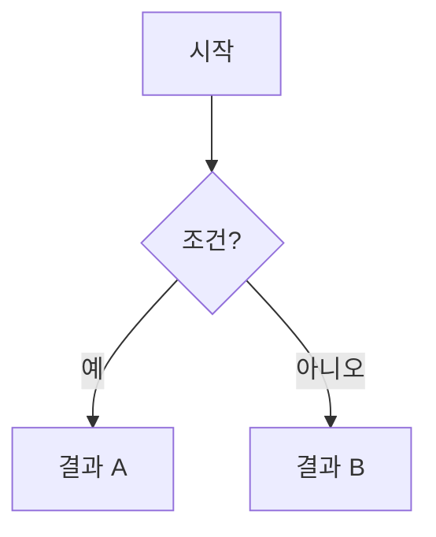

# 기여 가이드

CloudPick에 기여해 주셔서 감사합니다. 이 문서는 문서 작성 시 따라야 할 구조와 패턴을 안내합니다.

## 기여 전 확인

문서를 추가하거나 수정할 때는 아래를 먼저 확인합니다.

- 기존 문서의 구조와 톤을 우선합니다. 새 형식을 만들기보다 가까운 주제의 문서를 참고합니다.
- 기술 사실은 벤더 공식 문서, 표준 문서, 신뢰할 수 있는 재단 문서를 근거로 합니다. 블로그나 개인 경험은 보조 자료로만 사용합니다.
- 가격, 리전, SLA, Preview/GA 여부, 모델명, 서비스 한도처럼 바뀌기 쉬운 정보는 최신 공식 문서를 확인한 뒤 작성합니다.
- 문서 수정 범위를 작게 유지합니다. 특정 문서를 수정하면서 전체 문서 스타일을 한 번에 바꾸지 않습니다.

## 문서 구조 템플릿

모든 본문 문서는 가능하면 다음 순서를 따릅니다:

```
1. 프론트매터 (description)
2. 제목 (H1)
3. 문서 기준: YYYY년 M월
4. 개요 (또는 'X란 무엇인가')
5. 본문 (벤더 비교, 핵심 개념 등)
6. 자주 하는 실수 (안티패턴) — 해당되는 경우
7. 체크리스트 (설계/도입용) — 해당되는 경우
8. 관련 문서 (내부 링크)
9. 참고하기 (외부 공식 문서 링크)
```

**필수 항목:**
- 프론트매터 `description`
- H1 제목
- `> 문서 기준: YYYY년 M월`
- `## 참고하기`

**권장 항목:**
- `## 개요` 또는 `## [주제]란?`
- 벤더 비교 표
- 선택 가이드
- 관련 문서
- 체크리스트
- 자주 하는 실수

## 개요 섹션 작성 가이드

- `## 개요`를 기본으로 하되, 독자의 흥미를 끌 수 있는 질문형 제목(예: `## FinOps란?`)도 허용합니다.
- 복잡한 개념은 글보다는 **Mermaid 다이어그램**을 활용하여 시각적으로 먼저 설명하는 것을 권장합니다.
- [용어집](GLOSSARY.md)에 정의된 표준 용어를 사용하며, 새로운 약어는 처음 등장할 때 풀네임을 병기합니다.

### Mermaid 다이어그램 스타일

- **방향:** 위→아래(`TD`) 또는 왼→오른(`LR`). 결정 트리는 `TD`, 아키텍처 흐름은 `LR`을 기본으로 합니다.
- **노드 형태:** 질문/분기는 `{}` (다이아몬드), 결과/선택지는 `[]` (사각형)을 사용합니다.
- **텍스트:** 노드 안 텍스트는 짧게 유지합니다. 줄바꿈이 필요하면 `<br/>`을 사용합니다.
- **복잡도:** 노드 7~10개 이내로 유지합니다. 더 복잡하면 여러 다이어그램으로 분리합니다.

````markdown

````

## 안티패턴 섹션 작성 가이드

문서를 수정할 때, 독자가 실수하기 쉬운 지점이 있다면 `## 자주 하는 실수` 섹션을 추가합니다.

**형식:**

```markdown
## 자주 하는 실수


- **[실수 요약]** — [왜 문제인지 한 줄 설명]
- **[실수 요약]** — [왜 문제인지 한 줄 설명]

```

**예시:**

```markdown

- "**VPN이 있으면 Zero Trust다**" — VPN은 네트워크 경계만 만들며 Zero Trust와 다른 개념입니다.
- "**내부망은 안전하다**" — 내부 공격자, 계정 탈취 시나리오를 고려하지 않는 전통적 접근입니다.

```

**적용 원칙:**
- 한 번에 모든 문서에 추가하지 않습니다. 문서를 수정할 때 점진적으로 추가합니다.
- 3~5개 이내로 유지합니다. 너무 많으면 읽히지 않습니다.
- 공식 문서나 업계 사례에 근거한 실수만 포함합니다.

## 체크리스트 작성 가이드

독자가 실제 설계나 도입 시 바로 활용할 수 있도록 '예/아니오'로 답할 수 있는 질문 형태로 작성합니다.

```markdown
## [주제] 설계 체크리스트

- [ ] [항목 1] — (설명: 왜 이것을 체크해야 하는가)
- [ ] [항목 2]
```

- 항목은 5~10개 정도로 유지합니다.
- 단순 요약이 아니라 실제 설계 검토나 운영 점검에서 판단 가능한 질문으로 씁니다.
- 체크리스트만 읽어도 빠진 의사결정 항목을 알 수 있어야 합니다.

## 서비스 선택 가이드 — 공통 평가 축

`언제 무엇을 선택할 것인가` 섹션을 작성할 때, 아래 평가 축 중 해당되는 것을 사용합니다. 모든 축을 강제하지 않고, 문서 성격에 맞는 축만 골라 씁니다.

| 평가 축 | 설명 | 예시 질문 |
| --- | --- | --- |
| 비용 | 사용량 기반/고정 용량/약정/이그레스 비용 | 비용 예측이 중요한가? |
| 운영 부담 | 직접 운영 vs 관리형/서버리스 | 팀이 Day-2 운영을 감당할 수 있는가? |
| 성능/지연시간 | 처리량, 레이턴시, 글로벌 분산 | 사용자 위치와 데이터 위치가 어디인가? |
| 가용성/DR | AZ/리전 장애 대응, RPO/RTO | 어느 수준의 장애까지 견뎌야 하는가? |
| 보안/규정 | IAM, 암호화, 감사, 데이터 주권 | 규제나 감사 요구가 있는가? |
| 이식성/종속성 | 표준 API, 오픈소스 호환성 | 나중에 벤더를 바꿀 가능성이 있는가? |
| 생태계/통합 | 기존 도구, 조직 역량, 벤더 친화도 | 이미 사용 중인 플랫폼과 잘 통합되는가? |

**적용 방식:**
- 선택 가이드 표에서 "왜 이 선택이 맞는지"를 위 축으로 설명합니다.
- [벤더 선택 의사결정 프레임워크](about-cloud/decision-framework.md) 문서와 연결되도록 합니다.
- 벤더별 수치보다 안정적인 판단 기준을 우선합니다.
- 특정 벤더를 추천할 때는 장점만 쓰지 말고 운영 부담, 비용, 종속성 같은 트레이드오프를 함께 적습니다.

**적용 수준:**
- 신규 문서는 "개선 후" 형태(요구사항 → 권장 → 이유(평가 축))를 사용합니다.
- 기존 문서는 수정 시 점진적으로 전환합니다. 선택 가이드를 건드리지 않는 수정에서 강제하지 않습니다.

**적용 예시:**

개선 전 (축 없이 제품명만 나열):

```markdown
| 이럴 때 | 이것을 선택 |
| --- | --- |
| 서버리스 컨테이너가 필요할 때 | Cloud Run |
```

개선 후 (평가 축으로 "왜"를 설명):

```markdown
| 요구사항 | 권장 | 이유 (평가 축) |
| --- | --- | --- |
| 운영 부담 최소화 + 트래픽 변동 큼 | Cloud Run / Fargate | 운영 부담 ↓, 비용은 사용량 비례 |
| K8s 생태계 활용 + 멀티클라우드 이식성 | EKS / GKE / AKS | 이식성 ↑, 운영 부담 ↑ (트레이드오프) |
```

## 변동성 높은 정보 작성 기준

다음 정보는 빠르게 바뀔 수 있으므로 문서에 고정값을 남기지 않는 것을 기본으로 합니다.

- 가격, 할인율, 무료 제공량
- 리전 수, 가용영역 수, PoP 위치
- 서비스 한도, 처리량, 최대 대역폭
- SLA 수치
- Preview/GA/Deprecated 상태
- AI 모델 버전, 컨텍스트 길이, 토큰 단가

작성 방식:

- 정확한 수치가 핵심이 아니면 "공식 가격 페이지를 확인하세요"처럼 링크로 안내합니다.
- **비교 판단에 필수적인 수치**(예: 벤더 간 이그레스 무료 범위 차이)는 `문서 기준` 날짜와 함께 기재하되, **같은 행에 공식 출처 링크를 반드시 포함**합니다.
- 수치 비교표를 만들 때는 각 수치의 공식 출처 링크를 같은 행에 포함합니다.
- 오래 유지될 판단 기준과 자주 바뀌는 수치를 분리합니다.

좋은 예:

```markdown
대량 데이터 전송 비용은 벤더와 리전에 따라 달라지므로, 설계 시 [AWS Data Transfer Pricing](https://aws.amazon.com/ec2/pricing/on-demand/#Data_Transfer)을 확인하세요.
```

피해야 할 예:

```markdown
AWS 데이터 전송 비용은 GB당 $0.09입니다.
```

## 공식 문서 링크 기준

- 벤더 서비스명은 가능하면 공식 문서 링크를 겁니다.
- 한국어 공식 문서가 오래되었거나 내용이 부족하면 영어 원문을 우선합니다.
- 서비스 소개 페이지보다 운영·제한·가격·보안 기준을 확인할 수 있는 문서를 우선합니다.
- 외부 링크는 `## 참고하기`에 벤더별로 묶습니다.
- 본문 중 판단 근거가 필요한 곳에는 해당 문장 근처에도 링크를 둡니다.

## 강조 블록 사용 기준

| 스타일 | 용도 |
| --- | --- |
| `` | 핵심 개념, 보충 설명 |
| `` | 중요 경고, 안티패턴, 주의사항 |
| `` | 즉각적 보안 위험, 데이터 손실 가능성 |
| `` | 성공 패턴, 권장 사항 |

## GitBook 마크다운 렌더링 규칙

GitBook에서 `**볼드**`를 닫은 직후 한글 조사나 따옴표(`"`, `)`)가 오면 볼드 렌더링이 깨지는 문제가 있습니다.

- **허용:** `**강조** 를`, `**강조** 에`, `?" 입니다` — 공백을 넣어 렌더링 안정성을 확보합니다.
- **목록 라벨:** `**핵심:** 설명` 형태는 기존 Markdown을 유지합니다.
- **대량 자동 치환 금지:** `** [가-힣]` 패턴을 일괄 제거하면 목록 라벨 뒤 공백까지 망가집니다. 문장 단위로 수동 판단합니다.

## 외부 인용구 서식

외부 출처를 직접 인용할 때는 이탤릭 + 큰따옴표를 사용합니다:

```markdown
NIST SP 800-145는 클라우드 컴퓨팅을 다음과 같이 정의합니다.

> "최소한의 관리 노력이나..."
```

일반적인 강조나 용어 설명용 따옴표에는 적용하지 않습니다.

## 관련 문서 섹션 형식

본문에 맥락상 내부 링크가 있더라도, 문서 하단에 `## 관련 문서`로 주요 연관 문서를 모아 놓는 것을 권장합니다. 독자가 다음에 읽을 문서를 한눈에 파악할 수 있습니다.

내부 문서 링크는 상대 경로를 사용하며, 목록 형태로 작성합니다.

```markdown
## 관련 문서

- [벤더 선택 의사결정 프레임워크](about-cloud/decision-framework.md)
```

- 특별히 강조하고 싶은 1~2개 링크에만 `` 블록을 사용합니다.
- 문서 하단뿐만 아니라 본문 중에도 맥락상 필요한 경우 링크를 적극적으로 활용합니다.

## 벤더 비교 표 작성 기준

- **열 순서:** AWS → Azure → Google Cloud → OCI (시장 점유율 순)를 준수합니다.
- **링크:** 본문 표에서 서비스명이 처음 등장할 때 공식 문서 링크를 포함합니다. 같은 문서 내 반복 등장 시 생략 가능합니다. 참고하기 섹션에 링크가 있더라도 본문 표 링크는 유지합니다.
- **수치:** 빠르게 변하는 수치(가격, 리전 수, 인스턴스 개수)는 텍스트 대신 "공식 문서 참고" 또는 링크로 대체하여 문서의 생명주기를 늘립니다.
- **공백:** 해당 벤더에 대응 서비스가 없거나 확인이 어려우면 빈칸 대신 `—`를 사용합니다.
- **중립성:** "최고", "가장 좋음" 같은 표현은 피하고, 어떤 조건에서 적합한지 설명합니다.
- **비교 단위:** 서로 같은 계층의 서비스를 비교합니다. 예를 들어 관리형 Kubernetes와 서버리스 컨테이너를 한 행에 섞지 않습니다.

## 문체와 용어

- 독자는 클라우드 입문자부터 실무자까지 포함됩니다. 첫 문단은 쉽게 시작하고, 세부 내용은 뒤로 갈수록 깊게 씁니다.
- 한글을 기본으로 쓰되, 첫 등장 시 영문을 병기합니다. 예: `가용영역(Availability Zone)`.
- 벤더명과 서비스명은 공식 최신 명칭을 사용합니다. 예: `Microsoft Entra ID`.
- 같은 개념은 문서 전체에서 같은 용어로 씁니다. 새 용어가 반복될 가능성이 있으면 [용어집](GLOSSARY.md)에 추가합니다.
- 추측성 표현은 피합니다. 불확실하면 "공식 문서에서 확인 필요" 또는 "벤더별로 다름"처럼 범위를 좁혀 씁니다.

## 로컬 검증 (기계 검사)

문서를 수정한 뒤, GitHub Actions `Docs Quality`와 같은 기계 검사를 로컬에서 돌립니다.

```bash
npx markdownlint-cli2 "**/*.md" "#_book/**" "#node_modules/**"
python3 scripts/check-internal-links.py
```

이 단계는 **형식·링크·SUMMARY 커버리지·GitBook 블록 균형**을 확인합니다.  
“머지해도 될 만큼 내용이 맞는가”는 아래 **문서 리뷰 기준**과, 필요 시 멀티 에이전트 리뷰로 판단합니다. 리뷰 소견을 스크립트 규칙으로 고정하지 않습니다. 문서 내용이 바뀔 때마다 기준을 들고 다시 읽어야 합니다.

작성자가 직접 확인할 항목:

- 새 문서가 `SUMMARY.md`에 추가되었는가?
- `description`, H1, `문서 기준`, `참고하기`가 있는가?
- 내부 링크가 상대 경로로 동작하는가?
- 변동성 높은 수치를 고정값으로 남기지 않았는가?
- 벤더 비교 표의 열 순서가 AWS → Azure → Google Cloud → OCI인가?
- 공식 문서 링크가 오래된 제품명이나 폐기된 페이지를 가리키지 않는가?
- `README` 탭 목차와 `SUMMARY.md` 학습 순서가 의도대로 맞는가?

## 문서 리뷰 기준 (사람·에이전트 공통)

대규모 갱신, 최신 업데이트 반영, AI/보안 등 변동이 빠른 영역 수정 후에는 **기계 검사 통과만으로 머지하지 않습니다.** 아래 기준을 프롬프트 계약으로 쓰고, 필요하면 여러 에이전트에 도메인을 나눠 리뷰합니다.

### 언제 리뷰하는가

- 여러 도메인에 걸친 업데이트 (예: 월간 최신 반영)
- 섹션 통합·삭제·목차 재구성
- 가격·규제·한도·모델명 등 변동성 정보 변경
- 작성자 판단으로 “사실/중립성 리스크가 있다”고 볼 때

소규모 오타·링크 한 줄 수정은 기계 검사 + 작성자 자체 확인으로 충분할 수 있습니다.

### 무엇을 보는가

1. **구조** — `description`, H1, `문서 기준`, `## 참고하기` 필수. 권장: 관련 문서, 체크리스트, 자주 하는 실수
2. **사실 정확성** — 벤더 공식·표준 대비 과장, 구식 시제(“~부터 예정”이 이미 시행 등), 제품명·URL 불일치
3. **교차 정합** — 깨진/중복 링크, README ↔ SUMMARY 순서, 문서 간 모순 수치
4. **벤더 중립** — 열 순서 AWS → Azure → Google Cloud → OCI, 근거 없는 최상급 표현 지양
5. **변동성 정보** — 가격·리전·SLA·한도는 행 단위 또는 참고하기에 공식 링크. 추측·개인 블로그를 1차 근거로 쓰지 않음
6. **독자 접근성** — 신규 섹션 도입 설명, 모호한 단종·통합 표현, 표 중복

### 산출 형식

```text
Must-Fix / Should-Fix / Nice-to-Have
각 항목: 파일:대략줄 | 문제 | 근거 | 제안
마지막: 3문장 요약
```

- **Must-Fix** — 머지 전 해소 (구조 위반, 명백한 사실 오류, 깨진 내부 링크 등)
- **Should-Fix** — 같은 PR 또는 바로 다음 정리에서 처리 권장
- **Nice-to-Have** — 백로그

리뷰는 **파일 수정 없이** 소견만 내는 것을 기본으로 합니다. 수정은 작성자 또는 별도 작업에서 반영합니다.

### 멀티 에이전트 운용 (선택)

도메인을 나눠 병렬 리뷰할 때 예시:

| 역할 | 범위 예 |
| --- | --- |
| Security + Governance | `security/*`, `governance/*` |
| AI + Compute | `ai/*`, `compute/*` |
| 기반 + 교차 | `about-cloud/*`, `networking/*`, `storage/*`, `database/*`, `devops/*`, README, SUMMARY |

프롬프트에 이 절의 기준과 “리뷰 전용 / 파일 수정 금지”를 넣고, 완료 후 **코디네이터가 소견을 합쳐** Must-Fix를 반영합니다.  
에이전트 간 이견은 공식 문서를 열어 확인하고, 확인 불가 시 “공식 링크 위임” 또는 표현 완화로 처리합니다.

### 머지 판정

| 단계 | 담당 | 통과 조건 |
| --- | --- | --- |
| 1. 기계 검사 | CI / 로컬 동일 명령 | markdownlint + 내부 링크 검사 통과 |
| 2. 내용 리뷰 | 사람 또는 카운슬 | 이번 변경 범위에 대해 Must-Fix 0 |
| 3. Should-Fix | 사람 | 같은 PR에 넣을지 / 이슈로 남길지 합의 |

2단계는 **그때그때 문서 상태**를 읽어서 판단합니다. 과거 리뷰 소견을 코드나 고정 규칙으로 재실행하지 않습니다.

## PR 체크리스트

PR을 열기 전에 아래를 확인합니다.

- [ ] 수정한 문서의 `문서 기준` 날짜가 현재 내용과 맞습니다.
- [ ] 새로 추가한 기술 사실에는 공식 문서 또는 표준 문서 근거가 있습니다.
- [ ] 가격, 리전, SLA, 한도 같은 변동성 높은 정보는 공식 링크 중심으로 작성했습니다.
- [ ] markdownlint를 통과했습니다.
- [ ] 내부 링크 검사를 통과했습니다.
- [ ] 새 문서를 추가했다면 `SUMMARY.md`에 포함했습니다.
- [ ] 관련 문서와 참고하기 섹션을 필요한 만큼 갱신했습니다.
- [ ] (해당 시) 문서 리뷰 기준에 따라 내용 리뷰를 했고 Must-Fix를 반영했습니다.
