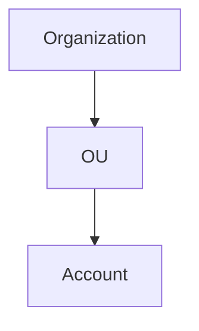
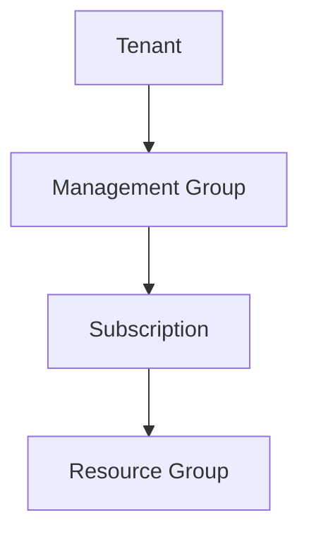
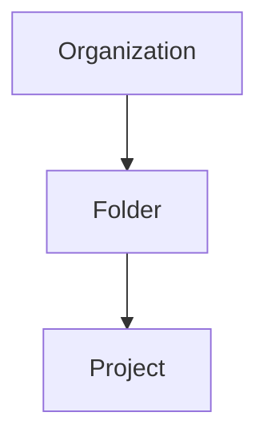
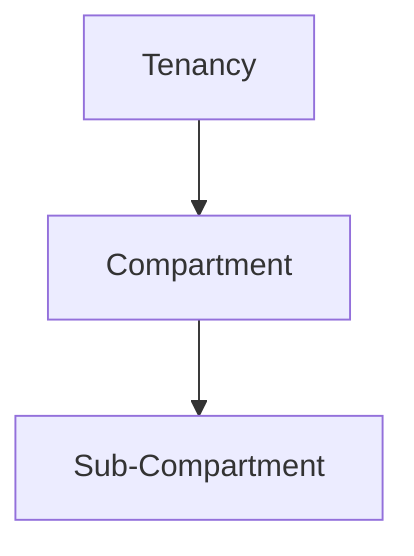

# 계정과 조직 구조

> 문서 기준: 2026년 5월

## 왜 계정 구조가 중요한가

온프레미스 환경에서 부서별로 서버를 분리하는 이유를 생각해 보겠습니다. 개발팀과 운영팀이 같은 서버를 공유하면, 개발팀의 실수로 운영 서비스가 중단될 수 있습니다. 비용도 어느 부서가 얼마나 사용했는지 구분하기 어렵습니다. 그래서 부서별로 서버를 분리하고, 네트워크를 격리하고, 접근 권한을 나누는 것입니다.

클라우드에서도 동일한 문제가 발생합니다. 하나의 계정에 모든 리소스를 넣으면 다음과 같은 문제가 생깁니다.

- **보안 경계 부재** — 개발 환경의 보안 사고가 프로덕션 환경에 영향을 줄 수 있습니다.
- **비용 추적 어려움** — 어떤 팀이, 어떤 프로젝트가 비용을 발생시키는지 파악하기 어렵습니다.
- **권한 관리 복잡** — 세밀한 접근 제어가 어려워지고, 과다 권한이 부여되기 쉽습니다.
- **서비스 할당량 공유** — 한 팀이 API 호출 한도를 소진하면 다른 팀도 영향을 받습니다.

이러한 문제를 해결하기 위해 각 벤더 모두 **멀티 계정** (Multi-Account) 구조를 권장하며, 여러 계정을 체계적으로 관리할 수 있는 조직(Organization) 기능을 제공합니다.

## 핵심 개념

### 계정 (Account / Subscription / Project)

클라우드에서 "계정"은 리소스의 격리 단위이자 빌링 단위입니다. 각 벤더 모두 비슷한 개념을 가지고 있지만, 용어와 세부 동작이 다릅니다.

### 조직 (Organization)

여러 계정을 하나의 조직으로 묶어 중앙에서 관리하는 기능입니다. 조직 수준에서 보안 정책을 적용하고, 빌링을 통합하고, 계정 간 리소스 공유를 제어할 수 있습니다.

### 정책 상속

상위 조직에서 설정한 정책이 하위 계정에 자동으로 적용되는 구조입니다. 예를 들어, "모든 계정에서 특정 리전만 사용 가능"이라는 정책을 조직 수준에서 설정하면, 모든 하위 계정에 적용됩니다.

## 벤더별 비교

| 개념 | AWS | Azure | GCP | OCI |
| --- | --- | --- | --- | --- |
| **리소스 격리 단위** | Account | Subscription | Project | Compartment |
| **조직** | Organization | Management Group (최상위) | Organization | Tenancy |
| **중간 그룹** | Organizational Unit (OU) | Management Group (중첩 가능) | Folder | Compartment (중첩 가능) |
| **리소스 그룹** | — (태그로 대체) | Resource Group | — (라벨로 대체) | Compartment |
| **정책 제어** | SCP (Service Control Policy) | Azure Policy | Organization Policy | IAM Policy (Compartment 상속) |
| **빌링 단위** | Account (통합 빌링 가능) | Subscription | Billing Account → Project | Tenancy |
| **계정 생성** | Organizations API로 자동 생성 | 수동 또는 자동화 | Projects API로 자동 생성 | Compartment API |





AWS의 계층 구조는 **Organization → OU → Account** 입니다.

- **Organization** — 최상위 관리 단위입니다. 하나의 관리 계정(Management Account)이 조직을 소유합니다.
- **OU (Organizational Unit)** — 계정을 논리적으로 그룹화하는 단위입니다. OU는 중첩할 수 있습니다.
- **Account** — 리소스 격리와 빌링의 기본 단위입니다. 각 Account는 독립된 IAM, VPC, 서비스 할당량을 가집니다.
- **SCP (Service Control Policy)** — OU 또는 Account에 적용하여, 사용 가능한 서비스와 작업을 제한합니다. SCP는 권한을 부여하는 것이 아니라, 최대 권한 범위를 제한하는 가드레일 역할을 합니다.

AWS는 **AWS Control Tower**를 통해 모범 사례 기반의 멀티 계정 환경을 자동으로 구성할 수 있습니다.





Azure의 계층 구조는 **Tenant → Management Group → Subscription → Resource Group** 입니다.

- **Tenant** — Azure AD(현 Microsoft Entra ID)의 인스턴스로, 조직의 ID 경계입니다.
- **Management Group** — Subscription을 그룹화하는 단위입니다. 최대 6단계까지 중첩할 수 있습니다.
- **Subscription** — 빌링과 리소스 격리의 기본 단위입니다. AWS의 Account에 해당합니다.
- **Resource Group** — Subscription 내에서 리소스를 논리적으로 그룹화하는 단위입니다. AWS/GCP에는 없는 Azure만의 개념입니다.
- **Azure Policy** — Management Group, Subscription, Resource Group 수준에서 정책을 적용할 수 있습니다.

Azure의 특징은 **Resource Group** 입니다. 하나의 Subscription 안에서도 리소스를 논리적으로 분리할 수 있어, 소규모 조직에서는 Subscription을 많이 만들지 않아도 됩니다.





GCP의 계층 구조는 **Organization → Folder → Project** 입니다.

- **Organization** — Google Workspace 또는 Cloud Identity 도메인에 연결된 최상위 노드입니다.
- **Folder** — Project를 그룹화하는 단위입니다. 최대 10단계까지 중첩할 수 있습니다.
- **Project** — 리소스 격리의 기본 단위입니다. AWS의 Account, Azure의 Subscription에 해당합니다.
- **Organization Policy** — Organization, Folder, Project 수준에서 제약 조건을 적용합니다.

GCP의 특징은 **빌링이 Project와 분리** 되어 있다는 점입니다. 하나의 Billing Account에 여러 Project를 연결할 수 있어, 빌링 구조를 유연하게 설계할 수 있습니다.





OCI의 계층 구조는 **Tenancy → Compartment** 입니다.

- **Tenancy** — 최상위 관리 단위이자 루트 Compartment입니다. OCI 계약 시 하나의 Tenancy가 생성됩니다.
- **Compartment** — 리소스 격리와 정책 적용의 기본 단위입니다. 최대 6단계까지 중첩할 수 있습니다. AWS의 Account + OU 역할을 하나의 개념으로 통합한 것입니다.
- **IAM Policy** — Compartment 단위로 적용되며, 상위 Compartment의 정책이 하위에 상속됩니다.

OCI의 특징은 **Compartment가 리소스 격리와 조직 구조를 동시에 담당** 한다는 점입니다. AWS처럼 별도의 Account를 만들 필요 없이, Compartment 중첩으로 환경을 분리합니다.



## 빌링 구조

각 벤더 모두 계정/구독/프로젝트 단위로 비용이 발생하지만, 빌링을 통합하고 관리하는 방식이 다릅니다.

| 항목 | AWS | Azure | GCP | OCI |
| --- | --- | --- | --- | --- |
| **빌링 단위** | Account | Subscription | Project | Tenancy |
| **통합 빌링** | Organizations 통합 결제 | Billing Account → 여러 Subscription | Billing Account → 여러 Project | Tenancy 단위 통합 |
| **비용 할당** | 태그 기반 Cost Allocation | Resource Group + 태그 | 라벨 + Project 단위 | Compartment + 태그 |
| **예산 알림** | AWS Budgets | Azure Budgets | GCP Budget Alerts | OCI Budgets |

- **AWS** — Organization 내 모든 Account의 비용을 관리 계정(Payer Account)에서 통합 결제합니다. **Billing Transfer**로 여러 Organization의 빌링을 하나의 계정에서 관리할 수도 있습니다 (2025년 출시).
- **Azure** — EA(Enterprise Agreement) 계약 시 부서(Department)별 비용 분리가 가능합니다. **Subscription Transfer**로 구독의 빌링 소유권을 다른 계정으로 이전할 수 있습니다.
- **GCP** — Billing Account가 계정 구조와 독립적이어서, Project별로 다른 Billing Account를 연결할 수 있습니다. Project의 빌링 계정 변경도 간단합니다.

## 멀티 계정 전략

각 벤더 모두 다음과 같은 멀티 계정 전략을 권장합니다.

### 환경별 분리

가장 기본적인 전략으로, 개발(dev), 스테이징(staging), 프로덕션(prod) 환경을 별도의 계정으로 분리합니다. 개발 환경에서의 실수가 프로덕션에 영향을 주지 않도록 격리합니다.

```text
Organization
├── Dev OU/Folder
│   ├── dev-account-a
│   └── dev-account-b
├── Staging OU/Folder
│   └── staging-account
└── Prod OU/Folder
    └── prod-account
```

### 워크로드별 분리

서로 다른 워크로드(웹 서비스, 데이터 파이프라인, ML 플랫폼 등)를 별도의 계정으로 분리합니다. 각 워크로드의 보안 요건과 비용을 독립적으로 관리할 수 있습니다.

### 보안/로깅 전용 계정

보안 로그, 감사 로그, CloudTrail/Activity Log 등을 중앙 집중식으로 수집하는 전용 계정을 두는 것이 모범 사례입니다. 이 계정은 읽기 전용으로 운영하여, 로그의 무결성을 보장합니다.

## 관련 문서


[iam-overview.md](iam-overview.md)



[landing-zone.md](../governance/landing-zone.md)



[finops.md](../governance/finops.md)


## 참고하기

### AWS

- [AWS Organizations](https://aws.amazon.com/ko/organizations/)
- [AWS Control Tower](https://aws.amazon.com/ko/controltower/)
- [멀티 계정 전략 모범 사례](https://docs.aws.amazon.com/ko_kr/organizations/latest/userguide/orgs_best-practices.html)

### Azure

- [Azure 관리 그룹](https://learn.microsoft.com/ko-kr/azure/governance/management-groups/overview)
- [Azure 구독 관리](https://learn.microsoft.com/ko-kr/azure/cloud-adoption-framework/ready/azure-best-practices/organize-subscriptions)
- [Azure Policy](https://learn.microsoft.com/ko-kr/azure/governance/policy/overview)

### GCP

- [Resource Manager](https://cloud.google.com/resource-manager/docs/cloud-platform-resource-hierarchy)
- [Organization Policy](https://cloud.google.com/resource-manager/docs/organization-policy/overview)
- [Google Cloud 설정 체크리스트](https://cloud.google.com/docs/enterprise/setup-checklist)

### OCI

- [OCI IAM with Identity Domains](https://docs.oracle.com/en-us/iaas/Content/Identity/home.htm)
- [OCI Compartments](https://docs.oracle.com/en-us/iaas/Content/Identity/Tasks/managingcompartments.htm)
- [OCI Tenancy Setup](https://docs.oracle.com/en-us/iaas/Content/GSG/Concepts/settinguptenancy.htm)
