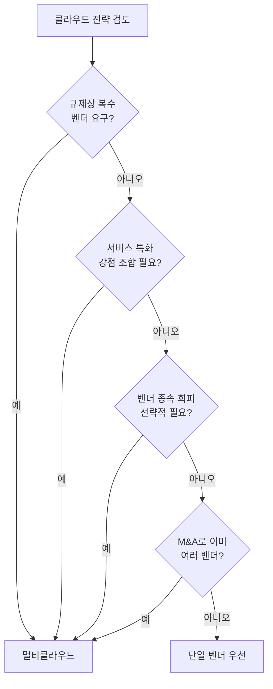

# 벤더 선택 의사결정 프레임워크

> 문서 기준: 2026년 5월

## 왜 의사결정 프레임워크가 필요한가

"어떤 클라우드가 가장 좋은가?"라는 질문에는 **정답이 없습니다.** 조직 상황, 워크로드 특성, 팀 역량에 따라 최적 선택이 달라집니다.

잘못된 접근 방식:

- 가격표만 비교
- 업계 유행이나 마케팅 위주 결정
- 한 번 선택 후 재검토 없이 유지
- 모든 워크로드에 동일 벤더 강제

올바른 접근은 **의사결정 기준을 명시하고, 주요 워크로드별로 다시 평가** 하는 것입니다.

## 핵심 의사결정 요인

### 1. 데이터 중력 (Data Gravity)

대용량 데이터가 위치한 곳으로 컴퓨팅이 따라가는 경향입니다.

- 데이터가 이미 특정 클라우드에 있으면 해당 클라우드에 추가 워크로드를 두는 것이 유리합니다.
- 이그레스 비용 때문에 클라우드 간 데이터 이동은 점점 어려워집니다 ([멀티클라우드 커넥티비티](../networking/multicloud-connectivity.md) 참고).

### 2. 사용자와의 지리적 근접성

- 한국 사용자 대상 서비스는 한국 리전 보유 벤더를 우선
- 글로벌 서비스는 엣지 네트워크와 리전 커버리지 검토
- DR 시 인접 리전까지 고려 ([리전과 가용영역](regions-and-zones.md) 참고)

### 3. 규제 및 규정 준수

- 공공 부문: CSAP 인증 필수
- 금융: 전자금융감독규정, ISMS-P
- EU 대상: GDPR
- 자세한 내용은 [규정 준수](../governance/compliance.md) 참고

### 4. 팀 역량과 생태계

- 기존 Microsoft 스택(AD, Office 365)이 있으면 Azure가 자연스럽습니다.
- 팀이 AWS에 익숙하면 초기 생산성이 높습니다.
- 주요 서비스의 공식 한국어 문서와 커뮤니티 지원도 고려합니다.

### 5. 벤더별 강점 영역

각 벤더는 서로 다른 강점을 가집니다. 상세 비교는 [벤더 비교하기](compare-clouds.md)를 참고하세요.

| 영역 | 일반적 강점 |
| --- | --- |
| 포트폴리오 다양성 | AWS |
| 엔터프라이즈/Microsoft 통합 | Azure |
| AI/ML, 데이터 분석 | GCP |
| Oracle DB, 이그레스 비용 | OCI |

### 6. 비용 구조

- 온디맨드 vs 약정 가격
- 이그레스 비용 (특히 멀티클라우드 환경에서 중요)
- 한국 리전 가격은 미국 리전 대비 10\~30% 높은 것이 일반적
- 관리형 서비스 프리미엄
- 자세한 내용은 [비용 구조 이해하기](pricing-model.md) 참고

### 7. 탈출 비용 (Exit Cost)

장기적으로 벤더를 변경할 수 있는 옵션 비용입니다. [출구 전략](../governance/exit-strategy.md)을 참고하세요.

## 의사결정 매트릭스 예시

여러 요인을 가중치 기반으로 평가합니다. 아래는 **예시 템플릿** 이며, 실제 가중치와 점수는 조직 상황에 맞게 조정해야 합니다.

| 요인 | 가중치 | AWS | Azure | GCP | OCI |
| --- | --- | --- | --- | --- | --- |
| 팀 역량/경험 | 20% | ? | ? | ? | ? |
| 데이터 중력 | 15% | ? | ? | ? | ? |
| 비용 (베이스라인) | 15% | ? | ? | ? | ? |
| 규제 준수 | 15% | ? | ? | ? | ? |
| 강점 서비스 매칭 | 15% | ? | ? | ? | ? |
| 생태계/통합 | 10% | ? | ? | ? | ? |
| 탈출 비용 | 10% | ? | ? | ? | ? |

각 셀은 1\~5점으로 평가하고 (가중치 × 점수)의 합으로 순위를 매깁니다.

## 워크로드별 배치 전략

모든 워크로드를 같은 벤더에 두는 대신, 워크로드 특성에 따라 배치를 다르게 할 수 있습니다.

### 대표 워크로드 유형과 평가 축

| 워크로드 유형 | 주요 요인 | 가능한 선택 |
| --- | --- | --- |
| **핵심 운영 시스템** | 안정성, 팀 역량, 지원 SLA | 조직의 주력 벤더 |
| **AI/ML 학습** | GPU 가용성, ML 도구, 가격 | GCP, AWS |
| **AI/ML 추론** | 레이턴시, 모델 호스팅 비용 | 사용자 근처 리전 |
| **데이터 분석** | 웨어하우스 기능, BI 통합 | GCP BigQuery, Azure Synapse |
| **Microsoft 워크로드** | Entra ID 통합, 라이선스 혜택 | Azure |
| **Oracle DB** | 라이선스, 성능 최적화 | OCI |
| **DR 사이트** | 리전 다양성, 비용 | 주력 벤더와 다른 지역/벤더 |
| **개발/테스트** | 비용, 빠른 프로비저닝 | Always Free 제공 벤더 고려 |

## 멀티클라우드 vs 단일 벤더 의사결정

멀티클라우드를 선택하는 명확한 이유가 없으면 단일 벤더가 단순합니다.

멀티클라우드의 비용(운영 복잡도, 팀 역량 분산, 통합 거버넌스, 이그레스)은 상당합니다. 자세한 내용은 [멀티클라우드 이해하기](why-multicloud.md)를 참고하세요.

## 안티패턴

실무에서 자주 발생하는 잘못된 의사결정 패턴입니다.

### 1. 가격표만 보고 선택

- 카탈로그 가격은 온디맨드 기준이며, 실제 비용은 약정/스팟/무료 티어/지원 플랜에 따라 달라집니다.
- 이그레스 비용, 관리 도구 비용, 운영 인력 비용을 빠뜨리기 쉽습니다.
- TCO (Total Cost of Ownership) 기반 평가가 필요합니다.

### 2. 한 번 배치 후 재평가 없음

- 클라우드 서비스와 가격은 매년 크게 변합니다.
- 워크로드도 성장 과정에서 초기 선택이 맞지 않게 됩니다.
- 연 1회 주요 워크로드의 배치 적절성을 재검토하는 것이 좋습니다.

### 3. "남들이 하니까"

- 컨퍼런스, 블로그 트렌드를 따라 도입하면 비용과 복잡도만 증가합니다.
- "우리 조직에 왜 필요한가"를 먼저 답해야 합니다.

### 4. 팀 역량 무시

- 최고의 기술이어도 팀이 쓸 줄 모르면 장애 대응 속도가 떨어집니다.
- 신규 도입 시 교육/채용 계획을 함께 세웁니다.

### 5. 강점만 보고 약점 무시

- 모든 벤더는 약점이 있습니다: 한국어 문서 부족, 특정 서비스 미지원, 지원 대응 속도 등.
- 도입 전 약점이 우리 조직에 치명적인지 확인합니다.

## 검증 단계

의사결정 전에 실제로 확인할 수 있는 단계:

1. **PoC (Proof of Concept)** — 핵심 워크로드 한 가지를 실제 환경에 배포
2. **비용 시뮬레이션** — 벤더 가격 계산기로 예상 비용 추정 (한계는 있음)
3. **벤치마크** — 동일 워크로드의 성능/응답 시간 측정
4. **지원 품질 평가** — 실제 티켓 응답 속도, 한국어 지원 수준
5. **팀 설문** — 실제 사용할 엔지니어들의 의견 수렴

## 참고하기

### AWS

- [AWS Well-Architected Framework](https://aws.amazon.com/architecture/well-architected/)

### Azure

- [Microsoft Cloud Adoption Framework](https://learn.microsoft.com/azure/cloud-adoption-framework/)

### GCP

- [Google Cloud Adoption Framework](https://cloud.google.com/adoption-framework)

### OCI

- [Oracle Cloud Adoption Framework](https://docs.oracle.com/en-us/iaas/Content/cloud-adoption-framework/home.htm)

### 표준 및 커뮤니티

- [Gartner Magic Quadrant for Cloud Infrastructure](https://www.gartner.com/reviews/market/cloud-infrastructure-and-platform-services)
- [CNCF Annual Survey](https://www.cncf.io/reports/)
- [FinOps Foundation](https://www.finops.org/)
