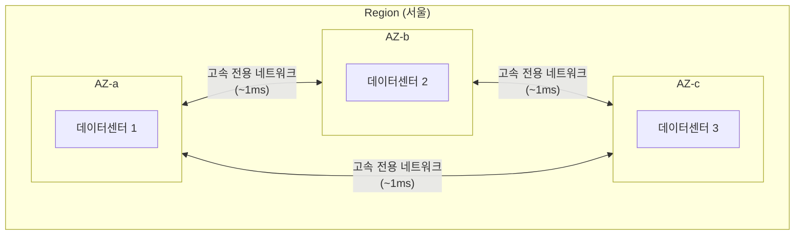

# 리전과 가용영역

> 문서 기준: 2026년 5월

## 개요

자체 전산센터를 서울 IDC 하나에만 두면, 그 건물에 화재나 정전이 발생하면 서비스 전체가 중단됩니다. 서울과 부산에 각각 IDC를 두고 이중화하면 한쪽에 장애가 나도 다른 쪽에서 서비스를 유지할 수 있습니다.

클라우드의 **리전**과 **가용영역**은 바로 이 이중화 개념을 벤더가 대규모로 구현한 것입니다. 리전을 선택하는 것은 단순히 "서버 위치"를 고르는 것이 아니라, 지연 시간, 데이터 주권, 재해복구 전략까지 결정하는 것입니다.

### 리전 (Region)

**리전**은 지리적으로 분리된 데이터센터 클러스터입니다. 각 리전은 독립적인 전력, 냉각, 네트워크를 갖추고 있으며, 다른 리전과 물리적으로 수십~수천 km 떨어져 있습니다. 온프레미스로 비유하면, 서울 IDC와 부산 IDC처럼 서로 다른 도시에 위치한 데이터센터에 해당합니다.

### 가용영역 (Availability Zone)

**가용영역** (AZ)은 하나의 리전 내에 있는 독립된 데이터센터(또는 데이터센터 그룹)입니다. 같은 리전 내의 AZ들은 고속 전용 네트워크로 연결되어 있어 지연 시간이 매우 낮지만(보통 1ms 이내), 각 AZ는 독립된 전력과 냉각 시스템을 갖추고 있어 하나의 AZ에 장애가 발생해도 다른 AZ는 영향을 받지 않습니다.

온프레미스로 비유하면, 같은 도시 내에 있지만 서로 다른 건물에 위치한 서버실과 비슷합니다.

### 엣지 로케이션 (Edge Location)

**엣지 로케이션**은 리전보다 사용자에게 더 가까운 위치에 배치된 소규모 인프라입니다. 주로 CDN이나 DNS 서비스에 사용되며, 정적 콘텐츠를 캐싱하여 사용자에게 빠르게 전달합니다.

## 벤더별 비교

| 개념 | AWS | Azure | GCP | OCI |
| --- | --- | --- | --- | --- |
| **리전** | Region | Region | Region | Region |
| **가용영역** | Availability Zone | Availability Zone | Zone | Fault Domain / AD |
| **리전 범위** | 리전별 독립 | Geography → Region | **글로벌 VPC** | Realm → Region |
| **리전당 최소 AZ** | 3개 | 3개 | 3개 | 3 Fault Domain |
| **주요 대륙 커버리지** | 북미, 남미, 유럽, 아시아, 오세아니아, 중동, 아프리카 | 북미, 남미, 유럽, 아시아, 오세아니아, 중동, 아프리카 | 북미, 남미, 유럽, 아시아, 오세아니아, 중동 | 북미, 남미, 유럽, 아시아, 오세아니아, 중동 |

### 벤더별 특징

**AWS** — Region → Availability Zone 구조. VPC는 리전 단위입니다. Local Zone으로 특정 도시(서울 외 부산 등)에 초저지연 인프라를 배치할 수 있으며, AWS Sovereign Cloud(유럽)로 데이터 주권 전용 리전을 제공합니다.

**Azure** — Geography → Region → Availability Zone 구조. VNet은 리전 단위입니다. 같은 Geography 내 두 리전이 **리전 쌍(Region Pair)**으로 지정되어 플랫폼 업데이트가 동시에 적용되지 않습니다. 한국은 `koreacentral`(서울) ↔ `koreasouth`(부산) 쌍으로, 국내에서 DR을 구성할 수 있습니다.

**GCP** — Region → Zone 구조. VPC가 **글로벌 리소스**여서 하나의 VPC에 여러 리전의 서브넷을 배치할 수 있습니다(AWS/Azure는 리전마다 VPC를 따로 생성). Multi-region 스토리지로 별도 설정 없이 자동 복제되며, Assured Workloads로 규제 워크로드를 특정 리전에 격리할 수 있습니다.

**OCI** — Realm → Region → Availability Domain(AD) → Fault Domain 구조. 대형 리전은 3개 AD, 소형 리전은 1개 AD + 3 Fault Domain으로 구성됩니다. VCN은 리전 단위이며, 서브넷을 리전 또는 AD 단위로 배치할 수 있습니다.


## 리전 선택 시 고려사항

- **지연 시간** — 사용자와 가까운 리전을 선택합니다. 한국 사용자 대상이면 한국 리전이 최선입니다.
- **서비스 가용성** — 모든 서비스가 모든 리전에 있지는 않습니다. 특히 AI/ML, 최신 서비스는 특정 리전에서만 제공됩니다.
- **비용** — 같은 서비스라도 리전에 따라 가격이 다릅니다. 미국 리전이 보통 가장 저렴합니다.
- **컴플라이언스** — 규제에 따라 특정 국가에 데이터를 저장해야 할 수 있습니다.


**모든 서비스가 모든 리전에서 제공되지 않습니다.** 특히 신규 AI/ML 서비스는 특정 리전에서만 먼저 출시됩니다. 아키텍처 설계 전에 원하는 서비스가 선택 리전에서 제공되는지 반드시 확인하세요.


## 장애 도메인과 가용성 설계

| 분산 수준 | 장애 대응 | 적합한 워크로드 |
| --- | --- | --- |
| **단일 AZ** | AZ 장애 시 중단 | 개발/테스트 |
| **멀티 AZ** | AZ 장애에도 서비스 유지 | 프로덕션 기본 |
| **멀티 리전** | 리전 전체 장애에도 유지 | 미션 크리티컬 |

### DR 전략 요약

| 전략 | 복구 시간 | 비용 |
| --- | --- | --- |
| Backup & Restore | 시간 단위 | 낮음 |
| Pilot Light | 분 단위 | 중간 |
| Warm Standby | 초~분 | 높음 |
| Active-Active | 거의 0 | 매우 높음 |

## 한국에서의 고려사항

### 한국 리전 현황

| 벤더 | 리전 코드 | AZ/Zone 수 | 출시 시기 |
| --- | --- | --- | --- |
| AWS | `ap-northeast-2` (서울) | 4개 AZ | 2016년 |
| Azure | `koreacentral` (서울), `koreasouth` (부산) | 3개 AZ (Central) | 2017년 |
| GCP | `asia-northeast3` (서울) | 3개 Zone | 2020년 |
| OCI | `ap-seoul-1`, `ap-chuncheon-1` | 3 FD | 2020년 |

AWS는 2016년에 가장 먼저 한국 리전을 개설했으며, 현재 4개의 AZ를 운영하고 있습니다. Azure는 서울과 부산 두 개의 리전을 보유하고 있어 국내에서 리전 간 DR 구성이 가능합니다. GCP는 2020년에 서울 리전을 개설했으며, 3개의 Zone을 운영하고 있습니다.

### DR 시 인접 리전

| 벤더 | 프라이머리 (한국) | 세컨더리 후보 | 지연 시간 |
| --- | --- | --- | --- |
| AWS | `ap-northeast-2` (서울) | `ap-northeast-1` (도쿄), `ap-northeast-3` (오사카) | 약 30\~50ms |
| Azure | `koreacentral` (서울) | `koreasouth` (부산) — **국내 DR 가능** | 약 5ms |
| Azure | `koreacentral` (서울) | `japaneast` (도쿄) | 약 30ms |
| GCP | `asia-northeast3` (서울) | `asia-northeast1` (도쿄), `asia-northeast2` (오사카) | 약 30\~50ms |
| OCI | `ap-seoul-1` (서울) | `ap-chuncheon-1` (춘천) — **국내 DR 가능** | 약 5ms |
| OCI | `ap-seoul-1` (서울) | `ap-tokyo-1` (도쿄) | 약 30ms |

Azure는 한국 내에 서울-부산 리전 쌍이 있어, 데이터 주권 규제가 엄격한 경우에도 국내에서 DR을 구성할 수 있다는 차별점이 있습니다.

### 데이터 주권

한국의 **개인정보보호법**은 개인정보의 국외 이전 시 정보주체의 동의 또는 법적 근거를 요구합니다. **신용정보법**은 금융 분야의 개인신용정보에 대해 더 엄격한 규제를 적용합니다. 클라우드 벤더를 선택할 때 한국 리전의 유무와 데이터 저장 위치를 반드시 확인해야 합니다.

각 CSP는 다음과 같이 리전 제한을 강제할 수 있습니다:

- **AWS** — SCP(Service Control Policy)로 특정 리전 외 리소스 생성을 차단할 수 있습니다.
- **Azure** — Azure Policy로 허용 리전을 제한할 수 있습니다.
- **GCP** — Organization Policy로 리소스 생성 가능 리전을 제한할 수 있습니다.

## 참고하기

### AWS

- [AWS Well-Architected — Reliability Pillar](https://docs.aws.amazon.com/ko_kr/wellarchitected/latest/reliability-pillar/welcome.html)
- [AWS 리전 및 가용 영역](https://docs.aws.amazon.com/ko_kr/AWSEC2/latest/UserGuide/using-regions-availability-zones.html)
- [AWS DR 시나리오 백서](https://docs.aws.amazon.com/ko_kr/whitepapers/latest/disaster-recovery-workloads-on-aws/disaster-recovery-workloads-on-aws.html)

### Azure

- [Azure Well-Architected — Reliability](https://learn.microsoft.com/ko-kr/azure/well-architected/reliability/)
- [Azure 지역 및 가용성 영역](https://learn.microsoft.com/ko-kr/azure/reliability/availability-zones-overview)
- [Azure 비즈니스 연속성](https://learn.microsoft.com/ko-kr/azure/reliability/business-continuity-management-program)

### GCP

- [GCP Architecture Framework — Reliability](https://cloud.google.com/architecture/framework/reliability)
- [Google Cloud 위치](https://cloud.google.com/about/locations)
- [GCP DR 계획 가이드](https://cloud.google.com/architecture/dr-scenarios-planning-guide)
