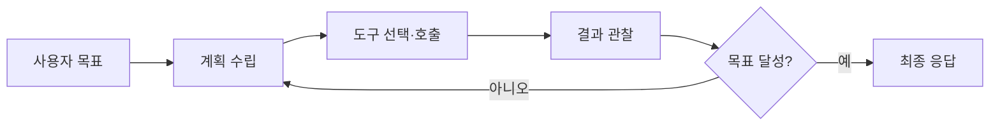
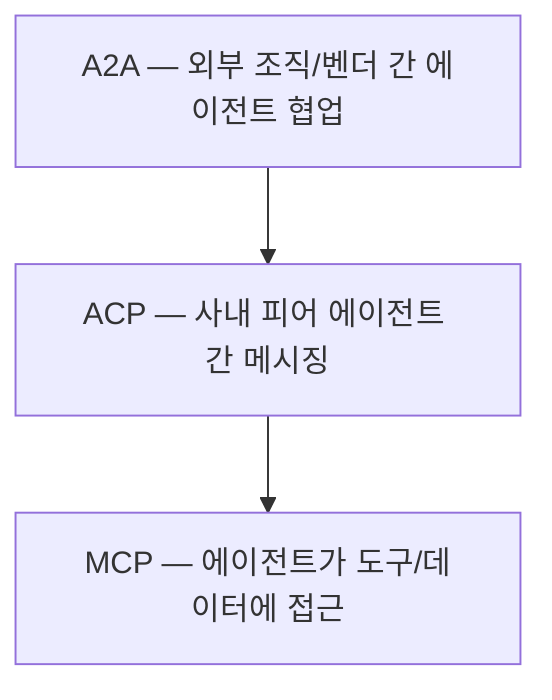

# AI 에이전트 (Agentic AI)

> 문서 기준: 2026년 5월

## 프롬프팅에서 에이전트로

기존 LLM 활용은 **한 번의 프롬프트 → 한 번의 응답** 구조입니다. 사용자가 질문하면 모델이 답하고 끝납니다. 컨텍스트 윈도우 안에서 모든 것을 해결해야 하며, 외부 시스템과 상호작용할 수 없습니다.

AI 에이전트는 이 한계를 넘어 **목표를 받으면 스스로 계획하고, 도구를 호출하며, 결과를 검증하고, 필요하면 재시도하는** 자율적 실행 루프를 갖습니다.


**핵심 차이:** 기존 LLM은 "질문에 답하는 도구"이고, 에이전트는 "목표를 부여받으면 완수하는 주체"입니다. 사람이 매 단계를 지시하지 않아도 스스로 판단하고 행동합니다.


| 구분 | LLM 프롬프팅 | AI 에이전트 |
| --- | --- | --- |
| **실행 방식** | 단일 요청-응답 | 다단계 루프 (관찰→사고→행동→반복) |
| **외부 연동** | 없음 (텍스트 입출력만) | 도구 호출 (API, DB, 파일시스템 등) |
| **상태 관리** | 컨텍스트 윈도우 내 | 장기 메모리, 세션 상태 유지 |
| **자율성** | 사용자가 매 단계 지시 | 목표만 주면 스스로 분해·실행 |
| **오류 처리** | 사용자가 재프롬프트 | 자체 검증 후 재시도 또는 대안 경로 |

## 에이전트 아키텍처 패턴

### 주요 오케스트레이션 패턴

| 패턴 | 설명 | 적합한 경우 |
| --- | --- | --- |
| **ReAct** | 추론(Reasoning)과 행동(Action)을 번갈아 수행 | 단일 에이전트, 단순 도구 호출 |
| **Plan-and-Execute** | 먼저 전체 계획을 세운 뒤 순차 실행 | 복잡한 다단계 작업 |
| **멀티에이전트** | 역할별 전문 에이전트가 협업 | 대규모 워크플로, 도메인 분리 |
| **Human-in-the-Loop** | 위험한 행동 전 사람 승인 요청 | 프로덕션 환경, 고위험 작업 |

## 벤더별 에이전트 플랫폼

| 벤더 | 플랫폼 | 특징 |
| --- | --- | --- |
| AWS | [Amazon Bedrock AgentCore](https://aws.amazon.com/bedrock/agentcore/) | 프레임워크 비종속 에이전트 인프라 플랫폼. Runtime, Gateway, Memory, Identity, Policy, Observability 제공. 간단한 에이전트는 [Bedrock Agents](https://aws.amazon.com/bedrock/agents/)로도 가능 |
| Azure | [Microsoft Foundry Agents](https://learn.microsoft.com/azure/ai-foundry/agents/) | Microsoft Agent Framework, Foundry 포털에서 빌드·배포·모니터링 통합 |
| Google Cloud | [Gemini Enterprise Agent Platform](https://cloud.google.com/products/agent-builder) | Vertex AI Agent Builder, A2A 프로토콜로 에이전트 간 통신 |
| OCI | [OCI Enterprise AI Agents](https://docs.oracle.com/iaas/Content/generative-ai/agents.htm) | RAG 에이전트 기본 제공, Oracle DB 네이티브 연동 |

### 오픈소스 프레임워크

| 프레임워크 | 특징 |
| --- | --- |
| [LangGraph](https://github.com/langchain-ai/langgraph) | 상태 머신 기반 멀티에이전트 오케스트레이션 |
| [CrewAI](https://github.com/crewAIInc/crewAI) | 역할 기반 멀티에이전트 협업 |
| [Strands Agents](https://strandsagents.com/) | AWS 오픈소스, 모델 비종속 에이전트 SDK |
| [AutoGen](https://github.com/microsoft/autogen) | Microsoft 오픈소스, 대화형 멀티에이전트 |
| [Semantic Kernel](https://github.com/microsoft/semantic-kernel) | .NET/Python/Java, 플러그인 기반 |

## 구현 핵심 요소

### 도구 (Tools/Functions)

에이전트가 외부 세계와 상호작용하는 인터페이스입니다.

- **API 호출** — REST/GraphQL 엔드포인트 실행
- **데이터 조회** — DB 쿼리, 벡터 검색, 파일 읽기
- **코드 실행** — 샌드박스 내 코드 해석기
- **다른 에이전트 호출** — A2A(Agent-to-Agent) 프로토콜

### 메모리와 상태

| 유형 | 용도 | 구현 |
| --- | --- | --- |
| **단기 메모리** | 현재 대화/작업 컨텍스트 | 컨텍스트 윈도우, 요약 |
| **장기 메모리** | 사용자 선호, 과거 작업 이력 | 벡터 DB, 키-값 저장소 |
| **작업 메모리** | 현재 계획, 중간 결과 | 상태 머신, 체크포인트 |

### 가드레일

에이전트의 행동 범위를 제한합니다.

- **입력 가드레일** — 프롬프트 인젝션 탐지, 주제 범위 제한
- **출력 가드레일** — 유해 콘텐츠 필터, 할루시네이션 검증
- **도구 가드레일** — 호출 가능 도구 화이트리스트, 파라미터 검증
- **실행 가드레일** — 최대 반복 횟수, 비용 한도, 타임아웃

## 코딩 에이전트 — 코드를 넘어 운영으로

코딩 에이전트는 AI 에이전트의 대표적 응용 분야입니다. 초기에는 코드 자동완성에서 시작했지만, 현재는 **버그 수정, 리팩터링, 테스트 작성, PR 리뷰, 배포, 인프라 운영**까지 영역을 확장하고 있습니다.

### 왜 코딩 분야가 가장 빠르게 실용화되고 있는가

생성형 AI의 수많은 응용 중 코딩 에이전트가 가장 빠르게 실용화된 이유가 있습니다.

- **검증이 자동화 가능** — 코드는 실행하면 맞는지 즉시 알 수 있습니다 (컴파일, 테스트, lint). 마케팅 카피나 법률 문서는 "정답"을 기계적으로 판단하기 어렵습니다.
- **피드백 루프가 빠름** — 에러 메시지를 보고 수정하고 다시 실행하는 루프가 초 단위입니다. 에이전트의 "관찰→행동→반복" 패턴에 이상적입니다.
- **학습 데이터가 풍부하고 구조적** — 공개 코드 저장소에 수십억 줄의 코드가 있으며, 프로그래밍 언어는 문법이 엄격하여 패턴 학습에 유리합니다.
- **도구 인터페이스가 표준화** — git, 터미널, 파일시스템, 패키지 매니저 등 에이전트가 호출할 도구의 인터페이스가 일관되고 잘 문서화되어 있습니다.

### 발전 단계

| 세대 | 형태 | 예시 |
| --- | --- | --- |
| **1세대** | IDE 자동완성 | GitHub Copilot (초기) |
| **2세대** | CLI 기반 에이전트 | Claude Code, Codex CLI, Gemini CLI, OpenCode, Pi |
| **3세대** | Desktop/Cloud 에이전트 | Codex App, Claude Code Desktop, Kiro, Jules |

### 주요 제품 비교

| 제품 | 제공사 | 형태 | 특징 |
| --- | --- | --- | --- |
| [Kiro](https://kiro.dev/) | AWS | IDE (VS Code 기반) | Spec-driven 개발. 요구사항→설계→태스크 3단계 워크플로. Hooks로 자동화 |
| [GitHub Copilot](https://github.com/features/copilot) | Microsoft/GitHub | IDE + CLI + Cloud | Agent Mode(VS Code/JetBrains), Copilot CLI(4개 병렬 에이전트), Copilot Workspace(멀티파일 변환), GitHub Issue 할당으로 자율 PR 생성 |
| [Codex App](https://openai.com/codex/) | OpenAI | Desktop (macOS) | 멀티에이전트 병렬 실행. Git worktree 격리. Computer Use, 브라우저, 90+ 플러그인 |
| [Claude Code](https://github.com/anthropics/claude-code) | Anthropic | CLI + Desktop | 터미널 에이전트. Agent View로 병렬 세션 관리. Dispatch로 원격 컴퓨터 제어. Routines로 스케줄 자동화 |
| [Gemini CLI](https://google-gemini.github.io/gemini-cli/) | Google | CLI (오픈소스) | ReAct 루프 + MCP 서버 연동. Apache 2.0 라이선스 |
| [Google Antigravity](https://antigravity.google/) | Google | IDE (VS Code 포크) | Agent-first IDE. 최대 5개 병렬 에이전트, 내장 브라우저, Gemini/Claude/GPT-OSS 멀티모델. 무료 |
| [Gemini Code Assist](https://codeassist.google/) | Google | IDE 확장 (VS Code, JetBrains) | Agent Mode로 멀티스텝 실행, Finish Changes/Outlines 기능. 엔터프라이즈 버전 제공 |
| [Jules](https://jules.google/) | Google | Cloud (비동기) | 태스크 큐 방식. Cloud VM에서 실행 후 PR로 결과 전달. 병렬 태스크 |
| [OpenCode](https://opencode.ai/) | Anomaly | CLI + Desktop + IDE (오픈소스) | 모델 비종속. 터미널/데스크톱/확장 모두 지원 |
| [Pi](https://github.com/badlogic/pi-mono) | 커뮤니티 | CLI (오픈소스) | 미니멀 설계. 로컬 LLM 지원에 강점 |

### CLI에서 Desktop으로, 코드에서 운영으로

최근 코딩 에이전트의 공통 트렌드:

- **CLI → Desktop 확장** — Claude Code Desktop, Codex App 등 GUI 기반 멀티세션 관리 도입
- **Computer Use** — 화면을 보고 마우스/키보드를 조작하는 원격 제어 기능 (Codex, Claude Dispatch)
- **비동기 실행** — 백그라운드에서 장시간 작업 수행 후 결과 전달 (Jules, Codex 백그라운드 태스크)
- **코드 → 풀스택 운영** — PR 리뷰, CI/CD 연동, 인프라 프로비저닝, 모니터링까지 확장
- **멀티에이전트** — 여러 에이전트가 병렬로 다른 태스크를 수행 (Codex App, Claude Agent View)

### 범용 컴퓨터 에이전트

코딩을 넘어 **로컬 파일, 네이티브 앱, 웹을 통합 제어**하는 범용 에이전트도 등장하고 있습니다.

| 제품 | 제공사 | 특징 |
| --- | --- | --- |
| [Perplexity Personal Computer](https://www.perplexity.ai/hub/blog/personal-computer-is-here) | Perplexity | Mac 네이티브 앱/파일시스템 접근, 24/7 상시 실행, 감사 로그·킬 스위치 내장 |
| [OpenClaw](https://openclawdesktop.com/) | 오픈소스 | 로컬 실행, Ollama/LM Studio 연동, WhatsApp/Telegram/Discord에서 PC 원격 제어. 프라이버시 중심 |
| [Sai](https://www.simular.ai/) | Simular | 클라우드 VM에서 실행, 승인 기반 안전 모델, 엔터프라이즈 워크플로 자동화 |


코딩 에이전트는 빠르게 진화 중입니다. 위 비교는 문서 작성 시점(2026년 5월) 기준이며, 각 제품의 최신 기능은 공식 사이트를 확인하세요.


## 에이전트 프로토콜 — MCP, A2A, ACP

에이전트가 도구를 호출하고, 다른 에이전트와 협업하려면 **표준화된 통신 규약**이 필요합니다. 2024~2025년에 세 가지 프로토콜이 등장했으며, 이들은 경쟁이 아닌 **상호 보완적 계층**입니다.

| 프로토콜 | 제정 | 역할 | 핵심 개념 |
| --- | --- | --- | --- |
| [MCP (Model Context Protocol)](https://modelcontextprotocol.io/) | Anthropic, 2024.11 | **에이전트 → 도구/데이터** 연결 | Tools, Resources, Prompts. JSON-RPC 2.0 |
| [A2A (Agent-to-Agent)](https://github.com/google/A2A) | Google, 2025.04 | **에이전트 → 에이전트** (크로스 벤더/조직) | Agent Card, Task Lifecycle, SSE/gRPC |
| [ACP (Agent Communication Protocol)](https://agentcommunicationprotocol.dev/) | IBM Research, 2025.03 | **에이전트 → 에이전트** (사내 피어 간) | REST 네이티브, SDK 불필요, 피어투피어 |

### 계층 구조

### 언제 무엇을 사용하는가

| 상황 | 프로토콜 | 예시 |
| --- | --- | --- |
| 에이전트가 Salesforce, DB, GitHub에 접근 | MCP | MCP 서버 하나 구현 → 모든 에이전트가 연결 |
| 사내 팀 A 에이전트 → 팀 B 에이전트 협업 | ACP | REST 호출로 피어 간 태스크 위임 |
| 우리 에이전트 → 파트너사 에이전트 협업 | A2A | Agent Card로 상대 발견 → 태스크 제출 |
| 장시간 비동기 태스크 + 진행 추적 | A2A | Task Lifecycle (submitted→working→completed) |
| 에어갭/폐쇄망 환경 | ACP | 오프라인 매니페스트 기반 디스커버리 |

### 적용 사례

**코딩 에이전트에서의 MCP** — Claude Code, Codex, Kiro, Gemini CLI 등 대부분의 코딩 에이전트가 MCP를 통해 파일시스템, Git, 터미널, 외부 API에 접근합니다. 10,000+ 공개 MCP 서버가 존재하며, Salesforce·GitHub·Slack·DB 등 주요 엔터프라이즈 도구를 커버합니다.

**멀티에이전트 워크플로에서의 A2A** — 구매 에이전트가 A2A로 공급사의 견적 에이전트에 태스크를 위임하고, 결과를 받아 내부 ERP에 MCP로 기록하는 패턴. Tyson Foods와 Gordon Food Service가 공급망 협업에 프로덕션 적용 중.

**사내 피어 에이전트에서의 ACP** — 규정 준수 에이전트가 ACP로 법무 에이전트, 가격 에이전트, 규제 에이전트에 동시 요청을 보내고 결과를 집계. 중앙 오케스트레이터 없이 피어투피어로 동작.


**도입 순서 권장:** MCP부터 시작 (가장 성숙, 즉시 ROI) → 멀티에이전트 필요 시 A2A 추가 → 사내 피어 메시징 필요 시 ACP 검토. 세 프로토콜 모두 Linux Foundation 거버넌스 하에 있으며 수렴 방향으로 진화 중입니다.


## 배포와 운영

| 항목 | 고려사항 |
| --- | --- |
| **호스팅** | 관리형(Bedrock Agents, Foundry Hosted) vs 자체 호스팅(컨테이너) |
| **확장** | 동시 세션 수, 도구 호출 지연시간, 큐 기반 비동기 처리 |
| **비용** | 토큰 사용량 × 루프 횟수로 기존 LLM 대비 수~수십 배 증가 가능 |
| **모니터링** | 트레이싱(각 단계별 입출력), 성공률, 평균 루프 수, 도구 실패율 |
| **평가** | 엔드투엔드 태스크 성공률, 도구 선택 정확도, 사용자 만족도 |

## 보안

에이전트는 기존 LLM보다 공격 표면이 넓습니다. 도구를 통해 실제 시스템에 영향을 줄 수 있기 때문입니다.

| 위협 | 대응 |
| --- | --- |
| **프롬프트 인젝션** | 입력 검증, 시스템 프롬프트 격리, 도구 출력 새니타이징 |
| **권한 상승** | 도구별 최소 권한 IAM, 민감 작업 사람 승인 |
| **데이터 유출** | 도구 응답 필터링, PII 마스킹, 감사 로그 |
| **무한 루프/비용 폭주** | 최대 반복 제한, 토큰 예산, 서킷 브레이커 |
| **공급망 공격** | 도구/플러그인 출처 검증, 샌드박스 실행 |

## 자주 하는 실수

- **모든 것을 에이전트로** — 단순 프롬프트로 충분한 작업까지 에이전트로 만들면 비용과 지연만 증가합니다.
- **가드레일 없이 프로덕션 배포** — 도구 권한을 제한하지 않으면 에이전트가 의도치 않은 시스템 변경을 수행할 수 있습니다.
- **평가 없이 출시** — 에이전트는 비결정적이므로 반복 테스트와 엔드투엔드 평가가 필수입니다.

## 체크리스트

- [ ] 에이전트가 필요한 작업인지 판단 (단순 RAG/프롬프트로 충분한지)
- [ ] 도구별 최소 권한 설정 및 화이트리스트 정의
- [ ] 가드레일 설정 (입력/출력/실행 제한)
- [ ] Human-in-the-Loop 정책 수립 (어떤 행동에 승인 필요한지)
- [ ] 트레이싱·모니터링 설정 (각 단계 입출력 기록)
- [ ] 비용 예산 및 서킷 브레이커 설정
- [ ] 엔드투엔드 평가 파이프라인 구축

## 관련 문서

- [AI 플랫폼과 모델 비교](ai-ml.md) — 벤더별 AI 플랫폼 전체 비교
- [프롬프트 엔지니어링](prompt-engineering.md) — 에이전트 시스템 프롬프트 설계
- [RAG 고급 패턴](rag-patterns.md) — 에이전트의 지식 기반 구성
- [LLMOps](llmops.md) — 에이전트 평가·운영·비용 추적
- [AI 보안](../security/ai-security.md) — 가드레일, 프롬프트 인젝션 방어

## 참고하기

- [Amazon Bedrock AgentCore 문서](https://docs.aws.amazon.com/bedrock-agentcore/latest/devguide/)
- [Microsoft Foundry Agents 문서](https://learn.microsoft.com/azure/ai-foundry/agents/)
- [Google Cloud Agent Builder 문서](https://cloud.google.com/products/agent-builder)
- [OCI Enterprise AI Agents 문서](https://docs.oracle.com/iaas/Content/generative-ai/agents.htm)
- [LangGraph 문서](https://langchain-ai.github.io/langgraph/)
- [A2A Protocol](https://github.com/google/A2A) — Google 오픈소스 에이전트 간 통신 프로토콜
- [MCP (Model Context Protocol)](https://modelcontextprotocol.io/) — Anthropic 오픈소스 도구 연결 표준
