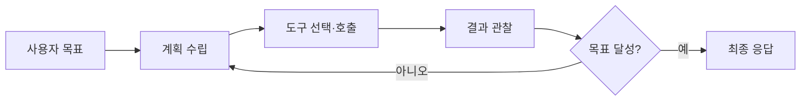
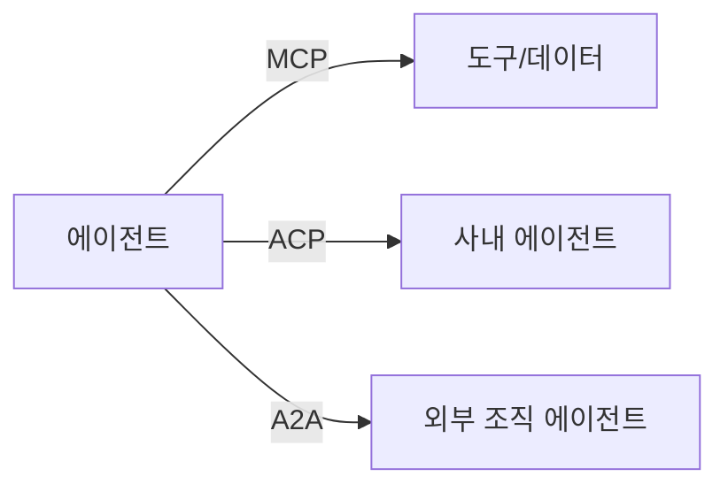

# AI 에이전트 (Agentic AI)

> 문서 기준: 2026년 6월

## 프롬프팅에서 에이전트로

기존 LLM 활용은 **한 번의 프롬프트 → 한 번의 응답** 구조입니다. 사용자가 질문하면 모델이 답하고 끝납니다. 컨텍스트 윈도우 안에서 모든 것을 해결해야 하며, 단독으로는 외부 시스템을 직접 조작하기 어렵습니다.

AI 에이전트는 이 한계를 넘어 **목표를 받으면 스스로 계획하고, 도구를 호출하며, 결과를 검증하고, 필요하면 재시도하는** 자율적 실행 루프를 갖습니다.


**핵심 차이:** 기존 LLM은 "질문에 답하는 도구"이고, 에이전트는 "목표를 부여받으면 완수하는 주체"입니다. 사람이 매 단계를 지시하지 않아도 스스로 판단하고 행동합니다.


| 구분 | LLM 프롬프팅 | AI 에이전트 |
| --- | --- | --- |
| **실행 방식** | 단일 요청-응답 | 다단계 루프 (관찰→사고→행동→반복) |
| **외부 연동** | 제한적 (Function Calling 등) | 도구 호출 (API, DB, 파일시스템 등) |
| **상태 관리** | 컨텍스트 윈도우 내 | 장기 메모리, 세션 상태 유지 |
| **자율성** | 사용자가 매 단계 지시 | 목표만 주면 스스로 분해·실행 |
| **오류 처리** | 사용자가 재프롬프트 | 자체 검증 후 재시도 또는 대안 경로 |

### 에이전트가 불필요한 경우

모든 작업에 에이전트가 필요한 것은 아닙니다.

- **단순 질의응답** — 프롬프트 한 번으로 충분하면 에이전트 오버헤드만 증가
- **정형화된 파이프라인** — 단계가 고정된 워크플로는 기존 오케스트레이션(Step Functions, Workflows)이 더 안정적
- **지연시간 민감** — 에이전트 루프는 수초~수분 소요. 실시간 응답이 필요하면 부적합

## 에이전트 아키텍처 패턴

| 패턴 | 설명 | 적합한 경우 |
| --- | --- | --- |
| **ReAct** | 추론(Reasoning)과 행동(Action)을 번갈아 수행 | 단일 에이전트, 단순 도구 호출 |
| **Plan-and-Execute** | 먼저 전체 계획을 세운 뒤 순차 실행 | 복잡한 다단계 작업 |
| **멀티에이전트** | 역할별 전문 에이전트가 협업 | 대규모 워크플로, 도메인 분리 |
| **Human-in-the-Loop** | 위험한 행동 전 사람 승인 요청 | 프로덕션 환경, 고위험 작업 |

## 벤더별 에이전트 플랫폼

| 벤더 | 플랫폼 | 특징 |
| --- | --- | --- |
| AWS | [Amazon Bedrock AgentCore](https://aws.amazon.com/bedrock/agentcore/) | 프레임워크 비종속 인프라 플랫폼. Runtime, Gateway, Memory, Identity, Policy, Observability. 간단한 에이전트는 [Bedrock Agents](https://aws.amazon.com/bedrock/agents/)로도 가능 |
| Azure | [Microsoft Foundry Agents](https://learn.microsoft.com/azure/ai-foundry/agents/) | Foundry Agent Service(GA). Responses API 기반 에이전트 런타임, MCP 인증 확장, Voice Live(Preview). 포털에서 빌드·배포·모니터링 통합 |
| Google Cloud | [Gemini Enterprise Agent Platform](https://cloud.google.com/products/agent-builder) | Agent Builder + ADK(오픈소스), A2A 프로토콜 네이티브 지원 |
| OCI | [OCI Enterprise AI Agents](https://docs.oracle.com/iaas/Content/generative-ai/agents.htm) | RAG 에이전트 기본 제공, Oracle DB 네이티브 연동, AI Guardrails(콘텐츠/PII/프롬프트 인젝션) 내장. 2026.03 GA |

### 오픈소스 프레임워크

| 프레임워크 | 특징 |
| --- | --- |
| [LangGraph](https://github.com/langchain-ai/langgraph) | 상태 머신 기반 멀티에이전트 오케스트레이션 |
| [CrewAI](https://github.com/crewAIInc/crewAI) | 역할 기반 멀티에이전트 협업 |
| [Strands Agents](https://strandsagents.com/) | AWS 오픈소스, 모델 비종속 에이전트 SDK |
| [AutoGen](https://github.com/microsoft/autogen) | Microsoft 오픈소스, 대화형 멀티에이전트 |
| [Hermes Agent](https://hermes-agent.nousresearch.com/) | Nous Research 오픈소스, 자기학습(스킬 자동 생성), NVIDIA RTX 로컬 실행 |

## 구현 핵심 요소

### 도구 (Tools/Functions)

에이전트가 외부 세계와 상호작용하는 인터페이스입니다.

- **API 호출** — REST/GraphQL 엔드포인트 실행
- **데이터 조회** — DB 쿼리, 벡터 검색, 파일 읽기
- **코드 실행** — 샌드박스 내 코드 해석기
- **다른 에이전트 호출** — A2A(Agent-to-Agent) 프로토콜

### 메모리와 상태

| 유형 | 용도 | 구현 |
| --- | --- | --- |
| **단기 메모리** | 현재 대화/작업 컨텍스트 | 컨텍스트 윈도우, 요약 |
| **장기 메모리** | 사용자 선호, 과거 작업 이력 | 벡터 DB, 키-값 저장소 |
| **작업 메모리** | 현재 계획, 중간 결과 | 상태 머신, 체크포인트 |

### 가드레일

에이전트의 행동 범위를 제한합니다.

- **입력 가드레일** — 프롬프트 인젝션 탐지, 주제 범위 제한
- **출력 가드레일** — 유해 콘텐츠 필터, 할루시네이션 검증
- **도구 가드레일** — 호출 가능 도구 화이트리스트, 파라미터 검증
- **실행 가드레일** — 최대 반복 횟수, 비용 한도, 타임아웃

## 에이전트 프로토콜 — MCP, A2A, ACP

에이전트가 도구를 호출하고, 다른 에이전트와 협업하려면 **표준화된 통신 규약**이 필요합니다. 세 프로토콜은 경쟁이 아닌 **상호 보완적 역할**을 합니다.

| 프로토콜 | 제정 | 역할 | 핵심 개념 |
| --- | --- | --- | --- |
| [MCP](https://modelcontextprotocol.io/) | Anthropic, 2024.11 → AAIF(Linux Foundation) | **에이전트 → 도구/데이터** 연결 | Tools, Resources, Prompts. JSON-RPC 2.0. 2026-07-28 릴리스 후보: stateless core, MCP Apps, Tasks extension, OAuth/OIDC |
| [A2A](https://github.com/google/A2A) | Google, 2025.04 | **에이전트 → 에이전트** (크로스 벤더/조직) | Agent Card, Task Lifecycle, SSE/gRPC |
| [ACP](https://agentcommunicationprotocol.dev/) | IBM Research, 2025.03 | **에이전트 → 에이전트** (사내 피어 간) | REST 네이티브, SDK 불필요, 피어투피어 |


**도입 순서 권장:** MCP부터 시작 (가장 성숙) → 멀티에이전트 필요 시 A2A 추가 → 사내 피어 메시징 필요 시 ACP 검토. 세 프로토콜 모두 [AAIF (Agentic AI Foundation)](https://www.linuxfoundation.org/press/linux-foundation-announces-the-formation-of-the-agentic-ai-foundation) 거버넌스 하에 있습니다. AAIF는 Anthropic, Block, OpenAI가 공동 설립하고 Google, Microsoft, AWS, Cloudflare가 지원하는 Linux Foundation 산하 재단입니다.


## 코딩 에이전트

코딩 에이전트는 AI 에이전트의 대표적 응용 분야입니다. 코드 자동완성에서 시작해 **버그 수정, 테스트 작성, PR 리뷰, 배포, 인프라 운영**까지 확장하고 있습니다.

### 왜 코딩 분야가 가장 빠르게 실용화되고 있는가

- **검증이 자동화 가능** — 컴파일, 테스트, lint로 정답 여부를 즉시 판단
- **피드백 루프가 빠름** — 에러→수정→재실행이 초 단위
- **학습 데이터가 풍부** — 공개 코드 저장소에 구조화된 데이터가 대량 존재
- **도구 인터페이스가 표준화** — git, 터미널, 파일시스템 등 일관된 인터페이스

### 주요 제품

| 제품 | 제공사 | 형태 | 특징 |
| --- | --- | --- | --- |
| [GitHub Copilot](https://github.com/features/copilot) | Microsoft | IDE + CLI + Cloud | Agent Mode, Copilot Workspace, Issue→PR 자율 생성 |
| [Kiro](https://kiro.dev/) | AWS | IDE | Spec-driven 개발, Hooks 자동화 |
| [Codex](https://openai.com/codex/) | OpenAI | Desktop + Bedrock | GPT-5.5 기반 멀티에이전트 병렬, Computer Use. Amazon Bedrock에서도 제공 |
| [Claude Code](https://github.com/anthropics/claude-code) | Anthropic | CLI + Desktop | Opus 4.8 기반(88.6% SWE-bench), Agent Teams(병렬 서브에이전트), 29 hook events, 플러그인 마켓플레이스 |
| [Antigravity](https://antigravity.google/) | Google | IDE | Agent-first, Managed Agents via Gemini API, 병렬 에이전트, 멀티모델 |
| [Grok Build](https://x.ai/news/grok-build-cli) | xAI | CLI | 8 병렬 서브에이전트(Git worktree 격리), plan-review-approve 워크플로, 70.8% SWE-bench |
| [Hermes Agent](https://hermes-agent.nousresearch.com/) | Nous Research | CLI + Desktop (오픈소스) | 자기학습(스킬 자동 생성), NVIDIA RTX 로컬 |
| [OpenCode](https://opencode.ai/) | Anomaly | CLI + Desktop (오픈소스) | 모델 비종속, 터미널/데스크톱/IDE 모두 지원 |

### 트렌드

- **CLI → Desktop** — GUI 기반 멀티세션 관리, 원격 제어(Computer Use)
- **비동기 실행** — 백그라운드 장시간 작업 후 PR로 결과 전달
- **코드 → 운영** — CI/CD, 인프라 프로비저닝, 모니터링까지 확장

### 범용 컴퓨터 에이전트

코딩을 넘어 로컬 파일, 네이티브 앱, 웹을 통합 제어하는 에이전트도 등장하고 있습니다.

| 제품 | 특징 |
| --- | --- |
| [Perplexity Personal Computer](https://www.perplexity.ai/hub/blog/personal-computer-is-here) | Mac 네이티브 앱/파일 접근, 24/7 상시 실행 |
| [OpenClaw](https://openclawdesktop.com/) | 오픈소스, 로컬 실행, 메신저에서 PC 원격 제어 |
| [Sai (Simular)](https://www.simular.ai/) | 클라우드 VM, 승인 기반 안전 모델 |


코딩/범용 에이전트는 빠르게 진화 중입니다. 위 비교는 문서 작성 시점 기준이며, 최신 현황은 각 제품 공식 사이트를 확인하세요.


## 배포와 운영

### 호스팅 옵션

| 방식 | 장점 | 단점 |
| --- | --- | --- |
| **관리형** (AgentCore, Foundry Hosted) | 인프라 관리 불필요, 자동 스케일링 | 벤더 종속, 커스터마이징 제한 |
| **자체 호스팅** (컨테이너, VM) | 완전한 제어, 프레임워크 자유 | 운영 부담, 스케일링 직접 구현 |

### 비용 관리

에이전트는 루프를 돌며 여러 번 모델을 호출하므로 **단순 LLM 대비 수~수십 배** 토큰을 소비할 수 있습니다.

- **토큰 예산** — 태스크당 최대 토큰 한도 설정
- **루프 제한** — 최대 반복 횟수로 무한 루프 방지
- **모델 계층화** — 계획은 고성능 모델, 실행은 경량 모델로 분리
- **서킷 브레이커** — 비용 임계값 초과 시 자동 중단

### 평가 (Evaluation)

에이전트는 비결정적이므로 단일 테스트로는 품질을 보장할 수 없습니다.

| 평가 유형 | 측정 항목 | 벤더 서비스 |
| --- | --- | --- |
| **엔드투엔드** | 태스크 성공률, 완료 시간 | AgentCore Evaluations, Foundry Evaluations |
| **도구 선택** | 올바른 도구 호출 비율 | Vertex AI Eval, 자체 구축 |
| **안전성** | 가드레일 위반율, 할루시네이션율 | Bedrock Guardrails 메트릭, Content Safety |
| **사용자 만족** | 피드백 점수, 재시도율 | 커스텀 수집 |

### Observability

| 항목 | 도구/방법 |
| --- | --- |
| **트레이싱** | OpenTelemetry 기반 각 단계 입출력 기록. AgentCore Observability, Foundry Monitoring |
| **메트릭** | 평균 루프 수, 도구 호출 지연, 세션 시간, 에러율 |
| **대시보드** | CloudWatch, Azure Monitor, Cloud Monitoring 연동 |
| **알림** | 도구 실패율 급증, 비용 임계값 초과, 태스크 타임아웃 |

## 보안

에이전트는 기존 LLM보다 공격 표면이 넓습니다. 도구를 통해 실제 시스템에 영향을 줄 수 있기 때문입니다.

| 위협 | 대응 |
| --- | --- |
| **프롬프트 인젝션** | 입력 검증, 시스템 프롬프트 격리, 도구 출력 새니타이징 |
| **권한 상승** | 도구별 최소 권한 IAM, 민감 작업 사람 승인 |
| **데이터 유출** | 도구 응답 필터링, PII 마스킹, 감사 로그 |
| **무한 루프/비용 폭주** | 최대 반복 제한, 토큰 예산, 서킷 브레이커 |
| **공급망 공격** | 도구/플러그인 출처 검증, 샌드박스 실행 |


프롬프트 인젝션 방어 전략, 벤더별 가드레일 서비스 비교, 에이전트 권한 통제 상세는 [AI 보안](../security/ai-security.md)을 참고하세요.


## 자주 하는 실수

- **모든 것을 에이전트로** — 단순 프롬프트나 고정 파이프라인으로 충분한 작업까지 에이전트로 만들면 비용과 지연만 증가합니다.
- **가드레일 없이 프로덕션 배포** — 도구 권한을 제한하지 않으면 에이전트가 의도치 않은 시스템 변경을 수행할 수 있습니다.
- **평가 없이 출시** — 에이전트는 비결정적이므로 반복 테스트와 엔드투엔드 평가가 필수입니다.

## 체크리스트

- [ ] 에이전트가 필요한 작업인지 판단 (단순 RAG/프롬프트로 충분한지)
- [ ] 도구별 최소 권한 설정 및 화이트리스트 정의
- [ ] 가드레일 설정 (입력/출력/실행 제한)
- [ ] Human-in-the-Loop 정책 수립 (어떤 행동에 승인 필요한지)
- [ ] 트레이싱·모니터링 설정 (OpenTelemetry 기반)
- [ ] 비용 예산 및 서킷 브레이커 설정
- [ ] 엔드투엔드 평가 파이프라인 구축

## 관련 문서

- [AI 플랫폼과 모델 비교](ai-ml.md) — 벤더별 AI 플랫폼 전체 비교
- [프롬프트 엔지니어링](prompt-engineering.md) — 에이전트 시스템 프롬프트 설계
- [RAG 고급 패턴](rag-patterns.md) — 에이전트의 지식 기반 구성
- [LLMOps](llmops.md) — 에이전트 평가·운영·비용 추적
- [AI 보안](../security/ai-security.md) — 가드레일, 프롬프트 인젝션 방어

## 참고하기

- [Amazon Bedrock AgentCore](https://docs.aws.amazon.com/bedrock-agentcore/latest/devguide/)
- [Microsoft Foundry Agents](https://learn.microsoft.com/azure/ai-foundry/agents/)
- [Gemini Enterprise Agent Platform](https://cloud.google.com/products/agent-builder)
- [OCI Enterprise AI Agents](https://docs.oracle.com/iaas/Content/generative-ai/agents.htm)
- [MCP (Model Context Protocol)](https://modelcontextprotocol.io/) — Anthropic, Linux Foundation
- [A2A Protocol](https://github.com/google/A2A) — Google, Linux Foundation
- [ACP (Agent Communication Protocol)](https://agentcommunicationprotocol.dev/) — IBM Research, Linux Foundation
