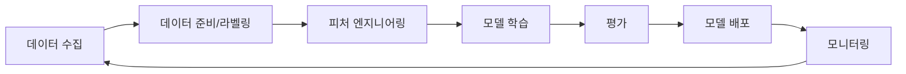

# AI와 머신러닝 서비스

> 문서 기준: 2026년 5월

## 개요

온프레미스에서 AI/ML을 하려면 GPU 서버 구매, 프레임워크 설치, 학습 인프라 구성을 직접 해야 합니다. 클라우드에서는 GPU를 시간 단위로 빌리고, 관리형 플랫폼에서 모델을 학습·배포할 수 있습니다.

2023년 이후 생성형 AI(Generative AI)의 등장으로, 직접 모델을 학습하지 않고 **파운데이션 모델을 API로 호출**하는 방식이 주류가 되고 있습니다.

## 생성형 AI 서비스

### 파운데이션 모델 API

직접 모델을 학습하지 않고, 벤더가 호스팅하는 대규모 언어 모델(LLM)을 API로 호출합니다.

| 벤더 | 제품 | 비고 |
| --- | --- | --- |
| AWS | Amazon Bedrock | Claude, Llama, Mistral, Titan 등 멀티 모델. 서버리스 API |
| Azure | Azure OpenAI Service | GPT-4o, o1 등 OpenAI 모델. 엔터프라이즈 보안/규정 준수 |
| GCP | Vertex AI (Gemini) | Gemini, Claude, Llama 등. Google 인프라에서 호스팅 |
| OCI | OCI Generative AI | Cohere, Meta Llama 등. OCI 인프라에서 호스팅 |

### AI 에이전트 / RAG

| 벤더 | 제품 | 비고 |
| --- | --- | --- |
| AWS | Bedrock Agents + Knowledge Bases | 문서 기반 RAG 자동 구성. 도구 호출(Tool Use) 지원 |
| Azure | Azure AI Agent Service | OpenAI Assistants API 기반. Azure 서비스 연동 |
| GCP | Vertex AI Agent Builder | 검색 + 대화 + RAG 통합 |
| OCI | OCI Generative AI Agents | RAG 기반 에이전트. OCI Search 연동 |

### 코드 어시스턴트

| 벤더 | 제품 | 비고 |
| --- | --- | --- |
| AWS | Kiro | AI 코딩 에이전트. 코드 생성, 변환, 보안 스캔 |
| Azure | GitHub Copilot | 코드 자동 완성. VS Code/JetBrains 통합 |
| GCP | Gemini Code Assist | 코드 생성, 설명, 변환 |
| OCI | OCI Generative AI (코드 생성) | Cohere/Llama 기반 코드 생성 |

## ML 플랫폼

직접 모델을 학습하고 배포해야 하는 경우 사용합니다.

| 벤더 | 제품 | 비고 |
| --- | --- | --- |
| AWS | SageMaker | 학습, 튜닝, 배포, MLOps 통합 플랫폼 |
| Azure | Azure Machine Learning | 노트북, AutoML, 파이프라인, 모델 레지스트리 |
| GCP | Vertex AI | 학습, 배포, 파이프라인, Feature Store 통합 |
| OCI | OCI Data Science | 노트북, 모델 학습/배포, 파이프라인 |

### GPU / AI 가속기

| 벤더 | 제품 | 비고 |
| --- | --- | --- |
| AWS | P5 (NVIDIA H100), Trn2 (Trainium), Inf2 (Inferentia) | 학습: Trainium, 추론: Inferentia로 비용 최적화 |
| Azure | ND H100 v5, ND H200 v5 | NVIDIA 최신 GPU |
| GCP | A3 (H100), TPU v5p | TPU: Google 자체 AI 가속기. 대규모 학습에 강점 |
| OCI | GPU Instances (A100, H100) | NVIDIA GPU. Bare Metal + RDMA 클러스터 지원 |

## 핵심 차이점

**AWS Bedrock** — 여러 모델 제공사(Anthropic, Meta, Mistral 등)의 모델을 하나의 API로 접근합니다. 모델 선택의 유연성이 가장 높고, 자체 칩(Trainium/Inferentia)으로 비용을 최적화할 수 있습니다.

**Azure OpenAI** — OpenAI 모델(GPT-4o, o1)을 엔터프라이즈 환경에서 사용할 수 있는 유일한 경로입니다. 기존 Microsoft 생태계(Teams, Office, Power Platform)와의 통합이 강점입니다.

**GCP Vertex AI** — Google의 Gemini 모델과 TPU 인프라가 강점입니다. 검색(Search)과 AI를 결합한 서비스가 잘 통합되어 있습니다.

**OCI AI Services** — Cohere, Meta Llama 등의 모델을 OCI 인프라에서 호스팅하며, Bare Metal GPU + RDMA 클러스터로 대규모 학습 워크로드를 지원합니다.

## ML 파이프라인과 MLOps

직접 모델을 학습하고 운영할 때는 MLOps 파이프라인을 구성합니다.

### ML 라이프사이클

### 단계별 도구

| 단계 | AWS | Azure | GCP | OCI |
| --- | --- | --- | --- | --- |
| **데이터 준비** | SageMaker Data Wrangler, Ground Truth | Azure ML Data Labeling | Vertex AI Data Labeling | OCI Data Labeling |
| **피처 스토어** | SageMaker Feature Store | Azure ML Feature Store | Vertex AI Feature Store | OCI Feature Store |
| **학습/튜닝** | SageMaker Training + Automatic Model Tuning | Azure ML + AutoML | Vertex AI Training + Hyperparameter Tuning | OCI Data Science Training |
| **모델 레지스트리** | SageMaker Model Registry | Azure ML Model Registry | Vertex AI Model Registry | OCI Model Catalog |
| **배포** | SageMaker Endpoints + Serverless | Azure ML Online/Batch Endpoints | Vertex AI Endpoints | OCI Model Deployment |
| **모니터링** | SageMaker Model Monitor | Azure ML Data Drift Detection | Vertex AI Model Monitoring | OCI Model Monitoring |
| **파이프라인** | SageMaker Pipelines | Azure ML Pipelines | Vertex AI Pipelines (Kubeflow 기반) | OCI Data Science Jobs + Pipelines |

### 생성형 AI vs 전통 ML 선택

| 요구사항 | 권장 접근 |
| --- | --- |
| 자연어 대화, 요약, 번역 | 파운데이션 모델 API (Bedrock/Azure OpenAI/Vertex AI) |
| 도메인 특화 지식 + 일반 LLM | RAG (파운데이션 모델 + 벡터 스토어) |
| 특정 태스크에 고도로 최적화 | Fine-tuning 또는 커스텀 모델 학습 |
| 이미지/객체 인식 | 사전 학습 비전 모델 또는 Computer Vision API |
| 시계열 예측, 이상 탐지 | 전통 ML (SageMaker/Vertex AI 등) |
| 초경량 엣지 배포 | 전통 ML + 모델 양자화 |

## 참고하기

### AWS

- [Amazon Bedrock 문서](https://docs.aws.amazon.com/ko_kr/bedrock/)
- [Amazon SageMaker 문서](https://docs.aws.amazon.com/ko_kr/sagemaker/)
- [Kiro](https://kiro.dev/)

### Azure

- [Azure OpenAI Service 문서](https://learn.microsoft.com/ko-kr/azure/ai-services/openai/)
- [Azure Machine Learning 문서](https://learn.microsoft.com/ko-kr/azure/machine-learning/)

### GCP

- [Vertex AI 문서](https://cloud.google.com/vertex-ai/docs)
- [Gemini API 문서](https://cloud.google.com/vertex-ai/generative-ai/docs)

### OCI

- [OCI AI Services 문서](https://docs.oracle.com/en-us/iaas/Content/ai/home.htm)
- [OCI Data Science 문서](https://docs.oracle.com/en-us/iaas/data-science/index.html)
- [OCI Generative AI 문서](https://docs.oracle.com/en-us/iaas/Content/generative-ai/home.htm)
