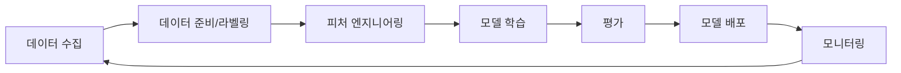

# AI와 머신러닝 서비스

> 문서 기준: 2026년 5월

## 개요


**클라우드 AI가 처음이라면** [클라우드 AI 시작하기](getting-started.md)를 먼저 읽어보시는 것을 권장합니다. 이 문서는 AI 서비스 비교에 초점을 둡니다.


### 이런 상황에서 유용합니다

- **챗봇/상담 자동화** — 고객 문의에 24시간 응답하고 싶을 때
- **문서 요약/분류** — 대량의 보고서, 이메일, 계약서를 빠르게 분석할 때
- **번역/콘텐츠 생성** — 다국어 지원, 마케팅 카피 생성, 제품 설명 자동화
- **코드 작성/리뷰** — 개발 생산성 향상, 보안 취약점 탐지
- **데이터 분석** — 자연어 질문으로 데이터 인사이트 얻기

온프레미스에서 AI/ML을 하려면 GPU 서버 구매, 프레임워크 설치, 학습 인프라 구성을 직접 해야 합니다. 클라우드에서는 GPU를 시간 단위로 빌리고, 관리형 플랫폼에서 모델을 학습·배포할 수 있습니다.

2023년 이후 생성형 AI(Generative AI)의 등장으로, 직접 모델을 학습하지 않고 **파운데이션 모델을 API로 호출**하는 방식이 주류가 되고 있습니다.

## 생성형 AI 서비스

### 파운데이션 모델 API

직접 모델을 학습하지 않고, 벤더가 호스팅하는 대규모 언어 모델(LLM)을 API로 호출합니다. 각 벤더는 자체 개발 모델과 파트너 모델을 함께 제공하며, 생태계가 빠르게 확장되고 있습니다.

| 벤더 | 플랫폼 | 주요 제공 모델군 | 비고 |
| --- | --- | --- | --- |
| AWS | [Amazon Bedrock](https://aws.amazon.com/bedrock/) | **Amazon Nova** (Nova Premier/Pro/Lite/Micro/Sonic), Anthropic Claude (Opus/Sonnet/Haiku), OpenAI GPT-OSS, Meta Llama, Mistral, NVIDIA Nemotron, AI21, Cohere | 단일 API로 멀티 모델 선택. Amazon Nova는 텍스트/이미지/비디오/음성 멀티모달 |
| Azure | [Azure OpenAI / Microsoft Foundry](https://azure.microsoft.com/products/ai-services/openai-service) | OpenAI (GPT-5 시리즈, o-시리즈), Anthropic Claude, Meta Llama, Mistral, Cohere 등 Foundry 카탈로그 수백 종 | OpenAI 주력, 엔터프라이즈 보안/규정 준수 |
| GCP | [Vertex AI Model Garden](https://cloud.google.com/vertex-ai/generative-ai/docs/learn/models) | Google **Gemini 2.5** 시리즈 (Pro/Flash/Flash-Lite), Anthropic Claude, Meta Llama, Mistral, AI21 | Gemini는 네이티브 멀티모달, Model Garden에 200+ 모델 |
| OCI | [OCI Generative AI](https://docs.oracle.com/iaas/Content/generative-ai/home.htm) | Cohere Command, Meta Llama, xAI Grok 등 ([지원 모델 목록](https://docs.oracle.com/en-us/iaas/Content/generative-ai/pretrained-models.htm)) | Oracle DB/애플리케이션 연동 강점, 전용 AI 클러스터 옵션 |


**모델 생태계는 빠르게 변합니다.** 최근에는 벤더 간 파트너십이 강화되어 "한 벤더 플랫폼에서 여러 제공사 모델 접근"이 일반화되었습니다:

- **AWS Bedrock** — Anthropic(전략적 투자 파트너), OpenAI GPT-OSS, Meta, Mistral, NVIDIA 등 다수 제공사 호스팅
- **Azure Foundry** — OpenAI 독점 파트너십 외에 Anthropic, Meta, Mistral 등 확장
- **Vertex AI** — Google 자체 Gemini + Anthropic Claude + 타사 모델 카탈로그

정확한 현재 모델 목록은 각 벤더의 공식 모델 페이지에서 확인하세요. 모델명/버전은 수개월마다 변경될 수 있습니다.


### AI 에이전트 / RAG

| 벤더 | 제품 | 비고 |
| --- | --- | --- |
| AWS | Bedrock Agents + Knowledge Bases | 문서 기반 RAG 자동 구성. 도구 호출(Tool Use) 지원 |
| Azure | Azure AI Agent Service | OpenAI Assistants API 기반. Azure 서비스 연동 |
| GCP | Vertex AI Agent Builder | 검색 + 대화 + RAG 통합 |
| OCI | OCI Generative AI Agents | RAG 기반 에이전트. OCI Search 연동 |

### 코드 어시스턴트

| 벤더 | 제품 | 비고 |
| --- | --- | --- |
| AWS | Kiro | AI 코딩 에이전트. 코드 생성, 변환, 보안 스캔 |
| Azure | GitHub Copilot | 코드 자동 완성. VS Code/JetBrains 통합 |
| GCP | Gemini Code Assist | 코드 생성, 설명, 변환 |
| OCI | 전용 코드 어시스턴트 없음 | OCI Generative AI API를 통한 코드 생성 가능 (Cohere Command, Llama). IDE 통합 플러그인은 미제공 |

## ML 플랫폼

직접 모델을 학습하고 배포해야 하는 경우 사용합니다.

| 벤더 | 제품 | 비고 |
| --- | --- | --- |
| AWS | SageMaker AI | 학습, 튜닝, 배포, MLOps 통합 플랫폼 |
| Azure | Azure Machine Learning | 노트북, AutoML, 파이프라인, 모델 레지스트리 |
| GCP | Vertex AI | 학습, 배포, 파이프라인, Feature Store 통합 |
| OCI | OCI Data Science | 노트북, 모델 학습/배포, 파이프라인 |

### GPU / AI 가속기

| 벤더 | 제품 | 비고 |
| --- | --- | --- |
| AWS | P5 (NVIDIA H100), Trn2 (Trainium), Inf2 (Inferentia) | 학습: Trainium, 추론: Inferentia로 비용 최적화 |
| Azure | ND H100 v5, ND H200 v5 | NVIDIA 최신 GPU |
| GCP | A3 (H100), TPU v5p | TPU: Google 자체 AI 가속기. 대규모 학습에 강점 |
| OCI | GPU Instances (A100, H100) | NVIDIA GPU. Bare Metal + RDMA 클러스터 지원 |

## 핵심 차이점

**AWS Bedrock** — 자체 개발 **Amazon Nova** 모델군(Premier/Pro/Lite/Micro/Sonic)과 Anthropic Claude, OpenAI GPT-OSS, Meta Llama 등 다양한 제공사의 모델을 하나의 API로 접근할 수 있습니다. 모델 선택 폭이 가장 넓고, 자체 칩(Trainium/Inferentia)으로 비용 최적화도 가능합니다.

**Azure OpenAI / Microsoft Foundry** — OpenAI GPT 시리즈를 엔터프라이즈 환경에서 쓸 수 있는 주요 경로이며, Microsoft Foundry를 통해 Anthropic, Meta 등 타사 모델도 점차 확장되고 있습니다. Microsoft 365, GitHub, Power Platform 등 기존 Microsoft 생태계와의 통합이 강점입니다.

**GCP Vertex AI** — Google 자체 **Gemini 2.5** 시리즈(Pro/Flash/Flash-Lite)의 네이티브 멀티모달 능력과 TPU 인프라가 강점입니다. Model Garden을 통해 Anthropic Claude와 타사 모델도 함께 제공하며, BigQuery/Google Search와의 결합이 차별점입니다.

**OCI Generative AI** — Cohere, Meta Llama, xAI Grok 등의 모델을 OCI 인프라에서 호스팅하며, 전용 AI 클러스터(Dedicated AI Cluster)와 RDMA 기반 Bare Metal GPU로 대규모 학습 워크로드를 지원합니다. Oracle Database/애플리케이션과의 통합이 강점입니다.

## ML 파이프라인과 MLOps

직접 모델을 학습하고 운영할 때는 MLOps 파이프라인을 구성합니다.

### ML 라이프사이클

### 단계별 도구

| 단계 | AWS | Azure | GCP | OCI |
| --- | --- | --- | --- | --- |
| **데이터 준비** | SageMaker AI Data Wrangler, Ground Truth | Azure ML Data Labeling | Vertex AI Data Labeling | OCI Data Labeling |
| **피처 스토어** | SageMaker AI Feature Store | Azure ML Feature Store | Vertex AI Feature Store | OCI Feature Store |
| **학습/튜닝** | SageMaker AI Training + Automatic Model Tuning | Azure ML + AutoML | Vertex AI Training + Hyperparameter Tuning | OCI Data Science Training |
| **모델 레지스트리** | SageMaker AI Model Registry | Azure ML Model Registry | Vertex AI Model Registry | OCI Model Catalog |
| **배포** | SageMaker AI Endpoints + Serverless | Azure ML Online/Batch Endpoints | Vertex AI Endpoints | OCI Model Deployment |
| **모니터링** | SageMaker AI Model Monitor | Azure ML Data Drift Detection | Vertex AI Model Monitoring | OCI Model Monitoring |
| **파이프라인** | SageMaker AI Pipelines | Azure ML Pipelines | Vertex AI Pipelines (Kubeflow 기반) | OCI Data Science Jobs + Pipelines |

### 생성형 AI vs 전통 ML 선택

| 요구사항 | 권장 접근 |
| --- | --- |
| 자연어 대화, 요약, 번역 | 파운데이션 모델 API (Bedrock/Azure OpenAI/Vertex AI) |
| 도메인 특화 지식 + 일반 LLM | RAG (파운데이션 모델 + 벡터 스토어) |
| 특정 태스크에 고도로 최적화 | Fine-tuning 또는 커스텀 모델 학습 |
| 이미지/객체 인식 | 사전 학습 비전 모델 또는 Computer Vision API |
| 시계열 예측, 이상 탐지 | 전통 ML (SageMaker AI/Vertex AI 등) |
| 초경량 엣지 배포 | 전통 ML + 모델 양자화 |


AI 서비스는 다른 클라우드 서비스보다 **변경 빈도가 매우 높습니다.** 모델명, API 엔드포인트, 가격이 수시로 바뀌므로, 이 문서의 기준 시점 이후 변경사항은 각 벤더의 공식 문서를 확인하세요.


## 참고하기

### AWS

- [Amazon Bedrock 문서](https://docs.aws.amazon.com/ko_kr/bedrock/)
- [Amazon SageMaker AI 문서](https://docs.aws.amazon.com/ko_kr/sagemaker/)
- [Kiro](https://kiro.dev/)

### Azure

- [Azure OpenAI Service 문서](https://learn.microsoft.com/ko-kr/azure/ai-services/openai/)
- [Azure Machine Learning 문서](https://learn.microsoft.com/ko-kr/azure/machine-learning/)

### GCP

- [Vertex AI 문서](https://cloud.google.com/vertex-ai/docs)
- [Gemini API 문서](https://cloud.google.com/vertex-ai/generative-ai/docs)

### OCI

- [OCI AI Services 문서](https://www.oracle.com/artificial-intelligence/ai-services/)
- [OCI Data Science 문서](https://docs.oracle.com/en-us/iaas/data-science/using/data-science.htm)
- [OCI Generative AI 문서](https://docs.oracle.com/en-us/iaas/Content/generative-ai/home.htm)
