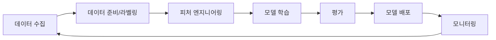
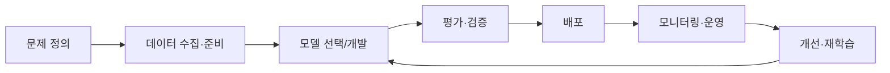

# AI 플랫폼과 모델 비교

> 문서 기준: 2026년 6월 | 이 문서는 변동이 빠른 영역으로 분기별 리뷰 대상입니다.

## 개요


**AI가 처음이라면** [AI 시작하기](getting-started.md)를 먼저 읽어보시는 것을 권장합니다. 이 문서는 AI 서비스 비교에 초점을 둡니다.


### 전통 ML에서 생성형 AI까지

| 세대 | 핵심 기술 | 특징 | 클라우드 서비스 예시 |
| --- | --- | --- | --- |
| **전통 ML** | 회귀, 분류, 클러스터링 | 정형 데이터 기반, 피처 엔지니어링 필요 | SageMaker, Azure ML, Vertex AI |
| **딥러닝** | CNN, RNN, Transformer | 비정형 데이터(이미지, 텍스트, 음성) 처리. GPU 필수 | GPU 인스턴스, 관리형 학습 플랫폼 |
| **생성형 AI** | 파운데이션 모델 (LLM, 멀티모달) | 텍스트/이미지/코드 생성. API 호출로 사용 | Bedrock, Microsoft Foundry, Gemini |
| **에이전틱 AI** | LLM + 도구 호출 + 자율 실행 | 목표 부여 시 스스로 계획·실행·검증 | AgentCore, Foundry Agents, [상세→](agents.md) |

**패러다임 전환:** 전통 ML은 "데이터를 모아 모델을 직접 학습"하는 방식이었습니다. 2017년 Google이 발표한 **Transformer 아키텍처** ("Attention Is All You Need")가 전환점이 되었습니다. 대규모 텍스트를 병렬로 학습할 수 있게 되면서 GPT, BERT 등 파운데이션 모델이 탄생했고, 이후 "이미 학습된 모델을 API로 호출"하는 생성형 AI 시대가 열렸습니다. 에이전틱 AI에서는 이 모델이 도구를 사용해 "스스로 작업을 완수"하는 단계로 진화하고 있습니다.

### 이런 상황에서 유용합니다

- **챗봇/상담 자동화** — 고객 문의에 24시간 응답하고 싶을 때
- **문서 요약/분류** — 대량의 보고서, 이메일, 계약서를 빠르게 분석할 때
- **번역/콘텐츠 생성** — 다국어 지원, 마케팅 카피 생성, 제품 설명 자동화
- **코드 작성/리뷰** — 개발 생산성 향상, 보안 취약점 탐지
- **데이터 분석** — 자연어 질문으로 데이터 인사이트 얻기

온프레미스에서 AI/ML을 하려면 GPU 서버 구매, 프레임워크 설치, 학습 인프라 구성을 직접 해야 합니다. 클라우드에서는 GPU를 시간 단위로 빌리고, 관리형 플랫폼에서 모델을 학습·배포할 수 있습니다.

## 생성형 AI 서비스

### 파운데이션 모델 API

직접 모델을 학습하지 않고, 벤더가 호스팅하는 대규모 언어 모델(LLM)을 API로 호출합니다. 각 벤더는 자체 개발 모델과 파트너 모델을 함께 제공하며, 생태계가 빠르게 확장되고 있습니다.

| 벤더 | 플랫폼 | 주요 제공 모델군 | 비고 |
| --- | --- | --- | --- |
| AWS | [Amazon Bedrock](https://aws.amazon.com/bedrock/) | **Amazon Nova** (Nova Premier/Pro/Lite/Micro/Sonic), Anthropic Claude (**Fable 5**/Opus/Sonnet/Haiku), OpenAI GPT-5.5/5.4/GPT-OSS, Meta Llama, Mistral, NVIDIA Nemotron, DeepSeek, MiniMax, GLM ([지원 모델 목록](https://docs.aws.amazon.com/bedrock/latest/userguide/model-ids.html)) | 단일 API로 멀티 모델 선택. OpenAI Codex(GPT-5.5 기반)도 Bedrock에서 제공 |
| Azure | [Microsoft Foundry(구 Azure OpenAI)](https://azure.microsoft.com/products/ai-services/openai-service) | OpenAI (GPT-5.5/5.4/5.4 mini/5.4 nano 시리즈, o-시리즈), Anthropic Claude, Meta Llama, Mistral, **MAI** (Image/Voice/Transcribe), DeepSeek V4 Pro, Kimi 2.6 ([Foundry 모델 카탈로그](https://ai.azure.com/catalog)) | OpenAI 주력 + 자체 MAI 모델군, Fireworks AI 통합, Foundry Local(로컬/단절망 실행) |
| Google Cloud | [Vertex AI Model Garden](https://cloud.google.com/vertex-ai/generative-ai/docs/learn/models) | Google **Gemini 3.x/2.5** 시리즈 (3.5 Flash/3.5 Pro/3.1 Pro/2.5 Pro/2.5 Flash), **Gemini Omni** (비디오 생성), Anthropic Claude, xAI Grok, Meta Llama, Mistral, DeepSeek, OpenAI GPT-OSS ([Model Garden](https://cloud.google.com/vertex-ai/generative-ai/docs/learn/models)) | Gemini 3.5 Pro가 최신 플래그십(2M 토큰, Deep Think). 네이티브 멀티모달, Model Garden에 200+ 모델 |
| OCI | [OCI Enterprise AI(구 OCI Generative AI)](https://docs.oracle.com/iaas/Content/generative-ai/home.htm) | Cohere Command, Meta Llama, xAI Grok 4.3, Google Gemini, OpenAI GPT-5.5/5.4/Codex(OCI Marketplace 예정), DeepSeek 등 ([지원 모델 목록](https://docs.oracle.com/en-us/iaas/Content/generative-ai/pretrained-models.htm)) | Oracle DB 네이티브 통합, **Dedicated AI Cluster** (전용 RDMA GPU, 타 테넌트 비공유), AI Guardrails(콘텐츠/PII/프롬프트 인젝션), 이그레스 10TB 무료 |
| xAI | [xAI API](https://x.ai/api) | **Grok 4.3**, Grok 4.1 Fast, Imagine (이미지/비디오 생성) | 100만 토큰 컨텍스트 윈도우, 경쟁력 있는 가격, 추론·코딩 특화. OCI에서도 호스팅 제공 |


**모델 생태계는 빠르게 변합니다.** 최근에는 벤더 간 파트너십이 강화되어 "한 벤더 플랫폼에서 여러 제공사 모델 접근"이 일반화되었습니다:

- **Amazon Bedrock** — Anthropic(전략적 투자 파트너, Claude Fable 5/Opus/Sonnet/Haiku 전 계열), OpenAI GPT-5.5/5.4 + Codex, Meta, Mistral, DeepSeek, NVIDIA 등 다수 제공사 호스팅
- **Microsoft Foundry** — OpenAI 독점 파트너십 외에 Anthropic, Meta, Mistral, 자체 MAI 모델군(이미지/음성), Fireworks AI(DeepSeek V4 Pro, Kimi 2.6) 확장
- **Gemini Enterprise Agent Platform** — Google 자체 Gemini 3.x/2.5(3.5 Pro/3.5 Flash/3.1 Pro) + Gemini Omni + Anthropic Claude + xAI Grok + 타사 모델 카탈로그
- **OCI Enterprise AI** — Cohere, Meta Llama, xAI Grok 4.3, Google Gemini + OpenAI(GPT-5.5/5.4, Codex) OCI Marketplace 통해 제공 예정

정확한 현재 모델 목록은 각 벤더의 공식 모델 페이지에서 확인하세요. 모델명/버전은 수개월마다 변경될 수 있습니다.


### AI 에이전트 / RAG

| 벤더 | 에이전트 플랫폼 | RAG |
| --- | --- | --- |
| AWS | [Bedrock AgentCore](https://aws.amazon.com/bedrock/agentcore/) | Bedrock Knowledge Bases |
| Azure | [Microsoft Foundry Agents](https://learn.microsoft.com/azure/ai-foundry/agents/) | Azure AI Search |
| Google Cloud | [Gemini Enterprise Agent Platform](https://cloud.google.com/products/agent-builder) | Vertex AI RAG Engine |
| OCI | [OCI Enterprise AI Agents](https://docs.oracle.com/iaas/Content/generative-ai/agents.htm) | OCI Search 연동 |

### 코드 어시스턴트

| 벤더 | 제품 | 비고 |
| --- | --- | --- |
| AWS | Kiro | AI 코딩 에이전트. Spec-driven 개발, Hooks, Kiro Web(GitHub/GitLab), Kiro Powers |
| Azure | GitHub Copilot | 코드 자동 완성. Desktop App, Agent Merge, Cloud Sessions |
| Google Cloud | Gemini Code Assist / Antigravity | 코드 생성·설명·변환. Antigravity는 Agent-first IDE |
| xAI | Grok Build | CLI 코딩 에이전트. 8 병렬 서브에이전트, Git worktree 격리 |


코딩 에이전트의 발전 과정, 제품별 상세 비교(Kiro, Copilot, Codex, Claude Code 등)는 [AI 에이전트 — 코딩 에이전트](agents.md#코딩-에이전트)를 참고하세요.


## ML 플랫폼

직접 모델을 학습하고 배포해야 하는 경우 사용합니다.

| 벤더 | 제품 | 비고 |
| --- | --- | --- |
| AWS | SageMaker AI | 학습, 튜닝, 배포, MLOps 통합 플랫폼 |
| Azure | Azure Machine Learning | 노트북, AutoML, 파이프라인, 모델 레지스트리 |
| Google Cloud | Vertex AI | 학습, 배포, 파이프라인, Feature Store 통합 |
| OCI | OCI Data Science | 노트북, 모델 학습/배포, 파이프라인 |

### GPU / AI 가속기

| 벤더 | 제품 | 비고 |
| --- | --- | --- |
| AWS | P6 (NVIDIA B200), P6e (GB200 UltraServer), P5 (H100), Trn2 (Trainium), Inf2 (Inferentia) | Blackwell: P6-B200(8×B200), P6e-GB200(최대 72 GPU NVLink). 학습: Trainium, 추론: Inferentia로 비용 최적화 |
| Azure | ND GB200-v6, ND H200 v5, ND H100 v5 | GB200-v6: Blackwell 플래그십. DL 학습/생성형 AI/HPC |
| Google Cloud | A4X (GB200 NVL72), A4 (B200), A3 (H100), TPU v5p/v6e | A4: Blackwell 단일 GPU, A4X: GB200 NVL72 최초 클라우드 제공. TPU: Google 자체 AI 가속기 |
| OCI | GPU Instances (B200, H100, A100) | NVIDIA Blackwell + Bare Metal + RDMA 클러스터 지원 |

## 핵심 차이점

**Amazon Bedrock** — 자체 개발 **Amazon Nova 2** 모델군(Premier/Pro/Lite/Micro/Sonic/Omni)과 Anthropic Claude, OpenAI GPT 시리즈 등 다양한 제공사의 모델을 하나의 API로 접근할 수 있습니다. 모델 선택 폭이 가장 넓으며, AI 에이전트 구축을 위한 AgentCore 등 운영 체계가 강점입니다.

**Microsoft Foundry** — 구 Azure AI Foundry가 브랜드를 통합한 상위 플랫폼입니다. OpenAI GPT-5.5/5.4 시리즈를 엔터프라이즈 환경에서 쓸 수 있는 주요 경로이며, Anthropic, Meta 등 타사 모델도 폭넓게 제공합니다. 자체 **MAI 모델군**(Image-2.5, Voice-1, Transcribe-1)과 **Foundry Local**(로컬/단절망 실행)이 추가되었습니다. Microsoft 365, GitHub, Power Platform 등 기존 Microsoft 생태계와의 깊은 통합이 최대 강점입니다.

**Gemini Enterprise Agent Platform** — 구 Vertex AI가 에이전트 중심으로 전면 개편된 플랫폼입니다. Google 자체 **Gemini 3.x/2.5** 시리즈(3.5 Pro/3.5 Flash/3.1 Pro)의 네이티브 멀티모달 능력과 TPU 인프라가 강점입니다. Gemini 3.5 Pro는 2M 토큰 컨텍스트 윈도우와 Deep Think 추론을 지원하며, **Gemini Omni**(any-to-any 멀티모달 비디오 생성)와 Agent Studio를 통한 로우코드 에이전트 개발, Google Search/BigQuery와의 결합이 차별점입니다.

**OCI Enterprise AI** — 구 OCI Generative AI가 확장된 플랫폼입니다. Cohere, Meta Llama, xAI Grok 4.3, Google Gemini 등의 모델을 OCI 인프라에서 호스팅하며, 전용 AI 클러스터(Dedicated AI Cluster)와 RDMA 기반 Bare Metal GPU로 고성능 워크로드를 지원합니다. **AI Guardrails**(콘텐츠 모더레이션, PII 탐지, 프롬프트 인젝션 방어)와 **Enterprise AI Agents**(GA)가 추가되었습니다. OpenAI와의 파트너십으로 GPT-5.5/5.4 및 Codex를 OCI Marketplace에서 Oracle Universal Credits로 이용할 수 있게 될 예정이며, Oracle Database/애플리케이션과의 네이티브 통합이 강점입니다.

## ML 파이프라인과 MLOps

직접 모델을 학습하고 운영할 때는 MLOps 파이프라인을 구성합니다.

### ML 라이프사이클

### 단계별 도구

| 단계 | AWS | Azure | Google Cloud | OCI |
| --- | --- | --- | --- | --- |
| **데이터 준비** | SageMaker AI Data Wrangler, Ground Truth | Azure ML Data Labeling | Vertex AI Data Labeling | OCI Data Labeling |
| **피처 스토어** | SageMaker AI Feature Store | Azure ML Feature Store | Vertex AI Feature Store | OCI Feature Store |
| **학습/튜닝** | SageMaker AI Training + Automatic Model Tuning | Azure ML + AutoML | Vertex AI Training + Hyperparameter Tuning | OCI Data Science Training |
| **모델 레지스트리** | SageMaker AI Model Registry | Azure ML Model Registry | Vertex AI Model Registry | OCI Model Catalog |
| **배포** | SageMaker AI Endpoints + Serverless | Azure ML Online/Batch Endpoints | Vertex AI Endpoints | OCI Model Deployment |
| **모니터링** | SageMaker AI Model Monitor | Azure ML Data Drift Detection | Vertex AI Model Monitoring | OCI Model Monitoring |
| **파이프라인** | SageMaker AI Pipelines | Azure ML Pipelines | Vertex AI Pipelines (Kubeflow 기반) | OCI Data Science Jobs + Pipelines |

### 생성형 AI vs 전통 ML 선택

| 요구사항 | 권장 접근 |
| --- | --- |
| 자연어 대화, 요약, 번역 | 파운데이션 모델 API (Bedrock/Microsoft Foundry/Vertex AI) |
| 도메인 특화 지식 + 일반 LLM | RAG (파운데이션 모델 + 벡터 스토어) |
| 특정 태스크에 고도로 최적화 | Fine-tuning 또는 커스텀 모델 학습 |
| 이미지/객체 인식 | 사전 학습 비전 모델 또는 Computer Vision API |
| 시계열 예측, 이상 탐지 | 전통 ML (SageMaker AI/Vertex AI 등) |
| 초경량 엣지 배포 | 전통 ML + 모델 양자화 |

### AI 개발 수명주기 (AI-DLC)

AI 프로젝트는 단순히 "모델을 선택해서 API를 호출"하는 것으로 끝나지 않습니다. 프로덕션 수준의 AI 시스템을 지속적으로 운영하려면 전체 수명주기를 관리해야 합니다.

| 단계 | 핵심 질문 | 생성형 AI에서의 적용 |
| --- | --- | --- |
| **문제 정의** | 무엇을 해결할 것인가? | 프롬프트 한 번으로 충분한가, RAG가 필요한가, 에이전트가 필요한가 판단 |
| **데이터 수집·준비** | 어떤 데이터가 필요한가? | RAG용 문서 수집·청킹, Fine-tuning용 데이터셋 구축 |
| **모델 선택/개발** | 어떤 모델을 쓸 것인가? | 벤더·모델·크기 선택, 프롬프트/스펙 설계 |
| **평가·검증** | 품질이 충분한가? | Golden set 평가, LLM-as-Judge, 회귀 테스트 ([LLMOps](llmops.md) 참고) |
| **배포** | 어떻게 서빙할 것인가? | API 라우팅, A/B 테스트, Canary 배포 |
| **모니터링·운영** | 품질이 유지되는가? | 지연·비용·환각률 추적, 모델 Fallback, 가드레일 |
| **개선·재학습** | 언제 업데이트할 것인가? | 모델 버전 업그레이드, 프롬프트 개선, 데이터 추가 |

**운영 관점 핵심 사항:**

- **모델 버전 수명 관리** — 벤더가 모델을 은퇴(deprecate)시키면 마이그레이션이 필요합니다. GPT-4o 은퇴(2026.02), Gemini 3 Pro Preview 중단(2026.03) 등 실제로 자주 발생합니다. 모델 ID를 코드에 고정하고 교체 시 반드시 평가를 거치세요.
- **비용 거버넌스** — AI 비용은 사용량에 비례하여 예측이 어렵습니다. 일/월 예산 상한, 태스크별 토큰 한도, 비용 초과 알림을 반드시 설정하세요.
- **데이터 드리프트** — RAG용 문서가 오래되면 답변 품질이 서서히 저하됩니다. 정기적인 데이터 갱신 파이프라인을 구성하세요.
- **규정 준수** — 입출력 로그의 PII 마스킹, 데이터 보존 정책, 모델의 학습 데이터 사용 여부를 지속적으로 관리해야 합니다.


생성형 AI의 DLC는 전통 ML보다 **반복 주기가 짧습니다**. 모델 학습에 수개월이 걸리는 전통 ML과 달리, 프롬프트 변경은 수 분, RAG 데이터 업데이트는 수 시간이면 반영됩니다. 이 빠른 주기에 맞는 평가·배포·롤백 체계가 필요합니다.



AI 서비스는 다른 클라우드 서비스보다 **변경 빈도가 매우 높습니다.** 모델명, API 엔드포인트, 가격이 수시로 바뀌므로, 이 문서의 기준 시점 이후 변경사항은 각 벤더의 공식 문서를 확인하세요.


## AI 활용의 확장 방향

AI는 모델 API 호출을 넘어 다양한 형태로 확장되고 있습니다.

### Applied AI (산업별 AI 서비스)

AI/ML을 직접 구축하지 않고, 특정 업무에 바로 적용할 수 있는 완성형 AI 서비스입니다.

| 영역 | 예시 | 벤더 서비스 |
| --- | --- | --- |
| 컨택센터 (AICC) | 음성 봇, 실시간 상담 지원 | Amazon Connect, Azure AI Contact Center, Google Cloud CCAI |
| 문서 처리 | OCR, 문서 분류, 데이터 추출 | Textract, Document Intelligence, Document AI |
| 코드 생성 | 코드 자동완성, 리뷰 | Amazon Q Developer, GitHub Copilot, Gemini Code Assist |
| BI 자연어 질의 | 자연어로 데이터 분석 | Amazon Q in QuickSight, Copilot in Power BI, Gemini in Looker |

### Physical AI (물리 세계 AI)

IoT, 로보틱스, 디지털 트윈 등 물리 세계와 연결되는 AI입니다.

| 영역 | 클라우드 연관 서비스 |
| --- | --- |
| IoT + 엣지 추론 | AWS IoT Greengrass, Azure IoT Edge, Google Cloud Edge TPU |
| 디지털 트윈 | AWS IoT TwinMaker, Azure Digital Twins |
| 로보틱스 시뮬레이션 | AWS RoboMaker, NVIDIA Isaac (클라우드 GPU) |

### Agentic Apps (AI 에이전트)

자율적으로 도구를 호출하고 멀티스텝 작업을 수행하는 AI 앱입니다. 기존 LLM이 "질문에 답하는 도구"라면, 에이전트는 "목표를 부여받으면 완수하는 주체"입니다.

| 사례 | 동작 방식 |
| --- | --- |
| 코딩 에이전트 | 버그 리포트를 받으면 코드를 분석하고, 수정하고, 테스트를 실행한 뒤 PR을 생성 |
| 고객 지원 에이전트 | 문의를 분류하고, CRM을 조회하고, 환불을 처리한 뒤 결과를 이메일로 발송 |
| 데이터 분석 에이전트 | 자연어 질문을 SQL로 변환하고, 실행 결과를 시각화하여 보고서 생성 |


벤더별 에이전트 플랫폼, 오케스트레이션 패턴, 코딩 에이전트, 프로토콜(MCP/A2A/ACP)에 대한 상세 비교는 [AI 에이전트](agents.md)를 참고하세요.


## 자주 하는 실수

- **Fine-tuning부터 시작** — RAG로 충분한 문제를 Fine-tuning으로 해결하려 하여 비용과 시간을 낭비. RAG를 먼저 시도해야 함
- **모델 버전을 고정하지 않음** — 벤더가 모델을 업데이트하면 기존 프롬프트의 동작이 달라져 프로덕션 품질이 갑자기 저하됨
- **단일 모델에 모든 워크로드를 처리** — 간단한 분류 작업에도 최대 모델을 사용하여 비용이 불필요하게 증가. 태스크별 모델 분리 필요

## 체크리스트

- [ ] 워크로드 특성(대화, 요약, 코드 생성 등)에 맞는 모델을 선택하고 비용/품질을 비교했는가
- [ ] 모델 ID/버전을 코드에 고정하고, 업그레이드 시 평가를 거쳐 전환하는가
- [ ] RAG → Fine-tuning → 직접 학습 순서로 단계적으로 접근하고 있는가

## 참고하기

### AWS

- [Amazon Bedrock 문서](https://docs.aws.amazon.com/ko_kr/bedrock/)
- [Amazon SageMaker AI 문서](https://docs.aws.amazon.com/ko_kr/sagemaker/)
- [Kiro](https://kiro.dev/)

### Azure

- [Microsoft Foundry(구 Azure OpenAI) Service 문서](https://learn.microsoft.com/ko-kr/azure/ai-services/openai/)
- [Azure Machine Learning 문서](https://learn.microsoft.com/ko-kr/azure/machine-learning/)

### Google Cloud

- [Vertex AI 문서](https://cloud.google.com/vertex-ai/docs)
- [Gemini API 문서](https://cloud.google.com/vertex-ai/generative-ai/docs)

### OCI

- [OCI AI Services 문서](https://www.oracle.com/artificial-intelligence/ai-services/)
- [OCI Data Science 문서](https://docs.oracle.com/en-us/iaas/data-science/using/data-science.htm)
- [OCI Enterprise AI(구 OCI Generative AI) 문서](https://docs.oracle.com/en-us/iaas/Content/generative-ai/home.htm)
