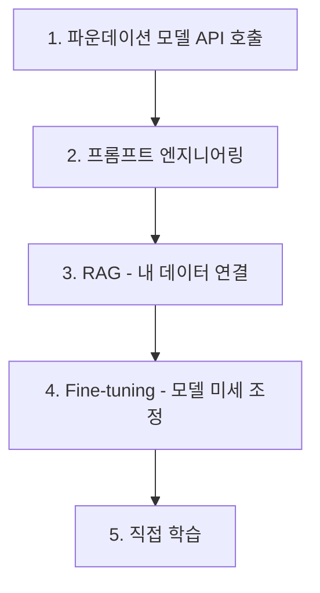

# AI 시작하기

> 문서 기준: 2026년 7월

## AI의 전체 그림

"AI"는 하나의 기술이 아닙니다. 수십 년간 발전해온 여러 기술의 총칭이며, 각 세대가 이전을 대체하는 것이 아니라 **공존**합니다.

| 세대 | 핵심 기술 | 하는 일 | 클라우드 서비스 |
| --- | --- | --- | --- |
| **전통 ML** | 회귀, 분류, 클러스터링, 트리 | 정형 데이터 예측·분류 (이탈 예측, 이상 탐지, 추천) | SageMaker AI, Azure ML, Vertex AI, OCI Data Science |
| **딥러닝** | CNN, RNN, Transformer | 비정형 데이터 처리 (이미지 인식, 음성, 번역) | GPU 인스턴스 + ML 플랫폼 |
| **생성형 AI** | 파운데이션 모델 (LLM, 멀티모달) | 텍스트/이미지/코드/음성 생성 | Bedrock, Microsoft Foundry, Gemini |
| **에이전틱 AI** | LLM + 도구 호출 + 자율 실행 | 목표를 주면 스스로 계획·실행·검증 | AgentCore, Foundry Agents, Gemini Agent Platform |


**지금 시작한다면:** 대부분의 엔터프라이즈 AI 도입은 **생성형 AI**(FM API 호출)에서 시작합니다. 전통 ML은 이미 데이터 파이프라인이 있는 조직에서, 딥러닝은 이미지/음성 등 특화 워크로드에서 여전히 활발합니다. 이 문서는 생성형 AI 시작에 초점을 두되, 전통 ML/딥러닝이 필요한 경우도 안내합니다.


### 어떤 AI가 필요한지 판단하기

| 해결하려는 문제 | 적합한 접근 | 문서 |
| --- | --- | --- |
| 정형 데이터 예측 (매출, 이탈, 이상 탐지) | 전통 ML | [AI 플랫폼 — ML 플랫폼](ai-ml.md#ml-플랫폼) |
| 이미지/영상 분류, 객체 탐지 | 딥러닝 (Computer Vision) | [AI 플랫폼 — ML 플랫폼](ai-ml.md#ml-플랫폼) |
| 자연어 대화, 문서 요약, 코드 생성 | 생성형 AI (FM API) | 이 문서 아래 참고 |
| 멀티스텝 자동화, 도구 호출, 자율 작업 | 에이전트 | [AI 에이전트](agents.md) |
| 업무 보조 (전 직원 AI 도구) | Desktop Agent | [AI 에이전트](agents.md) |

---

## 왜 클라우드에서 AI를 사용하는가

AI 모델을 직접 만들려면 수백억 원의 GPU, 수천만 건의 학습 데이터, 수개월의 학습 시간이 필요합니다. 대부분의 조직은 이 과정을 직접 수행하지 않고, **클라우드 벤더가 제공하는 준비된 AI 서비스**를 사용합니다.

비유하자면, 전기를 직접 발전하지 않고 한전에서 받아 쓰는 것과 같습니다. 우리는 "어떻게 전기를 만들지"가 아니라 "전기로 무엇을 할지"에 집중합니다.

## 가장 먼저 이해할 세 가지 개념

### 1. 파운데이션 모델 (Foundation Model)

대량의 데이터로 이미 학습된 범용 AI 모델입니다. 대표적으로 **LLM** (Large Language Model, 대형 언어 모델)이 있습니다. GPT (OpenAI), Claude (Anthropic), Gemini (Google), Nova (Amazon) 같은 이름들이 여기에 해당합니다.

- 직접 학습할 필요 없이 API를 호출해서 사용합니다.
- "질문을 하면 답을 하는 똑똑한 비서"라고 생각하면 됩니다.

### 2. 프롬프트 (Prompt)

모델에게 보내는 입력 메시지입니다. "한국의 수도를 알려줘"처럼 자연어로 작성합니다. 어떻게 묻느냐에 따라 답변 품질이 크게 달라집니다.

### 3. 토큰 (Token)

모델이 텍스트를 처리하는 단위입니다. 대략 단어 한 개가 1~2 토큰입니다. 대부분의 API는 **입력/출력 토큰 수로 과금** 합니다.

## 생성형 AI 활용 단계

이 아래부터는 가장 많이 선택되는 **생성형 AI(FM API)** 도입 순서를 다룹니다. 전통 ML 파이프라인(학습→배포→모니터링)은 [AI 플랫폼과 모델 비교 — ML 파이프라인](ai-ml.md#ml-파이프라인과-mlops)을 참고하세요.

생성형 AI를 도입할 때 보통 이 순서로 접근합니다. 아래로 갈수록 비용과 복잡도가 증가합니다.

### 단계 1: API 호출

가장 간단한 시작점입니다. Amazon Bedrock, Microsoft Foundry, Gemini Enterprise, OCI Enterprise AI 중 하나의 API로 질문을 보내고 답을 받습니다. 벤더별 서비스 비교는 [AI 플랫폼과 모델 비교](ai-ml.md)를 참고하세요.

**사용 예시:**
- 사용자 질문에 답하는 챗봇
- 문서 요약
- 번역

### 단계 2: 프롬프트 엔지니어링

같은 API라도 어떻게 묻느냐에 따라 답이 크게 달라집니다. 예를 들어 "당신은 법률 전문가입니다. 아래 계약서에서 위험 요소를 5가지 찾아주세요"처럼 역할과 지시를 명확히 주면 품질이 올라갑니다. 설계 기법 상세는 [프롬프트 엔지니어링](prompt-engineering.md)을 참고하세요.

**코드 작성 없이 가능한 개선 방법입니다.**

### 단계 3: RAG (Retrieval Augmented Generation)

파운데이션 모델은 일반 지식은 풍부하지만 **내 회사 데이터는 모릅니다**. RAG는 내 문서를 검색해서 관련 부분을 프롬프트에 포함시킨 후 모델에게 전달하는 기술입니다.

비유: "시험 시간에 오픈북으로 답을 쓰게 하는 것"

**사용 예시:**
- 사내 문서 기반 챗봇
- 제품 FAQ 자동 응답
- 법률/의료 문서 조회

RAG는 [벡터 스토어](vector-store.md)와 함께 동작합니다. 구현 패턴 상세는 [RAG 고급 패턴](rag-patterns.md)을 참고하세요.

### 단계 4: Fine-tuning

내 데이터로 모델을 미세 조정합니다. 특정 업무에 최적화할 수 있지만 비용과 시간이 크게 증가합니다.

**사용 예시:**
- 특정 업계 전문 용어 이해
- 회사 고유의 말투/스타일 반영
- 특정 형식의 출력 강제

### 단계 5: 직접 학습

대부분의 조직에는 필요하지 않습니다. 구글, OpenAI, Anthropic 같은 회사들이 하는 일입니다.

모델 운영·평가·비용 추적은 [LLMOps](llmops.md)를, AI 보안과 가드레일은 [AI 보안](../security/ai-security.md)을 참고하세요.

## 언제 어떤 방법을 쓸까

| 상황 | 권장 방법 |
| --- | --- |
| 빠르게 프로토타입을 만들고 싶다 | 단계 1 (API 호출) |
| API는 쓰지만 품질이 아쉽다 | 단계 2 (프롬프트 엔지니어링) |
| 내 회사 문서를 참고해서 답하게 하고 싶다 | 단계 3 (RAG) |
| 일반 모델이 잘 모르는 전문 도메인이다 | 단계 4 (Fine-tuning) |
| 모델 자체가 없는 새로운 문제다 | 단계 5 (직접 학습) |


**현실적 조언:** 대부분의 업무는 단계 3(RAG)까지로 충분합니다. Fine-tuning은 구축/운영 비용이 크고, RAG로 먼저 시도한 후 한계가 명확할 때만 고려하세요.


## AI 모델을 왜 직접 만들지 않는가

| 항목 | 직접 학습 | 클라우드 API |
| --- | --- | --- |
| **초기 비용** | 수백억 원대 GPU | API 호출당 수 원~수백 원 |
| **소요 시간** | 수개월~수년 | 수 분 (API 연동) |
| **데이터** | 수조 토큰의 학습 데이터 필요 | 모델이 이미 학습됨 |
| **전문 인력** | ML 엔지니어, 연구자 다수 | 일반 개발자로 가능 |
| **업데이트** | 재학습 필요 | 벤더가 자동 업데이트 |
| **효과** | 최첨단 가능 | 대부분의 업무에 충분 |

## 자주 하는 실수

- **프롬프트 엔지니어링을 건너뛰고 바로 Fine-tuning** — 프롬프트 개선만으로 품질이 충분히 올라가는 경우가 많은데, 비용과 시간이 큰 Fine-tuning부터 시도
- **토큰 비용을 고려하지 않고 설계** — 긴 시스템 프롬프트를 매 요청마다 보내거나, 불필요하게 긴 문서를 컨텍스트에 포함하여 비용 폭증
- **RAG 없이 모델의 내부 지식에만 의존** — 파운데이션 모델은 학습 시점 이후 정보나 사내 데이터를 모르므로 환각(Hallucination) 발생

## 체크리스트

- [ ] API 호출 → 프롬프트 엔지니어링 → RAG → Fine-tuning 순서로 단계적으로 접근하고 있는가
- [ ] 토큰 사용량과 비용을 모니터링하고 예산 상한을 설정했는가
- [ ] 사내 데이터 기반 답변이 필요한 경우 RAG 파이프라인을 구성했는가

## 참고하기

### AWS

- [Amazon Bedrock 소개](https://aws.amazon.com/ko/bedrock/)
- [Amazon Nova 2 모델 가이드](https://docs.aws.amazon.com/bedrock/latest/userguide/model-parameters-nova.html)

### Azure

- [Microsoft Foundry 공식 문서](https://learn.microsoft.com/azure/ai-studio/)
- [Microsoft Foundry Portal](https://ai.azure.com/)

### Google Cloud

- [Gemini Enterprise Agent Platform 문서](https://cloud.google.com/vertex-ai/docs)
- [Gemini 모델 공식 사이트](https://deepmind.google/technologies/gemini/)

### OCI

- [OCI Enterprise AI 개요](https://www.oracle.com/kr/artificial-intelligence/generative-ai/generative-ai-service/)
- [OCI AI Database 26ai](https://www.oracle.com/kr/database/21c/ai-vector-search/)

### 입문 자료

- [AWS — What is Generative AI?](https://aws.amazon.com/what-is/generative-ai/)
- [Microsoft — What is Generative AI?](https://azure.microsoft.com/en-us/solutions/ai/generative-ai)
- [Google Cloud — Gen AI Overview](https://cloud.google.com/ai/generative-ai)
- [Oracle — What Is Generative AI?](https://www.oracle.com/artificial-intelligence/generative-ai/what-is-generative-ai/)

### 용어집

- [CloudPick 용어집](../GLOSSARY.md) — AI/ML 관련 용어 포함
