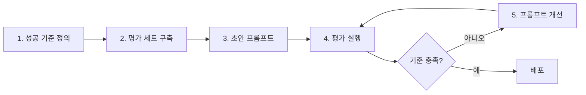

# 프롬프트 엔지니어링

> 문서 기준: 2026년 5월


LLM/프롬프트가 처음이라면 [AI 시작하기](getting-started.md)를 먼저 읽어보세요.


## 프롬프트 엔지니어링이란

프롬프트 엔지니어링은 "**모델에게 어떻게 질문/지시해야 원하는 답을 얻는가**" 를 다룹니다. 같은 모델이라도 프롬프트에 따라 출력 품질이 크게 달라집니다.

Anthropic 공식 문서에 따르면 프롬프트 엔지니어링은 *"경험적 과학(empirical science)"* 이며, 가장 중요한 것은 **평가 기준 정의 → 반복 테스트** 입니다. 단순히 "좋은 프롬프트"를 찾는 것이 아니라, 측정 가능한 지표로 개선하는 과정입니다 — [Anthropic Prompt Engineering Guide](https://docs.anthropic.com/claude/docs/prompt-engineering)

## 기본 원칙

Microsoft, Google, Anthropic 공식 가이드가 공통으로 강조하는 원칙:

- **명확하고 구체적인 지시** — 모호한 요청은 모호한 답을 낳습니다.
- **맥락 제공** — 모델이 모르는 배경 정보를 먼저 제공합니다.
- **역할 부여** — "당신은 법률 전문가입니다" 같은 페르소나 설정.
- **출력 형식 명시** — JSON, 목록, 단락 등을 원하는 형식을 지정.
- **예시 제공** — 입출력 예시를 보여주면 품질이 향상됩니다 (Few-shot).
- **반복 평가** — 대표 사례로 품질 측정 후 개선.

출처:
- [Microsoft — Prompt engineering techniques](https://learn.microsoft.com/azure/cognitive-services/openai/concepts/prompt-engineering)
- [Google Cloud — Prompting strategies](https://cloud.google.com/vertex-ai/generative-ai/docs/learn/prompts/prompt-design-strategies)
- [Anthropic — Prompt engineering overview](https://docs.anthropic.com/claude/docs/prompt-engineering)

## 주요 패턴

### Zero-shot

예시 없이 바로 지시합니다.

```
아래 문장의 감정을 분석하세요: "오늘 회의는 지루했어요."
```

간단한 작업에 적합하지만, 복잡한 작업에서는 품질이 떨어집니다.

### Few-shot (One-shot, Multi-shot)

원하는 패턴을 예시로 먼저 보여주는 방식입니다. LLM이 예시를 보고 비슷한 형식으로 답합니다.

```
다음 문장을 긍정/중립/부정으로 분류하세요.

문장: "서비스가 정말 훌륭했어요."
답: 긍정

문장: "배송은 예정대로 왔습니다."
답: 중립

문장: "제품이 파손되어 왔어요."
답:
```

**출처:**
- [Google Cloud — Give examples (few-shot prompting)](https://cloud.google.com/vertex-ai/generative-ai/docs/learn/prompts/few-shot-examples)
- [Anthropic — Use examples (multishot prompting)](https://docs.anthropic.com/en/docs/build-with-claude/prompt-engineering/multishot-prompting)

### Chain-of-Thought (CoT)

모델이 단계별로 추론하도록 유도합니다. 수학, 논리 추론, 복잡한 분류 작업에서 정확도가 크게 올라갑니다.

```
문제를 단계별로 풀어주세요.

문제: 가게에 사과 23개가 있고, 20개가 팔렸습니다. 그리고 새로 6개가 들어왔습니다. 지금 몇 개가 있나요?

단계:
1.
```

최신 모델(Claude Opus 4.8, GPT-5.5, Gemini 3.1 Pro)은 내부적으로 CoT를 자동 수행하기도 하지만, "**단계별로 설명하세요(Think step by step)**" 같은 명시적 지시가 여전히 효과가 있습니다.

**출처:**
- [Microsoft — Chain of thought prompting](https://learn.microsoft.com/en-us/dotnet/ai/conceptual/chain-of-thought-prompting)
- [Anthropic — Let Claude think (CoT)](https://docs.anthropic.com/en/docs/build-with-claude/prompt-engineering/chain-of-thought)
- 논문: [Wei et al., 2022 — Chain-of-Thought Prompting Elicits Reasoning in Large Language Models](https://arxiv.org/abs/2201.11903)

### 역할 부여 (System Prompt / Persona)

모델에게 역할을 지정합니다. 모델의 톤, 전문성, 응답 범위가 달라집니다.

```
당신은 한국 법률 전문가입니다. 일반인이 이해할 수 있도록 쉽게 설명하되,
법률 용어는 정확하게 사용하세요.

질문: 계약서에 '갑'과 '을' 표현이 나오는데 무슨 뜻인가요?
```

대부분의 API는 시스템 프롬프트(System Prompt)를 별도로 지정할 수 있습니다 ([Anthropic 가이드](https://docs.anthropic.com/en/docs/build-with-claude/prompt-engineering/system-prompts)).

### 출력 형식 강제

구조화된 출력(JSON, XML 등)을 원할 때 형식을 명시합니다.

```
아래 리뷰에서 정보를 JSON으로 추출하세요.

스키마:
{
  "product": "상품명",
  "rating": 1-5 정수,
  "sentiment": "긍정" | "중립" | "부정"
}

리뷰: "이 이어폰 정말 좋아요! 음질이 뛰어나고 배터리도 오래가요. 별 5개 드립니다."
```

일부 벤더는 **구조화된 출력(Structured Output)** 을 네이티브로 지원합니다:
- [Microsoft Foundry Structured Outputs](https://learn.microsoft.com/azure/ai-services/openai/how-to/structured-outputs)
- [Vertex AI Controlled Generation](https://cloud.google.com/vertex-ai/generative-ai/docs/multimodal/control-generated-output)

### ReAct (Reasoning + Acting)

LLM이 "생각 → 도구 호출 → 관찰 → 다음 생각"을 반복하며 도구를 사용하는 패턴입니다. 에이전트 구현의 기본 패턴으로 널리 사용됩니다.

```
사용 가능한 도구:
- search(query): 웹 검색
- calculate(expression): 계산

질문: 2024년 올림픽 개최지와 서울 간 거리는?

Thought: 먼저 2024년 올림픽 개최지를 찾아야 한다.
Action: search("2024 Olympics host city")
Observation: 파리
Thought: 파리와 서울의 거리를 계산해야 한다.
Action: search("distance Paris Seoul")
Observation: 약 8,957 km
Answer: 2024년 올림픽 개최지는 파리이며, 서울과의 거리는 약 8,957 km입니다.
```

**출처:**
- 논문: [Yao et al., 2022 — ReAct: Synergizing Reasoning and Acting in Language Models](https://arxiv.org/abs/2210.03629)
- [AWS — Using Tools (Function Calling) with Bedrock](https://docs.aws.amazon.com/bedrock/latest/userguide/tool-use.html)
- [Anthropic — Tool use](https://docs.anthropic.com/en/docs/agents-and-tools/tool-use/overview)

## 벤더별 권장 실천 사항

각 벤더가 자사 모델에 대해 권장하는 실천 방법이 조금씩 다릅니다.

| 벤더 | 특징적 권장사항 | 참고 |
| --- | --- | --- |
| **AWS Bedrock (Claude)** | XML 태그로 구조화 (`<context>...</context>`), 명확한 지시 선두 배치 | [Claude Opus 4.8 best practices](https://docs.anthropic.com/en/docs/build-with-claude/prompt-engineering/claude-4-best-practices) |
| **Microsoft Foundry(GPT 시리즈)** | 시스템 프롬프트로 역할 고정, 형식 예시 제공 | [Azure 프롬프트 엔지니어링 가이드](https://learn.microsoft.com/azure/ai-services/openai/concepts/prompt-engineering) |
| **Google Cloud Vertex AI (Gemini)** | 명확한 지시, 제약 조건 명시, 반복 실험 | [Vertex AI Prompt strategies](https://cloud.google.com/vertex-ai/generative-ai/docs/learn/prompts/prompt-design-strategies) |
| **OCI Enterprise AI (Cohere)** | Preamble(시스템 지시)로 페르소나 설정, 도구 사용 시 정확한 JSON 스키마 | [Cohere Prompt Engineering](https://docs.cohere.com/docs/prompt-engineering) |

## 프롬프트 개선 반복 루프

Anthropic 공식 가이드가 강조하는 워크플로우:



"좋은 프롬프트"는 한 번에 완성되지 않습니다. 대표 질문 20~50개로 **평가 세트(eval set)** 를 만들고, 프롬프트 변경 시 평가 점수로 비교하는 것이 실무 표준입니다.

## 자주 하는 실수

- **너무 많은 지시를 한 프롬프트에 넣기** — 5가지 이상의 지시는 모델이 놓치기 쉽습니다.
- **예시 없이 복잡한 형식 요구** — Few-shot 예시가 훨씬 효과적입니다.
- **대표 질문만 테스트하기** — 엣지 케이스에서 품질이 무너질 수 있습니다.
- **모델 업그레이드 시 프롬프트 재검토 누락** — 모델 버전에 따라 동일 프롬프트의 출력이 달라질 수 있습니다.

## 참고하기

### AWS

- [AWS — Bedrock Prompt Engineering Guidelines](https://docs.aws.amazon.com/bedrock/latest/userguide/prompt-engineering-guidelines.html)

### Azure

- [Microsoft Foundry — Prompt engineering techniques](https://learn.microsoft.com/azure/ai-services/openai/concepts/prompt-engineering)
- [Microsoft — Generative AI for Beginners](https://learn.microsoft.com/shows/generative-ai-for-beginners/)

### Google Cloud

- [Google Cloud Vertex AI — Prompting strategies](https://cloud.google.com/vertex-ai/generative-ai/docs/learn/prompts/prompt-design-strategies)

### 표준 및 커뮤니티

- [Anthropic Claude — Prompt engineering overview](https://docs.anthropic.com/claude/docs/prompt-engineering)
- [Cohere — Prompt engineering](https://docs.cohere.com/docs/prompt-engineering)
- [Wei et al., 2022 — Chain-of-Thought Prompting](https://arxiv.org/abs/2201.11903)
- [Yao et al., 2022 — ReAct](https://arxiv.org/abs/2210.03629)
- [Brown et al., 2020 — GPT-3 (Few-shot learning)](https://arxiv.org/abs/2005.14165)
- [Anthropic — Interactive Prompt Engineering Tutorial](https://github.com/anthropics/prompt-eng-interactive-tutorial)
