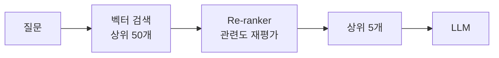

# RAG 고급 패턴

> 문서 기준: 2026년 5월 | 이 문서는 변동이 빠른 영역으로 분기별 리뷰 대상입니다.


RAG 기초는 [클라우드 AI 시작하기](getting-started.md)의 RAG 섹션과 [벡터 스토어와 AI 데이터](vector-store.md)를 먼저 읽어보세요.


## 기본 RAG의 한계

단순히 "문서 → 임베딩 → 검색 → LLM에 전달"만으로는 실무 품질을 맞추기 어렵습니다. Azure와 AWS 공식 가이드가 공통으로 지적하는 문제:

- **청킹(Chunking)이 잘못되면 문맥이 잘려서 검색 품질이 떨어집니다.**
- **검색된 문서 중 정말 관련 있는 것을 상위에 올리는 Re-ranking 없이는 LLM이 엉뚱한 맥락을 참조합니다.**
- **사용자 질문이 모호하면 벡터 검색만으로는 답을 찾기 어렵습니다.** (예: 대명사, 축약어)

출처:
- [Azure — Develop a RAG Solution: Chunking Phase](https://learn.microsoft.com/azure/architecture/ai-ml/guide/rag/rag-chunking-phase)
- [AWS — Writing best practices to optimize RAG applications](https://docs.aws.amazon.com/prescriptive-guidance/latest/writing-best-practices-rag/introduction.html)

## 청킹 전략

문서를 얼마나, 어떻게 나눌지가 검색 품질을 결정합니다.

### 주요 청킹 방식

| 방식 | 설명 | 적합한 문서 유형 |
| --- | --- | --- |
| **Fixed-size** | 고정 크기(예: 512토큰)로 단순 분할 | 일반 텍스트, 블로그 |
| **Sentence-based** | 문장 단위로 분할 | 자연어 문서 |
| **Recursive** | 단락 → 문장 → 단어 순서로 계층 분할 | 구조화된 문서 |
| **Semantic** | 의미가 비슷한 문장을 묶어 분할 | 긴 설명문 |
| **Document-structure** | 헤딩, 섹션 기반 분할 | 매뉴얼, 위키, 기술 문서 |

Azure 공식 가이드는 `Fixed-size` → `Recursive` → `Document-structure` 순으로 난이도를 높이며 시도할 것을 권장합니다 ([Chunking Phase 문서](https://learn.microsoft.com/azure/architecture/ai-ml/guide/rag/rag-chunking-phase)).

### 청크 크기 가이드

- **너무 작으면** — 문맥이 부족해서 검색된 조각이 의미를 잃음
- **너무 크면** — 한 청크에 여러 주제가 섞여 검색 정확도 하락, LLM 토큰 소비 증가

일반적인 시작점 (Azure 가이드):
- 청크 크기: **500\~1500 토큰**
- 중첩(Overlap): 청크 간 10\~20% 겹침으로 문맥 유실 방지


청크 크기는 한 번 정해도 끝이 아닙니다. 대표 질문으로 검색 품질을 측정하고 조정하는 반복 작업이 필요합니다.


### 벤더 제공 청킹 옵션

| 벤더 | 지원 방식 | 참고 |
| --- | --- | --- |
| AWS Bedrock Knowledge Bases | 기본, 고정 크기, 계층적(Hierarchical), 시맨틱(Semantic) 청킹 | [Knowledge Bases 청킹 옵션](https://docs.aws.amazon.com/bedrock/latest/userguide/kb-chunking-parsing.html) |
| Azure AI Search | 통합 벡터화 시 자동 청킹, 사용자 정의 가능 | [Azure AI Search 청킹](https://learn.microsoft.com/azure/search/vector-search-how-to-chunk-documents) |
| Vertex AI RAG Engine | 청크 크기/중첩 설정 | [RAG Engine 문서](https://cloud.google.com/vertex-ai/generative-ai/docs/rag-overview) |

## Re-ranking

벡터 검색은 빠르지만 "정말 관련 있는 순서"로 정렬하지는 못합니다. **Re-ranking** 은 검색 결과 상위 N개를 별도 모델로 재정렬하여 정확도를 높입니다.

### 벤더별 Re-ranking 서비스

| 벤더 | 서비스 | 참고 |
| --- | --- | --- |
| AWS | Bedrock Knowledge Bases Reranker (Amazon Rerank, Cohere Rerank) | [Reranker 가이드](https://docs.aws.amazon.com/bedrock/latest/userguide/kb-reranker.html) |
| Azure | Azure AI Search Semantic Ranker | [Semantic Ranker](https://learn.microsoft.com/azure/search/semantic-search-overview) |
| Google Cloud | Vertex AI Ranking API | [Ranking API](https://cloud.google.com/generative-ai-app-builder/docs/ranking) |
| OCI | Cohere Rerank (OCI Generative AI) | [OCI Generative AI 모델](https://docs.oracle.com/en-us/iaas/Content/generative-ai/pretrained-models.htm) |

## 하이브리드 검색

벡터 검색만으로는 제품 코드(`SKU-12345`), 고유명사, 정확한 문자열 매칭에 약합니다. **하이브리드 검색** 은 벡터 검색과 전통적인 키워드 검색(BM25)을 조합합니다.

| 벤더 | 하이브리드 지원 방식 | 참고 |
| --- | --- | --- |
| AWS | OpenSearch Vector + BM25 (RRF 알고리즘) | [Hybrid Search](https://docs.aws.amazon.com/opensearch-service/latest/developerguide/knn-retrieval.html) |
| Azure | Azure AI Search 하이브리드 쿼리 | [Hybrid Search](https://learn.microsoft.com/azure/search/hybrid-search-overview) |
| Google Cloud | Vertex AI Search (자동 하이브리드) | [Vertex AI Search](https://cloud.google.com/enterprise-search) |
| OCI | OCI AI Vector Search에서 SQL로 조합 | [OCI AI Vector Search](https://docs.oracle.com/en-us/iaas/autonomous-database-serverless/doc/oracle-ai-vector-search-autonomous-database.html) |

## 쿼리 확장과 변환

사용자 질문이 짧거나 모호할 때 LLM으로 질문을 재작성하거나 확장합니다.

- **Query Rewriting** — 대명사/축약어를 명시적으로 풀어냄 (예: "그거" → "지난 회의에서 논의한 정책 X")
- **Multi-Query** — 하나의 질문을 여러 버전으로 생성해 각각 검색
- **HyDE (Hypothetical Document Embeddings)** — LLM이 가상의 답을 생성한 뒤, 그 답을 임베딩하여 검색

공식 가이드:
- [Azure — Enrichment Phase of RAG](https://learn.microsoft.com/azure/architecture/ai-ml/guide/rag/rag-enrichment-phase)
- [AWS — RAG 최적화 가이드](https://docs.aws.amazon.com/prescriptive-guidance/latest/writing-best-practices-rag/introduction.html)

## 평가

RAG 시스템은 단순히 "답이 나온다"가 아니라, **검색 품질**과 **응답 품질**을 분리해서 측정해야 합니다.

### 검색 품질 지표

| 지표 | 의미 |
| --- | --- |
| **Recall@K** | 상위 K개 결과 중 정답 문서를 포함한 비율 |
| **MRR** (Mean Reciprocal Rank) | 정답 문서의 평균 순위의 역수 |
| **NDCG** (Normalized Discounted Cumulative Gain) | 상위 결과일수록 가중치를 주는 랭킹 품질 |

### 응답 품질 지표

| 지표 | 의미 |
| --- | --- |
| **Faithfulness** | 생성된 답이 검색된 문서에 근거하는가 |
| **Answer Relevance** | 답이 질문에 실제로 답하고 있는가 |
| **Context Precision / Recall** | 검색된 문맥이 얼마나 정확하고 충분한가 |

### 평가 도구

| 도구 | 설명 | 참고 |
| --- | --- | --- |
| **RAGAS** | 오픈소스 RAG 평가 프레임워크 | [RAGAS](https://github.com/explodinggradients/ragas) |
| **Azure AI Evaluation SDK** | Faithfulness, Relevance 등 내장 메트릭 | [Evaluation SDK](https://learn.microsoft.com/azure/ai-studio/how-to/develop/evaluate-sdk) |
| **Amazon Bedrock Evaluations** | 모델/RAG 평가 통합 | [Bedrock Evaluations](https://docs.aws.amazon.com/bedrock/latest/userguide/model-evaluation.html) |
| **Vertex AI Evaluation Service** | Gen AI 평가 프레임워크 | [Vertex AI Eval](https://cloud.google.com/vertex-ai/generative-ai/docs/models/evaluation-overview) |

## 참고하기

### AWS

- [AWS Prescriptive Guidance: RAG options and architectures](https://docs.aws.amazon.com/prescriptive-guidance/latest/retrieval-augmented-generation-options/introduction.html)
- [Writing best practices to optimize RAG applications](https://docs.aws.amazon.com/prescriptive-guidance/latest/writing-best-practices-rag/introduction.html)
- [Bedrock Knowledge Bases 청킹 옵션](https://docs.aws.amazon.com/bedrock/latest/userguide/kb-chunking-parsing.html)
- [Bedrock Knowledge Bases Reranker](https://docs.aws.amazon.com/bedrock/latest/userguide/kb-reranker.html)

### Azure

- [Azure Architecture Center: Design and Develop a RAG Solution](https://learn.microsoft.com/azure/architecture/ai-ml/guide/rag/rag-solution-design-and-evaluation-guide)
- [RAG Chunking Phase](https://learn.microsoft.com/azure/architecture/ai-ml/guide/rag/rag-chunking-phase)
- [Azure AI Search Hybrid Search](https://learn.microsoft.com/azure/search/hybrid-search-overview)
- [Azure AI Search Semantic Ranker](https://learn.microsoft.com/azure/search/semantic-search-overview)

### Google Cloud

- [Vertex AI RAG Engine](https://cloud.google.com/vertex-ai/generative-ai/docs/rag-overview)
- [Vertex AI Ranking API](https://cloud.google.com/generative-ai-app-builder/docs/ranking)
- [Vertex AI Evaluation Service](https://cloud.google.com/vertex-ai/generative-ai/docs/models/evaluation-overview)

### OCI

- [OCI AI Vector Search](https://docs.oracle.com/en-us/iaas/autonomous-database-serverless/doc/oracle-ai-vector-search-autonomous-database.html)
- [OCI Generative AI 모델](https://docs.oracle.com/en-us/iaas/Content/generative-ai/pretrained-models.htm)
