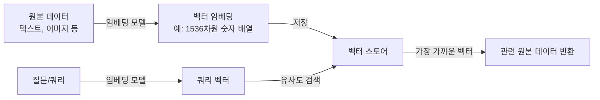

# 벡터 스토어와 AI 데이터

> 문서 기준: 2026년 5월

## 개요


**벡터/임베딩이 처음이라면** [클라우드 AI 시작하기](getting-started.md)의 RAG 섹션을 먼저 읽어보세요.


### 이런 상황에서 유용합니다

- **사내 문서 기반 챗봇** — "작년 휴가 정책이 뭐였지?"에 회사 문서를 검색해서 답하게 하기
- **제품 FAQ 자동 응답** — 수백 페이지의 제품 매뉴얼을 기반으로 고객 문의 처리
- **시맨틱 검색** — "저렴한 숙소"로 검색했을 때 "가성비 호텔", "합리적 가격의 펜션"도 함께 찾기
- **추천 시스템** — 비슷한 상품/콘텐츠/사용자 자동 추천
- **이상 탐지** — 기존 패턴과 다른 로그, 거래, 문서 식별

AI/LLM 애플리케이션은 텍스트, 이미지 등의 데이터를 **벡터 임베딩**(고차원 숫자 배열)으로 변환하여 의미적 유사도를 계산합니다. "서울 맛집 추천"과 "강남 레스토랑"이 비슷한 의미임을 이해하려면, 텍스트를 벡터로 변환하고 가까운 벡터를 찾아야 합니다.

**벡터 스토어**는 이 벡터 임베딩을 저장하고, 유사도 검색(Similarity Search)을 빠르게 수행하는 데이터베이스입니다.

### 왜 필요한가

- **RAG (Retrieval Augmented Generation)** — LLM이 답변할 때 관련 문서를 벡터 검색으로 찾아 컨텍스트로 제공. 환각(Hallucination) 감소.
- **시맨틱 검색** — 키워드 일치가 아닌 의미 기반 검색. "저렴한 숙소" → "가성비 호텔" 매칭.
- **추천 시스템** — 사용자/상품을 벡터로 표현하여 유사한 항목 추천.

### 동작 방식

임베딩 모델의 예: OpenAI text-embedding-3, Amazon Titan Embeddings, Vertex AI text-embedding, Cohere Embed 등.


벡터 검색은 **근사 최근접 이웃(ANN)** 알고리즘을 사용합니다. 정확도(Recall)와 속도는 트레이드오프 관계입니다. 인덱스 타입(HNSW, IVF 등)과 파라미터를 워크로드에 맞게 튜닝해야 합니다.


## 제품 비교

### 전용 벡터 스토어

| 벤더 | 제품 | 비고 |
| --- | --- | --- |
| AWS | S3 Vectors (Preview) | S3 내구성 + 저비용 벡터 저장. Bedrock Knowledge Bases 연동 |
| AWS | OpenSearch Serverless (벡터 엔진) | 대규모 벡터 검색. k-NN 지원 |
| Azure | Azure AI Search | 벡터 + 키워드 하이브리드 검색. 시맨틱 랭킹 |
| GCP | Vertex AI Vector Search | 대규모 고성능 벡터 검색 (ScaNN 알고리즘) |
| OCI | OCI AI Vector Search (Autonomous DB) | Autonomous Database 내장 벡터 검색. SQL 기반 |

### 기존 DB의 벡터 확장

기존 DB에 벡터 검색 기능을 추가하여, 별도 벡터 스토어 없이 사용할 수도 있습니다.

| 벤더 | 제품 | 비고 |
| --- | --- | --- |
| AWS | Aurora PostgreSQL (pgvector) | PostgreSQL 확장. 관계형 데이터 + 벡터를 한 DB에서 |
| AWS | Neptune Analytics | 그래프 + 벡터 결합 |
| AWS | ElastiCache for Valkey 8.2+ | 인메모리 벡터 검색. 초저지연 |
| Azure | Azure Cosmos DB (벡터 검색) | 글로벌 분산 + 벡터 |
| Azure | Azure Database for PostgreSQL (pgvector) | |
| GCP | AlloyDB (벡터 검색) | PostgreSQL 호환 + 고성능 벡터 |
| GCP | Cloud SQL for PostgreSQL (pgvector) | |

### AI 프레임워크 연동

| 벤더 | 제품 | 비고 |
| --- | --- | --- |
| AWS | Bedrock Knowledge Bases | 문서 → 임베딩 → 벡터 저장 → RAG 자동 파이프라인 |
| Azure | Azure AI Search + Azure OpenAI | "On Your Data" 기능으로 RAG 자동 구성 |
| GCP | Vertex AI RAG Engine | 문서 → 임베딩 → 검색 통합 |

## 핵심 차이점

**AWS** — 벡터 저장 옵션이 가장 다양합니다 (S3 Vectors, OpenSearch, Aurora pgvector, Neptune, ElastiCache). Bedrock Knowledge Bases로 RAG 파이프라인을 코드 없이 구성할 수 있습니다.

**Azure** — AI Search가 벡터 + 키워드 + 시맨틱 랭킹을 하나의 서비스로 통합합니다. Azure OpenAI의 "On Your Data" 기능으로 가장 빠르게 RAG를 구성할 수 있습니다.

**GCP** — Vertex AI Vector Search가 Google의 ScaNN 알고리즘으로 대규모 벡터 검색 성능이 뛰어납니다. AlloyDB의 벡터 검색은 트랜잭션 DB와 벡터를 하나로 통합합니다.

**OCI** — Autonomous Database에 내장된 AI Vector Search로 SQL 기반 벡터 검색을 제공합니다. 기존 Oracle DB 워크로드에 벡터 검색을 추가할 때 별도 인프라 없이 통합할 수 있습니다.

## 벡터 검색 알고리즘과 인덱싱

대규모 벡터 데이터에서 빠른 검색을 위해 ANN (Approximate Nearest Neighbor) 알고리즘을 사용합니다. 정확도를 약간 희생하여 속도를 크게 향상시킵니다.

| 알고리즘 | 특징 | 지원 제품 |
| --- | --- | --- |
| **HNSW** (Hierarchical Navigable Small World) | 그래프 기반. 높은 정확도와 속도 균형 | pgvector, OpenSearch, Azure AI Search |
| **IVF** (Inverted File) | 클러스터 기반. 메모리 효율 좋음 | pgvector, FAISS |
| **IVFPQ** (IVF + Product Quantization) | IVF + 양자화로 메모리 절감 | FAISS, Neptune Analytics |
| **ScaNN** (Scalable Nearest Neighbors) | Google 개발. TPU 최적화 | Vertex AI Vector Search |

### 임베딩 차원과 저장 공간

임베딩 모델이 생성하는 벡터의 차원(dimension)에 따라 저장 공간과 검색 속도가 달라집니다.

| 모델 | 차원 | 비고 |
| --- | --- | --- |
| OpenAI text-embedding-3-small | 1536 | 가장 널리 사용 |
| OpenAI text-embedding-3-large | 3072 | 높은 품질, 큰 저장 공간 |
| Amazon Titan Embeddings | 1024/1536/384 | 조정 가능 |
| Cohere Embed | 1024 | 다국어 지원 |
| Google text-embedding | 768/3072 | Vertex AI |

백만 개 벡터를 저장하면: 1536차원 × 4바이트(float32) = 약 6GB

## 하이브리드 검색

벡터 검색만으로는 정확한 키워드 매칭(제품 코드, 이름 등)에 약할 수 있습니다. **하이브리드 검색**은 벡터 검색 + 키워드 검색(BM25)을 조합하여 두 방식의 장점을 모두 활용합니다.

| 벤더 | 하이브리드 지원 |
| --- | --- |
| AWS OpenSearch | Vector + BM25 결합 (RRF 알고리즘) |
| Azure AI Search | 벡터 + 키워드 + 시맨틱 랭킹 |
| GCP Vertex AI Vector Search | Filter로 키워드 조건 결합 |
| OCI AI Vector Search | SQL로 벡터 + 관계형 데이터 조합 |

## 참고하기

### AWS

- [S3 Vectors 문서](https://docs.aws.amazon.com/AmazonS3/latest/userguide/s3-vectors.html)
- [Bedrock Knowledge Bases 문서](https://docs.aws.amazon.com/ko_kr/bedrock/latest/userguide/knowledge-base.html)
- [OpenSearch 벡터 검색](https://docs.aws.amazon.com/ko_kr/opensearch-service/latest/developerguide/knn.html)

### Azure

- [Azure AI Search 벡터 검색](https://learn.microsoft.com/ko-kr/azure/search/vector-search-overview)
- [Azure OpenAI On Your Data](https://learn.microsoft.com/ko-kr/azure/ai-services/openai/concepts/use-your-data)

### GCP

- [Vertex AI Vector Search 문서](https://cloud.google.com/vertex-ai/docs/vector-search/overview)
- [AlloyDB AI 문서](https://cloud.google.com/alloydb/docs/ai)

### OCI

- [OCI AI Vector Search 문서](https://docs.oracle.com/en-us/iaas/autonomous-database-serverless/doc/oracle-ai-vector-search-autonomous-database.html)
