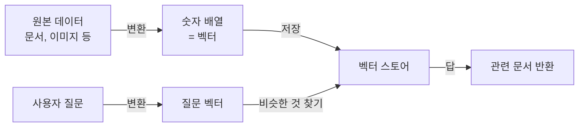

# 벡터 스토어와 AI 데이터

> 문서 기준: 2026년 5월

## 개요


**벡터/임베딩이 처음이라면** [클라우드 AI 시작하기](getting-started.md)의 RAG 섹션을 먼저 읽어보세요.


### 이런 상황에서 유용합니다

- **사내 문서 기반 챗봇** — "작년 휴가 정책이 뭐였지?"에 회사 문서를 검색해서 답하게 하기
- **제품 FAQ 자동 응답** — 수백 페이지의 제품 매뉴얼을 기반으로 고객 문의 처리
- **시맨틱 검색** — "저렴한 숙소"로 검색했을 때 "가성비 호텔", "합리적 가격의 펜션"도 함께 찾기
- **추천 시스템** — 비슷한 상품/콘텐츠/사용자 자동 추천

## 벡터 스토어란

### 쉽게 이해하기

도서관 사서를 떠올려 보세요. 사서에게 "머신러닝 책 있어요?"라고 물으면, 책 제목에 "머신러닝"이 없어도 비슷한 주제의 책을 찾아줍니다. "인공지능", "딥러닝", "AI 기초" 같은 책들을 말이죠.

**벡터 스토어는 이런 사서의 역할을 하는 데이터베이스**입니다. 문서의 "의미"를 기억해 두었다가, 비슷한 의미의 문서를 빠르게 찾아줍니다.

### 일반 검색 vs 벡터 검색

| 방식 | 검색 기준 | 예시 |
| --- | --- | --- |
| **키워드 검색** (일반 DB) | 단어가 정확히 일치 | "저렴한 숙소" → "저렴한"이 포함된 문서만 |
| **벡터 검색** (벡터 스토어) | 의미가 비슷 | "저렴한 숙소" → "가성비 호텔", "알뜰 펜션"도 검색 |

## 동작 방식

3줄 요약:
1. 원본 데이터(텍스트, 이미지)를 **숫자 배열(벡터)** 로 변환합니다. 이 과정을 **임베딩** 이라고 합니다.
2. 벡터를 벡터 스토어에 저장합니다.
3. 질문도 같은 방식으로 벡터로 만들어, **가장 비슷한 벡터** 를 찾아 원본 데이터를 반환합니다.


"왜 숫자 배열인가?"라고 궁금할 수 있습니다. 컴퓨터가 "비슷한 의미"를 계산하려면 의미를 수치화해야 합니다. 단어 하나를 1536개의 숫자로 표현하면, 비슷한 의미의 단어들은 비슷한 숫자 조합을 갖게 됩니다.


## 어떤 선택지가 있나

벡터를 저장하는 방법은 크게 두 가지입니다.

### 1. 전용 벡터 스토어

벡터 검색에 특화된 제품입니다. 대규모/고성능이 필요할 때 씁니다.

| 벤더 | 제품 | 특징 |
| --- | --- | --- |
| AWS | [OpenSearch Serverless 벡터 엔진](https://docs.aws.amazon.com/opensearch-service/latest/developerguide/serverless-vector-search.html) | 대규모 벡터 검색 |
| AWS | [S3 Vectors (Preview)](https://docs.aws.amazon.com/AmazonS3/latest/userguide/s3-vectors.html) | S3 내구성 + 저비용 |
| Azure | [Azure AI Search](https://learn.microsoft.com/azure/search/vector-search-overview) | 벡터 + 키워드 + 시맨틱 랭킹 통합 |
| Google Cloud | [Vertex AI Vector Search](https://cloud.google.com/vertex-ai/docs/vector-search/overview) | Google ScaNN 알고리즘으로 고성능 |
| OCI | [OCI AI Vector Search](https://docs.oracle.com/en-us/iaas/autonomous-database-serverless/doc/oracle-ai-vector-search-autonomous-database.html) | Autonomous Database 내장, SQL 기반 |

### 2. 기존 DB의 벡터 확장

이미 쓰는 DB에 벡터 기능을 추가하는 방식입니다. 별도 인프라 없이 시작할 수 있습니다.

| 벤더 | 제품 | 특징 |
| --- | --- | --- |
| AWS | [Aurora PostgreSQL (pgvector)](https://aws.amazon.com/about-aws/whats-new/2023/07/amazon-aurora-postgresql-pgvector-vector-storage-similarity-search/) | 관계형 + 벡터 한 DB에서 |
| AWS | [ElastiCache for Valkey](https://aws.amazon.com/elasticache/what-is-valkey/) | 인메모리 벡터, 초저지연 |
| Azure | [Cosmos DB 벡터 검색](https://learn.microsoft.com/azure/cosmos-db/vector-search) | 글로벌 분산 + 벡터 |
| Google Cloud | [AlloyDB (벡터 검색)](https://cloud.google.com/alloydb/docs/ai) | PostgreSQL 호환 + 고성능 |
| Google Cloud | [Cloud SQL (pgvector)](https://cloud.google.com/sql/docs/postgres/extensions#pgvector) | 간단한 시작 |

### 3. RAG 자동 파이프라인

복잡한 설정 없이 "문서 올리면 자동으로 벡터화"해주는 관리형 서비스입니다.

| 벤더 | 제품 | 특징 |
| --- | --- | --- |
| AWS | [Bedrock Knowledge Bases](https://docs.aws.amazon.com/bedrock/latest/userguide/knowledge-base.html) | 문서 → 임베딩 → 저장 → RAG 자동 |
| Azure | [Azure AI Search + OpenAI "On Your Data"](https://learn.microsoft.com/azure/ai-services/openai/concepts/use-your-data) | 가장 빠른 RAG 구성 |
| Google Cloud | [Vertex AI RAG Engine](https://cloud.google.com/vertex-ai/generative-ai/docs/rag-overview) | 문서 → 임베딩 → 검색 통합 |
| OCI | [OCI Enterprise AI Agents](https://www.oracle.com/artificial-intelligence/generative-ai/agents/) | OCI Search 연동 RAG |

## 언제 무엇을 선택할까

| 상황 | 권장 선택 |
| --- | --- |
| 처음 시작하고, 설정 없이 빠르게 | RAG 자동 파이프라인 (Bedrock Knowledge Bases 등) |
| 이미 PostgreSQL 쓰고 있음 | 기존 DB 벡터 확장 (pgvector) |
| 벡터가 수백만 건 이상, 성능 중요 | 전용 벡터 스토어 (OpenSearch, Vertex AI Vector Search) |
| Oracle DB 쓰고 있음 | OCI AI Vector Search |
| 초저지연 필요 (실시간 추천 등) | Valkey 기반 인메모리 |


**처음에는 단순하게 시작하세요.** 대부분의 업무는 RAG 자동 파이프라인이나 pgvector로 충분합니다. 전용 벡터 스토어는 수백만 벡터 이상의 규모에서 필요합니다.


## 심화: 알고리즘과 성능

벡터 스토어 성능을 깊이 이해하거나 튜닝이 필요할 때 알아두면 좋은 내용입니다.

### ANN 알고리즘

수백만 벡터 중 "가장 가까운 것"을 정확히 찾으려면 모든 벡터와 비교해야 해서 느립니다. 이를 해결하기 위해 **ANN** (근사 최근접 이웃, Approximate Nearest Neighbor) 알고리즘을 사용합니다. 정확도를 약간 양보하고 속도를 크게 얻는 방식입니다.

| 알고리즘 | 특징 | 주로 사용 |
| --- | --- | --- |
| **HNSW** | 그래프 기반. 정확도/속도 균형 좋음 | pgvector, OpenSearch, Azure AI Search |
| **IVF** | 클러스터 기반. 메모리 효율 좋음 | pgvector, FAISS |
| **IVFPQ** | IVF + 벡터 압축으로 메모리 절감 | Neptune Analytics, FAISS |
| **ScaNN** | Google 개발. TPU 최적화 | Vertex AI Vector Search |

### 임베딩 차원과 저장 공간

임베딩 모델이 생성하는 벡터의 크기(차원)가 저장 공간과 검색 속도를 결정합니다.

| 모델 | 차원 | 비고 |
| --- | --- | --- |
| OpenAI text-embedding-3-small | 1536 | 가장 널리 사용 |
| OpenAI text-embedding-3-large | 3072 | 고품질, 더 많은 공간 |
| Amazon Titan Embeddings | 384~1536 | 조정 가능 |
| Cohere Embed | 1024 | 다국어 강점 |
| Google text-embedding | 768~3072 | Vertex AI |

간단한 계산: 1,000,000개 × 1536차원 × 4바이트 = **약 6GB**

### 하이브리드 검색

벡터 검색은 의미에 강하지만, 제품 코드(`SKU-12345`) 같은 **정확한 문자열** 에는 약합니다. **하이브리드 검색**은 벡터 검색 + 전통적인 키워드 검색(BM25)을 조합합니다.

| 벤더 | 하이브리드 지원 방식 |
| --- | --- |
| AWS OpenSearch | Vector + BM25 결합 (RRF 알고리즘) |
| Azure AI Search | 벡터 + 키워드 + 시맨틱 랭킹 자동 결합 |
| Google Cloud Vertex AI Vector Search | Filter로 키워드 조건 추가 |
| OCI AI Vector Search | SQL로 벡터 + 관계형 조건 조합 |

## 참고하기

### AWS

- [S3 Vectors 문서](https://docs.aws.amazon.com/AmazonS3/latest/userguide/s3-vectors.html)
- [Bedrock Knowledge Bases 문서](https://docs.aws.amazon.com/ko_kr/bedrock/latest/userguide/knowledge-base.html)
- [OpenSearch 벡터 검색](https://docs.aws.amazon.com/ko_kr/opensearch-service/latest/developerguide/knn.html)

### Azure

- [Azure AI Search 벡터 검색](https://learn.microsoft.com/ko-kr/azure/search/vector-search-overview)
- [Microsoft Foundry On Your Data](https://learn.microsoft.com/ko-kr/azure/ai-services/openai/concepts/use-your-data)

### Google Cloud

- [Vertex AI Vector Search 문서](https://cloud.google.com/vertex-ai/docs/vector-search/overview)
- [AlloyDB AI 문서](https://cloud.google.com/alloydb/docs/ai)

### OCI

- [OCI AI Vector Search 문서](https://docs.oracle.com/en-us/iaas/autonomous-database-serverless/doc/oracle-ai-vector-search-autonomous-database.html)
