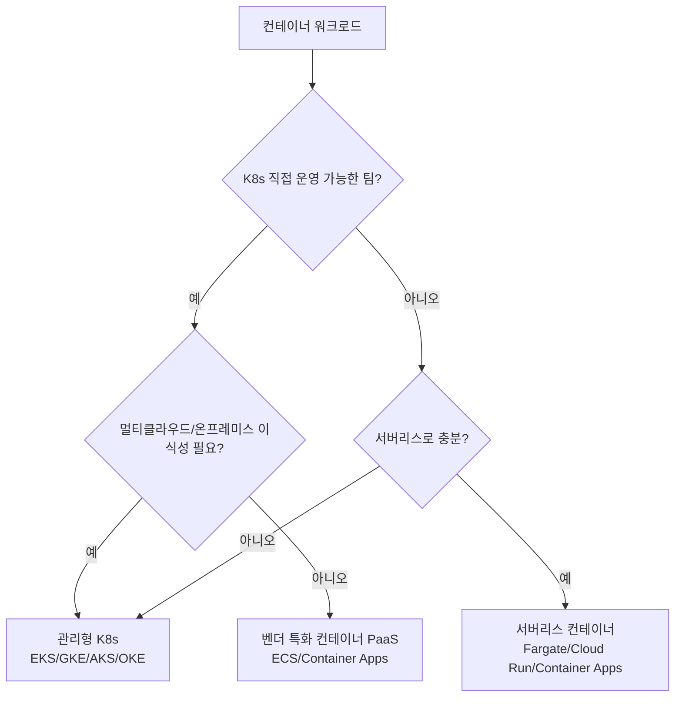

# 컨테이너 서비스

> 문서 기준: 2026년 8월

## 개요

VM은 유연하지만, 하나의 앱을 배포하기 위해 OS 전체를 포함한 무거운 이미지를 관리해야 합니다. 앱이 10개면 VM도 10개, OS 패치도 10번입니다. 환경 간 "내 PC에서는 되는데 서버에서는 안 돼요" 문제도 빈번합니다.

**컨테이너**는 앱과 그 의존성만 가볍게 패키징하여 어디서든 동일하게 실행되도록 합니다. VM보다 가볍고, 시작이 빠르고, 환경 차이 문제를 해결합니다.


EKS를 아시는 분을 위해: Azure는 AKS, Google Cloud는 GKE, OCI는 OKE입니다.


컨테이너가 수십~수백 개로 늘어나면 이를 관리하는 오케스트레이션이 필요합니다. 직접 Kubernetes를 설치하고 운영할 수도 있지만, 클라우드 벤더의 **관리형 서비스**를 사용하면 컨트롤 플레인 관리, 업그레이드, 보안 패치를 벤더가 담당합니다. 사용자는 앱 배포에만 집중할 수 있습니다.

## 제품 비교

### 관리형 Kubernetes

| 벤더 | 제품 | 비고 |
| --- | --- | --- |
| AWS | EKS (Elastic Kubernetes Service) | 컨트롤 플레인 유료. K8s 1.36 지원 (2026.06) |
| Azure | AKS (Azure Kubernetes Service) | 컨트롤 플레인 무료 |
| Google Cloud | GKE (Google Kubernetes Engine) | Autopilot 모드: 노드 관리 불필요, Pod 단위 과금. Rapid: K8s 1.36 |
| OCI | OKE (Oracle Kubernetes Engine) | 컨트롤 플레인 무료. Virtual Nodes로 서버리스 운영 가능 |

### 서버리스 / 간편 컨테이너 실행

서버(노드)를 직접 관리하지 않고 컨테이너를 실행하는 서비스입니다. AWS Fargate, Azure Container Apps, Google Cloud Cloud Run, OCI Container Instances 등이 있으며, 각 제품의 상세 비교는 [서버리스](serverless.md#서버리스-컨테이너) 문서를 참고하세요.

| 벤더 | 대표 제품 |
| --- | --- |
| AWS | Fargate · ECS · App Runner |
| Azure | Container Apps · Container Instances (ACI) |
| Google Cloud | Cloud Run |
| OCI | OCI Container Instances |

### 컨테이너 레지스트리

| 벤더 | 제품 | 비고 |
| --- | --- | --- |
| AWS | ECR (Elastic Container Registry) | |
| Azure | ACR (Azure Container Registry) | |
| Google Cloud | Artifact Registry | 컨테이너 외 패키지도 지원 |
| OCI | OCI Container Registry (OCIR) | |

## 핵심 차이점

- **AWS** — ECS(자체 오케스트레이터)와 EKS(Kubernetes) 두 가지 선택지를 제공합니다. ECS service auto scaling은 고해상도(20초) 메트릭을 지원하여 기존 대비 스케일아웃 트리거가 약 4배 빨라졌습니다(363초→86초).
- **Azure** — Container Apps로 K8s를 몰라도 컨테이너를 운영할 수 있습니다.
- **Google Cloud** — Cloud Run으로 가장 간단하게 컨테이너를 서버리스 환경에서 실행할 수 있습니다.
- **OCI** — OKE 컨트롤 플레인이 무료이며, Virtual Nodes로 서버리스 Kubernetes 운영이 가능합니다.

## 결정 트리

## 언제 무엇을 선택할 것인가

| 상황 | 추천 |
| --- | --- |
| Kubernetes 없이 간단하게 컨테이너를 운영하고 싶을 때 | AWS ECS 또는 Azure Container Apps |
| 기존 컨테이너 앱을 코드 수정 없이 서버리스로 실행하고 싶을 때 | Google Cloud Cloud Run |
| Kubernetes가 필요하지만 컨트롤 플레인 비용을 아끼고 싶을 때 | Azure AKS 또는 OCI OKE (컨트롤 플레인 무료) |
| 노드 관리 없이 Pod 단위로만 과금받고 싶을 때 | GKE Autopilot 또는 AWS Fargate |
| 서버리스 Kubernetes를 원할 때 | OCI OKE Virtual Nodes |
| 소스 코드에서 바로 배포하고 싶을 때 | AWS App Runner |

## Kubernetes 컨트롤 플레인 vs 데이터 플레인

관리형 Kubernetes는 두 계층으로 구성됩니다.

| 계층 | 담당 | 관리 주체 |
| --- | --- | --- |
| **컨트롤 플레인** | API 서버, etcd, 스케줄러, 컨트롤러 매니저 | 벤더가 관리 |
| **데이터 플레인** | 워커 노드(VM), kubelet, 컨테이너 런타임 | 사용자가 관리 (또는 서버리스 노드로 위임) |

### 컨트롤 플레인 비용

| 벤더 | 컨트롤 플레인 비용 | 비고 |
| --- | --- | --- |
| AWS EKS | 유료 (클러스터당 시간 과금) | [EKS 요금](https://aws.amazon.com/eks/pricing/) |
| Azure AKS | 무료 | Uptime SLA 활성화 시 유료 |
| Google Cloud GKE Standard | 유료 (클러스터당 시간 과금) | 월당 한 개 존 무료. [GKE 요금](https://cloud.google.com/kubernetes-engine/pricing) |
| Google Cloud GKE Autopilot | 무료 (Pod 단위 과금) | 노드 없음 |
| OCI OKE | 무료 | Enhanced 클러스터 시 유료 |

## 노드 관리 전략

데이터 플레인의 노드를 관리하는 방법에 따라 운영 부담이 달라집니다.

| 전략 | 설명 | 장점 | 단점 |
| --- | --- | --- | --- |
| **셀프 매니지드 노드** | 사용자가 노드 AMI, 패치, 스케일링 직접 관리 | 완전한 제어 | 운영 부담 큼 |
| **관리형 노드 그룹** | 벤더가 노드 프로비저닝/업그레이드 관리 (AWS Managed Node Groups, AKS Node Pools, GKE Node Pools) | 자동 업그레이드, 롤링 업데이트 | 여전히 노드 수 관리 필요 |
| **서버리스 노드 (Fargate/Virtual Nodes/Autopilot)** | 노드 개념 자체가 없음. Pod 단위 실행 | 운영 부담 최소 | Pod별 오버헤드 비용, 일부 제약(hostNetwork, DaemonSet 등) |

### 노드 풀 구성

단일 워크로드 유형이 아닌 다양한 요구사항(GPU, Spot, 스토리지 타입)에 따라 여러 노드 풀을 구성합니다.

- **범용 노드 풀** — 대부분의 애플리케이션
- **GPU 노드 풀** — ML 추론/학습 Pod
- **Spot/Preemptible 노드 풀** — 배치 작업, CI
- **ARM 노드 풀** — 비용 최적화 (Graviton, Cobalt, Ampere, Axion)

## 컨테이너 런타임 전환

Kubernetes 1.24에서 Dockershim이 제거된 이후 **containerd**가 사실상 표준 런타임입니다. 2025년 8월 containerd 1.6 EOL을 기점으로 **containerd 2.x** 전환이 본격화되었습니다.

### containerd 2.x 주요 변경

| 변경 | 영향 | 대응 |
| --- | --- | --- |
| Docker Image Manifest Schema 1 지원 제거 | 매우 오래된 이미지(2017년 이전 빌드)가 Pull 실패 | `docker manifest inspect`로 Schema 버전 확인. Schema 2 또는 OCI 이미지로 재빌드 |
| CRI 플러그인 설정 구조 변경 | 기존 `containerd config.toml` 호환 불가 가능 | 노드 업그레이드 전 설정 마이그레이션 검증 |
| 새 샌드박스(sandbox) API | 향상된 Pod 격리 | 관리형 K8s 사용 시 벤더가 처리 |

### 벤더별 런타임 현황

| 벤더 | 기본 런타임 | 비고 |
| --- | --- | --- |
| AWS EKS | containerd | AMI 자동 업데이트로 containerd 2.x 전환 |
| Azure AKS | containerd (Azure Linux 3.0) | AKS 1.32+부터 Azure Linux 3.0 기본. Azure Linux 2.0은 2025.11 EOL |
| Google Cloud GKE | containerd | COS(Container-Optimized OS) 자동 관리 |
| OCI OKE | containerd (Oracle Linux 8/9) | 노드 풀 OS 이미지 업그레이드로 전환 |


**Docker Schema 1 이미지를 사용 중이라면** containerd 2.x에서 Pull이 실패합니다. 레지스트리에서 `mediaType: "application/vnd.docker.distribution.manifest.v1+json"` 이미지를 검색하고 재빌드하세요.


## Kubernetes 프로덕션 준비 체크리스트

- [ ] 노드를 멀티 AZ에 분산 배치했는가
- [ ] Pod에 리소스 요청(requests)과 제한(limits)을 설정했는가
- [ ] Liveness/Readiness Probe를 설정했는가
- [ ] Horizontal Pod Autoscaler를 구성했는가
- [ ] Network Policy로 Pod 간 통신을 제한했는가
- [ ] Workload Identity로 클라우드 IAM과 연동했는가 (Service Account Key 미사용)
- [ ] 이미지를 프라이빗 레지스트리에서만 Pull하도록 제한했는가
- [ ] 로그/메트릭/트레이스 수집을 구성했는가
- [ ] etcd/PV 백업 전략을 수립했는가 (Velero 등)
- [ ] 클러스터 업그레이드 전략을 결정했는가
- [ ] containerd 2.x 호환 여부를 확인했는가 (Docker Schema 1 이미지 미지원)


Day-2 운영 상세는 [Kubernetes 운영](../devops/kubernetes-operations.md)을 참고하세요.


## 자주 하는 실수

- **K8s 없이 될 것을 K8s로** — 단순한 웹 앱이나 소규모 서비스에 Kubernetes를 도입하면 운영 복잡도만 높아집니다. ECS, Cloud Run, Container Apps로 충분한지 먼저 검토하세요.
- **리소스 제한 미설정** — Pod에 requests/limits를 설정하지 않으면 하나의 Pod가 노드 전체 리소스를 점유하여 다른 Pod가 OOMKill되거나 스케줄링에 실패합니다.
- **latest 태그 사용** — 이미지 태그를 `latest`로 사용하면 어떤 버전이 배포되었는지 추적할 수 없고, 롤백이 불가능합니다.

## 체크리스트

- [ ] 모든 Pod에 리소스 requests/limits를 설정했는가
- [ ] 컨테이너 이미지 태그를 SHA 또는 시맨틱 버전으로 고정했는가
- [ ] Liveness/Readiness Probe(헬스체크)를 설정했는가
- [ ] 네임스페이스를 환경/팀별로 분리했는가

## 관련 문서

- [CI/CD](../devops/cicd.md)
- [IaC](../devops/iac.md)
- [서버리스](serverless.md)

## 참고하기

### AWS

- [Amazon EKS 문서](https://docs.aws.amazon.com/ko_kr/eks/)
- [Amazon ECS 문서](https://docs.aws.amazon.com/ko_kr/ecs/)
- [AWS Fargate 문서](https://docs.aws.amazon.com/ko_kr/AmazonECS/latest/userguide/AWS_Fargate.html)

### Azure

- [AKS 문서](https://learn.microsoft.com/ko-kr/azure/aks/)
- [Container Apps 문서](https://learn.microsoft.com/ko-kr/azure/container-apps/)
- [Container Instances 문서](https://learn.microsoft.com/ko-kr/azure/container-instances/)

### Google Cloud

- [Google Kubernetes Engine 문서](https://cloud.google.com/kubernetes-engine/docs)
- [Google Cloud Run 문서](https://cloud.google.com/run/docs)
- [Google Artifact Registry 문서](https://cloud.google.com/artifact-registry/docs)

### OCI

- [OKE (Oracle Kubernetes Engine) 문서](https://docs.oracle.com/en-us/iaas/Content/ContEng/home.htm)
- [OCI Container Instances 문서](https://docs.oracle.com/en-us/iaas/Content/container-instances/home.htm)
- [OCI Container Registry 문서](https://docs.oracle.com/en-us/iaas/Content/Registry/home.htm)
