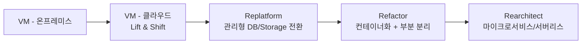
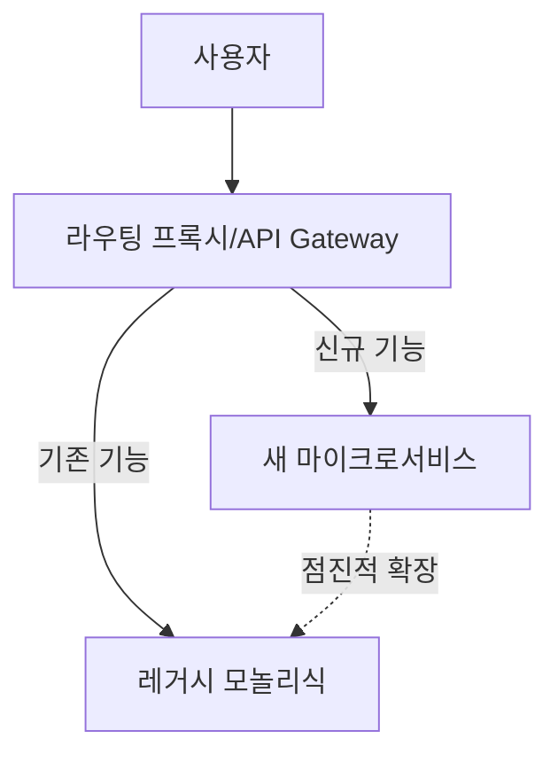
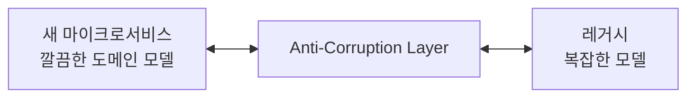

# 애플리케이션 모더나이제이션

> 문서 기준: 2026년 5월

## 모더나이제이션이란

**모더나이제이션** (Modernization)은 기존 애플리케이션을 클라우드 환경에 맞게 재구성하여 확장성, 배포 속도, 운영 효율을 개선하는 작업입니다.

Microsoft 공식 정의: "클라우드 모더나이제이션은 기존 클라우드 워크로드를 비즈니스 요구에 더 잘 맞도록 개선하는 실무로, 새 기능을 추가하지 않고 클라우드 모범 사례에 맞게 정렬하는 것입니다." ([출처](https://learn.microsoft.com/azure/cloud-adoption-framework/modernize/prepare-organization-cloud-modernization)).

### 마이그레이션과의 차이

| 구분 | 마이그레이션 | 모더나이제이션 |
| --- | --- | --- |
| **목적** | 클라우드로 이동 | 클라우드 네이티브 장점 활용 |
| **범위** | 인프라 교체 | 아키텍처/운영 방식 개선 |
| **시점** | 이전 중 | 이전 후 또는 동시 |
| **대표 활동** | Lift & Shift | Replatform, Refactor, Rearchitect |

마이그레이션 전략(7R)은 [애플리케이션 마이그레이션](migration.md)을 참고하세요.

## 왜 모더나이제이션인가

단순 Lift & Shift만으로는 클라우드의 이점을 충분히 얻지 못합니다. VM 기반으로만 운영하면:

- **확장성** — 오토스케일링은 가능하지만 VM 부팅에 수 분이 걸립니다.
- **배포 속도** — 배포 주기가 느리고 롤백이 복잡합니다.
- **운영 부담** — OS 패치, 보안, 모니터링을 직접 관리해야 합니다.
- **비용** — 관리형/서버리스 대비 비효율적입니다.

Google Cloud 공식 가이드는 모더나이제이션을 "레거시 애플리케이션의 한계를 벗어나 확장 가능하고, 복원력 있으며, 유연한 시스템으로 전환하는 점진적 여정"으로 설명합니다 ([출처](https://cloud.google.com/architecture/modernization-path-dotnet-applications-google-cloud)).

## 모더나이제이션 전략

Microsoft Cloud Adoption Framework이 제시하는 3가지 주요 전략:

| 전략 | 설명 | 난이도 | 대상 |
| --- | --- | --- | --- |
| **Replatform** (리플랫폼) | 엔진은 유지하되 관리형 서비스로 전환. 약간의 최적화 | 중간 | DB를 RDS로, VM을 App Service/Container Apps로 |
| **Refactor** (리팩터) | 애플리케이션 구조를 일부 재작성. 서비스 분해 시작 | 중\~상 | 모놀리식에서 특정 기능을 분리 |
| **Rearchitect** (리아키텍트) | 아키텍처를 처음부터 재설계. 마이크로서비스, 서버리스 | 상 | 확장성/복원력 근본 개선 필요 |

출처: [Azure CAF Modernization Strategies](https://learn.microsoft.com/azure/cloud-adoption-framework/modernize/modernization-cloud-replatform-refactor-rearchitect)

### 단계별 전환 경로

일반적으로 이런 순서로 진행합니다.


모든 워크로드를 E 단계까지 갈 필요는 없습니다. **비즈니스 가치**와 **변경 빈도**에 따라 적절한 지점을 선택하세요. 변경이 거의 없는 레거시는 B 단계에서 멈추는 것이 현실적입니다.


## 주요 패턴

### Strangler Fig 패턴

Martin Fowler가 제시한 패턴으로, 거대한 모놀리식 애플리케이션을 **한 번에 교체하지 않고 점진적으로 새 시스템으로 대체**하는 방식입니다.

**단계:**
1. 레거시 앞에 라우팅 계층(API Gateway)을 배치
2. 새 기능을 마이크로서비스로 개발하고 프록시가 라우팅
3. 기존 기능을 하나씩 마이크로서비스로 추출
4. 모든 기능이 이전되면 레거시 제거

**장점:** 리스크 최소화, 비즈니스 중단 없음
**단점:** 전환 기간 동안 이중 시스템 유지

출처:
- [AWS Prescriptive Guidance — Strangler Fig Pattern](https://docs.aws.amazon.com/prescriptive-guidance/latest/cloud-design-patterns/strangler-fig.html)
- [AWS — Decomposing monoliths: Strangler Fig](https://docs.aws.amazon.com/prescriptive-guidance/latest/modernization-decomposing-monoliths/strangler-fig.html)

### Anti-Corruption Layer

새 마이크로서비스와 레거시 시스템을 분리하는 중간 계층입니다. 레거시의 낡은 모델이 새 서비스에 영향을 주지 않도록 차단합니다.

### Saga 패턴

마이크로서비스 환경에서 여러 서비스에 걸친 트랜잭션을 처리하는 패턴입니다. 기존 DB의 분산 트랜잭션 대신 **보상 트랜잭션(Compensating Transaction)** 으로 일관성을 유지합니다.

출처: [AWS Prescriptive Guidance — Saga Pattern](https://docs.aws.amazon.com/prescriptive-guidance/latest/cloud-design-patterns/saga.html)

### Event-Driven Architecture

서비스 간 직접 호출 대신 **이벤트** 를 통해 비동기 통신합니다. 확장성과 느슨한 결합(loose coupling)을 얻습니다.

| 요소 | 4사 제품 |
| --- | --- |
| 메시징 | Amazon SQS/SNS/EventBridge, Azure Service Bus/Event Grid, GCP Pub/Sub/Eventarc, OCI Events/Streaming |
| 이벤트 스트리밍 | Amazon MSK/Kinesis, Azure Event Hubs, GCP Pub/Sub, OCI Streaming |

## 12-Factor App 원칙

[12-Factor App](https://12factor.net/ko/)은 클라우드 네이티브 애플리케이션의 설계 원칙입니다. 모더나이제이션 시 각 원칙을 점검하세요.

| # | 원칙 | 핵심 |
| --- | --- | --- |
| 1 | 코드베이스 | 하나의 저장소, 여러 배포 |
| 2 | 종속성 | 명시적으로 선언 및 격리 |
| 3 | 설정 | 환경변수로 분리 |
| 4 | 백엔드 서비스 | 연결된 리소스로 취급 |
| 5 | 빌드, 릴리스, 실행 | 단계 분리 |
| 6 | 프로세스 | 무상태(Stateless)로 실행 |
| 7 | 포트 바인딩 | 자체 포트로 서비스 제공 |
| 8 | 동시성 | 프로세스 모델로 확장 |
| 9 | 폐기 가능 | 빠른 시작과 우아한 종료 |
| 10 | 개발/프로덕션 동등 | 환경 차이 최소화 |
| 11 | 로그 | 이벤트 스트림으로 처리 |
| 12 | 관리 프로세스 | 일회성 작업도 동일 코드베이스 |

특히 **6번(무상태)** 이 클라우드 스케일링의 핵심입니다. 세션, 캐시, 파일을 외부 저장소로 분리해야 수평 확장이 가능합니다.

## 벤더별 모더나이제이션 도구

### AWS

| 제품 | 목적 |
| --- | --- |
| [App2Container](https://aws.amazon.com/app2container/) | Java/.NET 앱을 컨테이너로 자동 변환 |
| [Migration Hub Refactor Spaces](https://aws.amazon.com/migration-hub/features/#Migration_Hub_Refactor_Spaces) | Strangler Fig 패턴을 관리형 인프라로 지원 |
| [AWS Mainframe Modernization](https://aws.amazon.com/mainframe-modernization/) | 메인프레임 애플리케이션 마이그레이션/현대화 |
| [AWS Transform](https://aws.amazon.com/transform/) | AI 기반 레거시 코드 변환 (.NET/메인프레임) |

### Azure

| 제품 | 목적 |
| --- | --- |
| [Azure App Service](https://azure.microsoft.com/products/app-service/) | 웹앱 관리형 호스팅 (Replatform) |
| [Azure Container Apps](https://azure.microsoft.com/products/container-apps/) | 서버리스 컨테이너 |
| [Azure Migrate: Containerization](https://learn.microsoft.com/azure/migrate/tutorial-app-containerization-aspnet-kubernetes) | ASP.NET/Java 앱 컨테이너화 |
| [Azure Service Fabric](https://azure.microsoft.com/products/service-fabric/) | 마이크로서비스 플랫폼 |

### GCP

| 제품 | 목적 |
| --- | --- |
| [Cloud Application Modernization Program (CAMP)](https://cloud.google.com/solutions/camp) | 평가 → 모더나이제이션 종합 프레임워크 |
| [Migrate to Containers](https://cloud.google.com/migrate/containers/docs) | VM → GKE 컨테이너 |
| [Cloud Run](https://cloud.google.com/run/docs) | 서버리스 컨테이너 (Refactor 목적지) |
| [Apigee](https://cloud.google.com/apigee) | API 관리 + Strangler Fig 라우팅 |

### OCI

| 제품 | 목적 |
| --- | --- |
| [OKE (Oracle Kubernetes Engine)](https://docs.oracle.com/en-us/iaas/Content/ContEng/home.htm) | 컨테이너 플랫폼 |
| [OCI API Gateway](https://docs.oracle.com/en-us/iaas/Content/APIGateway/home.htm) | Strangler Fig 라우팅 |
| [OCI Functions](https://docs.oracle.com/en-us/iaas/Content/Functions/home.htm) | 서버리스로 재작성 |

## 흔한 실패 사례

여러 벤더 가이드가 공통으로 언급하는 실패 패턴:

- **전체 시스템 동시 재작성** — 리스크가 크고 일정이 무너집니다. Strangler Fig로 점진적으로.
- **비즈니스 가치 없는 과도한 분해** — 변경이 거의 없는 레거시를 마이크로서비스로 쪼개는 것은 운영 비용만 증가시킵니다.
- **모놀리식에서 상태 유지 문제 방치** — 컨테이너로 옮겨도 세션이 인스턴스에 붙어 있으면 오토스케일링이 동작하지 않습니다.
- **관찰가능성 미비** — 분산 시스템의 장애 원인 파악이 어려워집니다. 분산 추적/로그 집계를 먼저 구축하세요.
- **조직 구조 변화 부재** — Conway's Law: 시스템 구조는 조직 구조를 따릅니다. 기술만 바꾸고 팀 구조를 유지하면 모더나이제이션이 정착하지 못합니다.

## 참고하기

### AWS

- [AWS Prescriptive Guidance — Cloud Design Patterns](https://docs.aws.amazon.com/prescriptive-guidance/latest/cloud-design-patterns/welcome.html)
- [AWS Prescriptive Guidance — Modernization strategy](https://docs.aws.amazon.com/prescriptive-guidance/latest/modernization-decomposing-monoliths/welcome.html)
- [AWS — Decomposing monoliths into microservices](https://docs.aws.amazon.com/prescriptive-guidance/latest/modernization-decomposing-monoliths/welcome.html)
- [AWS App2Container](https://aws.amazon.com/app2container/)

### Azure

- [Cloud Adoption Framework: Modernize](https://learn.microsoft.com/azure/cloud-adoption-framework/modernize/)
- [Modernization guidance: Replatform, Refactor, Rearchitect](https://learn.microsoft.com/azure/cloud-adoption-framework/modernize/modernization-cloud-replatform-refactor-rearchitect)
- [Azure Architecture Center — Application Modernization](https://learn.microsoft.com/azure/architecture/guide/)

### GCP

- [Cloud Application Modernization Program (CAMP)](https://cloud.google.com/solutions/camp)
- [Application Modernization Solutions](https://cloud.google.com/solutions/application-modernization/)
- [Modernization path for .NET applications](https://cloud.google.com/architecture/modernization-path-dotnet-applications-google-cloud)

### OCI

- [Oracle Modernization](https://www.oracle.com/cloud/migrate-applications-to-oracle-cloud/)
- [OCI Cloud Adoption Framework](https://docs.oracle.com/en-us/iaas/Content/cloud-adoption-framework/home.htm)

### 설계 원칙

- [The Twelve-Factor App](https://12factor.net/ko/)
- [Martin Fowler — Strangler Fig Application](https://martinfowler.com/bliki/StranglerFigApplication.html)
