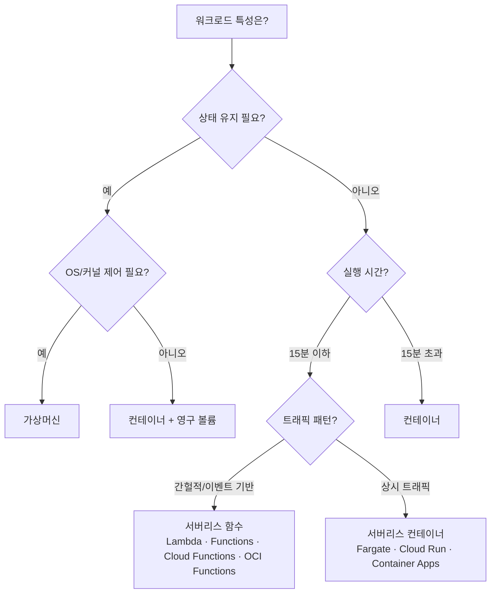

# 서버리스

> 문서 기준: 2024년 7월

## 개요

VM과 컨테이너는 서버 생성과 배포를 자동화했지만, 여전히 "서버가 몇 대 필요한가", "언제 스케일링할 것인가"를 사용자가 결정해야 합니다. 오토스케일링이 도와주지만, 최소 인스턴스를 유지하는 비용은 남습니다.

**서버리스**는 이 마지막 관리 부담마저 제거합니다. 서버의 존재를 의식하지 않고, 요청이 있을 때만 코드가 실행됩니다. 함수의 라이프사이클은 **요청 수신 → 인스턴스 생성(Cold Start) → 코드 실행 → 유휴 대기 → 일정 시간 후 해제(Evict)** 입니다. 이 과정이 벤더가 자동으로 관리합니다.

| 단계 | 관리 대상 | 과금 방식 | 유휴 비용 |
| --- | --- | --- | --- |
| **인스턴스 (VM)** | OS, 패치, 스케일링 전부 | 시간 단위 (켜져 있으면 과금) | 있음 |
| **컨테이너** | 앱 + 오케스트레이션 | 노드 시간 또는 Pod 단위 | 일부 있음 |
| **서버리스** | 코드만 | 요청 수 + 실행 시간 (GB-seconds) | 없음 (Provisioned Concurrency 미사용 시) |

## 왜 서버리스인가?

- **비용** — 트래픽이 없으면 비용이 0. 사용한 만큼만 과금됩니다 (GB-seconds 또는 요청 수 기반).
- **운영** — OS 패치, 보안 업데이트, 스케일링을 벤더가 전부 처리합니다.
- **속도** — 인프라 설정 없이 코드만 배포하면 즉시 실행됩니다.


서버리스가 항상 저렴한 것은 아닙니다. 상시 고부하 워크로드에서는 VM/컨테이너보다 비용이 높아질 수 있습니다. 또한 Provisioned Concurrency를 설정하면 유휴 시에도 비용이 발생합니다. 트래픽 패턴에 따라 비용을 시뮬레이션하세요.


## 아직 서버리스가 어려운 경우

- **Cold Start** — 일정 시간 호출이 없으면 인스턴스가 해제되어, 다시 호출 시 수백ms~수초 지연이 발생합니다. (이 문서에서 Cold Start는 함수 초기화 지연을 의미합니다. VM 기동 지연은 [오토스케일링](auto-scaling.md)을 참고하세요.)
- **실행 시간 제한** — 장시간 실행되는 작업에는 제한이 있습니다.
- **상시 부하** — 24시간 일정한 트래픽이면 VM이 더 경제적일 수 있습니다.
- **재시도와 멱등성** — 비동기·이벤트 트리거는 벤더·서비스에 따라 전달 보장이 다릅니다. 재시도가 있는 경로에서는 함수를 멱등하게 설계하세요. 실패 목적지는 DLQ, on-failure destination, 구독 dead-letter 등 서비스별 옵션을 확인하세요.
- **VPC 연결 시 지연 영향** — VPC 연동은 벤더마다 구현이 다릅니다. AWS Lambda는 Hyperplane ENI를 함수 생성/갱신 시점에 준비하는 모델로, “호출마다 ENI 생성” 설명은 구식입니다. 초기 구성·장기 유휴 후 첫 호출, 서브넷/보안 그룹 제약 등 환경별 지연은 별도로 측정하세요.

이러한 제약은 점차 완화되고 있으며 (Provisioned Concurrency, 실행 시간 연장 등), 서버리스 적용 범위는 계속 넓어지고 있습니다.

## 클라우드 자동화 트리거 서비스 비교

클라우드 자동화 트리거 서비스는 서버리스 함수의 핵심 구성 요소로, 이벤트에 반응하여 코드를 실행하고 인프라 관리 부담을 줄여 개발자가 비즈니스 로직에 집중할 수 있도록 도와줍니다. 본 문서는 실무자가 클라우드 플랫폼 선택 시 고려해야 할 핵심 요소들을 벤더 중립적 관점에서 객관적으로 비교합니다.

### 주요 평가 기준

다음 표는 각 클라우드 플랫폼의 주요 성능 및 비용 지표를 정리한 것입니다.
*   **트리거 유형**: 지원하는 트리거 유형의 다양성 (HTTP, Storage, Database, Event Bus 등)
*   **최대 실행 시간**: 함수 실행의 최대 시간 제한 (TIMEOUT 제한)
*   **메모리 할당**: 함수에 할당할 수 있는 최대 메모리 양 (성능과 비용에 직결)
*   **동시성 제한**: 동시에 실행할 수 있는 함수의 최대 수 (스케일링 능력)
*   **콜드 스타트**: 함수의 평균 콜드 스타트 시간 (성능 민감도에 영향)
*   **VPC 지원**: 가상 사설 클라우드(VPC) 네트워크기능 여부 (보안/프라이빗 네트워크 접근)
*   **비용 (GB-초 기준)**: GB-초당 비용 (실제 과금의 기본 단위)
*   **프리 티어**: 무료 제공량 (월별 요청 수 및 GB-초)

### FaaS (Function as a Service) 벤더별 상세 비교

#### AWS Lambda

*   **트리거 유형**: API Gateway, S3, DynamoDB, SQS, EventBridge, Kinesis, Cognito, SES 등 200가지 이상
*   **최대 실행 시간**: 15분
*   **메모리 할당**: 128MB ~ 10GB
*   **동시성 제한**: 기본 1,000 (확장 가능)
*   **콜드 스타트**: 평균 약 150ms
*   **VPC 지원**: 지원
*   **비용 (GB-초 기준)**: $0.20 (추정치: 1M 요청당)
*   **프리 티어**: 월 1M 요청, 400,000 GB-초
*   **장점**: 가장 광범위한 트리거 지원과 높은 확장성. 엔터프라이즈 환경에서 널리 사용되며 성숙한 생태계 보유.
*   **주요 사용 사례**: [CI/CD 파이프라인 통합](https://aws.amazon.com/ko/blogs/korea/set-up-a-ci-cd-pipeline-with-aws-codepipeline-aws-codebuild-amazon-s3-and-aws-codecommit/), [실시간 데이터 처리](https://aws.amazon.com/ko/blogs/korea/building-real-time-data-pipelines-with-aws/), [서버리스 백엔드](https://aws.amazon.com/ko/serverless/), ETL 워크로드
*   [AWS Lambda 공식 문서](https://aws.amazon.com/lambda/)

#### Azure Functions

*   **트리거 유형**: Blob Storage, Cosmos DB, Event Grid, Service Bus, HTTP, Timer 등 100가지 이상
*   **최대 실행 시간**: 10분
*   **메모리 할당**: 128MB ~ 16GB
*   **동시성 제한**: 기본 200 (확장 가능)
*   **콜드 스타트**: 평균 약 500ms
*   **VPC 지원**: 지원
*   **비용 (GB-초 기준)**: $0.20 (추정치: 1M 요청당)
*   **프리 티어**: 월 1M 요청, 400,000 GB-초
*   **장점**: C#/.NET 개발에 최적화된 환경. 강력한 [CI/CD 및 DevOps 통합 기능](https://azure.microsoft.com/ko-kr/services/devops/).
*   **주요 사용 사례**: [.NET 기반 애플리케이션 백엔드](https://docs.microsoft.com/ko-kr/azure/azure-functions/functions-comparison), [이벤트 기반 워크플로우](https://azure.microsoft.com/ko-kr/services/event-grid/), [데이터 통합](https://azure.microsoft.com/ko-kr/services/data-factory/)
*   [Azure Functions 공식 문서](https://azure.microsoft.com/services/functions/)

#### Google Cloud Functions (2nd Gen)

*   **트리거 유형**: Cloud Storage, Pub/Sub, Firestore, HTTP, Cloud Scheduler 등 50가지 이상 (2nd Gen)
*   **최대 실행 시간**: 60분 (2nd Gen)
*   **메모리 할당**: 128MB ~ 16GB
*   **동시성 제한**: 기본 1,000 (확장 가능)
*   **콜드 스타트**: 평균 약 50ms
*   **VPC 지원**: 지원
*   **비용 (GB-초 기준)**: $0.40 (추정치: 1M 요청당)
*   **프리 티어**: 월 2M 요청, 400,000 GB-초
*   **장점**: 뛰어난 콜드 스타트 성능과 확장성. 다중 지역 지원 및 AI/ML 워크로드에 유리.
*   **주요 사용 사례**: [실시간 데이터 처리](https://cloud.google.com/dataflow), [AI/ML 워크로드](https://cloud.google.com/ai-platform), [글로벌 애플리케이션](https://cloud.google.com/appengine), [고성능 컴퓨팅](https://cloud.google.com/hpc)
*   [Google Cloud Functions 공식 문서](https://cloud.google.com/functions)

#### IBM Cloud Functions

*   **트리거 유형**: Cloud Object Storage, Cloudant, HTTP, Message Hub 등 30가지 이상
*   **최대 실행 시간**: 10분
*   **메모리 할당**: 128MB ~ 2GB
*   **동시성 제한**: 기본 100 (확장 가능)
*   **콜드 스타트**: 평균 약 1초
*   **VPC 지원**: 미지원 (프라이빗 네트워크 접근에 제약)
*   **비용 (GB-초 기준)**: $0.30 (추정치: 1M 요청당)
*   **프리 티어**: 월 5M 요청, 400,000 GB-초
*   **장점**: IBM 클라우드 내 자산 및 레거시 시스템과의 통합에 용이.
*   **주요 사용 사례**: [IBM 클라우드 기반 애플리케이션](https://cloud.ibm.com/), [레거시 시스템 통합](https://www.ibm.com/ko-kr/cloud/legacy-systems-modernization), [메시지 처리](https://cloud.ibm.com/messaging)
*   [IBM Cloud Functions 공식 문서](https://cloud.ibm.com/functions)

### 종합 비교 표

| 서비스 | 콜드 스타트 (평균) | 최대 실행 시간 | 메모리 할당 (최대) | 동시성 제한 (기본) | VPC 지원 | 예상 비용 (1M 요청당) | 주요 트리거 예시 |
| :-------------------- | :----------------- | :------------- | :----------------- | :----------------- | :------- | :------------------ | :----------------------------- |
| AWS Lambda | ~150ms | 15분 | 10GB | 1,000 | O | $0.20 | S3, API Gateway, EventBridge |
| Azure Functions | ~500ms | 10분 | 16GB | 200 | O | $0.20 | Blob Storage, Event Grid, Service Bus |
| GCP Functions (2nd Gen) | ~50ms | 60분 | 16GB | 1,000 | O | $0.40 | Pub/Sub, Cloud Storage, Firestore |
| IBM Cloud Functions | ~1초 | 10분 | 2GB | 100 | X | $0.30 | Cloud Object Storage, Cloudant |

### 핵심 선택 기준

1.  **콜드 스타트 성능 민감도**:
    *   극도의 실시간 응답이 필요한 경우 → **Google Cloud Functions (2nd Gen)** (~50ms)
    *   높은 성능이 필요하지만 유연성이 더 중요한 경우 → **AWS Lambda** (~150ms)
2.  **트리거 다양성과 생태계 통합**:
    *   가장 광범위한 클라우드 서비스와의 통합이 필요한 경우 → **AWS Lambda** (200+ 트리거)
3.  **엔터프라이즈 보안 및 프라이빗 네트워크 접근**:
    *   VPC 내에서 함수 실행 및 내부 리소스 접근이 필수적인 경우 → **AWS Lambda**, **Azure Functions**, **Google Cloud Functions**
4.  **.NET 기반 개발 환경**:
    *   C#/.NET 개발에 최적화된 환경과 도구를 선호하는 경우 → **Azure Functions**
5.  **다중 지역 지원 및 글로벌 애플리케이션**:
    *   지리적 분산 및 낮은 지연 시간이 중요한 경우 → **Google Cloud Functions**
6.  **기존 IBM 클라우드 자산과의 통합**:
    *   IBM 클라우드 서비스와의 원활한 통합이 최우선인 경우 → **IBM Cloud Functions**

### 사용 사례별 추천 솔루션

| 사용 사례 | 추천 서비스 | 설명 |
| :-------------------- | :-------------------------- | :------------------------------------------------------- |
| 실시간 데이터 처리 | **Google Cloud Functions** | 뛰어난 콜드 스타트 성능과 확장성으로 지연 시간 최소화 |
| CI/CD 파이프라인 통합 | **AWS Lambda** | 강력한 CI/CD 지원 및 광범위한 트리거로 워크플로우 자동화 |
| AI/ML 워크로드 | **Google Cloud Functions** | 높은 메모리 할당 및 긴 실행 시간 지원으로 복잡한 연산 처리 |
| .NET 기반 애플리케이션 | **Azure Functions** | C#/.NET 개발에 최적화된 환경 및 엔터프라이즈급 지원 |
| 다중 지역 애플리케이션 | **Google Cloud Functions** | 글로벌 지역 지원 및 낮은 콜드 스타트로 분산 환경에 유리 |
| IBM 클라우드 통합 | **IBM Cloud Functions** | IBM 생태계 내 기존 자산 및 레거시 시스템과의 원활한 통합 |

### 주의 사항 및 고려 사항

*   **비용 계산의 복잡성**: GB-초 기준 비용은 실제 함수 실행 시간, 메모리 사용량, 요청 수에 따라 크게 달라질 수 있습니다. 정확한 비용 추정을 위해 PoC(개념 증명)를 통한 실제 사용량 예측이 중요합니다.
*   **보안 정책 및 네트워크 통합**: VPC 지원 여부뿐만 아니라, 클라우드 환경의 네트워크 보안 정책, IAM(ID 및 접근 관리) 설정 등을 사전에 철저히 검토해야 합니다. 특히 **IBM Cloud Functions**의 VPC 미지원 여부는 보안 요구사항이 높은 환경에서 주요 제약이 될 수 있습니다.
*   **서비스 제약 및 할당량**: 각 플랫폼은 함수 실행 시간, 메모리, 동시성 등에 고유한 제약과 기본 할당량이 있습니다. 대규모 워크로드를 계획할 때 이러한 제약을 확인하고 필요한 경우 상향 조정을 요청해야 합니다.
*   **콜드 스타트 민감도**: 사용자 대면(user-facing) 애플리케이션 같은 실시간성이 중요한 워크로드에서는 콜드 스타트 시간이 짧은 **GCP Functions** 또는 **AWS Lambda**를 우선적으로 고려해야 합니다. 백그라운드 작업 등 지연에 덜 민감한 워크로드에서는 다른 서비스도 충분히 활용 가능합니다.
*   **개발자 경험 및 언어 지원**: 선호하는 프로그래밍 언어와 개발 도구, 그리고 팀의 숙련도를 고려하여 개발자 경험이 좋은 플랫폼을 선택하는 것이 생산성에 중요합니다.

## 서버리스 컨테이너

| 벤더 | 제품 | 비고 |
| --- | --- | --- |
| AWS | Fargate | ECS/EKS에서 서버 없이 컨테이너 실행 |
| AWS | App Runner | 소스/이미지에서 바로 배포 |
| Azure | Container Apps | 이벤트 기반 스케일링 내장 |
| Google Cloud | Cloud Run | HTTP 기반. 기존 컨테이너 앱을 수정 없이 서버리스 전환 |
| OCI | OCI Container Instances | 서버 관리 없이 컨테이너 실행 |

## 워크플로우 오케스트레이션

| 벤더 | 제품 | 비고 |
| --- | --- | --- |
| AWS | Step Functions | 시각적 워크플로우 편집기 |
| Azure | Durable Functions / Logic Apps | 코드 기반 / 로우코드 |
| Google Cloud | Workflows | YAML 기반 서비스 오케스트레이션 |
| OCI | OCI Events + OCI Functions | 이벤트 기반 함수 체이닝 |

## 핵심 차이점

-   **AWS Lambda** — AWS 서비스와의 이벤트 소스 연동이 풍부합니다. API Gateway, S3, DynamoDB Streams 등 다양한 트리거를 네이티브로 지원합니다.
-   **Google Cloud Cloud Run** — 기존 컨테이너 이미지를 수정 없이 그대로 배포할 수 있어 마이그레이션 경로가 단순합니다.
-   **Azure Functions** — Durable Functions로 장시간 상태 유지 워크플로우까지 서버리스로 처리할 수 있습니다.
-   **OCI Functions** — Fn Project(오픈소스) 기반으로 Docker 컨테이너를 그대로 함수로 실행할 수 있어, 벤더 종속이 낮습니다.

## 서버리스 vs 컨테이너 vs VM

## Cold Start 완화 전략

Cold Start는 서버리스의 가장 큰 단점입니다. 벤더별 완화 방법을 정리합니다.

| 전략 | 설명 | AWS Lambda | Azure Functions | Google Cloud Cloud Functions/Run | OCI Functions |
| --- | --- | --- | --- | --- | --- |
| **사전 프로비저닝** | 미리 웜업된 인스턴스 유지 (유휴에도 비용 발생) | Provisioned Concurrency | Premium Plan (Pre-warmed) | Min Instances | — |
| **Keep-warm 호출** | 주기적으로 함수를 호출하여 웜 상태 유지 | EventBridge 스케줄 | Timer Trigger | Cloud Scheduler | OCI Events |
| **런타임 선택** | 빠른 초기화 런타임 사용 | Go, Rust는 Cold Start 빠름. Java/.NET은 느림 | 동일 | 동일 | 동일 |
| **경량화** | 패키지 크기 축소, 의존성 최소화 | Lambda Layers 활용 | 동일 | 동일 | 동일 |
| **SnapStart** | 스냅샷 기반 빠른 시작 | Lambda SnapStart (Java) | — | — | — |

## 동시성 제한과 처리량

서버리스는 자동 확장되지만 무제한은 아닙니다. 초당 얼마나 많은 요청을 처리할 수 있는지 알아야 합니다.

| 벤더 | 기본 동시성 제한 | 확장 가능 |
| --- | --- | --- |
| AWS Lambda | 계정당 1,000 동시 실행 (리전별) | 지원 요청으로 증가 가능 |
| Azure Functions | Consumption Plan: 제한 있음. Premium: 더 높음 | Elastic Premium Plan |
| Google Cloud Cloud Functions (2세대) | 인스턴스당 concurrent request 한도와 함수/프로젝트 확장 한도가 별도 ([공식 quotas](https://cloud.google.com/functions/quotas) 확인) | 조정 가능 |
| OCI Functions | 테넌시별 제한 | 지원 요청으로 증가 |

### 동시성 제한 전략

-   **Reserved Concurrency** (AWS Lambda) — 특정 함수에 동시 실행 수 예약 또는 제한
-   **Throttling** — 지원되는 리트라이 정책 사용 (지수 백오프)
-   **큐 기반 버퍼링** — SQS/Service Bus/Pub/Sub로 트래픽 스파이크 흡수
-   **다운스트림 보호** — 동시성 1,000 = DB 커넥션 1,000개. RDS Proxy, Cloud SQL Auth Proxy, PgBouncer 등 Lambda와 DB 사이에 커넥션 풀러를 반드시 배치하세요

## 컨테이너 이미지 지원

모든 벤더가 컨테이너 이미지 기반 서버리스 함수를 지원합니다. 기존 컨테이너 워크로드를 서버리스로 전환하기 쉽습니다.

| 벤더 | 최대 이미지 크기 | 비고 |
| --- | --- | --- |
| AWS Lambda | 10GB | ECR에서 가져옴 |
| Azure Functions | — (Custom Container) | 모든 이미지 |
| Google Cloud Cloud Run | — | Artifact Registry에서 가져옴 |
| OCI Functions | — | OCI Registry 또는 외부 |

## 운영 고려사항

서버리스는 인프라 관리가 줄어들지만, 운영이 사라지는 것은 아닙니다.

-   **IAM 최소 권한** — 함수에 필요한 최소 권한만 부여. 하나의 역할을 여러 함수가 공유하지 마세요.
-   **VPC 연결** — DB 접근 등이 필요할 때만 VPC를 연결하고, 벤더별 네트워킹 지연·제약(서브넷, NAT, 보안 그룹)을 측정하세요.
-   **분산 추적** — 서버리스는 호출 체인이 복잡해지기 쉽습니다. X-Ray, Cloud Trace 등으로 추적을 설정하세요.
-   **멱등성 설계** — 재시도·중복 전달이 있는 경로에서는 동일 이벤트를 여러 번 처리해도 결과가 같도록 설계하세요.
-   **비용 모니터링** — 예상치 못한 호출 폭증이 비용 폭증으로 이어질 수 있습니다. 예산 알림을 설정하세요.

## 자주 하는 실수

-   **DB 직접 연결 (커넥션 고갈)** — Lambda/Function에서 DB에 직접 연결하면 동시 실행 수만큼 커넥션이 생성되어 DB 커넥션 풀이 고갈됩니다. RDS Proxy, Cloud SQL Auth Proxy, PgBouncer 등 커넥션 풀러를 반드시 배치하세요.
-   **콜드 스타트 무시** — 응답 지연에 민감한 워크로드에서 콜드 스타트 완화 설정(Provisioned Concurrency, Min Instances) 없이 운영하면 사용자 경험이 저하됩니다.
-   **함수 하나에 모든 로직** — 하나의 함수에 여러 책임을 넣으면 디버깅이 어렵고, 타임아웃 위험이 커지며, 재사용이 불가능합니다. 단일 책임 원칙을 적용하세요.

## 체크리스트

-   [ ] 커넥션 풀러(RDS Proxy, PgBouncer 등)를 DB 앞에 배치했는가
-   [ ] 콜드 스타트 완화 설정(Provisioned Concurrency, Min Instances)을 적용했는가
-   [ ] 함수 타임아웃을 워크로드에 맞게 설정했는가
-   [ ] 비동기 패턴(큐, 이벤트)을 적용하여 동기 호출 체인을 줄였는가

## 관련 문서

-   [오토스케일링](auto-scaling.md)
-   [컨테이너](containers.md)

## 참고하기

### AWS

*   [AWS Lambda 공식 문서](https://aws.amazon.com/lambda/)
*   [CI/CD 파이프라인 통합](https://aws.amazon.com/ko/blogs/korea/set-up-a-ci-cd-pipeline-with-aws-codepipeline-aws-codebuild-amazon-s3-and-aws-codecommit/)
*   [실시간 데이터 처리](https://aws.amazon.com/ko/blogs/korea/building-real-time-data-pipelines-with-aws/)
*   [서버리스 백엔드](https://aws.amazon.com/ko/serverless/)
*   [AWS Step Functions 문서](https://docs.aws.amazon.com/ko_kr/step-functions/)
*   [서버리스 아키텍처](https://docs.aws.amazon.com/ko_kr/wellarchitected/latest/serverless-applications-lens/welcome.html)

### Azure

*   [Azure Functions 공식 문서](https://azure.microsoft.com/services/functions/)
*   [CI/CD 및 DevOps 통합 기능](https://azure.microsoft.com/ko-kr/services/devops/)
*   [.NET 기반 애플리케이션 백엔드](https://docs.microsoft.com/ko-kr/azure/azure-functions/functions-comparison)
*   [이벤트 기반 워크플로우](https://azure.microsoft.com/ko-kr/services/event-grid/)
*   [데이터 통합](https://azure.microsoft.com/ko-kr/services/data-factory/)
*   [Azure Durable Functions 문서](https://learn.microsoft.com/ko-kr/azure/azure-functions/durable/)

### Google Cloud

*   [Google Cloud Functions 공식 문서](https://cloud.google.com/functions)
*   [실시간 데이터 처리](https://cloud.google.com/dataflow)
*   [AI/ML 워크로드](https://cloud.google.com/ai-platform)
*   [글로벌 애플리케이션](https://cloud.google.com/appengine)
*   [고성능 컴퓨팅](https://cloud.google.com/hpc)
*   [Google Cloud Run 문서](https://cloud.google.com/run/docs)
*   [Google Cloud Workflows 문서](https://cloud.google.com/workflows/docs)
*   [Google Cloud Functions Quotas](https://cloud.google.com/functions/quotas)

### IBM Cloud

*   [IBM Cloud Functions 공식 문서](https://cloud.ibm.com/functions)
*   [IBM 클라우드 기반 애플리케이션](https://cloud.ibm.com/)
*   [레거시 시스템 통합](https://www.ibm.com/ko-kr/cloud/legacy-systems-modernization)
*   [메시지 처리](https://cloud.ibm.com/messaging)

### 기타

*   [Serverless Benchmark 2023](https://www.serverless.com/blog/serverless-benchmark-2023)
