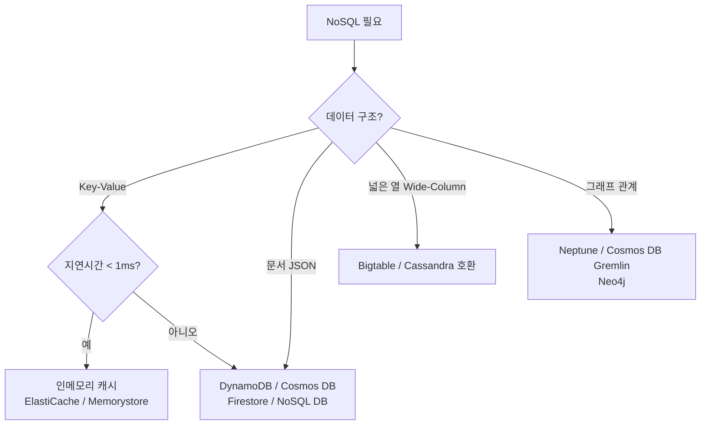

# NoSQL

> 문서 기준: 2026년 5월

## 개요

관계형 DB(SQL)는 테이블, 행, 열로 데이터를 정형화하고 SQL로 조회합니다. 스키마가 엄격하고 트랜잭션(ACID)을 보장하지만, 대규모 트래픽에서 수평 확장이 어렵고 스키마 변경이 번거롭습니다.

**NoSQL** (Not Only SQL)은 RDB의 핵심 요소 — 고정 스키마, JOIN, 완전한 ACID 트랜잭션 — 를 일부 포기하는 대신, 수평 확장성과 유연한 데이터 모델을 얻는 접근입니다. "SQL을 안 쓴다"가 아니라 "SQL만으로는 풀기 어려운 문제를 다른 방식으로 푼다"는 의미입니다.

### SQL vs NoSQL

| 항목 | SQL (관계형) | NoSQL |
| --- | --- | --- |
| **스키마** | 엄격 (테이블 구조 사전 정의) | 유연 (스키마리스 또는 스키마 온 리드) |
| **확장** | 수직 확장 위주 (더 큰 서버) | 수평 확장 (서버 추가) |
| **트랜잭션** | ACID 보장 | 일부만 지원 (BASE 모델) |
| **조인** | 복잡한 조인 가능 | 조인 없음 또는 제한적 |
| **적합한 경우** | 정형 데이터, 복잡한 관계, 일관성 중요 | 대규모 트래픽, 유연한 구조, 빠른 응답 |

### NoSQL 유형

| 유형 | 데이터 구조 | 이럴 때 선택 | 사용 사례 |
| --- | --- | --- | --- |
| **키-값** (Key-Value) | 키 하나로 값 조회 | 단순 조회가 초고속이어야 할 때 | 세션, 캐시, 설정, 장바구니 |
| **문서** (Document) | JSON/BSON 문서 | 스키마가 자주 바뀌거나 중첩 구조일 때 | 사용자 프로필, 카탈로그, CMS |
| **와이드 컬럼** (Wide Column) | 행마다 컬럼이 다를 수 있음 | 대규모 시계열/이벤트 데이터 쓰기 | IoT, 로그, 분석, 추천 |
| **그래프** (Graph) | 노드 + 엣지(관계) | 데이터 간 관계/연결이 핵심일 때 | 소셜 네트워크, 사기 탐지, 지식 그래프 |

## 사용 사례

| DB | 유형 | 대표 사용 사례 | 왜 RDB가 아닌 이것인가 |
| --- | --- | --- | --- |
| DynamoDB | 키-값/문서 | 세션, 장바구니, 게임 상태, IoT | 무한 스케일, 단일 자릿수 ms 보장, 스키마 유연 |
| MongoDB (Atlas/DocumentDB/Cosmos DB) | 문서 | 카탈로그, CMS, 사용자 프로필 | 스키마리스, 중첩 문서, 빠른 개발 |
| Cassandra / Bigtable | 와이드 컬럼 | 시계열, 로그, 추천 | 대규모 쓰기, 리전 분산 |
| Neptune / Cosmos DB Gremlin | 그래프 | 소셜, 사기 탐지, 지식 그래프 | 관계 탐색이 JOIN보다 빠름 |

### MongoDB 관리형 옵션

| 벤더 | 서비스 | 비고 |
| --- | --- | --- |
| AWS | DocumentDB | MongoDB 호환 API, 완전한 MongoDB는 아님 |
| Azure | Cosmos DB for MongoDB | MongoDB API 호환 모드 |
| MongoDB Atlas | Atlas (AWS/Azure/Google Cloud) | 멀티클라우드 관리형. 호환성 완벽. 벤더 중립 선택지 |

## 제품 비교

### 키-값 / 문서 DB

| 벤더 | 제품 | 비고 |
| --- | --- | --- |
| AWS | DynamoDB | 완전 서버리스. 밀리초 지연. 용량 자동 확장 |
| Azure | Cosmos DB | 멀티 모델(문서, 키-값, 그래프, 와이드 컬럼). 글로벌 분산 |
| Google Cloud | Firestore | 문서 DB. 모바일/웹 앱에 최적화. 실시간 동기화 |
| Google Cloud | Bigtable | 와이드 컬럼. 대규모 분석/시계열 |
| OCI | OCI NoSQL Database | 키-값 + 문서 + 와이드 컬럼. 서버리스 용량 관리 |

### 검색 / 로그 분석 엔진

| 벤더 | 제품 | 비고 |
| --- | --- | --- |
| AWS | OpenSearch Service | Elasticsearch/OpenSearch 관리형. 검색 + 로그 분석 + 대시보드 |
| Azure | Azure AI Search (구 Cognitive Search) | 검색 + AI 보강(벡터, 시맨틱) |
| OCI | OCI Search with OpenSearch | OpenSearch 관리형. 검색 + 로그 분석 |

### 그래프 DB

| 벤더 | 제품 | 비고 |
| --- | --- | --- |
| AWS | Neptune | |
| Azure | Cosmos DB (Gremlin API) | |


인메모리 캐시(Redis/Valkey)의 상세 비교는 [캐시와 인메모리](cache.md)를 참고하세요.


## 핵심 차이점

**AWS DynamoDB** — 완전 서버리스로 용량 관리가 불필요합니다. 단일 자릿수 밀리초 지연을 보장하며, DAX(인메모리 캐시)를 추가하면 마이크로초 지연도 가능합니다.

**Azure Cosmos DB** — 하나의 서비스로 문서, 키-값, 그래프, 와이드 컬럼을 모두 지원합니다. 글로벌 분산(멀티 리전 쓰기)이 기본 기능으로 내장되어 있습니다.

**Google Cloud Firestore** — 모바일/웹 클라이언트에서 직접 접근할 수 있는 실시간 동기화가 강점입니다. Bigtable은 대규모 분석 워크로드에 특화되어 있습니다.

**OCI NoSQL Database** — 키-값, 문서, 와이드 컬럼을 하나의 서비스로 지원하며, 서버리스 용량 관리와 예측 가능한 저지연 성능을 제공합니다.


글로벌 분산 DB(DynamoDB Global Tables, Cosmos DB, Spanner 등)의 일관성 트레이드오프와 선택 기준은 [관리형 RDB — 글로벌 분산 DB](managed-rdb.md#글로벌-분산-db)를 참고하세요.


## 선택 가이드

| 상황 | 추천 |
| --- | --- |
| 완전 서버리스 키-값/문서 DB + 밀리초 지연 | AWS DynamoDB |
| 하나의 DB로 문서, 키-값, 그래프를 모두 처리 | Azure Cosmos DB |
| 글로벌 멀티 리전 쓰기 | Azure Cosmos DB |
| 모바일/웹 앱 실시간 동기화 | Google Cloud Firestore |
| 대규모 시계열/IoT 데이터 쓰기 | Google Cloud Bigtable |
| 전문 검색 + 로그 분석 | AWS OpenSearch / OCI Search |
| 그래프 DB | AWS Neptune / Azure Cosmos DB (Gremlin) |

## 키 설계 패턴

NoSQL은 RDB와 달리 **쿼리 패턴을 먼저 정하고 키를 설계**해야 합니다.

### RDB vs NoSQL 설계 접근

- **RDB**: 데이터 정규화 → 쿼리는 나중에 JOIN으로 해결
- **NoSQL**: 접근 패턴(어떤 쿼리를 할 것인가)을 먼저 정의 → 그에 맞게 키/테이블 설계

### DynamoDB 스타일 키 설계

- **Partition Key (PK)** — 데이터 분산 단위. 균등 분산이 핵심
- **Sort Key (SK)** — PK 내에서 정렬/범위 조회
- **단일 테이블 설계** — 여러 엔티티를 하나의 테이블에 PK/SK 조합으로 저장
- **핫 파티션 안티패턴** — 특정 PK에 트래픽 집중 → 스로틀링

### MongoDB 스타일 키 설계

- **\_id 필드와 인덱스 전략** — 쿼리 패턴에 맞는 복합 인덱스 설계
- **임베딩 vs 레퍼런스** — 중첩 문서(1:1, 1:소수) vs 별도 컬렉션 참조(1:다수)
- **샤드 키 선택** — 카디널리티, 쓰기 분산, 쿼리 격리 고려


키 설계 안티패턴과 DB 운영 전반(커넥션 풀, 캐시 전략, HA)은 [데이터베이스 운영](operations.md)을 참고하세요.


## 자주 하는 실수

- **RDB처럼 정규화하여 설계** — NoSQL은 JOIN이 없거나 비효율적입니다. 쿼리 패턴을 먼저 정의하고 비정규화하여 설계해야 합니다.
- **핫 파티션을 유발하는 키 설계** — 타임스탬프만으로 Partition Key를 구성하면 특정 파티션에 트래픽이 집중되어 스로틀링이 발생합니다.
- **NoSQL을 모든 워크로드에 적용** — 복잡한 관계와 트랜잭션이 필요한 워크로드(결제, 재고)는 RDB가 적합합니다. NoSQL은 만능이 아닙니다.

## 체크리스트

- [ ] 접근 패턴(쿼리)을 먼저 정의하고 그에 맞게 키/테이블을 설계했는가
- [ ] Partition Key의 카디널리티가 충분히 높아 균등 분산되는지 확인했는가
- [ ] 용량 모드(프로비저닝 vs 온디맨드)를 트래픽 패턴에 맞게 선택했는가

## 참고하기

### AWS

- [Amazon DynamoDB 문서](https://docs.aws.amazon.com/ko_kr/dynamodb/)
- [Amazon Neptune 문서](https://docs.aws.amazon.com/ko_kr/neptune/)

### Azure

- [Azure Cosmos DB 문서](https://learn.microsoft.com/ko-kr/azure/cosmos-db/)

### Google Cloud

- [Firestore 문서](https://cloud.google.com/firestore/docs)
- [Bigtable 문서](https://cloud.google.com/bigtable/docs)

### OCI

- [OCI NoSQL Database 문서](https://docs.oracle.com/en-us/iaas/nosql-database/index.html)
