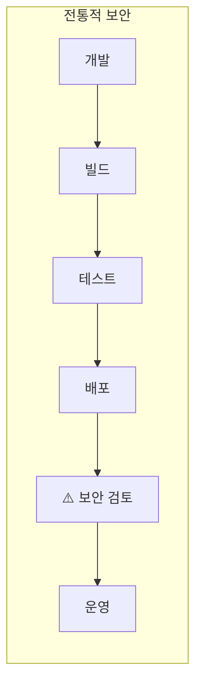
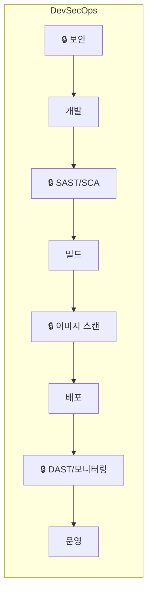
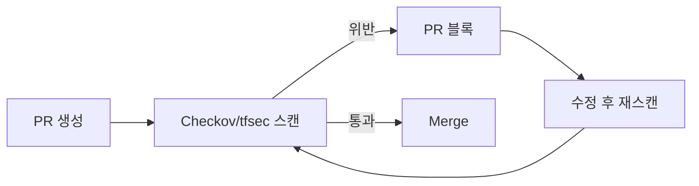

# DevSecOps

> 문서 기준: 2026년 5월

## 개요

DevSecOps는 보안(Security)을 개발(Dev)과 운영(Ops) 파이프라인에 **처음부터 내장**하는 접근 방식입니다. 배포 후 보안 검토를 하는 전통적 방식 대신, 코드 작성 시점부터 보안 검증을 자동화합니다.


배포 후 운영 환경의 보안 감시는 [보안 태세 관리](../security/security-posture.md)를, OS/런타임 패치는 [패치 관리와 취약점 대응](../devops/patch-and-vulnerability.md)을 참고하세요.


### 시프트-레프트 (Shift-Left) 원칙

보안 검증을 왼쪽(개발 초기)으로 이동할수록:

- **수정 비용 감소** — 프로덕션에서 발견된 취약점은 개발 단계 대비 10~100배 비용
- **배포 속도 유지** — 자동화된 보안 게이트가 수동 리뷰 병목을 제거
- **개발자 역량 강화** — 즉각적 피드백으로 보안 인식 향상

## 파이프라인 단계별 보안 도구

| 단계 | 보안 활동 | 도구 유형 |
| --- | --- | --- |
| **코드 작성** | 시크릿 노출 방지, 보안 코딩 패턴 | Pre-commit hooks, IDE 플러그인 |
| **코드 리뷰/PR** | 정적 분석 (SAST), 시크릿 스캔 | SAST, Secret scanning |
| **빌드** | 의존성 취약점 (SCA), 라이선스 검사 | SCA (Software Composition Analysis) |
| **컨테이너 빌드** | 이미지 취약점 스캔, 베이스 이미지 검증 | Container scanning |
| **IaC 검증** | 인프라 코드 보안 검사 | IaC scanning |
| **배포 전** | 정책 게이트, 승인 워크플로 | Policy-as-Code |
| **런타임** | DAST, 침투 테스트, 런타임 보호 | DAST, RASP |

## SAST (Static Application Security Testing)

**정적 분석.** 소스 코드를 실행하지 않고 코드 자체를 스캔하여 보안 취약점을 찾습니다. 개발 단계에서 빠르게 발견할 수 있지만, 런타임에서만 드러나는 문제는 못 찾습니다.

| 벤더/도구 | 서비스 | 특징 |
| --- | --- | --- |
| AWS | [Amazon Inspector (코드 스캔)](https://docs.aws.amazon.com/inspector/latest/user/scanning-code.html) | Lambda/ECR 코드 취약점 자동 스캔. Python, Java, JavaScript 등 |
| Azure | [Microsoft Defender for DevOps](https://learn.microsoft.com/azure/defender-for-cloud/defender-for-devops-introduction) + GitHub Advanced Security | CodeQL 기반. GitHub/Azure DevOps 네이티브 통합 |
| Google Cloud | 네이티브 SAST 없음 — Cloud Build에 [Semgrep](https://semgrep.dev/) 또는 [SonarQube](https://www.sonarsource.com/products/sonarqube/) 통합 | 서드파티 도구를 파이프라인에 연동 |
| 벤더 중립 | [SonarQube](https://www.sonarsource.com/products/sonarqube/), [Semgrep](https://semgrep.dev/), [Snyk Code](https://snyk.io/product/snyk-code/) | 멀티클라우드 환경에서 일관된 분석 |

## DAST (Dynamic Application Security Testing)

**동적 분석.** 실행 중인 애플리케이션을 외부에서 실제로 공격하여 취약점을 찾습니다. 배포된 환경에서만 드러나는 문제(인증 우회, 설정 오류 등)를 발견할 수 있습니다.

| 도구 | 특징 |
| --- | --- |
| [OWASP ZAP](https://www.zaproxy.org/) | 오픈소스. CI/CD 파이프라인 통합 가능 |
| [Burp Suite](https://portswigger.net/burp) | 상용. 수동 침투 테스트 + 자동 스캔 |
| [Nuclei](https://nuclei.projectdiscovery.io/) | 오픈소스. 템플릿 기반 취약점 스캔. CI 통합 용이 |

각 CSP에는 네이티브 DAST 도구가 없으므로, 위 벤더 중립 도구를 스테이징 환경에서 실행하는 것이 일반적입니다.

## SCA (Software Composition Analysis)

**의존성 분석.** 오픈소스 라이브러리/패키지에 포함된 알려진 취약점(CVE)과 라이선스 위반을 탐지합니다. 직접 작성한 코드가 아닌 가져다 쓴 코드의 위험을 관리합니다.

| 벤더/도구 | 서비스 | 특징 |
| --- | --- | --- |
| AWS | [Inspector SBOM](https://docs.aws.amazon.com/inspector/latest/user/sbom-generator.html) | SBOM 생성 + CVE 매칭 |
| Azure | [Defender for DevOps](https://learn.microsoft.com/azure/defender-for-cloud/defender-for-devops-introduction) + [GitHub Dependabot](https://docs.github.com/en/code-security/dependabot) | Defender for DevOps로 Azure DevOps/GitHub 통합. Dependabot은 GitHub 기능 |
| Google Cloud | [Artifact Analysis](https://cloud.google.com/artifact-analysis/docs) | 컨테이너 이미지 + 언어 패키지 스캔 |
| 벤더 중립 | [Snyk Open Source](https://snyk.io/product/snyk-open-source/), [Trivy](https://trivy.dev/), [Grype](https://github.com/anchore/grype) | 멀티 레지스트리, 멀티 언어 지원 |

## IaC 보안 검증

Terraform, CloudFormation, Bicep 등 [인프라 코드](iac.md)에서 보안 구성 오류를 배포 전에 탐지합니다.

| 도구 | 대상 | 특징 |
| --- | --- | --- |
| [Checkov](https://www.checkov.io/) | Terraform, CloudFormation, Kubernetes, Helm | 1,000+ 내장 정책. CIS Benchmark 매핑 |
| [tfsec](https://aquasecurity.github.io/tfsec/) (현 Trivy) | Terraform | Trivy에 통합. HCL 네이티브 분석 |
| [KICS](https://kics.io/) | Terraform, CloudFormation, Ansible, Docker | 오픈소스. 멀티 IaC 지원 |
| [cfn-nag](https://github.com/stelligent/cfn_nag) | CloudFormation | AWS 특화 |
| [Azure Policy (DeployIfNotExists)](https://learn.microsoft.com/azure/governance/policy/concepts/effects#deployifnotexists) | ARM/Bicep | 배포 시 정책 강제 |

### IaC 보안 검증 파이프라인 예시

## 정책 코드화 (Policy-as-Code)

보안 정책을 코드로 정의하여 자동으로 강제합니다.

| 도구/서비스 | 벤더 | 용도 |
| --- | --- | --- |
| [AWS SCP (Service Control Policies)](https://docs.aws.amazon.com/organizations/latest/userguide/orgs_manage_policies_scps.html) | AWS | Organization 수준에서 허용/거부 액션 강제 |
| [Azure Policy](https://learn.microsoft.com/azure/governance/policy/overview) | Azure | 리소스 생성/변경 시 정책 평가. 거부/감사/자동 교정 |
| [Google Cloud Organization Policy](https://cloud.google.com/resource-manager/docs/organization-policy/overview) | Google Cloud | 조직 수준 제약 조건 (리전 제한, 서비스 제한 등) |
| [OCI Security Zones](https://docs.oracle.com/en-us/iaas/security-zone/home.htm) | OCI | 컴파트먼트에 보안 정책 부착. 위반 작업 거부 (예방적 정책 강제) |
| [OPA (Open Policy Agent)](https://www.openpolicyagent.org/) | 벤더 중립 | Rego 언어로 범용 정책 정의. Kubernetes, Terraform, API 게이트웨이 등 |
| [HashiCorp Sentinel](https://www.hashicorp.com/sentinel) | 벤더 중립 | Terraform Enterprise/Cloud에서 정책 강제 |

### 정책 코드화 적용 예시

| 정책 | 구현 |
| --- | --- |
| "모든 S3 버킷은 암호화 필수" | AWS Config Rule + 자동 교정 Lambda |
| "프로덕션 리소스는 특정 리전만 허용" | SCP / Organization Policy / Azure Policy |
| "태그 없는 리소스 생성 거부" | Azure Policy (Deny) / AWS Tag Policy |
| "컨테이너 이미지는 승인된 레지스트리만" | OPA Gatekeeper (Kubernetes Admission) |
| "Terraform plan에 퍼블릭 IP 할당 시 거부" | Sentinel / Checkov CI 게이트 |

## 시크릿 스캔

코드 저장소에 커밋된 시크릿(API 키, 비밀번호, 토큰)을 탐지합니다. 시크릿의 안전한 저장과 교체는 [시크릿 관리](../security/secrets.md)를 참고하세요.

| 도구 | 특징 |
| --- | --- |
| [GitHub Secret Scanning](https://docs.github.com/en/code-security/secret-scanning) | Push 시 자동 탐지. 파트너 프로그램으로 벤더에 자동 알림 |
| [GitLeaks](https://gitleaks.io/) | 오픈소스. Pre-commit hook + CI 통합 |
| [TruffleHog](https://trufflesecurity.com/trufflehog) | Git 히스토리 전체 스캔. 600+ 시크릿 패턴 |
| [Amazon Q Developer (코드 스캔)](https://aws.amazon.com/q/developer/) | 코드 내 시크릿·취약점 탐지 (구 CodeGuru Security). IDE 플러그인은 [Kiro](https://kiro.dev/)로 전환 중 |


**Pre-commit hook으로 시크릿 커밋을 원천 차단하세요.** 한번 Git 히스토리에 들어간 시크릿은 force push로 제거해도 캐시에 남을 수 있습니다. 예방이 최선입니다.


## DevSecOps 성숙도 모델

| 단계 | 특징 | 도구 예시 |
| --- | --- | --- |
| **Level 1 — 수동** | 배포 후 수동 보안 리뷰. 취약점 발견 시 핫픽스 | 수동 침투 테스트 |
| **Level 2 — 부분 자동화** | CI에 SAST/SCA 추가. 결과는 리포트만 (블록 안 함) | SonarQube, Snyk (알림 모드) |
| **Level 3 — 게이트 적용** | Critical/High 취약점 시 파이프라인 블록. 정책 코드화 시작 | Checkov + PR 블록, OPA |
| **Level 4 — 완전 자동화** | 모든 단계에 보안 게이트. 자동 교정. 보안 메트릭 추적 | 전체 도구 체인 + SIEM 연동 |

## 자주 하는 실수

- **SAST/SCA 결과를 알림만 하고 블록하지 않음** — Critical 취약점이 프로덕션까지 배포됩니다. 최소 Critical/High는 파이프라인을 블록하세요.
- **시크릿이 Git 히스토리에 남은 채 force push로만 제거** — 캐시와 포크에 여전히 남아있습니다. 시크릿을 즉시 교체(rotate)하는 것이 유일한 해결책입니다.
- **IaC 보안 스캔 없이 terraform apply 실행** — 퍼블릭 S3 버킷, 과도한 Security Group 등이 그대로 배포됩니다. PR 단계에서 Checkov/tfsec을 게이트로 설정하세요.

## 체크리스트

- [ ] Pre-commit hook에 시크릿 스캔(GitLeaks 등)이 설정되어 있는가?
- [ ] CI 파이프라인에 SAST + SCA + IaC 스캔이 포함되고, Critical 발견 시 빌드가 실패하는가?
- [ ] 컨테이너 이미지 빌드 시 취약점 스캔이 자동 실행되는가?

## 참고하기

### AWS

- [AWS DevSecOps Workshop](https://catalog.workshops.aws/devsecops)

### Azure

- [Microsoft Security Development Lifecycle](https://www.microsoft.com/en-us/securityengineering/sdl)

### Google Cloud

- [Google Cloud Security Best Practices](https://cloud.google.com/security/best-practices)

### 표준 및 커뮤니티

- [OWASP DevSecOps Guideline](https://owasp.org/www-project-devsecops-guideline/)
- [NIST SP 800-218 (Secure Software Development Framework)](https://csrc.nist.gov/publications/detail/sp/800-218/final)
- [CIS Software Supply Chain Security Guide](https://www.cisecurity.org/cis-benchmarks)
- [SLSA (Supply-chain Levels for Software Artifacts)](https://slsa.dev/)
