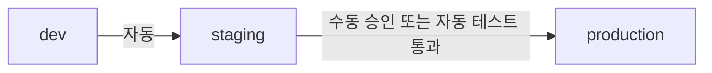

# Kubernetes 운영

> 문서 기준: 2026년 5월

## 개요

[컨테이너 서비스](../compute/containers.md)에서 관리형 Kubernetes를 선택한 뒤에는 **Day-2 운영**이 시작됩니다. 클러스터 업그레이드, 배포 자동화, 보안 정책, 관측가능성 등 지속적으로 관리해야 할 영역입니다.


관리형 Kubernetes 선택 가이드는 [컨테이너 서비스](../compute/containers.md)를, 서비스 간 통신 보안은 [서비스 메시](../compute/service-mesh.md)를 참고하세요.


## 클러스터 업그레이드

Kubernetes는 연 3회 마이너 버전을 릴리스하며, 각 벤더는 일정 기간 후 이전 버전 지원을 종료합니다.

| 벤더 | 서비스 | 지원 버전 수 | 업그레이드 방식 |
| --- | --- | --- | --- |
| AWS | EKS | 최근 4개 (+ Extended Support 유료) | 컨트롤 플레인 → 노드 그룹 순차 |
| Azure | AKS | 최근 3개 | 컨트롤 플레인 → 노드 풀 순차. Auto-upgrade 옵션 |
| GCP | GKE | 최근 3개 (Rapid/Regular/Stable 채널) | Release Channel 기반 자동 업그레이드 |
| OCI | OKE | 최근 3개 | 컨트롤 플레인 → 노드 풀 순차 |

**업그레이드 전략:**
- **Blue-Green 노드 풀** — 새 버전 노드 풀 생성 → 워크로드 이동 → 구 노드 풀 삭제
- **Rolling** — 노드를 하나씩 drain → 업그레이드 → uncordon
- **GKE Autopilot** — Google이 자동으로 업그레이드 관리

## 배포 운영 (GitOps)

| 도구 | 방식 | 특징 |
| --- | --- | --- |
| [Argo CD](https://argo-cd.readthedocs.io/) | Pull 기반 | Git 상태와 클러스터 상태를 지속 동기화. 멀티 클러스터 지원 |
| [Flux](https://fluxcd.io/) | Pull 기반 | CNCF 졸업 프로젝트. Helm/Kustomize 네이티브 |
| Helm + CI/CD | Push 기반 | 기존 CI/CD 파이프라인에서 `helm upgrade` 실행 |

**프로모션 전략:**

## 보안/정책

| 영역 | 도구 | 역할 |
| --- | --- | --- |
| **Admission Control** | [OPA Gatekeeper](https://open-policy-agent.github.io/gatekeeper/), [Kyverno](https://kyverno.io/) | Pod 생성 시 정책 강제 (이미지 소스 제한, 리소스 제한 등) |
| **Network Policy** | Calico, Cilium, 벤더 네이티브 | Pod 간 통신 제어 (기본: 모두 허용 → 명시적 허용만) |
| **Image Policy** | 서명 검증 (Cosign, Notation) | 승인된 레지스트리/서명된 이미지만 배포 허용 |
| **Workload Identity** | IRSA (AWS), Workload Identity (GCP/Azure) | Pod에 클라우드 IAM 역할 매핑 (Service Account Key 불필요) |

## 플랫폼 운영

| 컴포넌트 | 역할 | 대표 도구 |
| --- | --- | --- |
| **Ingress** | 외부 트래픽 → 클러스터 내 서비스 라우팅 | NGINX Ingress, AWS ALB Controller, GKE Gateway |
| **cert-manager** | TLS 인증서 자동 발급/갱신 | Let's Encrypt, ACM PCA 연동 |
| **external-dns** | 서비스 생성 시 DNS 레코드 자동 등록 | Route 53, Cloud DNS, Azure DNS 연동 |
| **시크릿 전달** | 외부 시크릿 → Pod 주입 | External Secrets Operator, CSI Secret Store Driver |
| **백업** | etcd + PV 백업 | Velero |

## 관측가능성

| 계층 | 수집 대상 | 도구 |
| --- | --- | --- |
| **클러스터** | 노드 CPU/메모리, Pod 상태, 스케줄링 | Prometheus + Grafana, 벤더 네이티브 (Container Insights, GKE Monitoring) |
| **애플리케이션** | 요청 지연, 에러율, 트레이스 | OpenTelemetry, Jaeger, X-Ray |
| **컨트롤 플레인** | API Server 지연, etcd 상태, 스케줄러 | 벤더 관리형은 제한적 노출. 감사 로그로 보완 |
| **이벤트** | Pod 재시작, OOM Kill, 스케줄 실패 | Kubernetes Events → 로그 수집 |

## VPC 네트워킹

Kubernetes 클러스터는 VPC 서브넷 위에서 동작하며, Pod 네트워킹 방식에 따라 IP 소비량과 성능이 달라집니다.

### Pod CIDR과 서브넷 관계

| 방식 | 설명 | 벤더 |
| --- | --- | --- |
| **VPC 네이티브 (Pod에 VPC IP 할당)** | Pod가 VPC IP를 직접 사용. VPC 내 다른 리소스와 직접 통신 가능 | AWS VPC CNI, Azure CNI, GCP Alias IP |
| **오버레이 네트워크** | Pod에 별도 CIDR 할당. VPC IP를 소비하지 않지만 캡슐화 오버헤드 | Azure kubenet, Calico VXLAN, Flannel |

### 서브넷 IP 소진 문제

VPC 네이티브 방식에서는 노드 + Pod가 모두 VPC IP를 소비하여 서브넷이 부족해질 수 있습니다.

| 벤더 | 대응 방법 |
| --- | --- |
| AWS | Prefix Delegation (노드당 /28 블록 할당), Secondary CIDR 추가 |
| Azure | Azure CNI Overlay (Pod에 오버레이 IP 사용), Azure CNI + Dynamic IP Allocation |
| GCP | Alias IP ranges, /14 기본 Pod CIDR (충분히 넓음) |

### 서비스 노출 패턴

| 단계 | 방식 | VPC 리소스 |
| --- | --- | --- |
| ClusterIP | 클러스터 내부에서만 접근 | 없음 |
| NodePort | 노드 IP + 포트로 외부 노출 | Security Group 규칙 추가 |
| LoadBalancer | 클라우드 LB 자동 생성 | LB + Target Group + Security Group |
| Ingress/Gateway | L7 라우팅 (경로/호스트 기반) | ALB/App Gateway/Cloud LB 자동 생성 |

### 네트워크 정책

Pod 간 트래픽을 제어하는 Kubernetes 네이티브 기능입니다. VPC Security Group과는 역할이 다릅니다.

| 구분 | Network Policy (Pod 레벨) | Security Group (VPC 레벨) |
| --- | --- | --- |
| 적용 대상 | Pod ↔ Pod | 인스턴스/ENI ↔ 외부 |
| 구현 | Calico, Cilium, 벤더 네이티브 | 벤더 VPC 기능 |
| 기본 동작 | 모두 허용 (정책 없으면) | 모두 거부 (인바운드) |

관련: [VPC와 서브넷](../networking/vpc-subnet.md), [컨테이너 서비스](../compute/containers.md)

**벤더별 Kubernetes VPC/서브넷 설계 가이드:**

- [AWS EKS — VPC and Subnet Best Practices](https://docs.aws.amazon.com/eks/latest/best-practices/subnets.html)
- [Azure AKS — IP Address Planning](https://learn.microsoft.com/azure/aks/concepts-network-ip-address-planning)
- [GCP GKE — VPC-native Cluster Networking](https://cloud.google.com/kubernetes-engine/docs/concepts/alias-ips)
- [OCI OKE — Network Configuration](https://docs.oracle.com/en-us/iaas/Content/ContEng/Concepts/contengnetworkconfig.htm)

## 벤더별 차이점



- 컨트롤 플레인 관리형, 노드는 사용자 관리 (Managed Node Group 또는 Fargate)
- IRSA로 Pod별 IAM Role 매핑
- VPC CNI (Pod에 VPC IP 직접 할당)
- ALB Ingress Controller로 AWS ALB 자동 생성



- 컨트롤 플레인 무료 (노드 비용만)
- Entra ID 통합 (RBAC + Conditional Access)
- Azure CNI 또는 kubenet
- KEDA 네이티브 통합 (이벤트 기반 오토스케일링)



- **Autopilot 모드**: 노드 관리 완전 자동화 (Pod 단위 과금)
- Workload Identity로 Service Account Key 불필요
- Gateway API 네이티브 지원
- Release Channel로 자동 업그레이드 관리



- 컨트롤 플레인 무료
- Virtual Node (서버리스 노드) 옵션
- OCI IAM 동적 그룹으로 Pod 권한 매핑
- Flannel 또는 OCI VCN-Native Pod Networking



## 참고하기

### Azure

- [Azure AKS Best Practices](https://learn.microsoft.com/azure/aks/best-practices)

### GCP

- [GKE Best Practices](https://cloud.google.com/kubernetes-engine/docs/best-practices)

### OCI

- [OCI OKE 문서](https://docs.oracle.com/en-us/iaas/Content/ContEng/home.htm)

### 표준 및 커뮤니티

- [AWS EKS Best Practices Guide](https://aws.github.io/aws-eks-best-practices/)
- [Argo CD 문서](https://argo-cd.readthedocs.io/)
- [CNCF Kubernetes Security Best Practices](https://kubernetes.io/docs/concepts/security/)
