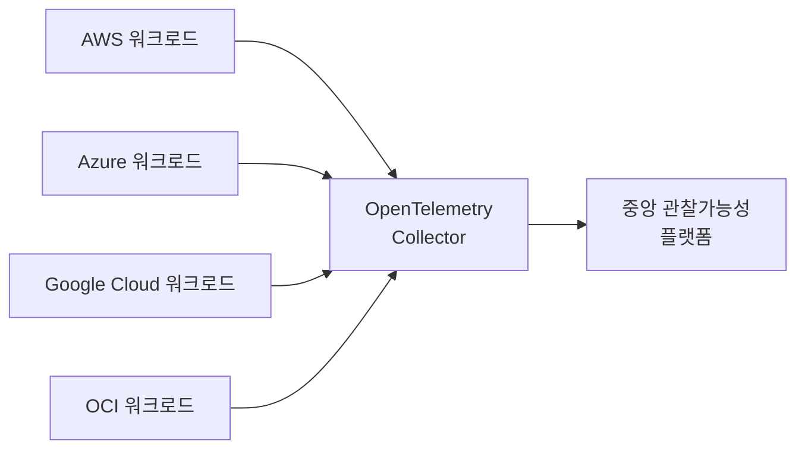
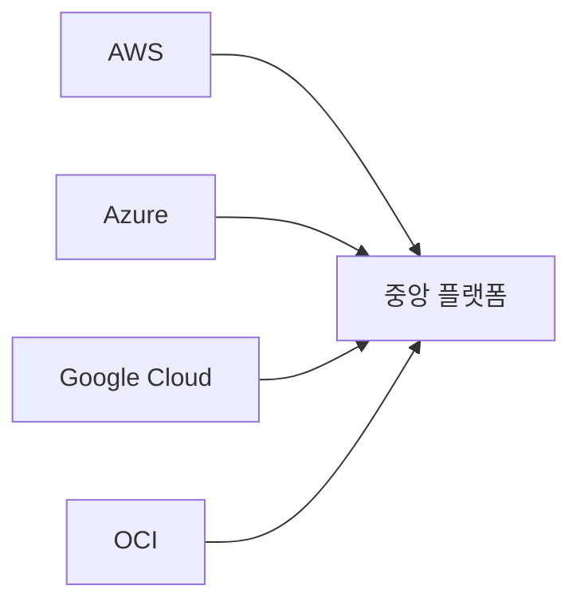
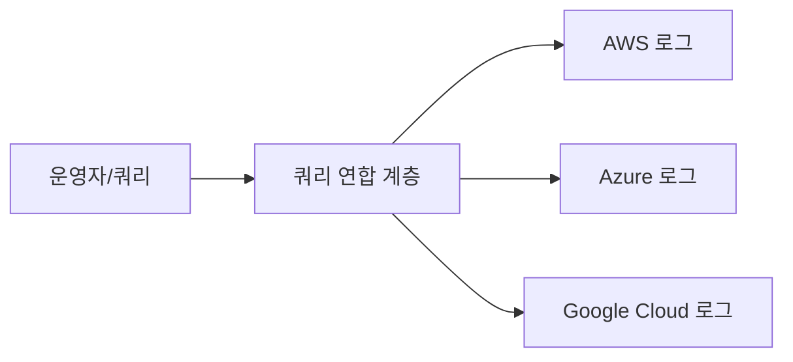

# 통합 관찰가능성 아키텍처

> 문서 기준: 2026년 5월


단일 클라우드 모니터링 기초는 [모니터링](monitoring.md)을 참고하세요. SLI/SLO/SLA 개념은 [SLI/SLO와 에러 버짓](slo.md)에서 다루고 있습니다. 이 문서는 **멀티클라우드 환경에서 어떻게 관찰가능성을 통합하는가** 에 초점을 맞춥니다.


## 왜 통합이 문제인가

멀티클라우드 환경에서는 각 벤더가 자체 관찰가능성 도구를 제공합니다.

| 벤더 | 로그 | 메트릭 | 트레이스 |
| --- | --- | --- | --- |
| AWS | CloudWatch Logs | CloudWatch Metrics | X-Ray |
| Azure | Azure Monitor Logs | Azure Monitor Metrics | Application Insights |
| Google Cloud | Cloud Logging | Cloud Monitoring | Cloud Trace |
| OCI | OCI Logging | OCI Monitoring | OCI APM |

이 도구들을 각각 운영하면:

- **사일로** — 한 요청이 여러 클라우드를 거치면 전체 흐름을 추적하기 어려움
- **중복 비용** — 각 플랫폼 라이선스, 저장소, 교육 비용
- **일관성 부족** — 대시보드와 알림이 분산되어 운영 팀 혼란
- **벤더 종속** — 특정 도구에 깊이 의존하면 전환 비용 증가

## OpenTelemetry 표준

[OpenTelemetry](https://opentelemetry.io/)는 CNCF 프로젝트로 **벤더 중립적인 관찰가능성 표준** 을 제공합니다. 로그/메트릭/트레이스를 통일된 방식으로 수집합니다.

- **Language SDK** — 주요 언어(Java, Python, Go, JavaScript, .NET 등)용 계측 라이브러리
- **Collector** — 데이터를 수집·가공·전송하는 에이전트
- **Semantic Conventions** — 속성명/형식 표준 (예: `http.method`, `service.name`)

벤더 공식 지원:

- [AWS Distro for OpenTelemetry (ADOT)](https://aws-otel.github.io/)
- [Azure Monitor OpenTelemetry](https://learn.microsoft.com/azure/azure-monitor/app/opentelemetry-overview)
- [Google Cloud OpenTelemetry](https://cloud.google.com/stackdriver/docs/instrumentation/overview)
- [OCI OpenTelemetry 지원](https://docs.oracle.com/en-us/iaas/application-performance-monitoring/doc/configure-open-source-tracing-systems.html)

## 통합 패턴

### 1. Fan-in (중앙 집계)

각 클라우드 워크로드의 데이터를 하나의 중앙 플랫폼으로 보냅니다.

- **장점** — 단일 대시보드, 교차 클라우드 상관관계 분석
- **단점** — 중앙 플랫폼이 단일 장애점, 데이터 이동 비용
- **사용** — 일반적인 멀티클라우드 운영 조직

### 2. Fan-out (쿼리 연합)

각 클라우드에 데이터를 유지하고, 조회 시점에 여러 소스에 동시 쿼리합니다.

- **장점** — 데이터 이동 없음, 이그레스 비용 절감
- **단점** — 쿼리 지연, 연합 엔진 필요
- **사용** — 데이터 주권 요건이 엄격한 경우 (Grafana 같은 도구가 지원)

### 3. 하이브리드

중요 메트릭만 중앙 집계, 상세 로그는 원위치 유지.

## 3rd Party 플랫폼 비교

대부분의 조직은 여러 클라우드에서 관찰가능성을 통합하기 위해 3rd party 플랫폼을 사용합니다.

| 플랫폼 | 특징 | 참고 |
| --- | --- | --- |
| [Datadog](https://www.datadoghq.com/) | 통합 대시보드, 광범위한 통합, APM 강점 | SaaS 위주 |
| [New Relic](https://newrelic.com/) | 전체 스택 APM, 사용량 기반 가격 | SaaS |
| [Dynatrace](https://www.dynatrace.com/) | AI 기반 자동 이상 탐지 (Davis AI) | 엔터프라이즈 |
| [Splunk](https://www.splunk.com/) | 로그 분석 강점, 보안 분석(SIEM) 통합 | 엔터프라이즈 |
| [Elastic Observability](https://www.elastic.co/observability) | 오픈소스 기반, 유연한 배포 | 셀프 호스팅 가능 |
| [Grafana Cloud](https://grafana.com/products/cloud/) | Prometheus/Loki/Tempo 관리형 | OpenTelemetry 친화적 |

## 자체 구축 스택

클라우드 이식성과 비용 제어가 중요하다면 오픈소스 스택을 직접 구축할 수 있습니다.

| 영역 | 오픈소스 |
| --- | --- |
| 메트릭 | [Prometheus](https://prometheus.io/), [Thanos](https://thanos.io/), [VictoriaMetrics](https://victoriametrics.com/) |
| 로그 | [Elasticsearch/OpenSearch](https://opensearch.org/), [Loki](https://grafana.com/oss/loki/) |
| 트레이스 | [Jaeger](https://www.jaegertracing.io/), [Tempo](https://grafana.com/oss/tempo/) |
| 대시보드 | [Grafana](https://grafana.com/) |
| 수집기 | [OpenTelemetry Collector](https://opentelemetry.io/docs/collector/), [Fluent Bit](https://fluentbit.io/) |

CNCF의 [Cloud Native Landscape — Observability](https://landscape.cncf.io/guide#observability-and-analysis)에 전체 생태계가 정리되어 있습니다.

## 비용 고려사항

관찰가능성 비용은 보통 **수집량(GB)** 과 **보존 기간(일)** 에 비례합니다. 멀티클라우드에서는 이그레스 비용까지 고려해야 합니다.

### 주요 비용 요인

- **로그 수집량** — 애플리케이션 로그 레벨(DEBUG vs ERROR)에 따라 10배 차이
- **메트릭 카디널리티** — 태그 조합이 많을수록 저장 비용 증가 (예: 사용자 ID별 메트릭)
- **트레이스 샘플링** — 전체 트레이스의 1~10%만 저장해도 분석 가능
- **크로스 클라우드 이그레스** — Fan-in 패턴 시 매월 수 TB의 데이터가 이동

### 비용 절감 전략

- **샘플링** — 트레이스는 대표성만 유지
- **압축/계층화** — 오래된 로그는 저렴한 스토리지로 이동
- **필터링** — 수집 단계에서 불필요한 로그 제거
- **집계** — 원시 로그 대신 집계된 메트릭만 중앙 전송
- **리전 내 처리** — 가능하면 리전 내에서 집계 후 메트릭만 전송

## 멀티클라우드 통합 모니터링 (Single Pane of Glass)

AWS CloudWatch, Azure Monitor, Google Cloud Cloud Monitoring을 각각 보는 것은 비효율적입니다. 멀티클라우드 환경에서는 **한 곳에서 모든 클라우드의 상태를 볼 수 있는 통합 대시보드**가 필요합니다.

| 접근 방식 | 설명 | 도구 |
| --- | --- | --- |
| **OpenTelemetry 표준화** | 벤더 중립 계측 → 단일 백엔드로 수집 | OTel Collector + Grafana/Datadog |
| **서드파티 통합 플랫폼** | 모든 벤더의 메트릭/로그를 하나의 SaaS로 | Datadog, New Relic, Dynatrace, Splunk |
| **오픈소스 스택** | 자체 운영, 벤더 종속 없음 | Prometheus + Grafana + Loki + Tempo |

**통합 모니터링 구성 시 고려사항:**

- 각 벤더의 네이티브 메트릭을 OTel 또는 Prometheus 형식으로 변환
- 알림을 단일 채널(PagerDuty, Opsgenie)로 라우팅
- 대시보드에서 벤더별 필터링 가능하도록 태그/라벨 표준화
- 비용: 서드파티 SaaS는 데이터 수집량 기반 과금이므로 로그 볼륨 관리 필요

## 구현 체크리스트

멀티클라우드 관찰가능성 도입 시 확인할 항목:

- [ ] OpenTelemetry 표준을 사용하여 벤더 종속 계측 피하기
- [ ] `service.name`, `environment` 등 공통 태그 규약 정의
- [ ] 트레이스 샘플링 정책 설정 (헤드 샘플링 / 테일 샘플링)
- [ ] 로그 레벨별 수집/보존 정책 수립 (예: ERROR 90일, INFO 7일)
- [ ] 클라우드 네이티브 메트릭(CPU, 네트워크)은 벤더 도구 유지
- [ ] 애플리케이션 메트릭/트레이스는 중앙 플랫폼으로 통합
- [ ] SLO 정의와 에러 버짓 대시보드 구성 ([SLI/SLO와 에러 버짓](slo.md) 참고)
- [ ] 알림 라우팅 표준화 (PagerDuty, Opsgenie 등 단일 통합)
- [ ] 비용 모니터링 (관찰가능성 플랫폼 자체 비용)

## 지속적으로 해야 할 것

- **대시보드/알림 정기 리뷰** — 분기마다 대시보드가 현재 아키텍처를 반영하는지 확인합니다.
- **알림 노이즈 제거** — 무시되는 알림은 제거하거나 임계치를 조정합니다. 알림 피로는 실제 장애를 놓치게 합니다.
- **SLO 기반 알림 튜닝** — 에러 버짓 소진 속도 기반 알림으로 전환하면 노이즈가 줄어듭니다.

## 관련 문서

- [모니터링](monitoring.md)
- [SLI/SLO](slo.md)
- [플랫폼 엔지니어링](platform-engineering.md)
- [보안 태세 관리](../security/security-posture.md)

## 참고하기

### 표준 및 오픈소스

- [OpenTelemetry 공식 문서](https://opentelemetry.io/docs/)
- [CNCF Observability TAG](https://github.com/cncf/tag-observability)
- [Cloud Native Observability Landscape](https://landscape.cncf.io/guide#observability-and-analysis)

### AWS

- [AWS Distro for OpenTelemetry (ADOT)](https://aws-otel.github.io/)
- [CloudWatch 문서](https://docs.aws.amazon.com/AmazonCloudWatch/latest/monitoring/)
- [AWS X-Ray 문서](https://docs.aws.amazon.com/xray/)

### Azure

- [Azure Monitor OpenTelemetry](https://learn.microsoft.com/azure/azure-monitor/app/opentelemetry-overview)
- [Application Insights 문서](https://learn.microsoft.com/azure/azure-monitor/app/app-insights-overview)
- [Azure Monitor 문서](https://learn.microsoft.com/azure/azure-monitor/)

### Google Cloud

- [Google Cloud OpenTelemetry](https://cloud.google.com/stackdriver/docs/instrumentation/overview)
- [Cloud Logging 문서](https://cloud.google.com/logging/docs)
- [Cloud Monitoring 문서](https://cloud.google.com/monitoring/docs)
- [Cloud Trace 문서](https://cloud.google.com/trace/docs)

### OCI

- [OCI APM OpenTelemetry](https://docs.oracle.com/en-us/iaas/application-performance-monitoring/doc/configure-open-source-tracing-systems.html)
- [OCI Logging 문서](https://docs.oracle.com/en-us/iaas/Content/Logging/home.htm)
- [OCI Monitoring 문서](https://docs.oracle.com/en-us/iaas/Content/Monitoring/home.htm)
