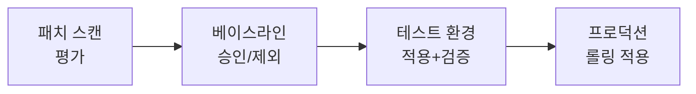
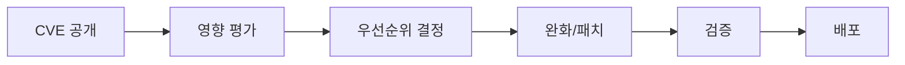

# 패치 관리와 취약점 대응

> 문서 기준: 2026년 5월

## 개요

클라우드 인프라를 운영하면 두 가지 보안 과제가 반복됩니다.

1. **주기적 패치** — OS, 런타임, 미들웨어의 보안 업데이트를 정기적으로 적용
2. **취약점 대응** — CVE가 공개되었을 때 영향 범위를 파악하고 긴급 패치 또는 완화 조치 수행

이 두 가지는 별개 프로세스이지만, 도구와 파이프라인이 겹치므로 함께 다룹니다.

## 주기적 패치 관리

### 벤더별 패치 관리 서비스

| 벤더 | 서비스 | 대상 | 특징 |
| --- | --- | --- | --- |
| AWS | [Systems Manager Patch Manager](https://docs.aws.amazon.com/systems-manager/latest/userguide/systems-manager-patch.html) | EC2 (Linux/Windows) | 패치 베이스라인 정의, 유지보수 윈도우 스케줄링, 규정 준수 리포트 |
| Azure | [Azure Update Manager](https://learn.microsoft.com/azure/update-manager/overview) | VM (Linux/Windows), Arc 연결 서버 | 에이전트리스 평가, 스케줄 패치, 사전/사후 스크립트 |
| GCP | [OS Patch Management](https://cloud.google.com/compute/docs/os-patch-management) | Compute Engine (Linux/Windows) | 패치 작업(Patch Job) + 패치 배포(Patch Deployment) |
| OCI | [OS Management Hub](https://docs.oracle.com/en-us/iaas/osmh/doc/home.htm) | Compute (Oracle Linux/Windows) | 패키지 관리, 예약 작업, 규정 준수 보고 |

### 패치 프로세스

1. **스캔/평가** — 현재 인스턴스에 누락된 패치 목록 확인
2. **베이스라인 정의** — 자동 승인할 패치 분류(Critical, Security 등)와 제외 목록 설정
3. **테스트 적용** — 비프로덕션 환경에 먼저 적용하여 호환성 검증
4. **프로덕션 롤링** — 유지보수 윈도우 내에서 그룹별 순차 적용. 실패 시 중단

### 패치 전략

| 전략 | 설명 | 적합한 환경 |
| --- | --- | --- |
| **Immutable Infrastructure** | 패치된 새 AMI/이미지로 인스턴스 교체 | 컨테이너, Auto Scaling 그룹, 서버리스 |
| **In-place Patching** | 실행 중인 인스턴스에 직접 패치 적용 | 상태 유지 서버(DB, 레거시 앱) |
| **Blue-Green** | 패치된 새 환경을 준비 후 트래픽 전환 | 다운타임 최소화 필요 시 |


**Immutable Infrastructure가 가능하면 우선 선택하세요.** 패치 적용 = 새 이미지 빌드 + 배포이므로, 패치 상태가 항상 일관되고 롤백이 쉽습니다. 컨테이너 환경에서는 베이스 이미지 업데이트 + 재배포가 이에 해당합니다. 이미지 빌드 시 보안 스캔을 자동화하려면 [DevSecOps](devsecops.md)를 참고하세요.


## 취약점 탐지 및 대응

### 벤더별 취약점 스캐닝 서비스

이 서비스들은 [보안 태세 관리](../security/security-posture.md)의 CWPP 영역과 겹칩니다. 여기서는 패치 대응 관점에서 다룹니다.

| 벤더 | 서비스 | 스캔 대상 | 특징 |
| --- | --- | --- | --- |
| AWS | [Amazon Inspector](https://docs.aws.amazon.com/inspector/latest/user/what-is-inspector.html) | EC2, ECR 이미지, Lambda | 에이전트리스 자동 스캔. CVE + 네트워크 도달성 분석 |
| Azure | [Microsoft Defender for Cloud](https://learn.microsoft.com/azure/defender-for-cloud/defender-for-cloud-introduction) | VM, 컨테이너, App Service, DB | CSPM + CWPP 통합. 취약점 평가 + 보안 권장사항 |
| GCP | [Security Command Center](https://cloud.google.com/security-command-center/docs) + [Artifact Analysis](https://cloud.google.com/artifact-analysis/docs) | Compute Engine, GKE, Artifact Registry | 취약점 + 구성 오류 + 위협 탐지 통합 |
| OCI | [Vulnerability Scanning](https://docs.oracle.com/en-us/iaas/scanning/home.htm) | Compute, Container Registry | 에이전트 기반 호스트 스캔 + 컨테이너 이미지 스캔 |

### 컨테이너 이미지 취약점 스캔

컨테이너 환경에서는 이미지 빌드 시점에 취약점을 탐지하는 것이 핵심입니다.

| 벤더 | 레지스트리 스캔 | CI/CD 통합 |
| --- | --- | --- |
| AWS | ECR 이미지 스캔 (Inspector 연동) | CodeBuild/CodePipeline에서 자동 스캔 |
| Azure | Defender for Containers (ACR 스캔) | Azure DevOps/GitHub Actions 연동 |
| GCP | Artifact Analysis (Artifact Registry) | Cloud Build 트리거에서 자동 스캔 |
| OCI | Container Registry 스캔 | DevOps 서비스 파이프라인 연동 |

### 취약점 대응 프로세스

| 단계 | 활동 | 도구 예시 |
| --- | --- | --- |
| **탐지** | 취약점 스캐너가 CVE 매칭 | Inspector, Defender, SCC |
| **영향 평가** | CVSS 점수 + 실제 노출 여부 (네트워크 도달성, 런타임 사용 여부) | Inspector 네트워크 도달성, Defender 공격 경로 분석 |
| **우선순위** | Critical + 외부 노출 = 즉시 대응. Low + 내부만 = 다음 정기 패치 | CVSS + EPSS + 비즈니스 영향도 |
| **완화** | 패치 전 임시 조치 (WAF 규칙, 네트워크 격리, 기능 비활성화) | WAF, Security Group, Feature Flag |
| **패치 적용** | 정기 패치 프로세스 또는 긴급 핫픽스 | Patch Manager, 이미지 재빌드 |
| **검증** | 패치 후 취약점 재스캔 + 서비스 정상 동작 확인 | 재스캔 + 스모크 테스트 |

### 긴급 취약점 (Zero-Day) 대응

정기 패치 주기를 기다릴 수 없는 긴급 상황의 대응 체계입니다.

| 단계 | 활동 |
| --- | --- |
| **1. 알림 수신** | 벤더 보안 공지, CVE 피드, 보안 뉴스 모니터링 |
| **2. 영향 범위 파악** | 취약 패키지/버전을 사용하는 리소스 목록 즉시 조회 (SBOM 활용) |
| **3. 즉시 완화** | 네트워크 격리, WAF 가상 패치, 취약 기능 비활성화 |
| **4. 긴급 패치** | 벤더 패치 릴리스 즉시 적용 (테스트 축소 허용, 단 롤백 준비) |
| **5. 사후 검증** | 전체 환경 재스캔, 침해 흔적(IOC) 확인 |


**SBOM (Software Bill of Materials)** 을 미리 관리하면 긴급 취약점 발생 시 영향 범위를 수 분 내에 파악할 수 있습니다. AWS Inspector, GCP Artifact Analysis는 SBOM 자동 생성을 지원합니다.


## 자동화 모범 사례

- **골든 이미지 파이프라인** — 패치된 베이스 이미지를 주기적으로 빌드하고, 모든 인스턴스/컨테이너가 이를 기반으로 배포
- **규정 준수 대시보드** — 패치 미적용 인스턴스 비율을 실시간 모니터링 (목표: 95% 이상 준수)
- **SLA 기반 패치 기한** — Critical: 72시간 내, High: 7일 내, Medium: 30일 내 (조직 정책에 따라 조정)
- **자동 티켓 생성** — 취약점 탐지 시 Jira/ServiceNow 티켓 자동 생성으로 추적
- **정기 리포트** — 월간 패치 준수율, 평균 패치 적용 시간(MTTP), 미해결 취약점 추이

## 참고하기

- [AWS Systems Manager Patch Manager](https://docs.aws.amazon.com/systems-manager/latest/userguide/systems-manager-patch.html)
- [Amazon Inspector](https://docs.aws.amazon.com/inspector/latest/user/what-is-inspector.html)
- [Azure Update Manager](https://learn.microsoft.com/azure/update-manager/overview)
- [Microsoft Defender for Cloud](https://learn.microsoft.com/azure/defender-for-cloud/)
- [GCP OS Patch Management](https://cloud.google.com/compute/docs/os-patch-management)
- [GCP Security Command Center](https://cloud.google.com/security-command-center/docs)
- [OCI OS Management Hub](https://docs.oracle.com/en-us/iaas/osmh/doc/home.htm)
- [OCI Vulnerability Scanning](https://docs.oracle.com/en-us/iaas/scanning/home.htm)
- [NIST Vulnerability Database (NVD)](https://nvd.nist.gov/)
- [FIRST EPSS (Exploit Prediction Scoring System)](https://www.first.org/epss/)
