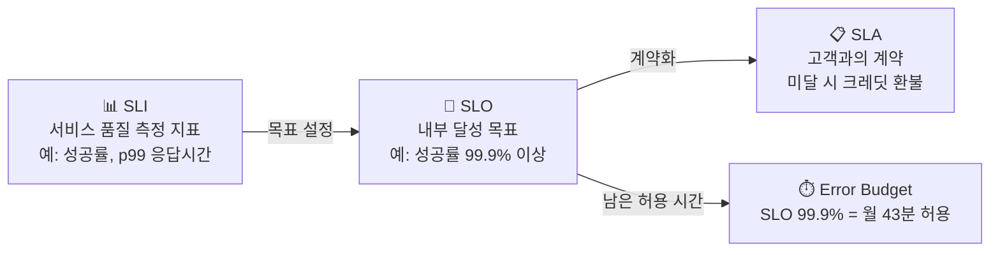

# SLI/SLO와 에러 버짓

> 문서 기준: 2026년 5월

## 개요

DevOps/SRE에서 "서비스가 충분히 안정적인가?"를 체계적으로 정의하는 프레임워크가 SLI/SLO/SLA입니다.

| 용어 | 정의 | 예시 |
| --- | --- | --- |
| **SLI** (Service Level Indicator) | 서비스 품질을 측정하는 지표 | 요청 성공률, 응답 시간 p99, 가용 시간 비율 |
| **SLO** (Service Level Objective) | SLI에 대한 내부 목표값 | "월간 요청 성공률 99.9% 이상" |
| **SLA** (Service Level Agreement) | 고객과의 계약. SLO 미달 시 보상 포함 | "가용성 99.95% 미달 시 크레딧 환불" |

관계: **SLI**(측정) → **SLO**(목표) → **SLA**(계약)

## 에러 버짓 (Error Budget)

SLO 99.9%는 "한 달에 약 43분의 장애가 허용된다"는 의미입니다. 이 허용 시간을 **에러 버짓**이라 합니다.

| SLO | 월간 허용 장애 시간 | 연간 허용 장애 시간 |
| --- | --- | --- |
| 99% | 7시간 18분 | 3일 15시간 |
| 99.9% | 43분 | 8시간 46분 |
| 99.95% | 21분 | 4시간 23분 |
| 99.99% | 4분 | 52분 |

에러 버짓이 중요한 이유:

- **배포 속도와 안정성의 균형** — 에러 버짓이 남아있으면 새 기능을 배포할 수 있고, 소진되면 안정화에 집중합니다.
- **팀 간 갈등 해소** — "더 빨리 배포하자" vs "더 안정적으로 운영하자"의 갈등을 데이터로 해결합니다.
- **투자 판단 기준** — 99.9% → 99.99%로 올리려면 비용이 10배 이상 증가할 수 있습니다. 비즈니스 요구에 맞는 적정 수준을 선택해야 합니다.

## SLO 설정 5단계

1. **SLI 선정** — 사용자 경험에 직접 영향을 주는 지표를 선택합니다 (예: API 응답 시간 p99, 에러율, 가용성).
2. **현재 수준 측정** — 최근 30일간의 실제 SLI를 측정합니다.
3. **SLO 설정** — 현재 수준보다 약간 높게 설정합니다. 처음부터 99.99%를 목표로 하지 마세요.
4. **에러 버짓 모니터링** — 에러 버짓 소진율을 대시보드에 표시하고, 소진 속도가 빠르면 알림을 보냅니다.
5. **에러 버짓 정책 수립** — 버짓 소진 시 배포 동결, 안정화 스프린트 등의 정책을 사전에 합의합니다.


**참고:** Google의 SRE 책 [Site Reliability Engineering](https://sre.google/sre-book/table-of-contents/)에서 SLI/SLO/에러 버짓 개념이 체계화되었습니다.


## CSP SLA ≠ 내 서비스 SLA

"CSP가 99.99% SLA를 주니까 내 서비스도 99.99%겠지"는 흔한 오해입니다.

| 구분 | CSP SLA | 내 서비스 SLA |
| --- | --- | --- |
| **대상** | 개별 컴포넌트 (EC2, RDS, S3 등) | 엔드 유저가 경험하는 전체 서비스 |
| **범위** | "이 컴포넌트가 죽지 않겠다" | "사용자가 정상 응답을 받겠다" |
| **계산** | 벤더가 보장 | 내가 아키텍처로 달성 |
| **보상** | SLA 미달 시 크레딧 환불 | 고객 이탈, 계약 위반 |

### 직렬 구성의 가용성 곱셈

서비스가 LB → App → DB → Cache를 거치면:

> 99.99% × 99.95% × 99.9% × 99.99% = **약 99.83%** (연간 약 15시간 다운)

CSP가 각각 99.9%+ 를 보장해도, 엮으면 떨어집니다.

### 가용성을 높이는 방법

| 패턴 | 효과 | 예시 |
| --- | --- | --- |
| 병렬 이중화 (Active-Active) | 1 - (1-A)² | 멀티 AZ, 리전 이중화 |
| 서킷 브레이커 / 폴백 | 의존성 장애 격리 | 캐시 실패 시 DB 직접 조회 |
| 비동기 처리 | 동기 의존성 제거 | 메시지 큐로 분리 |
| 그레이스풀 디그레이데이션 | 일부 기능만 중단 | 추천 실패 시 기본 목록 표시 |

### SLO > SLA (에러 버짓 활용)

- 고객에게 약속하는 SLA: 99.9% (연간 8.7시간)
- 내부 목표 SLO: 99.95% (연간 4.4시간)
- 차이 = 에러 버짓 → 배포, 실험, 유지보수에 사용
- SLO를 SLA와 같게 잡으면 에러 버짓이 0 → 아무것도 못 함

## 자주 하는 실수

- **SLO를 SLA와 동일하게 설정** — 에러 버짓이 0이 되어 배포도, 실험도 할 수 없습니다. SLO는 SLA보다 높게 설정하여 여유를 확보하세요.
- **서버 메트릭(CPU, 메모리)을 SLI로 사용** — 사용자 경험과 직접 연결되지 않습니다. 요청 성공률, 응답 시간 p99 등 사용자 관점 지표를 선택하세요.
- **처음부터 99.99%를 목표로 설정** — 달성 비용이 기하급수적으로 증가합니다. 현재 수준을 측정한 뒤 점진적으로 올리세요.

## 체크리스트

- [ ] SLI가 사용자 경험에 직접 영향을 주는 지표(성공률, 지연 시간)로 정의되어 있는가?
- [ ] 에러 버짓 소진율을 실시간 대시보드에서 확인할 수 있는가?
- [ ] 에러 버짓 소진 시 배포 동결 등의 정책이 팀 간 사전 합의되어 있는가?

## 참고하기

- [Google SRE Book — Service Level Objectives](https://sre.google/sre-book/service-level-objectives/)
- [DORA Metrics](https://dora.dev/)
- [OpenSLO Specification](https://openslo.com/)
