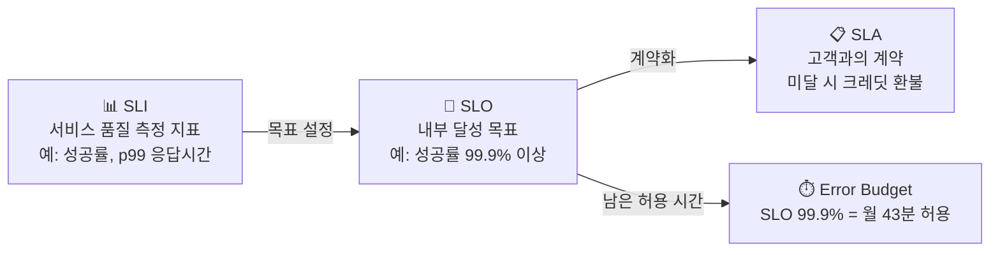

# SLI/SLO와 에러 버짓

> 문서 기준: 2026년 5월

## 개요

DevOps/SRE에서 "서비스가 충분히 안정적인가?"를 체계적으로 정의하는 프레임워크가 SLI/SLO/SLA입니다.

| 용어 | 정의 | 예시 |
| --- | --- | --- |
| **SLI** (Service Level Indicator) | 서비스 품질을 측정하는 지표 | 요청 성공률, 응답 시간 p99, 가용 시간 비율 |
| **SLO** (Service Level Objective) | SLI에 대한 내부 목표값 | "월간 요청 성공률 99.9% 이상" |
| **SLA** (Service Level Agreement) | 고객과의 계약. SLO 미달 시 보상 포함 | "가용성 99.95% 미달 시 크레딧 환불" |

관계: **SLI**(측정) → **SLO**(목표) → **SLA**(계약)

## 에러 버짓 (Error Budget)

SLO 99.9%는 "한 달에 약 43분의 장애가 허용된다"는 의미입니다. 이 허용 시간을 **에러 버짓**이라 합니다.

| SLO | 월간 허용 장애 시간 | 연간 허용 장애 시간 |
| --- | --- | --- |
| 99% | 7시간 18분 | 3일 15시간 |
| 99.9% | 43분 | 8시간 46분 |
| 99.95% | 21분 | 4시간 23분 |
| 99.99% | 4분 | 52분 |

에러 버짓이 중요한 이유:

- **배포 속도와 안정성의 균형** — 에러 버짓이 남아있으면 새 기능을 배포할 수 있고, 소진되면 안정화에 집중합니다.
- **팀 간 갈등 해소** — "더 빨리 배포하자" vs "더 안정적으로 운영하자"의 갈등을 데이터로 해결합니다.
- **투자 판단 기준** — 99.9% → 99.99%로 올리려면 비용이 10배 이상 증가할 수 있습니다. 비즈니스 요구에 맞는 적정 수준을 선택해야 합니다.

## SLO 설정 5단계

1. **SLI 선정** — 사용자 경험에 직접 영향을 주는 지표를 선택합니다 (예: API 응답 시간 p99, 에러율, 가용성).
2. **현재 수준 측정** — 최근 30일간의 실제 SLI를 측정합니다.
3. **SLO 설정** — 현재 수준보다 약간 높게 설정합니다. 처음부터 99.99%를 목표로 하지 마세요.
4. **에러 버짓 모니터링** — 에러 버짓 소진율을 대시보드에 표시하고, 소진 속도가 빠르면 알림을 보냅니다.
5. **에러 버짓 정책 수립** — 버짓 소진 시 배포 동결, 안정화 스프린트 등의 정책을 사전에 합의합니다.


**참고:** Google의 SRE 책 [Site Reliability Engineering](https://sre.google/sre-book/table-of-contents/)에서 SLI/SLO/에러 버짓 개념이 체계화되었습니다.


## 참고하기

- [Google SRE Book — Service Level Objectives](https://sre.google/sre-book/service-level-objectives/)
- [DORA Metrics](https://dora.dev/)
- [OpenSLO Specification](https://openslo.com/)
