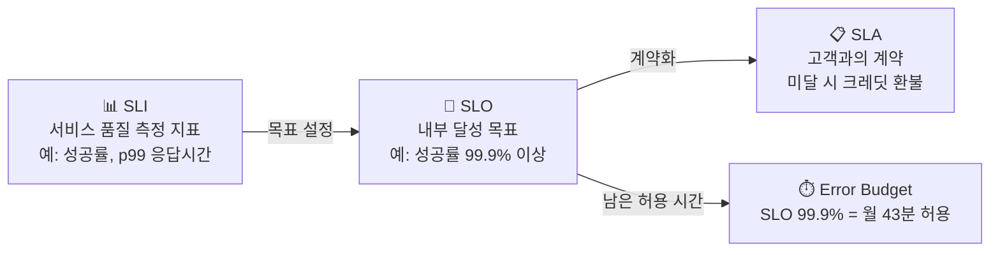

# DevOps란?

> 문서 기준: 2026년 5월

## 개요

전통적인 IT 조직에서는 개발팀(Dev)이 코드를 작성하고, 운영팀(Ops)이 서버를 관리합니다. 개발팀은 빠르게 기능을 출시하고 싶고, 운영팀은 안정성을 유지하고 싶어 충돌이 발생합니다. 배포는 수 주에 한 번, 장애가 나면 서로 책임을 미루는 구조입니다.

**DevOps**는 이 벽을 허무는 문화이자 실천 방법입니다. 개발자가 운영까지 전부 하는 것이 아니라, 개발과 운영이 **서로의 업무에 가시성을 갖고 협력**하여 더 빠르고 안정적으로 서비스를 제공하는 것입니다.

### DevOps가 아닌 것

- ❌ 개발자가 서버 관리까지 다 하는 것
- ❌ 특정 도구를 쓰면 DevOps인 것
- ❌ 팀 이름을 "DevOps팀"으로 바꾸는 것

### DevOps의 핵심 가치

- **자동화** — 반복 작업(빌드, 테스트, 배포, 인프라 구성)을 자동화하여 사람의 실수를 줄입니다.
- **가시성** — 개발자도 프로덕션 환경의 메트릭, 로그, 에러를 직접 볼 수 있어 문제를 빠르게 파악합니다.
- **피드백 루프** — 배포 후 사용자 반응과 시스템 상태를 빠르게 확인하고 개선합니다.
- **작은 단위 배포** — 큰 변경을 한 번에 배포하는 대신, 작은 변경을 자주 배포하여 위험을 줄입니다.

## 왜 클라우드에서 DevOps인가

온프레미스에서는 서버 구매에 수 주가 걸리고, 환경 구성이 수동이라 자동화가 어렵습니다. 클라우드는 DevOps를 실현하기 위한 최적의 환경입니다.

- **인프라를 코드로** — API로 인프라를 생성/삭제할 수 있어 IaC가 가능합니다.
- **환경 복제** — 프로덕션과 동일한 테스트 환경을 몇 분 안에 만들 수 있습니다.
- **관리형 서비스** — CI/CD, 모니터링, 로깅을 직접 구축하지 않아도 됩니다.
- **종량제** — 테스트 환경을 사용할 때만 켜고, 끝나면 삭제하여 비용을 절감합니다.

## GitOps

**GitOps**는 DevOps의 실천 방법 중 하나로, Git 저장소를 인프라와 애플리케이션의 **단일 진실 원천** (Single Source of Truth)으로 사용합니다. 특히 **Kubernetes 환경**에서 표준적인 배포 방식으로 자리잡았습니다. K8s의 선언형 매니페스트(YAML)와 GitOps의 "Git에 선언된 상태 = 클러스터 상태" 철학이 자연스럽게 맞기 때문입니다.

- 인프라/앱 변경 = Git에 커밋 → 에이전트가 감지 → 클러스터에 자동 반영
- 롤백 = Git 히스토리에서 이전 커밋으로 되돌리기
- 감사 = Git 로그가 곧 변경 이력
- 드리프트 감지 = 클러스터 상태가 Git과 다르면 자동 복구

| 도구 | 비고 |
| --- | --- |
| ArgoCD | Kubernetes GitOps. 가장 널리 사용 |
| Flux | CNCF 프로젝트. 경량 GitOps |
| AWS CodePipeline + GitSync | AWS 네이티브 |
| Azure GitOps (Flux 기반) | AKS에 내장 |
| GCP Config Sync | GKE에 내장 |

## 플랫폼 엔지니어링

DevOps가 성숙해지면, 개발자가 직접 인프라를 다루는 것이 오히려 부담이 됩니다. **플랫폼 엔지니어링**은 개발자가 셀프서비스로 인프라를 사용할 수 있도록 내부 플랫폼을 구축하는 것입니다.

- 개발자: "배포 버튼 하나로 프로덕션에 올리고 싶다"
- 플랫폼 팀: CI/CD, 모니터링, 보안을 추상화한 내부 플랫폼 제공

개발자는 본연의 업무(코드 작성)에 집중하고, 플랫폼 팀은 안전하고 효율적인 배포 경로를 제공합니다.

## 개발자가 운영에 참여하면 좋은 점

- **장애 대응 속도** — 코드를 작성한 사람이 로그를 보면 원인을 가장 빠르게 파악합니다.
- **설계 품질 향상** — 운영 부담을 직접 느끼면, 운영하기 쉬운 코드를 작성하게 됩니다.
- **피드백 속도** — 배포 후 메트릭을 직접 확인하면 개선 방향을 빠르게 잡을 수 있습니다.

## SLI, SLO, SLA — 신뢰성의 목표 설정

DevOps/SRE에서 "서비스가 충분히 안정적인가?"를 체계적으로 정의하는 프레임워크가 SLI/SLO/SLA입니다.

### 개념 정의

| 용어 | 정의 | 예시 |
| --- | --- | --- |
| **SLI** (Service Level Indicator) | 서비스 품질을 측정하는 지표 | 요청 성공률, 응답 시간 p99, 가용 시간 비율 |
| **SLO** (Service Level Objective) | SLI에 대한 내부 목표값 | "월간 요청 성공률 99.9% 이상" |
| **SLA** (Service Level Agreement) | 고객과의 계약. SLO 미달 시 보상 포함 | "가용성 99.95% 미달 시 크레딧 환불" |

관계: **SLI**(측정) → **SLO**(목표) → **SLA**(계약)

### 왜 장애 가능 시간(Error Budget)이 중요한가

SLO 99.9%는 "한 달에 약 43분의 장애가 허용된다"는 의미입니다. 이 허용 시간을 **에러 버짓** (Error Budget)이라 합니다.

| SLO | 월간 허용 장애 시간 | 연간 허용 장애 시간 |
| --- | --- | --- |
| 99% | 7시간 18분 | 3일 15시간 |
| 99.9% | 43분 | 8시간 46분 |
| 99.95% | 21분 | 4시간 23분 |
| 99.99% | 4분 | 52분 |

에러 버짓이 중요한 이유:

- **배포 속도와 안정성의 균형** — 에러 버짓이 남아있으면 새 기능을 배포할 수 있고, 소진되면 안정화에 집중합니다.
- **팀 간 갈등 해소** — "더 빨리 배포하자" vs "더 안정적으로 운영하자"의 갈등을 데이터로 해결합니다.
- **투자 판단 기준** — 99.9% → 99.99%로 올리려면 비용이 10배 이상 증가할 수 있습니다. 비즈니스 요구에 맞는 적정 수준을 선택해야 합니다.

### SLO를 목표로 삼는 방법

1. **SLI 선정** — 사용자 경험에 직접 영향을 주는 지표를 선택합니다 (예: API 응답 시간 p99, 에러율, 가용성).
2. **현재 수준 측정** — 최근 30일간의 실제 SLI를 측정합니다.
3. **SLO 설정** — 현재 수준보다 약간 높게 설정합니다. 처음부터 99.99%를 목표로 하지 마세요.
4. **에러 버짓 모니터링** — 에러 버짓 소진율을 대시보드에 표시하고, 소진 속도가 빠르면 알림을 보냅니다.
5. **에러 버짓 정책 수립** — 버짓 소진 시 배포 동결, 안정화 스프린트 등의 정책을 사전에 합의합니다.


**참고:** Google의 SRE 책 [Site Reliability Engineering](https://sre.google/sre-book/table-of-contents/)에서 SLI/SLO/에러 버짓 개념이 체계화되었습니다.


## 참고하기

- [AWS DevOps 가이드](https://docs.aws.amazon.com/ko_kr/whitepapers/latest/introduction-devops-aws/introduction-devops-aws.html)
- [Azure DevOps 소개](https://learn.microsoft.com/ko-kr/devops/what-is-devops)
- [Google Cloud DevOps](https://cloud.google.com/devops)
- [DORA Metrics (DevOps Research and Assessment)](https://dora.dev/)
- [Platform Engineering 가이드](https://platformengineering.org/)
