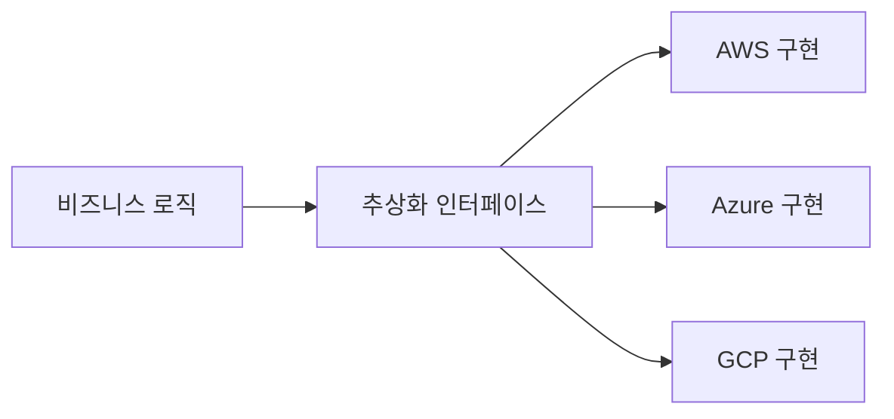

# 벤더 종속성과 출구 전략

> 문서 기준: 2026년 5월

## 왜 출구 전략이 필요한가

단일 벤더 깊이 통합할수록 **가격 협상력이 줄어들고**, 벤더의 정책 변경(가격 인상, 서비스 단종, 지역 철수)에 취약해집니다. 유럽연합의 Digital Operational Resilience Act(DORA), 한국의 전자금융감독규정 등은 금융권에 **Exit Plan 문서화** 를 의무화하고 있습니다.

중요한 오해:


**"종속성 0%"는 비현실적이며, 종종 비생산적입니다.** 관리형 서비스의 이점(운영 부담 감소, 보안 자동화, 높은 가용성)을 포기하면서까지 완전한 포터빌리티를 추구하면 오히려 경쟁력이 떨어집니다. 목표는 **종속성 제거가 아니라 "수용 가능한 수준의 종속성"을 선택하는 것** 입니다.


[AWS Prescriptive Guidance](https://docs.aws.amazon.com/prescriptive-guidance/latest/strategy-multicloud-fsi/vendor-lockin.html)도 같은 입장을 명시합니다: *"종속성 방지는 기술 결정보다 조직의 인력·프로세스에 더 의존합니다"*.

## 종속성의 4가지 양상

| 양상 | 설명 | 예시 |
| --- | --- | --- |
| **데이터 종속성** | 데이터 형식, 저장소, 이그레스 비용 | S3-only 포맷, Cosmos DB 전용 API, 페타바이트급 데이터의 이그레스 |
| **API 종속성** | 특정 벤더 SDK/API에 맞춰진 코드 | Lambda 이벤트 객체, Azure Durable Functions 상태 관리 |
| **아키텍처 종속성** | 벤더 고유 서비스에 기반한 설계 | Step Functions 워크플로우, Cosmos DB 전용 기능 |
| **운영 종속성** | 팀 역량과 도구 체인의 편중 | CloudFormation만 쓰는 팀, Azure DevOps 파이프라인 |

## 종속성 레벨과 트레이드오프

서비스마다 종속성 정도가 다릅니다. 일반적으로 **하위 계층(IaaS)일수록 낮고, 상위 계층(관리형 서비스)일수록 높습니다.**

| 수준 | 종속성 | 이식성 | 관리 부담 | 대표 예시 |
| --- | --- | --- | --- | --- |
| **IaaS (VM)** | 낮음 | 높음 | 높음 | EC2, Azure VM, Compute Engine |
| **컨테이너 (Kubernetes)** | 매우 낮음 | 매우 높음 | 중간 | EKS/AKS/GKE/OKE |
| **오픈소스 관리형** | 중간 | 중간 | 낮음 | PostgreSQL/Valkey/Kafka 관리형 |
| **클라우드 네이티브 PaaS** | 높음 | 낮음 | 매우 낮음 | Aurora, Cosmos DB, BigQuery |
| **서버리스 (FaaS)** | 매우 높음 | 매우 낮음 | 매우 낮음 | Lambda, Azure Functions, Cloud Run |

선택은 **"관리 부담 절감 vs 이식성 확보"** 의 절충입니다. 대부분의 조직은 한 지점에 몰리지 않고, 워크로드 특성에 따라 여러 지점을 혼용합니다.

## 포터빌리티를 위한 설계 원칙

### 1. 표준 오픈소스 우선

가능한 곳에서는 **업계 표준 오픈소스 인터페이스** 를 선택합니다.

| 카테고리 | 이식성 높은 선택 | 이식성 낮은 선택 |
| --- | --- | --- |
| 컨테이너 오케스트레이션 | Kubernetes (EKS/AKS/GKE/OKE) | ECS, Service Fabric |
| 관계형 DB | PostgreSQL/MySQL 호환 (Aurora PostgreSQL, Cloud SQL) | Cosmos DB 독점 API, DynamoDB |
| 캐시 | Valkey/Redis 호환 (ElastiCache, Cache for Redis) | 벤더 독점 캐시 |
| 메시지 큐 | Kafka 호환 (MSK, Event Hubs for Kafka) | SQS, Service Bus |
| 컨테이너 이미지 | OCI 표준 이미지 (ECR, ACR, Artifact Registry) | 벤더 전용 배포 포맷 |
| 인증 | OIDC/SAML | 벤더 전용 SDK 인증 |

### 2. IaC로 인프라 정의

IaC는 포터빌리티의 기반입니다. Terraform은 멀티클라우드 정의를 하나의 도구로 관리할 수 있어 이식성이 가장 높습니다.

| 도구 | 멀티클라우드 지원 | 이식성 |
| --- | --- | --- |
| [Terraform / OpenTofu](https://www.terraform.io/) | 주요 벤더 + 3rd party | 매우 높음 |
| [Pulumi](https://www.pulumi.com/) | 주요 벤더 | 높음 |
| [Crossplane](https://www.crossplane.io/) | Kubernetes 기반 추상화 | 높음 |
| AWS CloudFormation | AWS 전용 | 낮음 |
| Azure Bicep / ARM | Azure 전용 | 낮음 |
| GCP Deployment Manager | GCP 전용 | 낮음 |
| OCI Resource Manager | OCI 전용 (Terraform 기반) | 중간 |


IaC 도구의 상세 비교는 [IaC](../devops/iac.md)를 참고하세요.


### 3. 추상화 계층

벤더 종속 코드가 애플리케이션 비즈니스 로직에 퍼지지 않도록 격리합니다.

대표적인 추상화 라이브러리/프레임워크:

- **스토리지**: Go Cloud Development Kit, Apache Libcloud
- **메시지**: CloudEvents (CNCF)
- **AI**: LangChain, LlamaIndex (LLM 추상화)
- **쿠버네티스**: Knative Serving, Dapr


추상화는 **"최소 공통 분모"** 를 강제하기 때문에 각 벤더 고유 기능을 쓰기 어려워지는 단점이 있습니다. 팀이 실제로 여러 벤더로 전환할 계획이 없다면 추상화 비용이 종속성 비용보다 클 수 있습니다.


### 4. 데이터 포터빌리티

- **표준 포맷** — Parquet, Avro, JSON, CSV
- **정기 백업을 중립 위치에 저장** — 다른 리전/벤더/온프레미스
- **이그레스 비용 인지** — 페타바이트급 데이터는 이그레스 비용이 수천만 원\~수억 원
- **오프라인 전송 활용** — [스토리지 마이그레이션](../storage/migration.md) 참고

## Exit 실행 계획

금융권/규제 산업에서 요구되는 Exit Plan의 일반적 구성요소:

### 1. 자산 인벤토리

- 워크로드, 데이터, 종속 서비스 목록
- 각 항목의 종속성 수준 (상/중/하)
- 이전 우선순위와 난이도

### 2. 트리거 시나리오

어떤 상황에서 Exit을 실행하는가:

- 벤더의 일방적 가격 인상 (계약상 상한 초과)
- 핵심 서비스 단종 공지
- 규제 변경으로 벤더 사용 제한
- 벤더의 보안 사고/신뢰 상실
- M&A로 인한 전략 변경

### 3. 이전 절차

- 타겟 환경 준비 (다른 벤더 또는 온프레미스)
- 데이터 이전 순서 (마이그레이션 파도, [애플리케이션 마이그레이션](../compute/migration.md) 참고)
- 듀얼 런 기간 (두 환경 병행)
- 레거시 종료 기준

### 4. 비용 추정

- 데이터 이그레스
- 마이그레이션 도구/인력
- 운영 중단 비용
- 신규 환경 구축

### 5. 정기 검증

- 연 1회 Exit Plan 검토
- 주요 아키텍처 변경 시 영향 분석
- 경쟁 벤더와의 PoC로 실제 이전 가능성 확인

## 참고하기

### AWS

- [AWS Prescriptive Guidance — Building a multicloud strategy (FSI)](https://docs.aws.amazon.com/prescriptive-guidance/latest/strategy-multicloud-fsi/welcome.html)
- [AWS Prescriptive Guidance — Vendor lock-in 고려](https://docs.aws.amazon.com/prescriptive-guidance/latest/strategy-multicloud-fsi/vendor-lockin.html)

### Azure

- [Microsoft EU Data Boundary](https://learn.microsoft.com/privacy/eudb/eu-data-boundary-learn)
- [Azure 서비스 종료 공지](https://azure.microsoft.com/updates/?status=retirement)

### GCP

- [Google Cloud Data Processing and Security Terms](https://cloud.google.com/terms/data-processing-addendum)
- [GCP 서비스 종료 공지](https://cloud.google.com/terms/deprecation)

### OCI

- [Oracle Cloud Hosting and Delivery Policies](https://www.oracle.com/corporate/contracts/cloud-services/)

### 표준 및 규정

- [CNCF Cloud Native Trail Map](https://landscape.cncf.io/)
- [EU DORA (Digital Operational Resilience Act)](https://www.eiopa.europa.eu/digital-operational-resilience-act-dora_en)
- [Martin Fowler — Strangler Fig Application](https://martinfowler.com/bliki/StranglerFigApplication.html)
