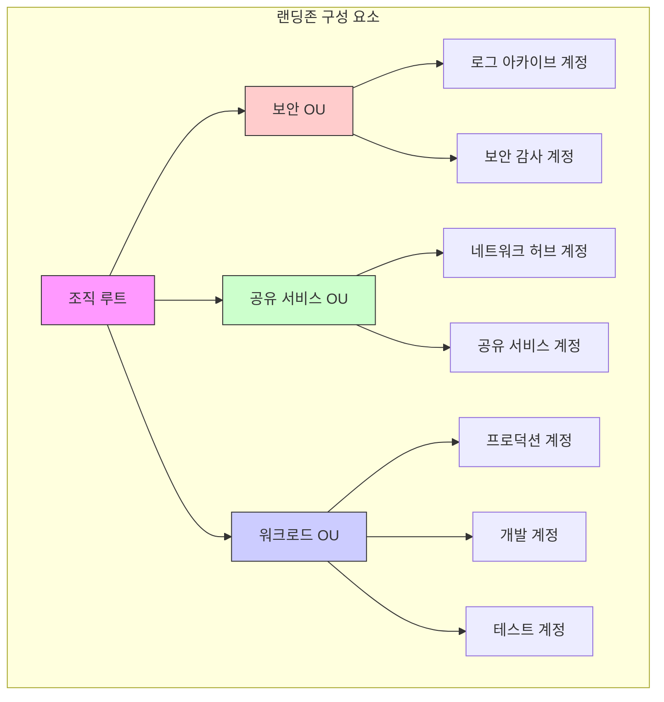

# 랜딩존

> 문서 기준: 2026년 5월

## 랜딩존이란

랜딩존(Landing Zone)은 멀티 계정 클라우드 환경을 안전하고 일관되게 운영하기 위한 기반 설정입니다. 일반적으로 다음 요소를 포함합니다:

- **네트워크**: 표준화된 VPC/VNet 구조, 허브-스포크 토폴로지, 연결 정책
- **보안**: 계정 간 보안 경계, 암호화 정책, 위협 탐지
- **로깅**: 중앙 집중식 로그 수집, 감사 추적, 규정 준수 증적
- **가드레일**: 예방적/탐지적 정책으로 조직 전체에 일관된 거버넌스 적용

랜딩존을 통해 새로운 워크로드 계정을 빠르고 안전하게 프로비저닝할 수 있으며, 조직의 보안·규정 준수 요구사항을 자동으로 적용할 수 있습니다.


랜딩존은 특정 제품 하나가 아니라 계정 구조, 네트워크, 보안, 로깅, 정책을 함께 설계한 운영 기반입니다.


## 주요 CSP 랜딩존 비교

| 항목 | AWS | Azure | GCP | OCI |
| --- | --- | --- | --- | --- |
| 서비스명 | [AWS Control Tower](https://aws.amazon.com/controltower/) | [Azure Landing Zone](https://learn.microsoft.com/en-us/azure/cloud-adoption-framework/ready/landing-zone/) | [GCP Foundation Toolkit](https://cloud.google.com/foundation-toolkit) | [OCI Landing Zone](https://docs.oracle.com/en/solutions/cis-oci-benchmark/) |
| 계정 구조 | AWS Organizations + OU | Management Group + Subscription | Organization + Folder + Project | Tenancy + Compartment |
| 가드레일 | Controls (예방적/탐지적/사전 예방적) | Azure Policy + Blueprints | Organization Policy | CIS Benchmark 기반 정책 |
| 네트워크 기본 구조 | VPC + Transit Gateway | Hub-Spoke VNet + Azure Firewall | Shared VPC + Cloud Interconnect | Hub-Spoke VCN + DRG |
| IaC 제공 | AWS CloudFormation (기본 내장) | Bicep / Terraform 모듈 | Terraform 모듈 | Terraform 모듈 |
| 로깅 | AWS CloudTrail + Config | Activity Log + Defender for Cloud | Cloud Audit Logs + Security Command Center | Audit + Cloud Guard |

## 설계 체크리스트

랜딩존을 설계할 때는 다음 항목을 먼저 정리합니다.

- **조직 구조** — 계정, 구독, 프로젝트, 컴파트먼트를 어떤 기준으로 나눌지 결정합니다.
- **환경 분리** — 운영, 개발, 테스트, 보안, 공유 서비스 계정을 분리합니다.
- **네트워크 경계** — 허브-스포크, 인터넷 진입점, 온프레미스 연결 방식을 정합니다.
- **ID 연동** — 사내 IdP, SSO, MFA, 관리자 권한 부여 방식을 표준화합니다.
- **로깅과 감사** — 모든 계정의 감사 로그를 중앙 저장소로 수집합니다.
- **가드레일** — 금지 리전, 공개 스토리지 차단, 암호화 강제 같은 정책을 자동 적용합니다.

## 도입 순서

| 단계 | 설명 |
| --- | --- |
| 1 | 최소 계정 구조와 중앙 로그 저장소를 먼저 만듭니다. |
| 2 | 네트워크, 보안, IAM 표준을 IaC로 템플릿화합니다. |
| 3 | 신규 워크로드 계정 생성 절차를 자동화합니다. |
| 4 | 정책 위반 탐지와 예외 승인 프로세스를 운영합니다. |


랜딩존을 한 번에 완벽하게 만들려고 하면 도입이 지연될 수 있습니다. 중앙 로깅, 관리자 권한 통제, 필수 보안 가드레일부터 시작하고 반복적으로 확장하는 것이 현실적입니다.


## 관련 문서


[IAM 실무 설계와 보안 운영](../security/iam.md)



[VPC와 서브넷](../networking/vpc-subnet.md)



[FinOps](finops.md)


## 참고하기

### AWS

- [AWS Control Tower 문서](https://docs.aws.amazon.com/controltower/)
- [AWS Organizations 문서](https://docs.aws.amazon.com/organizations/)

### Azure

- [Azure Landing Zone 아키텍처](https://learn.microsoft.com/en-us/azure/cloud-adoption-framework/ready/landing-zone/)
- [Cloud Adoption Framework](https://learn.microsoft.com/en-us/azure/cloud-adoption-framework/)

### GCP

- [Foundation Toolkit 문서](https://cloud.google.com/foundation-toolkit)
- [Security Foundation Blueprint](https://cloud.google.com/architecture/security-foundations)

### OCI

- [OCI Landing Zone 문서](https://docs.oracle.com/en/solutions/cis-oci-benchmark/)
- [CIS OCI Benchmark](https://docs.oracle.com/en/solutions/cis-oci-benchmark/)
