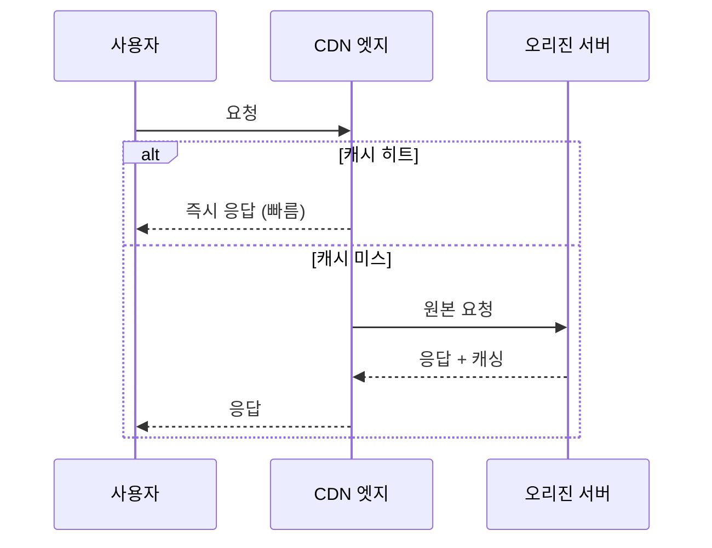

# CDN

> 문서 기준: 2026년 5월

## 개요

웹 서비스의 사용자는 전 세계에 분산되어 있지만, 오리진 서버는 특정 리전에 있습니다. 서울에 있는 서버에 미국 사용자가 접속하면, 물리적 거리만큼 지연이 발생합니다.

**CDN** (Content Delivery Network)은 전 세계 엣지 로케이션에 콘텐츠를 캐싱하여, 사용자에게 가장 가까운 위치에서 빠르게 전달하는 서비스입니다. 오리진 서버까지 가지 않고 엣지에서 응답하므로 지연 시간이 크게 줄어들고, 오리진 부하도 감소합니다.

### 동작 원리

### 핵심 개념

| 개념 | 설명 |
| --- | --- |
| **오리진 (Origin)** | 원본 콘텐츠가 있는 서버. 객체 스토리지, VM, 로드밸런서 등 |
| **엣지 (Edge/PoP)** | 사용자에게 가까운 캐시 서버. 전 세계 수백 개 지점 |
| **캐시 히트/미스** | 엣지에 콘텐츠가 있으면 히트(빠름), 없으면 미스(오리진에서 가져옴) |
| **TTL (Time To Live)** | 캐시 유효 시간. 만료되면 오리진에서 다시 가져옴 |
| **캐시 무효화 (Invalidation)** | TTL 만료 전에 강제로 캐시를 삭제. 전 세계 전파에 시간 소요 |

클라우드 CDN은 기본적으로 **HTTPS 전용**이며, TLS 인증서 관리가 통합되어 별도 인증서 구매 없이 무료 SSL/TLS를 제공합니다.


CDN 엣지에서 TLS를 종료하면 클라이언트↔엣지 간 핸드셰이크 RTT가 줄어 TTFB가 개선됩니다. 캐싱이 불가능한 TCP/UDP 워크로드의 네트워크 경로 가속은 이 문서 하단의 "글로벌 네트워크 가속기" 섹션을 참고하세요.


## 적용 대상

CDN은 정적 파일뿐 아니라 다양한 워크로드에 적용할 수 있습니다.

| 대상 | 설명 |
| --- | --- |
| **정적 파일** | 이미지, CSS, JS. 가장 기본적인 CDN 활용 |
| **API 응답** | 변경이 드문 API 응답을 엣지에서 캐싱. 오리진 부하 감소 |
| **동영상 스트리밍** | MP4 다운로드, HLS/DASH 적응형 스트리밍. 대용량 전송에 필수 |
| **동적 콘텐츠 / API** | 캐싱은 안 되지만, 엣지에서 TCP/TLS 종료 + 벤더 백본 경유로 지연 감소. 오리진 커넥션 재사용으로 핸드셰이크 비용 절감 |


**REST API에 CDN을 태울 것인가?** 두 가지 이점이 있습니다:
1. **캐싱 가능한 API** (공개 데이터, 상품 목록, 환율) — 짧은 TTL(5~60초)로 오리진 부하 감소
2. **캐싱 불가능한 API** (인증 기반, 개인화) — 캐싱 없이도 엣지 TCP/TLS 종료 + 백본 경로 최적화로 지연 감소

모든 주요 CDN(CloudFront, Front Door, Cloud CDN)이 동적 콘텐츠 가속을 지원합니다. `Cache-Control: no-store`로 캐싱을 비활성화해도 네트워크 경로 최적화 이점은 유지됩니다.


## 캐싱 전략

### 캐싱 계층

| 계층 | 위치 | 제어 방법 |
| --- | --- | --- |
| **브라우저 캐시** | 사용자 디바이스 | `Cache-Control`, `ETag` 헤더 |
| **CDN 엣지 캐시** | 벤더 엣지 로케이션 | TTL 정책, 캐시 키 설정 |
| **오리진 캐시** | 오리진 서버 앞단 (선택) | 리버스 프록시, 오리진 쉴드 |

### 캐시 키 전략

| 전략 | 방법 | TTL 설정 |
| --- | --- | --- |
| **해시 파일명** | `app.a3f2c1.js` (빌드 시 해시 삽입) | 매우 길게 (1년). 무효화 불필요 |
| **버전 쿼리** | `app.js?v=2` | 중간. 일부 CDN에서 캐시 키로 인식 안 할 수 있음 |
| **짧은 TTL** | 동일 URL, TTL 5분 | API 응답 등 자주 바뀌는 콘텐츠에 적합 |
| **무효화** | 수동 Invalidation 요청 | 긴급 수정 시에만. 비용 발생 가능 |


대부분의 프론트엔드 빌드 도구(Webpack, Vite 등)는 해시 파일명을 자동 생성합니다. `index.html`만 짧은 TTL로 설정하고, 나머지 정적 파일은 긴 TTL + 해시 파일명으로 운영하는 것이 일반적인 패턴입니다.


## 아키텍처 패턴

### CDN이 효과적인 상황

| 패턴 | 설명 | CDN 효과 |
| --- | --- | --- |
| **단일 리전 오리진 + 글로벌 사용자** | DB/앱이 한 리전에만 있고 사용자는 전 세계 | 엣지 캐싱으로 오리진 리전까지의 지연 제거 |
| **1:다수 배포** | 동일 콘텐츠를 수만~수백만 사용자에게 전달 | 오리진 부하를 엣지로 분산. 오리진 1대로도 대규모 서빙 가능 |
| **트래픽 스파이크 흡수** | 이벤트/뉴스 등 갑작스러운 트래픽 급증 | 엣지가 대부분 흡수, 오리진은 평소 부하 유지 |
| **정적 사이트 호스팅** | SPA/정적 사이트를 객체 스토리지에서 서빙 | CDN + 객체 스토리지만으로 서버 없이 운영 |

### 콘텐츠 보호 (Signed URL / Token)

CDN을 통해 배포하면서도 접근을 제한해야 하는 경우 (유료 콘텐츠, 인증된 사용자만 접근):

| 방법 | 설명 | AWS | Azure | GCP |
| --- | --- | --- | --- | --- |
| **Signed URL** | 시간 제한이 있는 서명된 URL | CloudFront Signed URL | Front Door Private Link | Cloud CDN Signed URL |
| **Signed Cookie** | 쿠키 기반 인증. 여러 파일 동시 적용 | CloudFront Signed Cookie | — | — |
| **Token 인증** | 엣지에서 토큰 검증 | CloudFront Functions | Front Door Rules Engine | — |
| **지역 제한** | 특정 국가/지역 허용 또는 차단 | ✅ | ✅ | ✅ |
| **WAF 연동** | IP 제한, Rate Limiting, Bot 차단 | CloudFront + WAF | Front Door + WAF | Cloud Armor |


유료 동영상 스트리밍처럼 콘텐츠 보호가 중요한 경우, Signed URL + DRM(Digital Rights Management)을 조합합니다. CDN은 전송 경로를 보호하고, DRM은 콘텐츠 자체를 보호합니다.


## 제품 비교

| 벤더 | 제품 | 비고 |
| --- | --- | --- |
| AWS | CloudFront | 400+ 엣지 로케이션. Origin Shield(오리진 보호 캐시 계층) |
| Azure | Azure CDN / Front Door | Front Door에 CDN + WAF + 글로벌 LB 통합 |
| GCP | Cloud CDN | Cloud Load Balancing과 통합. 캐시 무효화 빠름 |
| OCI | — | 자체 CDN 미제공. Akamai, Cloudflare 등 3rd party 사용 |

### 핵심 차이점

- **AWS CloudFront** — 엣지 로케이션 수가 가장 많고, Lambda@Edge/CloudFront Functions로 엣지에서 코드를 실행할 수 있습니다. Origin Shield로 오리진 부하를 추가로 줄일 수 있습니다.
- **Azure Front Door** — CDN, 글로벌 로드밸런서, WAF를 하나의 서비스로 통합합니다. 별도 CDN 설정 없이 Front Door 하나로 전체 트래픽을 관리할 수 있습니다.
- **GCP Cloud CDN** — Cloud Load Balancing에 체크박스 하나로 활성화할 수 있어 설정이 가장 간단합니다. 캐시 무효화가 수 초 내에 전파됩니다.

## 글로벌 네트워크 가속기

CDN은 콘텐츠를 **캐싱**하여 빠르게 전달하지만, 캐싱이 불가능한 워크로드(게임 서버, IoT, 실시간 API)에는 **네트워크 가속기**가 필요합니다. 가속기는 캐싱 없이 TCP/TLS 연결을 엣지에서 종료하고 벤더 백본 네트워크로 오리진까지 전달하여 지연을 줄입니다.

### CDN vs 네트워크 가속기

| 구분 | CDN | 네트워크 가속기 |
| --- | --- | --- |
| 목적 | 콘텐츠 캐싱 + 엣지 서빙 | TCP/TLS 연결 경로 최적화 |
| 캐싱 | ✅ | — |
| 대상 프로토콜 | HTTP/HTTPS | TCP/UDP 모든 프로토콜 |
| 동작 | 캐시 히트 시 오리진 불필요 | 항상 오리진으로 전달, 경로만 최적화 |
| 사용 예 | 정적 파일, 스트리밍, API 캐싱 | 게임 서버, IoT, 글로벌 API (캐싱 불가) |

### 벤더별 서비스

| 벤더 | 서비스 | 가속 대상 | 제약 |
| --- | --- | --- | --- |
| AWS | Global Accelerator | TCP/UDP | L4만. HTTP 라우팅 필요 시 ALB와 조합 |
| Azure | Front Door | HTTP + TCP | L7 통합. TCP 프록시는 Premium 티어 |
| GCP | Cloud LB (Premium Tier) | HTTP/TCP/UDP | 기본 글로벌. Standard Tier는 리전 한정 |
| OCI | DNS Traffic Management | DNS 기반 | 네트워크 가속 아님, DNS 레벨 분배만 |

### 선택 기준

| 요구사항 | 선택 |
| --- | --- |
| HTTP 콘텐츠 캐싱이 주 목적 | CDN |
| TCP/UDP 앱의 글로벌 지연 감소 (게임, IoT) | 글로벌 가속기 |
| HTTP + 글로벌 분산 + WAF 통합 | Azure Front Door / CloudFront + GA 조합 |
| 고정 Anycast IP 필요 (IP 화이트리스트) | Global Accelerator |


리전 내 L4/L7 분배는 [로드밸런서](load-balancer.md)를, DNS 기반 글로벌 분배는 [DNS](dns.md)를 참고하세요.


## 엣지 컴퓨팅

CDN 엣지에서 코드를 실행하여 요청/응답을 변환하거나, 간단한 로직을 오리진 없이 처리할 수 있습니다.

| 벤더 | 제품 | 비고 |
| --- | --- | --- |
| AWS | CloudFront Functions | 경량 (요청/응답 헤더 변환, 리다이렉트). 밀리초 이내 |
| AWS | Lambda@Edge | 풀 기능 (오리진 요청/응답 변환, 인증). 수 밀리초 |
| Azure | Front Door Rules Engine | 규칙 기반 라우팅/변환 |
| GCP | Cloud CDN + Cloud Functions | 별도 조합 |

## 참고하기

### AWS

- [Amazon CloudFront 문서](https://docs.aws.amazon.com/ko_kr/cloudfront/)
- [Lambda@Edge 문서](https://docs.aws.amazon.com/ko_kr/lambda/latest/dg/lambda-edge.html)

### Azure

- [Azure Front Door 문서](https://learn.microsoft.com/ko-kr/azure/frontdoor/)
- [Azure CDN 문서](https://learn.microsoft.com/ko-kr/azure/cdn/)

### GCP

- [Cloud CDN 문서](https://cloud.google.com/cdn/docs)
- [Media CDN 문서](https://cloud.google.com/media-cdn/docs)
