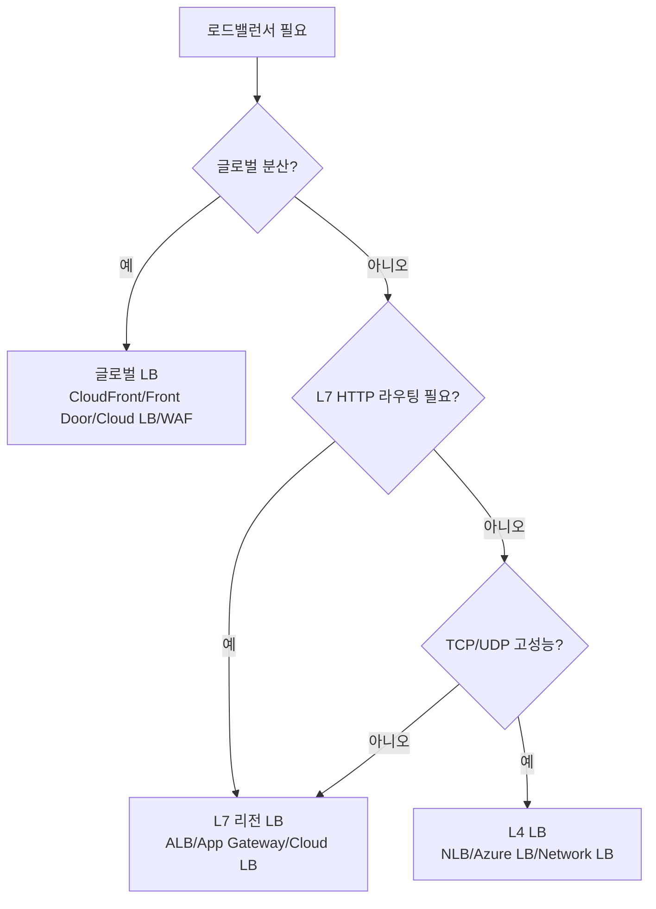

# 로드밸런서

> 문서 기준: 2026년 5월

## 개요

서버가 여러 대일 때, 사용자 요청을 어떤 서버로 보낼지 분배하는 것이 **로드밸런서**입니다. 온프레미스에서는 F5, Citrix 같은 하드웨어 장비를 사용하지만, 클라우드에서는 관리형 서비스로 제공됩니다.

오토스케일링과 함께 사용하면, 서버가 추가/제거될 때 자동으로 트래픽 분배 대상이 조정됩니다.

## 제품 비교

### L7 (HTTP/HTTPS) 로드밸런서

| 벤더 | 제품 | 비고 |
| --- | --- | --- |
| AWS | ALB (Application Load Balancer) | 경로/호스트 기반 라우팅, WebSocket, gRPC |
| Azure | Application Gateway | WAF 통합 가능 |
| GCP | External HTTP(S) Load Balancer | 글로벌 (단일 IP로 전 세계 서빙) |
| OCI | OCI Load Balancer | L7. 경로/호스트 기반 라우팅, SSL 종료 |

### L4 (TCP/UDP) 로드밸런서

| 벤더 | 제품 | 비고 |
| --- | --- | --- |
| AWS | NLB (Network Load Balancer) | 초저지연, 고정 IP |
| Azure | Azure Load Balancer | Standard/Basic 티어 |
| GCP | TCP/UDP Load Balancer | 리전 또는 글로벌 |
| OCI | OCI Network Load Balancer | L4. 초저지연, IP 해시/5-tuple 해시 |

### 글로벌 로드밸런서 / 가속기

| 벤더 | 제품 | 비고 |
| --- | --- | --- |
| AWS | Global Accelerator | Anycast IP로 가장 가까운 엣지로 라우팅 |
| Azure | Front Door | 글로벌 L7 + CDN + WAF 통합 |
| GCP | Cloud Load Balancing | 기본적으로 글로벌 (단일 Anycast IP) |
| OCI | OCI DNS Traffic Management | DNS 기반 글로벌 트래픽 분배 |

## 핵심 구성 요소

로드밸런서는 어디로 보낼지(규칙)와 누구에게 보낼지(대상 그룹)를 설정해야 합니다. L7과 L4는 라우팅 방식이 다릅니다.

### L7 (HTTP/HTTPS)

| 개념 | AWS ALB | Azure App Gateway | GCP HTTP(S) LB | OCI Load Balancer |
| --- | --- | --- | --- | --- |
| **라우팅 규칙** | Listener Rule (경로/호스트/헤더) | URL Path Map | URL Map | Routing Policy (경로/호스트) |
| **대상 그룹** | Target Group | Backend Pool | Backend Service | Backend Set |
| **헬스 체크** | HTTP/HTTPS 헬스 체크 | Health Probe | Health Check | Health Check |

경로(`/api/*`), 호스트(`api.example.com`), 헤더 값 등으로 세밀하게 트래픽을 분배할 수 있습니다.

### L4 (TCP/UDP)

| 개념 | AWS NLB | Azure LB | GCP TCP/UDP LB | OCI Network LB |
| --- | --- | --- | --- | --- |
| **라우팅** | 포트 기반 | Frontend IP + Port | Forwarding Rule | Listener (포트 기반) |
| **대상 그룹** | Target Group (IP/인스턴스) | Backend Pool | Backend Service | Backend Set |
| **특징** | 고정 IP, 초저지연, TLS 패스스루 | Standard/Basic 티어 | 리전 또는 글로벌 | 초저지연, IP 해시 |

L4는 패킷 내용을 보지 않고 포트 단위로 분배하므로 지연이 매우 낮습니다. DB, gRPC, 게임 서버 등 HTTP가 아닌 프로토콜에 사용합니다.

## 핵심 차이점

- **AWS** — ALB/NLB가 리전 단위이며, 글로벌 라우팅은 Global Accelerator를 별도로 사용합니다.
- **Azure** — Front Door가 글로벌 L7 + CDN + WAF를 하나의 서비스로 통합합니다.
- **GCP** — 로드밸런서가 기본적으로 글로벌입니다. 하나의 IP로 전 세계 사용자에게 가장 가까운 백엔드로 라우팅합니다.
- **OCI** — Load Balancer(L7)와 Network Load Balancer(L4)를 분리 제공하며, DNS Traffic Management로 글로벌 트래픽 분배를 구성합니다.

## SSL/TLS 처리

로드밸런서는 TLS 암호화 종료/통과 방식을 선택할 수 있습니다.

| 방식 | 설명 | 장점 | 단점 |
| --- | --- | --- | --- |
| **TLS Termination (종료)** | LB에서 TLS 복호화, 백엔드는 HTTP | 백엔드 부담 감소, LB에서 L7 처리 | LB-백엔드 구간 평문 (VPC 내부라 일반적으로 허용) |
| **TLS Passthrough (통과)** | LB는 암호화된 트래픽을 그대로 전달, 백엔드가 복호화 | End-to-end 암호화 | L7 라우팅/검사 불가 (L4만 가능) |
| **End-to-end TLS (재암호화)** | LB에서 복호화 후 백엔드로 갈 때 다시 암호화 | L7 처리 + 전 구간 암호화 | CPU 부하 증가 |

### 인증서 관리

| 벤더 | 무료 관리형 인증서 |
| --- | --- |
| AWS | AWS Certificate Manager (ACM) |
| Azure | App Service Managed Certificate, Key Vault |
| GCP | Certificate Manager |
| OCI | OCI Certificates |

모두 자동 갱신을 지원하며, LB에 네이티브 연동됩니다.

## 헬스 체크


로드밸런서에서 TLS를 종료하면, 로드밸런서와 백엔드 서버 사이 구간은 평문(HTTP)으로 통신합니다. 이 구간이 VPC 내부라면 일반적으로 허용되지만, 규제 요건이 있다면 End-to-end TLS(재암호화) 를 적용하세요.


로드밸런서는 주기적으로 백엔드 상태를 확인하여 비정상 인스턴스를 제외합니다.

### 헬스 체크 유형

| 유형 | 설명 | 사용 |
| --- | --- | --- |
| **TCP** | TCP 연결 가능 여부만 확인 | L4 LB, 간단한 체크 |
| **HTTP/HTTPS** | 특정 경로에 응답 코드 확인 (보통 200) | L7 LB, 앱 레벨 체크 |
| **gRPC** | gRPC Health Checking Protocol | gRPC 서비스 |

### 헬스 체크 설계 팁

- **전용 헬스 체크 엔드포인트** (`/health`, `/healthz`) 사용. 비즈니스 엔드포인트는 피하기
- **DB 의존성 포함 여부** — 얕은 체크(앱 살아있음)와 깊은 체크(DB 연결됨)를 구분
- **Interval과 Threshold** — 너무 짧으면 false positive, 너무 길면 장애 감지 지연
- **404/500도 건강함으로 간주할지** — 특정 경로가 없어도 서버는 정상일 수 있음

## 관련 문서


[DNS](dns.md)



[CDN](cdn.md)



[오토스케일링](../compute/auto-scaling.md)


## 결정 트리

## 언제 무엇을 선택할 것인가

| HTTP/HTTPS 라우팅, 경로 기반 분배 | L7 (ALB, App Gateway, Cloud LB, OCI LB) | URL/헤더 기반 라우팅, SSL 종료 |
| TCP/UDP 고성능, 낮은 레이턴시 | L4 (NLB, Azure LB, Network LB, OCI NLB) | 패킷 수준 처리, 고정 IP |
| 글로벌 트래픽 분산 + CDN + WAF | 글로벌 LB (CloudFront+ALB, Front Door, Cloud LB, OCI WAF) | 지역별 최적 라우팅 |
| 내부 서비스 간 통신만 | Internal LB | 퍼블릭 IP 불필요, 프라이빗 서브넷 내 |
| gRPC, WebSocket | L7 (gRPC 지원 확인) | ALB, Cloud LB는 gRPC 네이티브 지원 |

## 참고하기

### AWS

- [Elastic Load Balancing 문서](https://docs.aws.amazon.com/ko_kr/elasticloadbalancing/)
- [AWS Global Accelerator 문서](https://docs.aws.amazon.com/ko_kr/global-accelerator/)

### Azure

- [Azure Load Balancer 문서](https://learn.microsoft.com/ko-kr/azure/load-balancer/)
- [Azure Front Door 문서](https://learn.microsoft.com/ko-kr/azure/frontdoor/)

### GCP

- [Google Cloud Load Balancing 문서](https://cloud.google.com/load-balancing/docs)

### OCI

- [OCI Load Balancer 문서](https://docs.oracle.com/en-us/iaas/Content/Balance/home.htm)
- [OCI Network Load Balancer 문서](https://docs.oracle.com/en-us/iaas/Content/NetworkLoadBalancer/home.htm)
