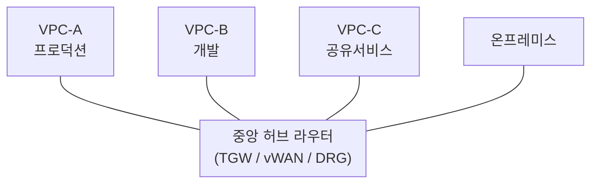

# VPC와 서브넷

> 문서 기준: 2026년 5월

## 개요

온프레미스에서는 물리적인 네트워크 장비(스위치, 라우터, 방화벽)로 네트워크를 구성합니다. 클라우드에서는 이 모든 것을 소프트웨어로 정의합니다.

**VPC** (Virtual Private Cloud)는 클라우드 안에 만드는 논리적으로 격리된 가상 네트워크입니다. 온프레미스의 사내 네트워크에 해당하며, IP 대역, 서브넷, 라우팅, 방화벽 규칙을 사용자가 직접 설계합니다.


AWS VPC를 아시는 분을 위해: GCP는 VPC가 글로벌이고, OCI는 VCN이라 부릅니다.


서브넷은 가용영역(AZ) 단위로 배치되며, 여러 AZ에 서브넷을 분산하면 장애 도메인을 분리하여 고가용성을 확보할 수 있습니다. 리전과 가용영역의 개념은 [리전과 가용영역](../about-cloud/regions-and-zones.md)에서 자세히 다룹니다.

## 제품 비교

| 벤더 | 제품 | 비고 |
| --- | --- | --- |
| AWS | VPC | 리전 단위. 서브넷은 AZ 단위 |
| Azure | VNet (Virtual Network) | 리전 단위. 서브넷은 리전 내 자유 배치 |
| GCP | VPC | **글로벌** (리전에 종속되지 않음). 서브넷이 리전 단위 |
| OCI | VCN (Virtual Cloud Network) | 리전 단위. 서브넷은 리전 또는 AD 단위 |

### 보안 (네트워크 방화벽)

클라우드 네트워크 보안은 여러 계층으로 구성됩니다.

| 계층 | AWS | Azure | GCP | OCI | 비고 |
| --- | --- | --- | --- | --- | --- |
| **인스턴스 단위** | Security Groups (상태 유지) | NSG | Firewall Rules (태그 기반) | Security Lists / NSG | 가장 기본. 인바운드/아웃바운드 규칙 |
| **서브넷 단위** | Network ACL (상태 비유지) | NSG (서브넷 연결) | — | Security Lists (서브넷 연결) | 서브넷 경계에서 필터링 |
| **VPC 단위 (IDS/IPS)** | Network Firewall | Azure Firewall | Cloud Firewall | OCI Network Firewall | L7 검사, 위협 인텔리전스, 도메인 필터링 |
| **DDoS 방어** | Shield (Standard 무료 / Advanced 유료) | DDoS Protection | Cloud Armor | OCI WAF (DDoS 보호 포함) | L3/L4 DDoS 자동 완화 |
| **웹 앱 방화벽 (WAF)** | AWS WAF | Azure WAF | Cloud Armor WAF | OCI WAF | L7 공격 차단 (SQL Injection, XSS 등) |

Security Groups/NSG만으로 기본 보안은 가능하지만, 프로덕션 환경에서는 VPC 단위 방화벽과 WAF를 추가하여 심층 방어(Defense in Depth)를 구성하는 것을 권장합니다.

### NAT (Network Address Translation)

프라이빗 서브넷의 인스턴스는 인터넷에서 직접 접근할 수 없지만, 소프트웨어 업데이트나 외부 API 호출을 위해 아웃바운드 인터넷 접근이 필요한 경우가 있습니다. **NAT Gateway**는 프라이빗 인스턴스가 인터넷으로 나갈 수 있게 하면서, 외부에서의 인바운드 접근은 차단합니다.

| 벤더 | 제품 | 비고 |
| --- | --- | --- |
| AWS | NAT Gateway | AZ 단위. 고가용성을 위해 AZ별로 생성 권장 |
| Azure | NAT Gateway | 서브넷 단위 연결 |
| GCP | Cloud NAT | 리전 단위. VM에 외부 IP 없이 인터넷 접근 가능 |
| OCI | NAT Gateway | VCN 단위. 프라이빗 서브넷의 아웃바운드 인터넷 접근 |


NAT Gateway는 시간당 비용 + 데이터 처리 비용이 발생합니다. 대량 아웃바운드 트래픽이 있는 경우 비용에 주의해야 합니다.


### 프라이빗 연결 (온프레미스 ↔ 클라우드)

온프레미스와 클라우드를 연결하는 방법은 **전용선**과 **VPN(IPSec)** 두 가지입니다.

| 구분 | 전용선 | VPN (IPSec) |
| --- | --- | --- |
| **경로** | 벤더 로케이션까지 물리 회선 | 인터넷 경유 암호화 터널 |
| **대역폭** | 1~100 Gbps | 일반적으로 1~5 Gbps |
| **지연/안정성** | 낮고 일정 | 인터넷 상태에 따라 변동 |
| **비용** | 회선비 + 포트비 (월 고정) | 시간당 과금 (상대적 저렴) |
| **구축 기간** | 수 주~수 개월 (물리 회선 개통) | 수 분~수 시간 (설정만) |
| **적합한 경우** | 대용량 데이터, 안정적 지연 필요, 프로덕션 | PoC, 백업 경로, 소규모 트래픽 |

#### 벤더별 서비스

| 벤더 | 전용선 | VPN | 비고 |
| --- | --- | --- | --- |
| AWS | Direct Connect | Site-to-Site VPN | Direct Connect는 전용선, VPN은 백업 경로로 조합 권장 |
| Azure | ExpressRoute | VPN Gateway | ExpressRoute Global Reach로 리전 간 연결 가능 |
| GCP | Cloud Interconnect (Dedicated/Partner) | Cloud VPN (HA VPN) | HA VPN은 99.99% SLA |
| OCI | FastConnect | Site-to-Site VPN | FastConnect 이그레스 10TB/월 무료에 포함 |

#### 한국 내 전용선 연결

전용선을 사용하려면 벤더의 물리적 접속 지점(PoP)까지 **고객 캠퍼스에서 회선을 끌어야** 합니다. 직접 연결(Dedicated)이 어려우면 통신사(LG U+, KT 등)를 통해 Partner 방식으로 연결할 수 있습니다.

| 벤더 | 로케이션 목록 |
| --- | --- |
| AWS | [Direct Connect 로케이션](https://aws.amazon.com/directconnect/locations/) |
| Azure | [ExpressRoute 피어링 위치](https://learn.microsoft.com/azure/expressroute/expressroute-locations) |
| GCP | [Cloud Interconnect 위치](https://cloud.google.com/network-connectivity/docs/interconnect/concepts/choosing-colocation-facilities) |
| OCI | [FastConnect 위치](https://docs.oracle.com/en-us/iaas/Content/Network/Concepts/fastconnectprovider.htm) |


전용선은 "벤더까지의 연결"만 제공합니다. 고객 사무실/IDC에서 벤더 PoP까지의 물리 회선은 별도로 통신사와 계약해야 하며, 개통에 수 주~수 개월이 소요됩니다. 이 구간의 비용과 리드타임을 사전에 확인하세요.


글로벌 네트워크 관리(AWS Cloud WAN, Azure Virtual WAN 등)와 멀티사이트 연결 상세는 [멀티클라우드 네트워킹](multicloud-networking.md)을 참고하세요.

## 핵심 차이점

- **GCP** — VPC가 글로벌이어서 리전 간 서브넷을 하나의 VPC로 관리할 수 있습니다. AWS/Azure는 리전별로 VPC/VNet을 만들고 피어링해야 합니다.
- **AWS** — Security Groups(인스턴스 단위)와 Network ACL(서브넷 단위) 이중 방화벽 구조입니다.
- **Azure** — VNet 피어링이 글로벌로 가능하여 리전 간 연결이 간편합니다.
- **OCI** — VCN은 리전 단위이며, 서브넷을 리전 또는 AD 단위로 배치할 수 있습니다. Security Lists와 NSG를 조합하여 유연한 보안 구성이 가능합니다.

## 서브넷 설계 모범사례

서브넷은 **퍼블릭(Public)**, **프라이빗(Private)**, **격리(Isolated)** 3계층으로 나누는 것이 일반적입니다.

| 계층 | 용도 | 인터넷 접근 | 배치 리소스 |
| --- | --- | --- | --- |
| **퍼블릭** | 외부 트래픽 수신 | 인바운드/아웃바운드 모두 가능 | ALB, NAT Gateway, Bastion Host |
| **프라이빗** | 애플리케이션 계층 | NAT Gateway 통해 아웃바운드만 | EC2, ECS, EKS 워커 노드 |
| **격리** | DB, 내부 시스템 | 인터넷 접근 불가 (VPC 내부만) | RDS, ElastiCache |

### CIDR 계획

CIDR 설계는 나중에 바꾸기 가장 어려운 결정입니다. VPC를 만든 뒤에는 CIDR을 변경할 수 없으므로(AWS는 Secondary CIDR 추가만 가능), 처음부터 여유 있게 설계해야 합니다.

**단일 VPC 설계:**

- **VPC CIDR**은 `/16` (65,536개 IP)을 권장. `/24`로 시작하면 서브넷 분할이 어려움
- **서브넷 CIDR**은 `/24` (256개 IP) 단위로 시작. EKS/AKS 노드가 많으면 `/20` (4,096개) 필요
- **AZ별로 서브넷 분산**. 최소 2개, 권장 3개 AZ에 배치

**멀티 VPC / 멀티 계정 설계:**

조직에 VPC가 여러 개 생기면 CIDR 충돌이 가장 큰 문제입니다. 피어링이나 Transit Gateway로 연결할 때 CIDR이 겹치면 라우팅이 불가능합니다.

| 전략 | 예시 | 설명 |
| --- | --- | --- |
| 환경별 대역 분리 | `10.0.0.0/16` (prod), `10.1.0.0/16` (dev), `10.2.0.0/16` (staging) | 환경 간 충돌 방지 |
| 팀/서비스별 할당 | `10.10.0.0/16` (팀A), `10.20.0.0/16` (팀B) | 팀 자율성 확보 |
| 온프렘 대역 회피 | 온프렘이 `172.16.0.0/12` 사용 중이면 클라우드는 `10.0.0.0/8` 사용 | 전용선 연결 시 충돌 방지 |


`10.0.0.0/16`은 가장 흔한 기본값이라 여러 VPC가 동일 CIDR을 갖는 경우가 많습니다. 조직 차원에서 CIDR 할당 레지스트리를 관리하세요.


**멀티클라우드 CIDR 설계:**

AWS, Azure, GCP를 동시에 사용하면서 전용선으로 연결하는 경우, 세 벤더의 VPC/VNet CIDR이 모두 겹치지 않아야 합니다. 멀티클라우드 환경의 네트워크 설계 상세는 [멀티클라우드 커넥티비티](multicloud-connectivity.md)를 참고하세요.

## 라우팅

서브넷에서 나가는 트래픽이 어디로 전달될지 결정하는 규칙입니다. 온프레미스의 라우터 설정과 동일한 역할이지만, 클라우드에서는 소프트웨어로 정의됩니다.

### 공통 개념

모든 벤더에서 라우팅의 핵심은 동일합니다:

- **VPC 내부 트래픽**은 자동으로 라우팅됩니다 (별도 설정 불필요)
- **외부로 나가는 트래픽**은 명시적 경로가 필요합니다 (인터넷, 온프레미스, 다른 VPC)
- **서브넷 계층별로 다른 라우팅**을 적용하여 격리 수준을 제어합니다

| 서브넷 계층 | 외부 경로 | 이유 |
| --- | --- | --- |
| **퍼블릭** | 인터넷 게이트웨이 (양방향) | LB, Bastion 등 외부 노출 리소스 |
| **프라이빗** | NAT (아웃바운드만) | 앱 서버 — 외부 API 호출은 가능, 인바운드 차단 |
| **격리** | 경로 없음 (VPC 내부만) | DB — 인터넷 접근 자체를 차단 |

### 벤더별 라우팅 모델 차이

| 항목 | AWS | Azure | GCP | OCI |
| --- | --- | --- | --- | --- |
| **라우팅 테이블 단위** | 서브넷별 연결 | 서브넷별 연결 (UDR) | VPC 전체 (암묵적) + 커스텀 경로 | 서브넷별 연결 |
| **기본 인터넷 경로** | 명시적 IGW 경로 추가 필요 | 기본 제공 (NSG로 제어) | 기본 제공 (방화벽 규칙으로 제어) | 명시적 IGW 경로 추가 필요 |
| **NAT** | NAT Gateway (AZ별) | NAT Gateway (서브넷별) | Cloud NAT (리전별) | NAT Gateway (VCN별) |
| **온프렘 경로 전파** | Route Propagation (TGW/VPN) | BGP 전파 (VPN Gateway) | Cloud Router (BGP) | DRG Route Table |
| **특이점** | Prefix List로 벤더 서비스 경로 관리 | System Routes 자동 생성 | **글로벌 VPC라 리전 간 라우팅 자동** | Security List가 라우팅과 별도 |


GCP는 VPC가 글로벌이므로 리전 간 서브넷 통신에 별도 라우팅 설정이 불필요합니다. AWS/Azure/OCI는 리전별 VPC이므로 리전 간 통신에 피어링이나 허브가 필요합니다.


### 라우팅 설계 안티패턴

| 안티패턴 | 문제 | 올바른 접근 |
| --- | --- | --- |
| 모든 서브넷에 동일 라우팅 | 격리 계층 무의미 | 계층별 별도 라우팅 |
| DB 서브넷에 인터넷 경로 | 불필요한 노출 | 경로 없음 + 벤더 서비스는 프라이빗 연결로 |
| 온프렘 경로를 모든 서브넷에 전파 | 불필요한 노출 | 필요한 서브넷에만 선택적 전파 |
| CIDR 겹침 무시 | 피어링/허브 연결 시 라우팅 불가 | 사전 CIDR 계획 필수 |

## VPC 간 연결

VPC가 여러 개 생기면 서로 통신해야 하는 상황이 발생합니다. 공유 서비스(로깅, DNS, 보안 도구)에 접근하거나, 온프레미스와 연결하거나, 환경 간 제한적 통신이 필요한 경우입니다.

### VPC 피어링 — 단순하지만 확장이 어려움

VPC 피어링은 두 VPC를 1:1로 직접 연결합니다. 설정이 간단하고 추가 비용이 낮지만(데이터 전송 비용만), **전이적 라우팅(transitive routing)을 지원하지 않습니다.**

전이적 라우팅이 안 된다는 것은: VPC-A ↔ VPC-B 피어링, VPC-B ↔ VPC-C 피어링이 있어도, VPC-A에서 VPC-C로 VPC-B를 경유하여 통신할 수 없다는 뜻입니다. A↔C 통신이 필요하면 별도 피어링을 만들어야 합니다.

**VPC가 늘어나면 피어링이 폭발합니다:**

- 3개 VPC → 3개 피어링
- 5개 VPC → 10개 피어링
- 10개 VPC → 45개 피어링
- N개 VPC → N×(N-1)/2개 피어링

각 피어링마다 양쪽 라우팅 테이블을 업데이트해야 하므로, 운영 복잡도가 기하급수적으로 증가합니다.

### 허브-스포크 연결 (Transit Gateway / Virtual WAN / DRG)

이 문제를 해결하기 위해 등장한 것이 **중앙 허브 라우터**입니다. 모든 VPC와 온프레미스를 허브에 연결하면, 허브가 전이적 라우팅을 처리합니다.

| 벤더 | 허브 서비스 | 비고 |
| --- | --- | --- |
| AWS | Transit Gateway (TGW) | 리전 단위. 리전 간은 TGW Peering |
| Azure | Virtual WAN / Hub VNet | Microsoft 관리형 허브. 글로벌 |
| GCP | — (글로벌 VPC로 대부분 불필요) | 프로젝트 간은 Shared VPC 또는 Peering |
| OCI | Dynamic Routing Gateway (DRG v2) | 허브 역할. VCN/온프렘/타 리전 연결 |

| 구분 | VPC 피어링 | 허브-스포크 (TGW / vWAN / DRG) |
| --- | --- | --- |
| **연결 구조** | 1:1 (메시) | 허브-스포크 (스타) |
| **전이적 라우팅** | 불가 | 가능 (허브 경유) |
| **VPC 10개 연결 시** | 45개 피어링 | 10개 연결 (허브에 각 1개) |
| **온프렘 연결** | VPC마다 VPN 필요 | 허브에 1개 VPN/전용선 |
| **라우팅 관리** | VPC마다 개별 관리 | 허브에서 중앙 관리 |
| **비용** | 데이터 전송만 | 시간당 + 데이터 처리 비용 |
| **적합한 경우** | VPC 2~3개, 단순 구조 | VPC 4개 이상, 온프렘 연결, 중앙 관리 필요 |


GCP는 VPC가 글로벌이므로 리전 간 서브넷을 하나의 VPC로 관리할 수 있어, Transit Gateway 같은 별도 허브가 필요 없는 경우가 많습니다. 다만 조직/프로젝트 간 연결에는 VPC Peering이나 Shared VPC를 사용합니다.


### 벤더별 피어링 및 허브 서비스 정리

| 벤더 | 1:1 피어링 | 허브-스포크 | 비고 |
| --- | --- | --- | --- |
| AWS | VPC Peering | Transit Gateway (TGW) | TGW는 리전 단위, 리전 간은 TGW Peering |
| Azure | VNet Peering (글로벌 가능) | Azure Virtual WAN / Hub VNet | vWAN은 Microsoft 관리형 허브 |
| GCP | VPC Network Peering | 글로벌 VPC + Shared VPC | 대부분 피어링으로 충분 |
| OCI | Local/Remote Peering Gateway | Dynamic Routing Gateway (DRG) | DRG v2는 허브 역할 |

### 프라이빗 서비스 연결 (VPC Endpoint / Private Link)

클라우드 관리형 서비스(스토리지, DB 등)에 접근할 때, 기본적으로는 인터넷 또는 NAT Gateway를 경유합니다. **프라이빗 서비스 연결**을 사용하면 트래픽이 벤더 내부 네트워크를 벗어나지 않아 보안과 비용 모두 이점이 있습니다.

| 벤더 | 제품 | 비고 |
| --- | --- | --- |
| AWS | VPC Endpoint (Gateway/Interface) / PrivateLink | Gateway(S3, DynamoDB)는 무료, Interface는 시간당 과금 |
| Azure | Private Endpoint / Private Link | 서비스별 Private Endpoint 생성 |
| GCP | Private Service Connect / Private Google Access | Private Google Access는 설정만으로 활성화 |
| OCI | Service Gateway / Private Endpoint | Service Gateway는 Oracle 서비스 접근용 |

## 프로덕션 VPC 설계 체크리스트

- [ ] CIDR 범위를 향후 확장과 멀티클라우드 피어링을 고려하여 설계했는가
- [ ] 퍼블릭/프라이빗/데이터 서브넷을 분리했는가
- [ ] 각 AZ에 서브넷을 배치하여 고가용성을 확보했는가
- [ ] NAT Gateway를 AZ별로 배치했는가 (단일 장애점 방지)
- [ ] Security Group은 최소 권한으로 설정했는가 (기본 Deny)
- [ ] VPC Flow Logs를 활성화했는가
- [ ] DNS 설정 (Private Hosted Zone / Private DNS)을 구성했는가
- [ ] VPC Endpoint를 사용하여 S3/DynamoDB 등 접근 시 NAT 비용을 절감했는가
- [ ] 태그 정책을 적용했는가 (env, owner, cost-center)
- [ ] 향후 VPC 피어링/Transit Gateway 연결을 위한 CIDR 충돌 여부를 확인했는가

## 참고하기

### AWS

- [Amazon VPC 문서](https://docs.aws.amazon.com/ko_kr/vpc/)
- [Amazon VPC Security Groups](https://docs.aws.amazon.com/ko_kr/vpc/latest/userguide/vpc-security-groups.html)

### Azure

- [Azure Virtual Network 문서](https://learn.microsoft.com/ko-kr/azure/virtual-network/)
- [Azure NSG 문서](https://learn.microsoft.com/ko-kr/azure/virtual-network/network-security-groups-overview)

### GCP

- [Google Cloud VPC 문서](https://cloud.google.com/vpc/docs)
- [Google Cloud 방화벽 규칙](https://cloud.google.com/firewall/docs/firewalls)

### OCI

- [OCI VCN 문서](https://docs.oracle.com/en-us/iaas/Content/Network/Concepts/overview.htm)
- [OCI Security Lists](https://docs.oracle.com/en-us/iaas/Content/Network/Concepts/securitylists.htm)
- [OCI Network Security Groups](https://docs.oracle.com/en-us/iaas/Content/Network/Concepts/networksecuritygroups.htm)
