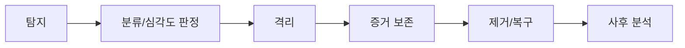

# 보안 사고 대응

> 문서 기준: 2026년 5월

## 개요

[보안 태세 관리](security-posture.md)로 예방하고 탐지하더라도, 보안 사고는 발생할 수 있습니다. 클라우드 환경에서는 온프레미스와 다른 대응 절차가 필요합니다 — 계정 격리, 토큰 회수, API 기반 증거 보존, 자동 격리 등.

## 대응 흐름

| 단계 | 활동 | 클라우드 특화 포인트 |
| --- | --- | --- |
| **탐지** | GuardDuty/Defender/SCC 알림, SIEM 상관 분석 | 자동 탐지 서비스 활용 |
| **분류** | 심각도 판정 (Critical/High/Medium/Low), 영향 범위 파악 | 어떤 계정/리전/서비스가 영향받는지 |
| **격리** | 침해된 리소스를 네트워크/권한에서 분리 | SG 변경, IAM 키 비활성화, 역할 세션 차단 |
| **증거 보존** | 포렌식용 데이터 확보 | 디스크 스냅샷, 메모리 덤프, 감사 로그 보존 |
| **제거/복구** | 위협 제거 후 서비스 복구 | 감염 인스턴스 교체 (Immutable), 키 교체 |
| **사후 분석** | 근본 원인 분석, 재발 방지 | 타임라인 재구성, 정책 개선 |

## 클라우드 격리 패턴

### IAM 기반 격리

| 상황 | 조치 | 벤더별 방법 |
| --- | --- | --- |
| **API 키/자격 증명 유출** | 키 즉시 비활성화 + 활성 세션 무효화 | AWS: Access Key 비활성화 + 세션 취소, Azure: Entra ID 세션 취소, GCP: Service Account 키 삭제 |
| **역할/권한 탈취** | 해당 역할에 Deny 정책 추가 또는 세션 만료 강제 | AWS: SCP Deny, Azure: Conditional Access 차단, GCP: Organization Policy |
| **계정 전체 침해** | 계정/구독/프로젝트를 조직에서 격리 | AWS: SCP 전체 Deny, Azure: Subscription 비활성화, GCP: Project 정지 |

### 네트워크 기반 격리

| 조치 | 방법 |
| --- | --- |
| **인스턴스 격리** | 방화벽 규칙을 "모든 인바운드/아웃바운드 차단"으로 교체 (삭제하면 안 됨 — 증거 보존) |
| **서브넷 격리** | 서브넷 레벨 ACL로 해당 서브넷 트래픽 전면 차단 |
| **DNS 싱크홀** | 악성 도메인을 내부 DNS에서 싱크홀로 리다이렉트 |


**격리 시 인스턴스를 종료(terminate)하지 마세요.** 메모리, 디스크, 네트워크 연결 정보가 사라집니다. 격리 후 스냅샷을 먼저 확보하세요.


## 증거 보존

| 증거 유형 | 수집 방법 | 보존 위치 |
| --- | --- | --- |
| **디스크** | EBS/Managed Disk 스냅샷 | 포렌식 전용 계정의 암호화된 스토리지 |
| **메모리** | SSM Run Command로 메모리 덤프 (LiME 등) | S3/Blob (암호화) |
| **로그** | CloudTrail/Activity Log/Audit Log 보존 기간 연장 | 별도 로그 아카이브 계정 (변조 방지) |
| **네트워크** | VPC Flow Logs, DNS 쿼리 로그 | 장기 보존 스토리지 |
| **타임라인** | 이벤트 시간순 정리 | 사고 대응 문서 |

## 벤더별 사고 대응 도구

| 영역 | AWS | Azure | GCP | OCI |
| --- | --- | --- | --- | --- |
| **탐지** | GuardDuty | Defender for Cloud | Security Command Center | Cloud Guard |
| **조사** | Detective | Sentinel (Investigation) | Chronicle | Logging Analytics |
| **자동 대응** | EventBridge → Lambda/Step Functions | Sentinel Playbook (Logic Apps) | Cloud Functions / Workflows | Events → Functions |
| **포렌식** | 스냅샷 + SSM + Athena (로그 쿼리) | Disk Snapshot + Log Analytics | Disk Snapshot + BigQuery | Block Volume Backup + Logging |
| **로그 장기 보존** | S3 + Glacier (Object Lock) | Immutable Blob Storage | Cloud Storage (Retention Lock) | Object Storage (Retention Rules) |

## 사전 준비 사항

사고가 발생하기 **전에** 준비해야 할 것들:

- [ ] **포렌식 전용 계정** — 증거를 격리 보존할 별도 계정/구독/프로젝트
- [ ] **비상 접근 (Break-glass) 계정** — 평소 비활성, 사고 시에만 활성화. 사후 감사 필수
- [ ] **로그 보존 정책** — 감사 로그(CloudTrail/Activity Log/Audit Log/OCI Audit)를 최소 1년 이상 보존 (변조 방지 설정)
- [ ] **연락 체계** — 보안팀, 경영진, 법무, 벤더 지원 연락처
- [ ] **Runbook** — 사고 유형별 대응 절차 문서화 (IAM 키 유출, 데이터 유출, 랜섬웨어 등)
- [ ] **정기 훈련** — Tabletop Exercise (시나리오 기반 모의 훈련) 분기 1회

## 지속적으로 해야 할 것

- **정기 훈련(테이블탑 연습)** — 분기 1회 이상 시나리오 기반 모의 훈련을 수행하여 대응 역량을 유지합니다.
- **플레이북 업데이트** — 실제 사고나 훈련 후 발견된 개선점을 즉시 플레이북에 반영합니다.
- **사후 분석(Post-mortem) 반영** — 사고 후 근본 원인 분석 결과를 탐지 규칙과 대응 절차에 피드백합니다.

## 참고하기

### AWS

- [AWS Security Incident Response Guide](https://docs.aws.amazon.com/whitepapers/latest/aws-security-incident-response-guide/aws-security-incident-response-guide.html)

### Azure

- [Azure Security Incident Response](https://learn.microsoft.com/azure/security/fundamentals/incident-response-overview)

### GCP

- [GCP Responding to Security Incidents](https://cloud.google.com/security/incident-response)

### OCI

- [OCI Security Best Practices](https://docs.oracle.com/en-us/iaas/Content/Security/Concepts/security_guide.htm)

### 표준 및 커뮤니티

- [NIST SP 800-61 — Computer Security Incident Handling Guide](https://csrc.nist.gov/publications/detail/sp/800-61/rev-2/final)
- [SANS Incident Handler's Handbook](https://www.sans.org/white-papers/33901/)
