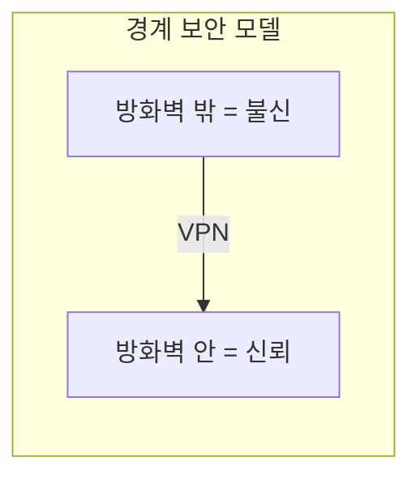
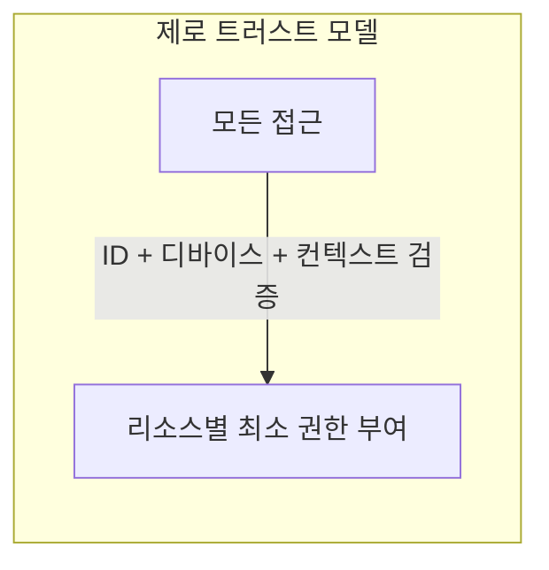

# 제로 트러스트 (Zero Trust)

> 문서 기준: 2026년 5월

## 개요

전통적 네트워크 보안은 **경계 보안** (Perimeter Security) 모델입니다. 방화벽 안쪽은 신뢰하고, 바깥은 차단합니다. 하지만 클라우드, 원격 근무, SaaS 확산으로 "안과 밖"의 경계가 사라졌습니다.

**제로 트러스트** (Zero Trust)는 "절대 신뢰하지 말고, 항상 검증하라" (Never trust, always verify)는 원칙입니다. 네트워크 위치와 관계없이 모든 접근을 검증합니다.

## 핵심 원칙

| 원칙 | 설명 | 구현 예시 |
| --- | --- | --- |
| **ID 기반 접근** | 네트워크 위치가 아닌 사용자/워크로드 ID로 접근 제어 | IAM 역할, Workload Identity |
| **최소 권한** | 필요한 리소스에만, 필요한 시간만 접근 허용 | JIT 접근, 시간 제한 토큰 |
| **명시적 검증** | 모든 요청을 매번 검증 (캐시된 신뢰 없음) | MFA, 디바이스 상태 확인, 위치 기반 정책 |
| **침해 가정** | 이미 침해되었다고 가정하고 설계 | 마이크로세그멘테이션, 암호화, 로깅 |
| **지속적 검증** | 세션 중에도 지속적으로 신뢰 수준 재평가 | Conditional Access, 이상 행위 탐지 |

## 벤더별 제로 트러스트 서비스

| 영역 | AWS | Azure | GCP | OCI |
| --- | --- | --- | --- | --- |
| **네트워크 접근 (ZTNA)** | [Verified Access](https://docs.aws.amazon.com/verified-access/latest/ug/what-is-verified-access.html) | [Entra Private Access](https://learn.microsoft.com/entra/global-secure-access/concept-private-access) | [BeyondCorp Enterprise](https://cloud.google.com/beyondcorp-enterprise) | [Zero Trust Packet Routing](https://docs.oracle.com/en-us/iaas/Content/zero-trust-packet-routing/home.htm) |
| **ID 기반 접근** | IAM + Identity Center | Entra ID + Conditional Access | IAM + Workload Identity Federation | Identity Domains + 동적 그룹 |
| **마이크로세그멘테이션** | Security Groups + PrivateLink | NSG + Private Endpoints | VPC Service Controls + Firewall Rules | NSG + Network Path Analyzer |
| **디바이스 신뢰** | Verified Access 디바이스 정책 | Intune + Conditional Access | BeyondCorp 디바이스 인증서 | — (서드파티 연동) |
| **워크로드 간 인증** | IAM Role + STS | Managed Identity | Workload Identity Federation | Instance Principal |

## 기존 VPC 모델과의 관계

제로 트러스트는 VPC/서브넷 기반 네트워크 보안을 **대체하는 것이 아니라 보완**합니다.

| 계층 | 역할 | 도구 |
| --- | --- | --- |
| **네트워크 계층** (기존) | 대역폭 제어, DDoS 방어, 기본 격리 | VPC, 서브넷, Security Group, WAF |
| **ID 계층** (제로 트러스트) | 누가, 어떤 조건에서, 무엇에 접근하는지 | IAM, Conditional Access, ZTNA |


**VPC를 없애는 것이 아닙니다.** 네트워크 격리(VPC/서브넷)는 여전히 심층 방어의 한 계층입니다. 제로 트러스트는 그 위에 ID 기반 접근 제어를 추가하여, 네트워크 안에 있더라도 무조건 신뢰하지 않는 것입니다.


## 도입 단계

| 단계 | 활동 | 목표 |
| --- | --- | --- |
| **1. ID 통합** | 모든 사용자/서비스를 중앙 ID 시스템으로 통합 | 누가 접근하는지 파악 |
| **2. MFA + 조건부 접근** | 모든 접근에 MFA 강제, 위치/디바이스 조건 추가 | 기본 검증 체계 구축 |
| **3. 최소 권한 적용** | 과도한 권한 제거, JIT 접근 도입 | 침해 시 피해 범위 최소화 |
| **4. 마이크로세그멘테이션** | 워크로드 간 통신을 명시적으로 허용된 것만 | 횡적 이동 차단 |
| **5. 지속적 모니터링** | 모든 접근 로그 수집, 이상 행위 탐지 | 침해 조기 탐지 |

## 참고하기

- [NIST SP 800-207 — Zero Trust Architecture](https://csrc.nist.gov/publications/detail/sp/800-207/final)
- [AWS Verified Access 문서](https://docs.aws.amazon.com/verified-access/latest/ug/what-is-verified-access.html)
- [Microsoft Zero Trust 가이드](https://learn.microsoft.com/security/zero-trust/)
- [Google BeyondCorp Enterprise](https://cloud.google.com/beyondcorp-enterprise)
- [OCI Zero Trust Packet Routing](https://docs.oracle.com/en-us/iaas/Content/zero-trust-packet-routing/home.htm)
- [CISA Zero Trust Maturity Model](https://www.cisa.gov/zero-trust-maturity-model)
