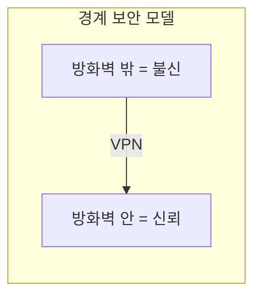
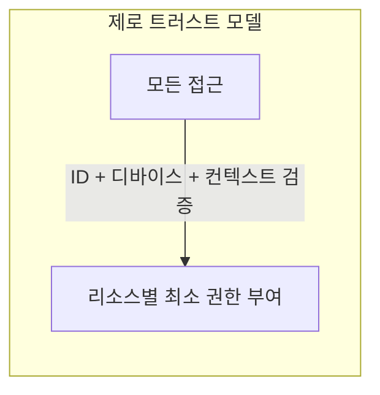

# 제로 트러스트 (Zero Trust)

> 문서 기준: 2026년 8월

## 개요

전통적 네트워크 보안은 **경계 보안** (Perimeter Security) 모델입니다. 방화벽 안쪽은 신뢰하고, 바깥은 차단합니다. 하지만 클라우드, 원격 근무, SaaS 확산으로 "안과 밖"의 경계가 사라졌습니다.

**제로 트러스트** (Zero Trust)는 "절대 신뢰하지 말고, 항상 검증하라" (Never trust, always verify)는 원칙입니다. 네트워크 위치와 관계없이 모든 접근을 검증합니다.

## 핵심 원칙

| 원칙 | 설명 | 구현 예시 |
| --- | --- | --- |
| **ID 기반 접근** | 네트워크 위치가 아닌 사용자/워크로드 ID로 접근 제어 | IAM 역할, Workload Identity |
| **최소 권한** | 필요한 리소스에만, 필요한 시간만 접근 허용 | JIT 접근, 시간 제한 토큰 |
| **명시적 검증** | 모든 요청을 매번 검증 (캐시된 신뢰 없음) | MFA, 디바이스 상태 확인, 위치 기반 정책 |
| **침해 가정** | 이미 침해되었다고 가정하고 설계 | 마이크로세그멘테이션, 암호화, 로깅 |
| **지속적 검증** | 세션 중에도 지속적으로 신뢰 수준 재평가 | Conditional Access, 이상 행위 탐지 |

## 벤더별 제로 트러스트 서비스

| 영역 | AWS | Azure | Google Cloud | OCI |
| --- | --- | --- | --- | --- |
| **네트워크 접근 (ZTNA)** | [Verified Access](https://docs.aws.amazon.com/verified-access/latest/ug/what-is-verified-access.html) — HTTP(S) + **TCP/SSH/RDP/DB** 지원으로 VPN 대체 가능 | [Entra Private Access](https://learn.microsoft.com/entra/global-secure-access/concept-private-access) | [BeyondCorp Enterprise](https://cloud.google.com/beyondcorp-enterprise/docs) | [Zero Trust Packet Routing](https://docs.oracle.com/en-us/iaas/Content/zero-trust-packet-routing/home.htm) |
| **ID 기반 접근** | IAM + Identity Center | Entra ID + Conditional Access | IAM + Workload Identity Federation | Identity Domains + 동적 그룹 |
| **마이크로세그멘테이션** | Security Groups + PrivateLink | NSG + Private Endpoints | VPC Service Controls + Firewall Rules | NSG + Network Path Analyzer |
| **디바이스 신뢰** | Verified Access 디바이스 정책 | Intune + Conditional Access | BeyondCorp 디바이스 인증서 | — (서드파티 연동) |
| **워크로드 간 인증** | IAM Role + STS | Managed Identity | Workload Identity Federation | Instance Principal |

## 기존 VPC 모델과의 관계

제로 트러스트는 VPC/서브넷 기반 네트워크 보안을 **대체하는 것이 아니라 보완**합니다.

| 계층 | 역할 | 도구 |
| --- | --- | --- |
| **네트워크 계층** (기존) | 대역폭 제어, DDoS 방어, 기본 격리 | VPC, 서브넷, Security Group, WAF |
| **ID 계층** (제로 트러스트) | 누가, 어떤 조건에서, 무엇에 접근하는지 | IAM, Conditional Access, ZTNA |


**VPC를 없애는 것이 아닙니다.** 네트워크 격리(VPC/서브넷)는 여전히 심층 방어의 한 계층입니다. 제로 트러스트는 그 위에 ID 기반 접근 제어를 추가하여, 네트워크 안에 있더라도 무조건 신뢰하지 않는 것입니다.


## 도입 단계

| 단계 | 활동 | 목표 |
| --- | --- | --- |
| **1. ID 통합** | 모든 사용자/서비스를 중앙 ID 시스템으로 통합 | 누가 접근하는지 파악 |
| **2. MFA + 조건부 접근** | 모든 접근에 MFA 강제, 위치/디바이스 조건 추가 | 기본 검증 체계 구축 |
| **3. 최소 권한 적용** | 과도한 권한 제거, JIT 접근 도입 | 침해 시 피해 범위 최소화 |
| **4. 마이크로세그멘테이션** | 워크로드 간 통신을 명시적으로 허용된 것만 | 횡적 이동 차단 |
| **5. 지속적 모니터링** | 모든 접근 로그 수집, 이상 행위 탐지 | 침해 조기 탐지 |

### 단계별 구체적 액션

#### 1단계: ID 통합

- 모든 사용자 계정에 MFA 적용 (예외 없음)
- 서비스 계정/워크로드 아이덴티티 인벤토리 작성
- 외부 IdP(Microsoft Entra ID, Okta 등)로 SSO 통합

#### 2단계: 조건부 접근

- MDM(모바일 기기 관리) 연동으로 기기 상태 확인
- 위치/시간/기기 상태 기반 조건부 접근 정책 적용
- VPN만으로 신뢰를 부여하는 정책 제거

#### 3단계: 최소 권한

- IAM 권한 감사 도구 활용 (IAM Access Analyzer, Entra ID Access Reviews)
- 미사용 권한 탐지 및 제거 (90일 미사용 기준)
- JIT(Just-In-Time) 접근으로 상시 권한 최소화

#### 4단계: 마이크로세그멘테이션

- VPC 서브넷 분리 (워크로드 유형별)
- 서비스 간 통신 화이트리스트 (기본 거부, 명시적 허용만)
- 서비스 메시(Istio, Linkerd) 또는 네트워크 정책으로 구현

#### 5단계: 지속적 모니터링

- 이상 징후 탐지 도구 활성화 (GuardDuty, Defender, SCC)
- SIEM 연동으로 중앙 집중 로그 분석
- 접근 패턴 베이스라인 수립 및 이탈 알림

## Zero Trust 도입 체크리스트

- [ ] 모든 사용자 계정에 MFA 적용 (피싱 방지 MFA 우선)
- [ ] 서비스 계정/워크로드 아이덴티티 인벤토리 작성
- [ ] 비인간 ID(서비스 계정, AI 에이전트, CI/CD 봇)에 단기 자격 증명 적용
- [ ] 네트워크 위치 기반 신뢰 제거 (VPN만으로 신뢰 부여 금지)
- [ ] 조건부 접근 정책 적용 (기기 상태, 위치, 시간 기반)
- [ ] 워크로드 간 통신에 워크로드 ID(SPIFFE/OIDC/Instance Principal) 적용
- [ ] 동-서 트래픽(내부 통신) 가시성 확보
- [ ] 접근 로그 중앙 집중화 및 이상 탐지 설정 (ITDR 포함)

## 자주 하는 실수

- **"VPN이 있으면 Zero Trust다"** — VPN은 네트워크 경계만 만들며 Zero Trust와 다른 개념입니다. VPN 안에서도 모든 요청을 검증해야 합니다.
- **"내부망은 안전하다"** — 내부 공격자, 계정 탈취 시나리오를 고려하지 않는 전통적 접근입니다.
- **"한 번에 전사 적용"** — 단계적 접근 없이 전면 도입 시도 시 운영 장애 위험이 큽니다. 중요 시스템부터 점진적으로 적용하세요.

## 2025-2026 트렌드: Identity-first Zero Trust

제로 트러스트의 중심이 네트워크 기반 제어에서 **ID 기반 제어**로 이동하고 있습니다 (NIST SP 800-207, CISA ZTMM).

### 비인간 ID (Non-Human Identity)

AI 에이전트, 서비스 계정, CI/CD 파이프라인 봇 등 비인간 ID의 관리가 새로운 과제입니다.

| 과제 | 대응 |
| --- | --- |
| 장기 자격 증명 방치 | 단기 토큰(STS), OIDC 페더레이션, 인스턴스 메타데이터 기반 인증으로 전환 |
| 과도한 권한의 서비스 계정 | 미사용 권한 탐지(IAM Access Analyzer, Entra Access Reviews), JIT 접근 |
| AI 에이전트의 신원 검증 | 워크로드 ID + 조건부 접근 + 도구별 최소 권한 |
| 비인간 ID 이상 행동 탐지 | ITDR(Identity Threat Detection & Response) |

#### Microsoft Entra Agent ID

Microsoft는 AI 에이전트를 디렉터리의 **1급 신원(first-class identity)**으로 관리하는 [Entra Agent ID](https://learn.microsoft.com/entra/workload-id/)를 도입했습니다 (Build 2025). 에이전트에 조건부 액세스, 수명주기 관리, 감사 로그가 사람 ID와 동일하게 적용됩니다. 에이전트 도입 거버넌스 상세는 [AI 에이전트 도입 가이드](../ai/agent-adoption.md)를 참고하세요.

### 워크로드 ID 강화

| 벤더 | 변화 |
| --- | --- |
| **Microsoft** | Entra Workload ID에 Conditional Access + 지속적 접근 평가(CAE) 적용 |
| **AWS** | 멤버 계정 루트 사용자 MFA 필수화, IAM 역할/OIDC 공급자 쿼터 증가 |
| **Google Cloud** | Workforce Identity Federation 확장 — 동기화 없는 속성 기반 SSO, 컨텍스트 인식 IAM |

멀티클라우드/하이브리드 환경에서는 **SPIFFE/SPIRE** (CNCF Graduated)로 워크로드 간 상호 인증을 표준화할 수 있습니다. 단기 자격 증명(X.509 SVID, JWT)을 자동 발급/회전하여 장기 시크릿을 제거합니다.

### 보안 도구 통합 추세

개별 도구로 분산 운영하던 클라우드 보안이 **CNAPP**(Cloud-Native Application Protection Platform)으로 통합되고 있습니다. Zero Trust의 "항상 검증" 원칙을 자동화하는 기반입니다.

| 구성 요소 | 역할 | Zero Trust 연관 |
| --- | --- | --- |
| **CSPM** | 클라우드 구성 오류 탐지 | 잘못 열린 접근 경로 사전 차단 |
| **CIEM** | 클라우드 ID/권한 관리 | 과도한 권한 탐지, 비인간 ID 포함. Azure: Entra Permissions Management 단종 → Defender for Cloud 권한 기능으로 통합 |
| **CWPP** | 워크로드 런타임 보호 | 침해 가정 하의 실행 시점 방어 |

이 세 요소를 ID 중심으로 통합 관리하는 것이 현재 방향이며, 구성 오류(misconfiguration)와 권한 확산(privilege sprawl)이 클라우드 침해의 주요 경로로 지목되고 있습니다.

## IAM과의 관계

Zero Trust는 **보안 모델**(철학)이고, IAM은 **구현 수단**입니다. Zero Trust의 "**항상 검증하라**"를 실현하는 핵심 도구가 IAM입니다. IAM 실무 설계는 [IAM 심화](iam.md)를 참고하세요.

## 참고하기

### AWS

- [AWS Verified Access 문서](https://docs.aws.amazon.com/verified-access/latest/ug/what-is-verified-access.html)

### Azure

- [Microsoft Zero Trust 가이드](https://learn.microsoft.com/security/zero-trust/)

### Google Cloud

- [Google BeyondCorp Enterprise](https://cloud.google.com/beyondcorp-enterprise/docs)

### OCI

- [OCI Zero Trust Packet Routing](https://docs.oracle.com/en-us/iaas/Content/zero-trust-packet-routing/home.htm)

### 표준 및 커뮤니티

- [NIST SP 800-207 — Zero Trust Architecture](https://csrc.nist.gov/publications/detail/sp/800-207/final)
- [CISA Zero Trust Maturity Model](https://www.cisa.gov/zero-trust-maturity-model)
