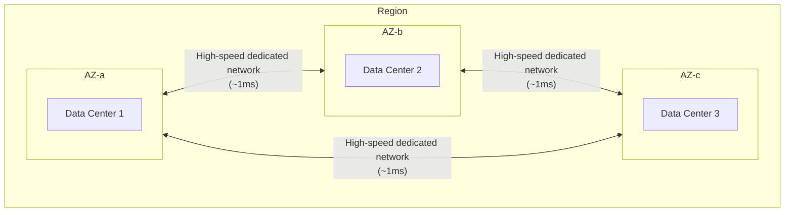

> Last reviewed: May 2026

## Overview

If your own data center exists in only a single facility in one city, a fire or power outage there would take down your entire service. If you place data centers in two different cities for redundancy, the service can keep running from the other side even if one fails.

Cloud **regions** and **availability zones** are exactly this redundancy concept implemented by a vendor at scale. Choosing a region isn't simply about picking a "server location" — it also determines latency, data sovereignty, and disaster recovery strategy.

### Region

A **region** is a geographically separated cluster of data centers. Each region has independent power, cooling, and networking, and is physically dozens to thousands of kilometers away from other regions. In on-premises terms, this is equivalent to data centers located in different cities.

### Availability Zone

An **availability zone** (AZ) is an independent data center (or group of data centers) within a single region. AZs within the same region are connected by high-speed dedicated networks, giving very low latency (typically under 1ms), but each AZ has independent power and cooling systems, so a failure in one AZ does not affect the others.

In on-premises terms, this is similar to server rooms located in different buildings within the same city.

### Edge Location

An **edge location** is small-scale infrastructure placed closer to users than a region. It's mainly used for CDN or DNS services, caching static content for fast delivery to users.

## Comparison by Vendor

| Concept | AWS | Azure | Google Cloud | OCI |
| --- | --- | --- | --- | --- |
| **Region** | Region | Region | Region | Region |
| **Availability zone** | Availability Zone | Availability Zone | Zone | Fault Domain / AD |
| **Region scope** | Independent per region | Geography → Region | **Global VPC** | Realm → Region |
| **Minimum AZs per region** | 3 | 3 | 3 | 3 Fault Domains |
| **Major continent coverage** | North America, South America, Europe, Asia, Oceania, Middle East, Africa | North America, South America, Europe, Asia, Oceania, Middle East, Africa | North America, South America, Europe, Asia, Oceania, Middle East | North America, South America, Europe, Asia, Oceania, Middle East |

### Vendor-Specific Characteristics

#### AWS

| Item | Details |
| --- | --- |
| Hierarchy | Region → Availability Zone (AZ) |
| VPC scope | Region-level |
| Local Zone | Ultra-low-latency infrastructure placed in a specific city |
| Sovereign Cloud | Dedicated region for EU data sovereignty (EU operating staff, data stored within the EU). [AWS European Sovereign Cloud](https://aws.amazon.com/sovereign-cloud/) (Brandenburg, €7.8B investment) |

#### Azure

| Item | Details |
| --- | --- |
| Hierarchy | Geography → Region → Availability Zone |
| VNet scope | Region-level |
| Region Pair | Two regions within the same geography are designated as a pair. Platform updates are not applied to both simultaneously |
| Region pair examples | Some pairs enable in-country DR (e.g. Australia East–Southeast). See country guides for local status |

#### Google Cloud

| Item | Details |
| --- | --- |
| Hierarchy | Region → Zone |
| VPC scope | **Global** — a single VPC can place subnets across multiple regions |
| Multi-region storage | Automatically replicated across multiple regions with no separate configuration |
| Assured Workloads | Isolates regulated workloads to a specific region |

#### OCI

| Item | Details |
| --- | --- |
| Hierarchy | Realm → Region → Availability Domain (AD) → Fault Domain |
| VCN scope | Region-level. Subnets can be placed at the region or AD level |
| Large regions | 3 ADs (physically separated data centers) |
| Small regions | 1 AD + 3 Fault Domains (logical failure isolation) |

## Considerations When Choosing a Region

- **Latency** — Choose a region close to your users. A region in the same country or area as your target users is often the best choice.
- **Service availability** — Not every service is available in every region. AI/ML and newer services in particular are often available only in specific regions.
- **Cost** — Pricing for the same service can vary by region. US regions are usually the cheapest.
- **Compliance** — Regulations may require storing data in a specific country.

:::caution
**Not every service is available in every region.** New AI/ML services in particular are often launched in specific regions first. Before designing your architecture, always verify that the service you want is available in your chosen region.
:::

## Failure Domains and Availability Design

Once you understand regions and AZs, you need to decide what level of distribution to use for your workload.

| Distribution Level | Failure Response | Suitable Workloads |
| --- | --- | --- |
| **Single AZ** | Service stops on AZ failure | Dev/test |
| **Multi-AZ** | Service continues even with an AZ failure | Standard for production |
| **Multi-region** | Service continues even with a full regional failure | Mission-critical |

:::note
Up through multi-AZ, this is approached as a **high availability (HA)** design; from multi-region onward, it's approached as a **disaster recovery (DR)** design. For DR strategy types (Backup & Restore through Active-Active), RPO/RTO definitions, and vendor-specific DR services, see [Disaster Recovery (DR)](../../governance/dr/).
:::

## Regions by Country and Regulation

Choosing a region is not only about latency — it is also about **where data is stored**. For local region codes, in-country DR, and cross-border personal-data transfer requirements, see each country guide:

- [Korea](../../korea/) — Seoul, Busan, and Chuncheon regions; CSAP; Personal Information Protection Act
- [United States](../../us/) — FedRAMP, data residency
- [EU](../../eu/) — GDPR, sovereign cloud
- [Japan](../../japan/) — ISMAP, government cloud
- [Singapore](../../singapore/) — MTCS, PDPA

### Data Sovereignty

Many jurisdictions require consent or a legal basis when transferring personal information overseas. When choosing a cloud vendor, verify region availability and data storage location **in the jurisdiction of your target users**.

Each CSP can enforce regional restrictions as policy:

- **AWS** — Blocks resource creation outside specific regions via SCP (Service Control Policy)
- **Azure** — Restricts allowed regions via Azure Policy
- **Google Cloud** — Restricts regions where resources can be created via Organization Policy
- **OCI** — Restricts regions via Compartment Policy

### Sovereign Cloud

As data sovereignty requirements grow stricter, **sovereign regions** that are physically and logically separated from the public cloud are expanding.

| Vendor | Sovereign Option | Key Characteristics |
| --- | --- | --- |
| AWS | [European Sovereign Cloud](https://aws.amazon.com/sovereign-cloud/) | EU-dedicated infrastructure, staff, and governance. Brandenburg launch (€7.8B investment) |
| Azure | [Cloud for Sovereignty](https://learn.microsoft.com/industry/sovereignty/) / Data Guardian | Sovereign Landing Zone (SLZ), EU Data Boundary, confidential computing |
| Google Cloud | [Sovereign Controls](https://cloud.google.com/blog/products/identity-security/delivering-a-secure-open-sovereign-digital-world) + partners (S3NS, T-Systems) | In-jurisdiction key management, access transparency, GDC (Distributed Cloud) |
| OCI | [EU Sovereign Cloud](https://www.oracle.com/cloud/eu-sovereign-cloud/) | Independently operated EU Realm. Accessible only by EU entities and staff |

:::note
For sovereign landing zone guardrail design and vendor-specific implementation details, see [Landing Zone — Sovereign Landing Zone](../../governance/landing-zone/#sovereign-landing-zone).
:::

## Common Mistakes

- **"Just pick the nearest region"** — Beyond latency, you also need to consider service availability, cost, and compliance requirements together.
- **"A single availability zone is enough"** — A single-AZ deployment causes the entire service to go down on an AZ failure. Production should always be configured as multi-AZ.
- **"Every service is available in every region"** — AI/ML and newer services in particular are often available only in specific regions. Verify service availability before designing your architecture.

## Checklist

- [ ] Did you select the region based on your target user location and regulatory requirements?
- [ ] Did you deploy production workloads across multi-AZ to prepare for a single-AZ failure?
- [ ] Did you verify on the vendor's official page that the services you plan to use are available in your chosen region?

## References

### AWS

- [AWS Regions and Availability Zones](https://docs.aws.amazon.com/ko_kr/AWSEC2/latest/UserGuide/using-regions-availability-zones.html)
- [AWS Local Zones](https://aws.amazon.com/about-aws/global-infrastructure/localzones/)
- [AWS European Sovereign Cloud](https://aws.amazon.com/sovereign-cloud/)

### Azure

- [Azure Regions and Availability Zones](https://learn.microsoft.com/ko-kr/azure/reliability/availability-zones-overview)
- [Azure Region Pairs](https://learn.microsoft.com/ko-kr/azure/reliability/cross-region-replication-azure)

### Google Cloud

- [Google Cloud Locations](https://cloud.google.com/about/locations)
- [Assured Workloads](https://cloud.google.com/assured-workloads/docs)

### OCI

- [OCI Regions and Availability Domains](https://docs.oracle.com/en-us/iaas/Content/General/Concepts/regions.htm)
- [OCI Public Cloud Regions](https://www.oracle.com/cloud/public-cloud-regions/)
