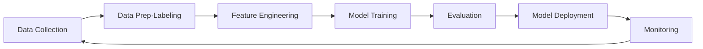

## Overview

:::note
**New to AI?** Read [Getting Started with AI](../../ai/getting-started/) first. This document focuses on service comparison.
:::

### From Traditional ML to Generative AI

| Generation | Core Tech | Characteristics | Cloud Examples |
| --- | --- | --- | --- |
| **Traditional ML** | Regression, classification, clustering | Structured data, feature engineering required | SageMaker, Azure ML, Vertex AI |
| **Deep Learning** | CNN, RNN, Transformer | Unstructured data (image, text, speech). GPU required | GPU instances, managed training platforms |
| **Generative AI** | Foundation models (LLM, multimodal) | Text/image/code generation. Used via API | Bedrock, Microsoft Foundry, Gemini |
| **Agentic AI** | LLM + tool use + autonomous execution | Plans, executes, verifies given a goal | AgentCore, Foundry Agents, [details→](../../ai/agents/) |

### When This Helps

- **Chatbot/support automation** — Responding to customer inquiries around the clock
- **Document summarization/classification** — Rapidly analyzing large volumes of reports, emails, and contracts
- **Translation/content generation** — Multilingual support, marketing copy generation, automated product descriptions
- **Code writing/review** — Improving developer productivity, detecting security vulnerabilities
- **Data analysis** — Gaining data insights through natural language questions

On-premises AI/ML requires purchasing GPU servers, installing frameworks, and building training infrastructure yourself. In the cloud, you can rent GPUs by the hour and train and deploy models on managed platforms.

## Generative AI Model Types

| Type | Input → Output | Representative Services | Use Cases |
| --- | --- | --- | --- |
| **Text (LLM)** | Text → Text | GPT-5.6, Claude Fable 5, Gemini 3.5 | Chatbots, summarization, code generation |
| **Image Generation** | Text → Image | DALL-E, MAI-Image, Imagen, Titan Image | Marketing, design |
| **Speech (TTS/STT)** | Text ↔ Speech | Polly, MAI-Voice, Azure Speech, Cloud TTS | Transcription, IVR, accessibility |
| **Video Generation** | Text → Video | Nova Reel, Veo 3.1, Gemini Omni | Ads, short-form content |
| **Multimodal** | Text+Image+Speech → Text | GPT-5.6, Gemini 3.5 Pro, Claude Fable 5 | Document understanding, image analysis |
| **Embeddings** | Text/Image → Vector | Titan Embeddings, Gemini Embedding, Cohere Embed | RAG, similarity search |

## Generative AI Services

### Foundation Model APIs

| Provider | Key Models | 1P (Direct) | 3P (Cloud-hosted) |
| --- | --- | --- | --- |
| **OpenAI** | GPT-5.6, GPT-5.5, o-series | [api.openai.com](https://platform.openai.com/) | Azure Foundry, Bedrock |
| **Anthropic** | Claude Fable 5, Opus 5, Opus 4.8, Sonnet 5, Haiku | [api.anthropic.com](https://platform.claude.com/) | Bedrock, Vertex AI |
| **Google** | Gemini 3.5 Pro/Flash, 3.1 Pro, Gemini Omni (check [official docs](https://ai.google.dev/) for Preview/GA status) | [Gemini API](https://ai.google.dev/) | Vertex AI (native) |
| **xAI** | Grok 4.3, Grok 4.1 Fast, Imagine | [x.ai/api](https://x.ai/api) | OCI, Vertex AI, Bedrock, Azure |
| **Meta** | Llama 4 (open-weight) | [llama.meta.com](https://llama.meta.com/) | Bedrock, Vertex, Azure, OCI |
| **Amazon** | Nova 1 (Premier/Pro/Lite/Micro/Sonic, etc.) + **Nova 2** (Lite, Pro, etc. — generational distinction) | — (Bedrock only) | Bedrock |
| **Microsoft** | MAI (Image/Voice/Transcribe) | — (Foundry only) | Azure Foundry |
| **Mistral** | Large, Small, Codestral | [api.mistral.ai](https://docs.mistral.ai/) | Bedrock, Azure, Vertex |

:::note
**1P vs 3P difference** — The same model may differ in feature scope, quotas, and billing depending on channel. See [LLM Channel Selection Guide](../../ai/1p-vs-3p/).
:::

### Cloud Platform Strengths

| Platform | Strengths |
| --- | --- |
| [Amazon Bedrock](https://aws.amazon.com/bedrock/) | Multi-model single API, AgentCore, AWS IAM/VPC integration, EDP consumption |
| [Microsoft Foundry](https://azure.microsoft.com/products/ai-services/openai-service) | Primary OpenAI channel, M365/GitHub integration, Foundry Local (air-gapped), PTU |
| [Vertex AI / Gemini Platform](https://cloud.google.com/vertex-ai) | Native Gemini, 2M token context, Model Garden 200+ models, ADK |
| [OCI Enterprise AI](https://docs.oracle.com/iaas/Content/generative-ai/home.htm) | Oracle DB integration, dedicated GPU clusters (RDMA), 10TB egress free |

### AI Agents / RAG

| Vendor | Agent Platform | RAG |
| --- | --- | --- |
| AWS | [Bedrock AgentCore](https://aws.amazon.com/bedrock/agentcore/) | [Bedrock Knowledge Bases](https://aws.amazon.com/bedrock/knowledge-bases/) |
| Azure | [Microsoft Foundry Agents](https://learn.microsoft.com/azure/ai-foundry/agents/) | Azure AI Search |
| Google Cloud | [Gemini Enterprise Agent Platform](https://cloud.google.com/products/agent-builder) | Vertex AI RAG Engine |
| OCI | [OCI Enterprise AI Agents](https://docs.oracle.com/iaas/Content/generative-ai/agents.htm) | OCI Search integration |

### Code Assistants / AI Agents

Coding agents (Kiro, Claude Code, Codex, Copilot, etc.) and agent platforms (AgentCore, Foundry Agents, etc.) are covered in [AI Agents](../../ai/agents/).

## ML Platforms

For organizations that need to train and deploy their own models.

| Vendor | Product | Notes |
| --- | --- | --- |
| AWS | SageMaker AI | Training, tuning, deployment, MLOps |
| Azure | Azure Machine Learning | Notebooks, AutoML, pipelines, model registry |
| Google Cloud | Vertex AI | Training, deployment, pipelines, Feature Store |
| OCI | OCI Data Science | Notebooks, training/deployment, pipelines |

### GPU / AI Accelerators

| Vendor | Products | Notes |
| --- | --- | --- |
| AWS | P6 (B200), P6e (GB200 UltraServer), P5 (H100), Trn2 (Trainium), Inf2 (Inferentia) | Blackwell: P6-B200 (8×B200), P6e-GB200 (up to 72 GPU NVLink). Training: Trainium, Inference: Inferentia |
| Azure | ND GB200-v6, ND H200 v5, ND H100 v5 | GB200-v6: Blackwell flagship for DL training/GenAI/HPC |
| Google Cloud | A4X (GB200 NVL72), A4 (B200), A3 (H100), TPU v5p/v6e | A4X: first cloud GB200 NVL72. TPU: Google's custom AI accelerator |
| OCI | GPU Instances (B200, H100, A100) | NVIDIA Blackwell + Bare Metal + RDMA cluster support |

## Key Differences

**Amazon Bedrock** — Provides access to a wide range of provider models — including its own **Amazon Nova** models (1st-generation Premier/Pro/Lite/Micro/Sonic, etc., and **Nova 2** Lite/Pro, etc. — check the [official model list](https://aws.amazon.com/nova/models/) for generation and availability status) as well as Anthropic Claude, the OpenAI GPT series, and more — through a single API. It offers a broad model selection, and its strength lies in operational capabilities such as AgentCore for building AI agents.

**Microsoft Foundry** — Formerly Azure AI Foundry, now the unified upper-level platform that consolidated the brand. It is the primary channel for using the OpenAI GPT-5.5/5.4 series in enterprise environments, and it also offers a wide range of third-party models such as Anthropic and Meta. It has added its own **MAI model family** (Image-2.5, Voice-1, Transcribe-1) and **Foundry Local** (for local/air-gapped execution). Its greatest strength is deep integration with the existing Microsoft ecosystem, including Microsoft 365, GitHub, and Power Platform.

**Gemini Enterprise Agent Platform** — A full agent-centric overhaul of the former Vertex AI. Its strengths are the native multimodal capabilities of Google's own **Gemini 3.x/2.5** series (3.5 Pro/3.5 Flash/3.1 Pro, etc. — check the [official documentation](https://cloud.google.com/vertex-ai/generative-ai/docs) for the Preview/GA status and limits of each variant) and its TPU infrastructure. Its differentiators are long context, reasoning mode, **Gemini Omni** (multimodal), low-code agent development through Agent Studio, and integration with Google Search/BigQuery.

**OCI Enterprise AI** — An expanded platform that evolved from the former OCI Generative AI. It hosts models such as Cohere, Meta Llama, xAI Grok 4.3, and Google Gemini on OCI infrastructure, and supports high-performance workloads with Dedicated AI Clusters and RDMA-based Bare Metal GPUs. It has added **AI Guardrails** (content moderation, PII detection, prompt injection defense) and **Enterprise AI Agents** (GA). Through its partnership with OpenAI, GPT-5.5/5.4 and Codex are expected to become available on the OCI Marketplace via Oracle Universal Credits, and its strength is native integration with Oracle Database and applications.

## ML Pipeline and MLOps

### ML Lifecycle

### Tools by Stage

| Stage | AWS | Azure | Google Cloud | OCI |
| --- | --- | --- | --- | --- |
| **Data Prep** | SageMaker Data Wrangler, Ground Truth | Azure ML Data Labeling | Vertex AI Data Labeling | OCI Data Labeling |
| **Feature Store** | SageMaker Feature Store | Azure ML Feature Store | Vertex AI Feature Store | OCI Feature Store |
| **Training** | SageMaker Training + Auto Tuning | Azure ML + AutoML | Vertex AI Training + HPT | OCI Data Science Training |
| **Model Registry** | SageMaker Model Registry | Azure ML Model Registry | Vertex AI Model Registry | OCI Model Catalog |
| **Deployment** | SageMaker Endpoints + Serverless | Azure ML Online/Batch Endpoints | Vertex AI Endpoints | OCI Model Deployment |
| **Monitoring** | SageMaker Model Monitor | Azure ML Data Drift Detection | Vertex AI Model Monitoring | OCI Model Monitoring |
| **Pipelines** | SageMaker Pipelines | Azure ML Pipelines | Vertex AI Pipelines (Kubeflow) | OCI Data Science Jobs + Pipelines |

### Choosing Between Generative AI and Traditional ML

| Requirement | Recommended Approach |
| --- | --- |
| Natural language conversation, summarization, translation | Foundation model APIs (Bedrock/Microsoft Foundry/Vertex AI) |
| Domain-specific knowledge + general LLM | RAG (foundation model + vector store) |
| Highly optimized for a specific task | Fine-tuning or custom model training |
| Image/object recognition | Pre-trained vision models or Computer Vision APIs |
| Time-series forecasting, anomaly detection | Traditional ML (SageMaker AI/Vertex AI, etc.) |
| Ultra-lightweight edge deployment | Traditional ML + model quantization |

### AI Development Lifecycle (AI-DLC)

For the full lifecycle of an AI project (problem definition → data → model → evaluation → deployment → monitoring → improvement) and operational details, see [LLMOps](../../ai/llmops/).
- **Cost governance** — AI costs scale with usage and are hard to predict. Be sure to set daily/monthly budget caps, per-task token limits, and cost-overrun alerts.
- **Data drift** — If RAG documents become outdated, answer quality gradually degrades. Set up a regular data refresh pipeline.
- **Compliance** — PII masking in input/output logs, data retention policies, and whether the model uses your data for training must be continuously managed.

:::note
Generative AI's DLC has a **much shorter iteration cycle** than traditional ML. Unlike traditional ML, where model training can take months, prompt changes take effect in minutes and RAG data updates take effect in hours. This fast cycle requires an evaluation, deployment, and rollback framework suited to it.
:::

:::caution
AI services change **far more frequently** than other cloud services. Model names, API endpoints, and pricing change often, so check each vendor's official documentation for changes after this document's reference date.
:::

## Where AI Adoption Is Expanding

### Applied AI (Industry-Specific Turnkey Services)

| Area | Vendor Services | Trend (2025–2026) |
| --- | --- | --- |
| Contact center | Amazon Connect, Azure Contact Center, Google CCAI | Copilot → autonomous agent transition |
| Document processing | Textract, Document Intelligence, Document AI | Combined with LLM/multimodal reasoning |
| BI | Amazon Quick, Copilot in Power BI, Gemini in Looker | Agentic analytics, dashboard agents |
| Healthcare | Amazon Connect Health, Azure Health Bot | HIPAA-compliant agents |

### Physical AI (Connecting to the Physical World)

Physical AI — connecting AI to the physical world of sensors, robots, and equipment (edge inference, digital twins and simulation, robotics foundation models) — is covered in detail from a vendor-neutral perspective in the dedicated [Physical AI](../../ai/physical-ai/) document.

## Multicloud Model Access (2025–2026)

| Event | Impact |
| --- | --- |
| **OpenAI-Microsoft exclusivity ended (2026.04)** | OpenAI models available on non-Azure platforms |
| **OpenAI → Bedrock (2026.04)** | GPT-5.x available on Bedrock post-exclusivity |
| **xAI Grok multicloud expansion** | Available on Azure, Vertex AI, OCI, Bedrock |
| **Anthropic Claude channel expansion** | Beyond Bedrock/Vertex to additional channels |

## Inference Cost Optimization

| Strategy | Description | Vendor Support |
| --- | --- | --- |
| **Flex/Batch Inference** | Process latency-tolerant workloads at lower priority | Bedrock Flex, Azure Batch API, Vertex Batch Predictions |
| **Model Routing** | Route simple queries to lightweight models, complex ones to frontier models | Bedrock IntelligentPromptRouter, custom |
| **Prompt Caching** | Cache repeated system prompts/context to reduce token costs | Anthropic Prompt Caching, OpenAI Cached Tokens, Gemini Context Caching |
| **Long Context vs RAG** | Extended context windows (1–2M+ tokens) may eliminate RAG need | Gemini 3.5 Pro, Claude Opus |
| **GPU Price Competition** | Hyperscaler GPU instance pricing trending downward | AWS, Azure, GCP competitive pricing |

:::note
Inference pricing changes frequently. Check each vendor's official pricing page for current rates. Cost tracking and budget management are detailed in [LLMOps](../../ai/llmops/).
:::

## Common Mistakes

- **Starting with fine-tuning** — RAG often suffices; fine-tuning wastes cost/time on problems RAG can solve.
- **Not pinning model versions** — Vendor model updates can silently degrade production prompt quality.
- **Single model for all workloads** — Using frontier models for simple classification tasks inflates costs. Route by task complexity.

## Checklist

- [ ] Selected models matching workload characteristics and compared cost/quality
- [ ] Pinned model ID/version in code; upgrades go through evaluation before rollout
- [ ] Following staged approach: RAG → Fine-tuning → Train from scratch

## References

### AWS
- [Amazon Bedrock](https://docs.aws.amazon.com/bedrock/)
- [Amazon SageMaker AI](https://docs.aws.amazon.com/sagemaker/)

### Azure
- [Microsoft Foundry](https://learn.microsoft.com/azure/ai-services/openai/)
- [Azure Machine Learning](https://learn.microsoft.com/azure/machine-learning/)

### Google Cloud
- [Vertex AI](https://cloud.google.com/vertex-ai/docs)
- [Gemini API](https://cloud.google.com/vertex-ai/generative-ai/docs)

### OCI
- [OCI AI Services](https://www.oracle.com/artificial-intelligence/ai-services/)
- [OCI Enterprise AI](https://docs.oracle.com/en-us/iaas/Content/generative-ai/home.htm)
