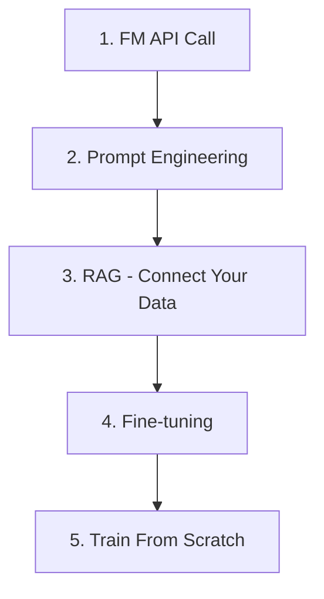

## The Big Picture

"AI" is not a single technology. It is a collective term for decades of techniques that **coexist** rather than replace one another.

| Generation | Core Tech | What It Does | Cloud Services |
| --- | --- | --- | --- |
| **Traditional ML** | Regression, classification, clustering, trees | Predict/classify structured data (churn, anomaly detection, recommendations) | SageMaker AI, Azure ML, Vertex AI, OCI Data Science |
| **Deep Learning** | CNN, RNN, Transformer | Process unstructured data (image recognition, speech, translation) | GPU instances + ML platforms |
| **Generative AI** | Foundation models (LLM, multimodal) | Generate text/image/code/speech | Bedrock, Microsoft Foundry, Gemini |
| **Agentic AI** | LLM + tool use + autonomous execution | Given a goal, plans, executes, and verifies on its own | AgentCore, Foundry Agents, Gemini Agent Platform |

:::note
**Starting now?** Most enterprise AI adoption begins with **generative AI** (FM API calls). Traditional ML remains active where data pipelines exist; deep learning thrives for image/speech workloads. This guide focuses on generative AI while pointing to traditional ML/DL where needed.
:::

### Deciding Which AI You Need

| Problem to Solve | Approach | Document |
| --- | --- | --- |
| Structured data prediction (revenue, churn, anomaly) | Traditional ML | [AI Platforms — ML Platforms](../../ai/ai-ml/) |
| Image/video classification, object detection | Deep Learning (Computer Vision) | [AI Platforms — ML Platforms](../../ai/ai-ml/) |
| Natural language conversation, summarization, code generation | Generative AI (FM API) | See below |
| Multi-step automation, tool calling, autonomous tasks | Agents | [AI Agents](../../ai/agents/) |
| Productivity assist (AI tools for all employees) | Desktop Agent | [AI Agents](../../ai/agents/) |

---

## Why Use AI on the Cloud

Training an AI model from scratch requires billions in GPU investment, millions of training samples, and months of compute time. Most organizations use **ready-made AI services provided by cloud vendors** rather than doing this themselves.

## Three Key Concepts

### 1. Foundation Model (FM)

A general-purpose AI model pre-trained on massive data. The most common type is an **LLM** (Large Language Model). GPT (OpenAI), Claude (Anthropic), Gemini (Google), and Nova (Amazon) are examples.

- Used via API calls — no need to train yourself.
- Think of it as "a smart assistant that answers questions."

### 2. Prompt

The input message sent to the model. Written in natural language. Output quality varies greatly depending on how you ask.

### 3. Token

The unit a model uses to process text. Roughly one word ≈ 1–2 tokens. Most APIs **bill by input/output token count**.

## Generative AI Adoption Stages

Below covers the most common path — adopting generative AI via FM APIs. For traditional ML pipelines (train → deploy → monitor), see [AI Platforms — ML Pipeline](../../ai/ai-ml/).

Complexity and cost increase as you move down.

### Stage 1: API Call

The simplest starting point. Send a question to Amazon Bedrock, Microsoft Foundry, Gemini Enterprise, or OCI Enterprise AI and receive an answer. See [AI Platforms and Model Comparison](../../ai/ai-ml/) for vendor comparisons.

**Use cases:** chatbots, document summarization, translation.

### Stage 2: Prompt Engineering

Same API, dramatically different results depending on how you ask. Adding role, constraints, and examples improves quality without writing code. See [Prompt Engineering](../../ai/prompt-engineering/).

### Stage 3: RAG (Retrieval-Augmented Generation)

Foundation models lack knowledge of **your organization's data**. RAG retrieves relevant documents and includes them in the prompt before sending to the model.

Analogy: "Letting the model take an open-book exam."

**Use cases:** internal document chatbots, product FAQ, legal/medical document lookup.

RAG works with [Vector Stores](../../ai/vector-store/). See [Advanced RAG Patterns](../../ai/rag-patterns/) for implementation details.

### Stage 4: Fine-tuning

Adjust the model with your data. Enables domain specialization but significantly increases cost and time.

**Use cases:** industry-specific terminology, company tone/style, enforcing specific output formats.

### Stage 5: Train From Scratch

Unnecessary for most organizations. This is what Google, OpenAI, and Anthropic do.

For model operations, evaluation, and cost tracking see [LLMOps](../../ai/llmops/). For AI security and guardrails see [AI Security](../../security/ai-security/).

## When to Use Which Method

| Situation | Recommended |
| --- | --- |
| Quick prototype | Stage 1 (API call) |
| Using API but quality is lacking | Stage 2 (Prompt engineering) |
| Need answers based on company documents | Stage 3 (RAG) |
| Specialized domain the general model doesn't know | Stage 4 (Fine-tuning) |
| Entirely new problem with no existing model | Stage 5 (Train from scratch) |

:::note
**Practical advice:** Most tasks are well served through Stage 3 (RAG). Fine-tuning has high build/ops costs — try RAG first and only consider fine-tuning when its limitations are clear.
:::

## Why Not Train Your Own Model

| Factor | Train from Scratch | Cloud API |
| --- | --- | --- |
| **Initial cost** | Hundreds of millions in GPU | Cents to dollars per API call |
| **Time** | Months to years | Minutes (API integration) |
| **Data** | Trillions of training tokens needed | Model already trained |
| **Talent** | Many ML engineers/researchers | General developers |
| **Updates** | Retraining required | Vendor auto-updates |
| **Effectiveness** | State-of-the-art possible | Sufficient for most tasks |

## Common Mistakes

- **Skipping prompt engineering and jumping to fine-tuning** — Prompt improvements alone often suffice, yet teams invest the cost/time of fine-tuning first.
- **Designing without considering token costs** — Sending long system prompts on every request or including unnecessarily large documents in context causes cost explosion.
- **Relying solely on model internal knowledge without RAG** — FMs don't know post-training information or internal data, causing hallucinations.

## Checklist

- [ ] Following the staged approach: API call → prompt engineering → RAG → fine-tuning
- [ ] Monitoring token usage and costs with budget caps set
- [ ] RAG pipeline configured for cases requiring answers based on internal data

## References

### AWS
- [Amazon Bedrock](https://aws.amazon.com/bedrock/)
- [Amazon Nova 2 Model Guide](https://docs.aws.amazon.com/bedrock/latest/userguide/model-parameters-nova.html)

### Azure
- [Microsoft Foundry Documentation](https://learn.microsoft.com/azure/ai-studio/)
- [Microsoft Foundry Portal](https://ai.azure.com/)

### Google Cloud
- [Gemini Enterprise Agent Platform](https://cloud.google.com/vertex-ai/docs)
- [Gemini Models](https://deepmind.google/technologies/gemini/)

### OCI
- [OCI Enterprise AI](https://www.oracle.com/artificial-intelligence/generative-ai/generative-ai-service/)

### Introductory Resources
- [AWS — What is Generative AI?](https://aws.amazon.com/what-is/generative-ai/)
- [Microsoft — What is Generative AI?](https://azure.microsoft.com/en-us/solutions/ai/generative-ai)
- [Google Cloud — Gen AI Overview](https://cloud.google.com/ai/generative-ai)
- [Oracle — What Is Generative AI?](https://www.oracle.com/artificial-intelligence/generative-ai/what-is-generative-ai/)

### Glossary

- [CloudPick Glossary](../../glossary/) — includes AI/ML-related terms
