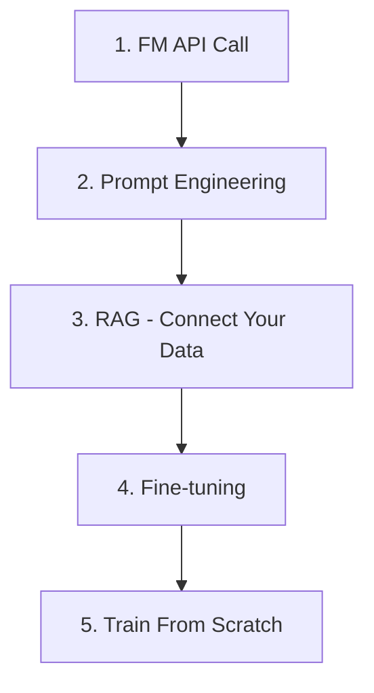

> Last reviewed: August 2026

## Decide First: Is AI the Right Fit for This Problem?

Before choosing an interface or a model, confirm **whether this is even an AI problem**. Generative AI is strong at producing plausible text, code, and images, but it is **not a source of verified facts, up-to-date internal data, or deterministic calculation.** Use these four questions to filter.

1. Is this a problem you can solve precisely with rules and computation, or one that tolerates uncertainty like generation, summarization, or classification?
2. Do you need up-to-date information or internal, company-specific grounding?
3. Can a human review wrong answers or wrong actions, or can you constrain them with permissions?
4. Can you define success criteria, representative test inputs, and a cost ceiling?

| Nature of the problem | Recommended approach |
| --- | --- |
| Solved by deterministic rules/computation | Conventional software (no AI needed) |
| Structured-data prediction/classification | Traditional ML ([ML Platforms](../../ai/ai-ml/#ml-platforms)) |
| Generation, summarization, coding assistance | Generative AI (via the three ways below) |
| Requires up-to-date/internal grounding | Generative AI + RAG or tool use |
| High-impact judgment or state-changing actions | Human approval and least privilege required ([AI Security](../../security/ai-security/)) |

:::note
This gate covers the entry decision only. For detailed fit/ROI/governance judgment see [AI System Lifecycle](../../ai/lifecycle/#1-problem-framing--governance), and for a list of useful use cases see [AI Platform and Model Comparison](../../ai/ai-ml/#when-this-helps).
:::

If the problem ends with rules and statistics, stop here and use conventional software. If AI is a fit, decide **which interface to use** below.

## Three Ways to Use AI

The first thing to decide in AI adoption is not "which technology" but **"through which interface will we use AI."** There are three broad ways, and one organization often uses all three in parallel.

| Way to use | What it is | Primary users | Representative examples |
| --- | --- | --- | --- |
| **① Conversational AI apps & platforms** | Subscribe to finished chatbots/copilots and use them right away. Build internal bots with no-code builders | Non-technical staff, business planners | ChatGPT, Gemini app, Microsoft 365 Copilot, Copilot Studio |
| **② AI coding tools** | Developers delegate code writing/editing to AI in the IDE or terminal | Software engineers | GitHub Copilot, Claude Code, Codex, Kiro, Grok Build |
| **③ API & SDK** | Apps and agents call models programmatically and embed them in products | Development teams, system integrators | Amazon Bedrock API, Azure Foundry SDK, api.openai.com |

:::note
- **①→②→③ is not a sequence (maturity ladder).** It is a choice based on **the primary interface** according to "who is doing what."
- **Boundary cases**: A no-code builder like Copilot Studio is ① (used by non-technical staff) yet has development elements, and AI coding tools (②) internally call APIs (③). Types are not exclusive categories but a "primary usage" basis.
- Within each type there is also a **spectrum from subscribing to a finished product (Buy) to building/training your own (Build/Train)**. For the detailed matrix by control and responsibility boundary, see [AI System Lifecycle and Engineering](../../ai/lifecycle/#4-tier-enterprise-adoption-matrix).
- To **automate work with agents**, see [AI Agents](../../ai/agents/) and the [Agent Adoption Guide](../../ai/agent-adoption/).
:::

This document covers the concepts and starting points of ① and ②, and how to use ③ (building directly with APIs) below.

## Why Use AI on the Cloud

Pre-training a frontier foundation model from scratch requires tens of millions of dollars in massive GPU clusters, trillions of training tokens, and months of compute time. Most organizations do not do this themselves and instead use **ready-made AI services provided by cloud vendors**.

By analogy, it is like drawing electricity from a power plant or the power grid rather than generating your own. We focus on "what to do with electricity," not "how to generate electricity."

## Three Key Concepts

### 1. Foundation Model (FM)

A general-purpose AI model pre-trained on massive data. The most common type is an **LLM** (Large Language Model). GPT (OpenAI), Claude (Anthropic), Gemini (Google), and Nova (Amazon) are examples.

- Used via API calls — no need to train yourself.
- Think of it as "a smart assistant that answers questions."

### 2. Prompt

The input message sent to the model. Written in natural language, such as "Tell me the capital of Korea." Output quality varies greatly depending on how you ask.

### 3. Token

The unit a model uses to process text. Roughly one word ≈ 1–2 tokens. Most APIs **bill by input/output token count**.

## Background: The AI Technology Lineage

"AI" is not a single technology. It is a collective term for decades of techniques, and each generation **coexists** with rather than replaces the previous one. The three ways above mainly deal with the latest generations — generative and agentic AI — but traditional ML and deep learning are still in use.

| Generation | Core Tech | What It Does | Cloud Services |
| --- | --- | --- | --- |
| **Traditional ML** | Regression, classification, clustering, trees | Predict/classify structured data (churn, anomaly detection, recommendations) | SageMaker AI, Azure ML, Vertex AI, OCI Data Science |
| **Deep Learning** | CNN, RNN, Transformer | Process unstructured data (image recognition, speech, translation) | GPU instances + ML platforms |
| **Generative AI** | Foundation models (LLM, multimodal) | Generate text/image/code/speech | Bedrock, Microsoft Foundry, Gemini |
| **Agentic AI** | LLM + tool use + autonomous execution | Given a goal, plans, executes, and verifies on its own | AgentCore, Foundry Agents, Gemini Agent Platform |

:::note
Traditional ML remains active where data pipelines exist; deep learning thrives for specialized workloads such as image and speech. For a detailed comparison of per-generation vendor services and models, see [AI Platform and Model Comparison](../../ai/ai-ml/). For structured-data prediction and training your own models (traditional ML pipelines), see [ML Platforms](../../ai/ai-ml/#ml-platforms).
:::

## Method: How Do You Extend AI

Even with the same foundation model, results differ depending on **the method by which you adapt it to your problem**. The methods below are not exclusive to one way of using AI — they **run through all three ways**. For example, prompt improvement appears as "custom instructions" in ① conversational apps, connecting your data appears as "file upload" in ① or knowledge grounding in a no-code builder, and as a RAG pipeline in ③ the API.

Cost and complexity increase as you move down, and the stages are most distinct when building directly with ③ (API/SDK).

### Stage 1: API Call

The simplest starting point. Send a question to one of Amazon Bedrock, Microsoft Foundry, Gemini Enterprise, or OCI Enterprise AI and receive an answer. See [AI Platform and Model Comparison](../../ai/ai-ml/) for vendor comparisons.

**Use cases:**
- Chatbots that answer user questions
- Document summarization
- Translation

### Stage 2: Prompt Engineering

Same API, dramatically different results depending on how you ask. For example, giving a clear role and instruction like "You are a legal expert. Find five risk factors in the contract below" improves quality. For detailed design techniques, see [Prompt Engineering](../../ai/prompt-engineering/).

**This is an improvement you can make without writing code.**

### Stage 3: RAG (Retrieval-Augmented Generation)

Foundation models are rich in general knowledge but **do not know your company's data**. RAG retrieves your documents, includes the relevant parts in the prompt, and then sends it to the model.

Analogy: "Letting the model take an open-book exam."

**Use cases:**
- Internal document-based chatbots
- Automated product FAQ responses
- Legal/medical document lookup

RAG works with [Vector Stores](../../ai/vector-store/). See [Advanced RAG Patterns](../../ai/rag-patterns/) for implementation details.

### Stage 4: Fine-tuning

Fine-tune the model with your data. It can be optimized for a specific task but cost and time increase significantly.

**Use cases:**
- Understanding industry-specific terminology
- Reflecting a company's unique tone/style
- Enforcing a specific output format

### Stage 5: Train From Scratch

Unnecessary for most organizations. This is what companies like Google, OpenAI, and Anthropic do.

For model operations, evaluation, and cost tracking see [LLMOps](../../ai/llmops/). For AI security and guardrails see [AI Security](../../security/ai-security/).

## When to Use Which Method

The table below takes a beginner's **learning-order** view (simple → advanced). For a practical routing view that maps requirements directly to approaches, technologies, and docs, see [AI System Lifecycle — Technical Task Selection Guide](../../ai/lifecycle/#technical-task-selection-guide).

| Situation | Recommended |
| --- | --- |
| Want a quick prototype | Stage 1 (API call) |
| Using API but quality is lacking | Stage 2 (Prompt engineering) |
| Want answers grounded in company documents | Stage 3 (RAG) |
| Specialized domain the general model doesn't know well | Stage 4 (Fine-tuning) |
| Entirely new problem with no existing model | Stage 5 (Train from scratch) |

:::note
**Practical advice:** Most tasks are well served through Stage 3 (RAG). Fine-tuning has high build/ops costs — try RAG first and only consider fine-tuning when its limitations are clear.
:::

## Why Not Build Your Own AI Model

| Factor | Train from Scratch | Cloud API |
| --- | --- | --- |
| **Initial cost** | Tens of millions in GPU infrastructure | Cents to dollars per API call |
| **Time** | Months to years | Minutes (API integration) |
| **Data** | Trillions of training tokens needed | Model already trained |
| **Talent** | Many ML engineers/researchers | Achievable with general developers |
| **Updates** | Retraining required | Vendor auto-updates |
| **Effectiveness** | State-of-the-art possible | Sufficient for most tasks |

## Common Mistakes

- **Skipping prompt engineering and jumping to fine-tuning** — Prompt improvements alone often suffice, yet teams invest the cost/time of fine-tuning first.
- **Designing without considering token costs** — Sending long system prompts on every request or including unnecessarily large documents in context causes cost explosion.
- **Relying solely on model internal knowledge without RAG** — FMs don't know post-training information or internal data, causing hallucinations.

## Checklist

- [ ] Following the staged approach: API call → prompt engineering → RAG → fine-tuning
- [ ] Monitoring token usage and costs with budget caps set
- [ ] RAG pipeline configured for cases requiring answers based on internal data

## References

### AWS
- [Amazon Bedrock](https://aws.amazon.com/bedrock/)
- [Amazon Nova 2 Model Guide](https://docs.aws.amazon.com/bedrock/latest/userguide/model-parameters-nova.html)

### Azure
- [Microsoft Foundry Documentation](https://learn.microsoft.com/azure/ai-studio/)
- [Microsoft Foundry Portal](https://ai.azure.com/)

### Google Cloud
- [Gemini Enterprise Agent Platform](https://cloud.google.com/vertex-ai/docs)
- [Gemini Models](https://deepmind.google/technologies/gemini/)

### OCI
- [OCI Enterprise AI](https://www.oracle.com/artificial-intelligence/generative-ai/generative-ai-service/)
- [Oracle AI Database (Vector Search)](https://www.oracle.com/database/ai-vector-search/)

### Introductory Resources
- [AWS — What is Generative AI?](https://aws.amazon.com/what-is/generative-ai/)
- [Microsoft Learn — Azure OpenAI Service overview](https://learn.microsoft.com/azure/ai-services/openai/overview)
- [Google Cloud — Gen AI Overview](https://cloud.google.com/ai/generative-ai)
- [Oracle — What Is Generative AI?](https://www.oracle.com/artificial-intelligence/generative-ai/what-is-generative-ai/)

### Glossary

- [CloudPick Glossary](../../glossary/) — includes AI/ML-related terms
