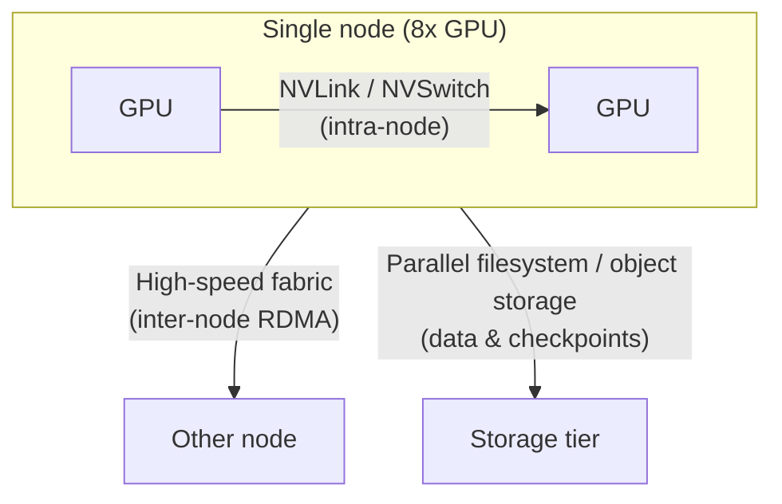

> Last reviewed: September 2026 | This is a fast-moving area subject to quarterly review.

:::tip[GPU Infrastructure series — reading order]
This is Part 1 of a four-part GPU infrastructure series.

1. **GPU Workload Characteristics and Reference Architecture** (this document) — workload classes, the three communication tiers, placement
2. [Distributed Training Standard Architecture](../distributed-training/) — parallelism (TP/PP/DP), checkpoints
3. [GPU Kubernetes and Scheduling](../kubernetes-and-scheduling/) — node pools, quotas, gang scheduling
4. [Inference Serving, Reliability, and Cost](../serving-reliability-cost/) — serving, failures, capacity, cost

Reading in order is recommended, but if you are **already running training, start at Part 2**, and if you are in **cluster operations/SRE, start at Parts 3–4**.
:::

:::note
This document covers advanced GPU infrastructure design. GPU instance specs by generation, regional availability, and reserved/spot options are in [Multicloud AI — GPU Availability](../../../ai/multicloud-ai/#gpu-availability); AI platform and model selection is in [AI Platforms and Model Comparison](../../../ai/ai-ml/). This document focuses on "how to combine multiple GPUs into a single cluster for training and inference."
:::

## Overview

You need this document when a model or its data exceeds the capacity of a single GPU (or a single server). In that case, you have to combine multiple GPUs and multiple servers into one and split the work across them.

A common misconception here is "faster GPUs and more of them makes it that much faster." It doesn't work that way. For multiple GPUs to collaborate, they must constantly exchange calculation results, and **if you add GPUs without also increasing inter-node communication bandwidth and storage throughput, only GPU idle time grows and performance does not scale linearly.** (Just as adding cooks doesn't speed things up if the kitchen is cramped and the aisles for carrying ingredients are jammed.)

So GPU infrastructure design is less about "which GPU" and more about **how you connect the GPUs and how you move the data**. This document first classifies what kind of workload you have (training vs. inference, etc.), then compares four vendors across a connection structure split into three tiers: **intra-node → inter-node → storage**.

:::note
In this document, a **node** means one server with several GPUs installed, and a **cluster** means several such nodes grouped together.
:::

### What stays the same across clouds, and what differs per vendor

Sorting out what carries over versus what you must relearn when switching clouds makes the rest easier.

- **What carries over (portability baseline)** — Training/inference code mostly runs on the common foundation of **CUDA and NCCL**. (CUDA = NVIDIA's standard software for running computation on GPUs; NCCL = the library that lets multiple GPUs exchange results.) Code written on top of these two generally ports across clouds.
- **What differs per vendor** — The **high-speed network physically connecting the GPUs, the way servers are placed close together, and the fully managed cluster products** differ in name and implementation by vendor, and cannot be swapped one-to-one.

:::caution
The fine-grained settings of vendor-specific implementations (e.g., communication queue counts for a specific instance, partition keys) are out of scope. This document focuses on comparing concepts across vendors side by side, delegating detailed tuning to each vendor's official documentation. Performance figures also depend heavily on instance, driver, library version, storage, and placement, so measure with real workloads before adoption.
:::

## Three GPU Workload Classes

Because the bottleneck resource differs per workload, the starting point of infrastructure design is understanding workload characteristics.

| Workload | Dominant bottleneck | Communication needs | Storage needs | Representative infrastructure traits |
| --- | --- | --- | --- | --- |
| **Pre-training** | Compute + inter-node communication | Very high (all nodes communicate together) | High (streaming large datasets) | Many nodes, high-speed network required, checkpoint bandwidth critical |
| **Fine-tuning** | Compute + memory | Medium (often within a few nodes) | Medium | Small-to-medium cluster, often feasible on a single node |
| **Inference** | Memory bandwidth + latency | Low (only when model-parallel) | Low (weights resident after load) | Latency/throughput balance, autoscaling-centric |

:::note
Most enterprise workloads concentrate on fine-tuning and inference, and these two are often satisfied by a single node or a small number of nodes. It is mainly large-scale pre-training where an inter-node high-speed fabric governs performance. Choose the minimal configuration that fits your workload.
:::

## Reference Architecture — Three-Tier Communication Model

There are roughly three kinds of paths data travels in a GPU cluster. Each path is built with different technology and differs in both speed and role. When comparing vendors, mixing these three tiers leads to wrong comparisons, so always separate them.

- **Intra-node (within one server)** — GPUs inside one server are joined by ultra-fast dedicated links called NVLink/NVSwitch. This is the fastest of the three tiers and is determined by NVIDIA hardware characteristics regardless of vendor.
- **Inter-node (server to server)** — Servers are connected by a **high-speed fabric**. Here, a fabric means "a dedicated high-speed network that tightly weaves servers together," and RDMA (Remote Direct Memory Access) is the technology that "exchanges data directly between server memories without going through the CPU." **This tier is implemented differently by each vendor and governs large-scale training performance.**
- **Storage (data store)** — The path for reading training data and writing/reloading intermediate saves (checkpoints). If this path is slow, GPUs sit idle waiting for data.

### Inter-node High-Speed Fabric — Vendor Mapping

| Tier | AWS | Azure | Google Cloud | OCI |
| --- | --- | --- | --- | --- |
| **Inter-node fabric** | [EFA (Elastic Fabric Adapter)](https://docs.aws.amazon.com/AWSEC2/latest/UserGuide/efa.html) | [InfiniBand](https://learn.microsoft.com/azure/virtual-machines/sizes/overview) (ND series) | [GPUDirect-TCPX / RDMA](https://cloud.google.com/compute/docs/gpus) | [RDMA Cluster Network](https://docs.oracle.com/en-us/iaas/Content/Compute/Tasks/managingclusternetworks.htm) |
| **Communication library** | NCCL | NCCL | NCCL | NCCL |
| **Same concept?** | Approximate — name, implementation, and performance characteristics differ | Approximate | Approximate | Approximate |

:::caution
The four fabrics above are **different technologies that play the same role**; they are not one-to-one equivalents. For example, InfiniBand and EFA differ in protocol, congestion control, and supported instances. Do not simply substitute "vendor A's X = vendor B's Y"; use application portability on top of NCCL as your baseline, but measure fabric performance per vendor.
:::

### Placement & Topology — Physical Proximity and NUMA

Two things must line up to realize inter-node communication performance. First, the GPU servers must be **physically close** within the data center (if scattered far apart, the round trip takes longer). Second, within one server, the GPU and the network card (NIC) it uses must sit in the **same zone**. Here, NUMA (Non-Uniform Memory Access) refers to "a structure where even within one server the CPU/memory is split into zones, so same-zone access is fast and crossing to another zone is slow."

| Item | AWS | Azure | Google Cloud | OCI |
| --- | --- | --- | --- | --- |
| **Proximity placement** | Placement Group (Cluster) | Proximity Placement Group + VMSS | Compact Placement Policy | Cluster Network (built-in proximity provisioning) |
| **NUMA/GPU-NIC alignment** | Instance topology exposed, NCCL topology awareness | Topology exposed | gVNIC + topology awareness | Bare Metal topology pinning |

- **Proximity placement** — To bind training nodes at low latency, you must explicitly request proximity placement. Nodes scattered without a placement group incur higher collective-communication latency, reducing training throughput.
- **NUMA/GPU-NIC affinity** — If a GPU and the NIC it uses reside on different NUMA nodes, data traverses the inter-socket link, causing latency and bandwidth loss. Align them with NCCL topology awareness and process binding.

## Managed GPU Clusters

Instead of assembling nodes, fabric, and scheduler yourself, using a vendor-provided managed GPU cluster gets topology, health checks, and restarts pre-integrated. For large-scale training, this is a first-class option.

| Vendor | Managed cluster product | Characteristics |
| --- | --- | --- |
| AWS | [SageMaker HyperPod](https://aws.amazon.com/sagemaker/hyperpod/) | Node health checks/auto-replacement, checkpoint-based resume built in |
| Azure | [CycleCloud](https://learn.microsoft.com/azure/cyclecloud/) + ND series | HPC/AI cluster orchestration, scheduler integration (auto node-replacement not built in — configured via scheduler/scripts) |
| Google Cloud | [AI Hypercomputer / Cluster Director](https://cloud.google.com/ai-hypercomputer) | Integrated infrastructure stack, topology-aware provisioning |
| OCI | [Supercluster](https://www.oracle.com/cloud/compute/gpu/) | RDMA cluster network, ultra-low-latency connectivity for large GPU counts (Bare Metal) |

:::note
OCI's **Dedicated AI Cluster** is a different tier from the training infrastructure above. It is a managed (PaaS) resource within OCI Enterprise AI for fine-tuning and hosting pre-trained foundation models, not training infrastructure you assemble yourself. The equivalent for large-scale training infrastructure is Supercluster.
:::

:::note
Managed clusters greatly reduce initial assembly and operational burden but increase vendor lock-in. Building on pure Kubernetes raises portability but makes you responsible for topology, health checks, and gang scheduling yourself. Judge the portability-vs-operational-convenience trade-off by workload scale and team capability. For Kubernetes-based configuration, see [GPU Kubernetes and Scheduling](../kubernetes-and-scheduling/).
:::

### Orchestrator Choice — Slurm vs Kubernetes

A fork you hit when picking a managed GPU cluster is **which orchestrator distributes the work**. There are broadly two paths — Slurm and Kubernetes — and they are not a superior/inferior substitution but **options you pick by workload characteristics**.

- **Slurm** — An open-source workload manager (job scheduler) long used in HPC (high-performance computing). A user submits a **job ("give me N GPUs for M hours"), and Slurm places it in a priority-ordered queue (partition) and allocates it to nodes as they free up**. Because it centers on batch jobs rather than containers, it has less friction for large-scale pre-training or when lifting existing on-prem HPC/Slurm jobs as-is, and you can reuse submission scripts and recipes.
- **Kubernetes** — The container-orchestration standard, stronger at **long-running services (such as inference servers) than at batch jobs**. It is advantageous when running training, inference, and serving mixed on one cluster, or when you need namespace isolation and multi-tenancy, and it reuses your existing Kubernetes ecosystem. Note that gang scheduling, which distributed training needs, must be added via separate tools (see [GPU Kubernetes and Scheduling](../kubernetes-and-scheduling/)).

Most managed clusters offer both orchestrators, and some also support a hybrid approach that bridges the two.

| Orchestrator | AWS | Azure | Google Cloud | OCI |
| --- | --- | --- | --- | --- |
| **Slurm (HPC)** | [HyperPod + Slurm](https://docs.aws.amazon.com/sagemaker/latest/dg/sagemaker-hyperpod-slurm.html) (managed) | [CycleCloud Workspace for Slurm](https://learn.microsoft.com/azure/cyclecloud/overview-ccws) (managed) | [Cluster Director](https://cloud.google.com/products/cluster-director) (managed) · [Cluster Toolkit](https://cloud.google.com/ai-hypercomputer/docs/create/create-self-managed-slurm-cluster) (self-deployed) | Supercluster + [HPC stack](https://www.oracle.com/cloud/hpc/) (self-deployed) |
| **Kubernetes** | HyperPod + EKS / EKS | AKS | GKE | OKE |
| **Hybrid** | — | — | [Cluster Director — Slurm on GKE](https://cloud.google.com/blog/products/compute/cluster-director-is-now-generally-available) (Preview) | — |

:::caution
The entries above are **different implementations that play the same role**; they are not one-to-one equivalents. Read the table with three distinctions in mind.

- **Managed vs. self-deployed** — Even the same "Slurm" differs in procurement and operational burden between a vendor-managed orchestrator and one you deploy yourself from a template or toolkit and then operate.
- **Maturity** — Cluster Director's Slurm on GKE is in **Preview** as of September 2026. Confirm the current release stage before assuming it for production.
- **What `—` means** — No first-party hybrid was identified for that vendor as of September 2026. It does not mean a third-party or self-built configuration is impossible.

Verify per-vendor provisioning method, resiliency features, and integration depth against each vendor's official documentation.
:::

:::note
This document covers Slurm only up to the orchestrator-choice axis, delegating detailed configuration such as sbatch scripts and partition settings to each vendor's official documentation. If you choose Kubernetes, node-pool, quota, and gang-scheduling configuration is in [GPU Kubernetes and Scheduling](../kubernetes-and-scheduling/), linked above.
:::

## Related Documents

- **Next: Distributed training parallelism (TP/PP/DP)** — [Distributed Training Standard Architecture](../distributed-training/)
- **Kubernetes, scheduling, quotas** — [GPU Kubernetes and Scheduling](../kubernetes-and-scheduling/)
- **Inference serving, failures, capacity, cost** — [Inference Serving, Reliability, and Cost](../serving-reliability-cost/)
- **Confidential GPU computing** — [Data Protection — Confidential Computing](../../../security/data-protection/#confidential-computing)

## Common Mistakes

- **Choosing the top GPU generation without workload analysis** — Applying a large-scale pre-training configuration to a workload well served by fine-tuning/inference, spiking cost
- **Multi-node training without a placement group** — Nodes physically scattered, increasing collective-communication latency and degrading training throughput
- **Substituting fabrics one-to-one across vendors** — Assuming EFA, InfiniBand, and RDMA are identical, leading to mispredicted performance
- **Under-provisioning storage bandwidth** — GPUs idle while checkpoints are written, lowering effective utilization

## Checklist

- [ ] Did you classify the workload as pre-training/fine-tuning/inference and identify the dominant bottleneck (compute/memory/communication)?
- [ ] Did you design the three tiers (intra-node/inter-node/storage) separately?
- [ ] Did you explicitly request proximity placement (placement group/cluster network) for multi-node training?
- [ ] Did you verify GPU-NIC NUMA alignment and NCCL topology awareness?
- [ ] Did you evaluate the portability/operational trade-off between managed clusters and self-built configuration?

## References

### AWS

- [Elastic Fabric Adapter (EFA)](https://docs.aws.amazon.com/AWSEC2/latest/UserGuide/efa.html)
- [SageMaker HyperPod](https://aws.amazon.com/sagemaker/hyperpod/)
- [SageMaker HyperPod — Slurm orchestration](https://docs.aws.amazon.com/sagemaker/latest/dg/sagemaker-hyperpod-slurm.html)

### Azure

- [GPU-optimized VM sizes](https://learn.microsoft.com/azure/virtual-machines/sizes/overview)
- [Azure CycleCloud](https://learn.microsoft.com/azure/cyclecloud/)
- [CycleCloud Workspace for Slurm](https://learn.microsoft.com/azure/cyclecloud/overview-ccws)

### Google Cloud

- [Cloud GPUs](https://cloud.google.com/compute/docs/gpus)
- [AI Hypercomputer](https://cloud.google.com/ai-hypercomputer)
- [Cluster Toolkit — self-managed Slurm cluster](https://cloud.google.com/ai-hypercomputer/docs/create/create-self-managed-slurm-cluster)
- [Cluster Director (product page)](https://cloud.google.com/products/cluster-director)
- [Cluster Director GA announcement (includes Slurm on GKE Preview)](https://cloud.google.com/blog/products/compute/cluster-director-is-now-generally-available)

### OCI

- [OCI HPC (Slurm stack deployment)](https://www.oracle.com/cloud/hpc/)

- [Cluster Networks](https://docs.oracle.com/en-us/iaas/Content/Compute/Tasks/managingclusternetworks.htm)
- [OCI GPU Compute](https://www.oracle.com/cloud/compute/gpu/)

### Common

- [NVIDIA NCCL documentation](https://docs.nvidia.com/deeplearning/nccl/user-guide/docs/index.html)
- [Slurm Workload Manager overview](https://slurm.schedmd.com/overview.html)
