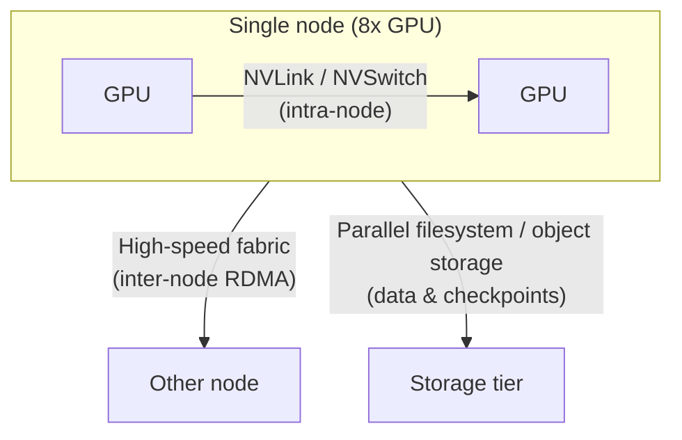

> Last reviewed: September 2026 | This is a fast-moving area subject to quarterly review.

:::note
This document covers advanced GPU infrastructure design. GPU instance specs by generation, regional availability, and reserved/spot options are in [Multicloud AI — GPU Availability](../../ai/multicloud-ai/#gpu-availability); AI platform and model selection is in [AI Platforms and Model Comparison](../../ai/ai-ml/). This document focuses on "how to combine multiple GPUs into a single cluster for training and inference."
:::

## Overview

Workloads that a single GPU cannot handle must combine multiple GPUs and multiple nodes into one cluster. What determines performance here is not the compute power of an individual GPU, but the **communication bandwidth and latency between GPUs and between nodes**, along with the **storage throughput that feeds data to the GPUs**. This document first classifies workload characteristics, then compares cluster architectures across vendors in three tiers.

### Portability baseline and scope of this document

This document treats **CUDA + NCCL as the portability baseline**. Most distributed training and inference stacks run on top of this combination, and switching clouds is generally portable at the application-code level. In contrast, **high-speed communication fabrics, placement groups, and managed cluster products differ in name and implementation across vendors and do not map one-to-one.**

:::caution
Detailed settings for vendor-specific implementations (e.g., EFA queue counts for a specific instance, InfiniBand partition keys) are out of scope. This document focuses on normalizing and comparing concepts across vendors, delegating vendor-specific detailed tuning to each vendor's official documentation. Performance figures depend heavily on instance, driver, NCCL version, storage, and topology, so measure with real workloads before adoption.
:::

## Three GPU Workload Classes

Because the bottleneck resource differs per workload, the starting point of infrastructure design is understanding workload characteristics.

| Workload | Dominant bottleneck | Communication needs | Storage needs | Representative infrastructure traits |
| --- | --- | --- | --- | --- |
| **Pre-training** | Compute + inter-node communication | Very high (cluster-wide collectives) | High (streaming large datasets) | Many nodes, high-speed fabric required, checkpoint bandwidth critical |
| **Fine-tuning** | Compute + memory | Medium (often within a few nodes) | Medium | Small-to-medium cluster, often feasible on a single node |
| **Inference** | Memory bandwidth + latency | Low (only when model-parallel) | Low (weights resident after load) | Latency/throughput balance, autoscaling-centric |

:::note
Most enterprise workloads concentrate on fine-tuning and inference, and these two are often satisfied by a single node or a small number of nodes. It is mainly large-scale pre-training where an inter-node high-speed fabric governs performance. Choose the minimal configuration that fits your workload.
:::

## Reference Architecture — Three-Tier Communication Model

Data movement in a GPU cluster is divided into three tiers. Each tier is handled by different technology, and these tiers must not be conflated when comparing vendors.

- **Intra-node** — GPUs within one server are connected by NVLink/NVSwitch. Bandwidth is highest here and is determined by NVIDIA platform characteristics regardless of vendor.
- **Inter-node backend fabric** — Servers are connected to each other by an RDMA-based high-speed fabric. **This tier is implemented differently by each vendor and governs large-scale training performance.**
- **Storage I/O** — Used for training-data streaming and checkpoint save/restore. In large-scale training, insufficient checkpoint bandwidth leaves GPUs idle and waiting.

### Inter-node High-Speed Fabric — Vendor Mapping

| Tier | AWS | Azure | Google Cloud | OCI |
| --- | --- | --- | --- | --- |
| **Inter-node fabric** | [EFA (Elastic Fabric Adapter)](https://docs.aws.amazon.com/AWSEC2/latest/UserGuide/efa.html) | [InfiniBand](https://learn.microsoft.com/azure/virtual-machines/sizes/overview) (ND series) | [GPUDirect-TCPX / RDMA](https://cloud.google.com/compute/docs/gpus) | [RDMA Cluster Network](https://docs.oracle.com/en-us/iaas/Content/Compute/Tasks/managingclusternetworks.htm) |
| **Communication library** | NCCL | NCCL | NCCL | NCCL |
| **Same concept?** | Approximate — name, implementation, and performance characteristics differ | Approximate | Approximate | Approximate |

:::caution
The four fabrics above are **different technologies that play the same role**; they are not one-to-one equivalents. For example, InfiniBand and EFA differ in protocol, congestion control, and supported instances. Do not simply substitute "vendor A's X = vendor B's Y"; use application portability on top of NCCL as your baseline, but measure fabric performance per vendor.
:::

### Placement & Topology — Physical Proximity and NUMA

To realize inter-node communication performance, GPU nodes must be **placed physically close together**, and within a node the GPU and network interface (NIC) must be aligned in the **same NUMA domain**.

| Item | AWS | Azure | Google Cloud | OCI |
| --- | --- | --- | --- | --- |
| **Proximity placement** | Placement Group (Cluster) | Proximity Placement Group + VMSS | Compact Placement Policy | Cluster Network (built-in proximity provisioning) |
| **NUMA/GPU-NIC alignment** | Instance topology exposed, NCCL topology awareness | Topology exposed | gVNIC + topology awareness | Bare Metal topology pinning |

- **Proximity placement** — To bind training nodes at low latency, you must explicitly request proximity placement. Nodes scattered without a placement group incur higher collective-communication latency, reducing training throughput.
- **NUMA/GPU-NIC affinity** — If a GPU and the NIC it uses reside on different NUMA nodes, data traverses the inter-socket link, causing latency and bandwidth loss. Align them with NCCL topology awareness and process binding.

## Managed GPU Clusters

Instead of assembling nodes, fabric, and scheduler yourself, using a vendor-provided managed GPU cluster gets topology, health checks, and restarts pre-integrated. For large-scale training, this is a first-class option.

| Vendor | Managed cluster product | Characteristics |
| --- | --- | --- |
| AWS | [SageMaker HyperPod](https://aws.amazon.com/sagemaker/hyperpod/) | Node health checks/auto-replacement, checkpoint-based resume built in |
| Azure | [CycleCloud](https://learn.microsoft.com/azure/cyclecloud/) + ND series | HPC/AI cluster orchestration, scheduler integration (auto node-replacement not built in — configured via scheduler/scripts) |
| Google Cloud | [AI Hypercomputer / Cluster Director](https://cloud.google.com/ai-hypercomputer) | Integrated infrastructure stack, topology-aware provisioning |
| OCI | [Supercluster](https://www.oracle.com/cloud/compute/gpu/) | RDMA cluster network, ultra-low-latency connectivity for large GPU counts (Bare Metal) |

:::note
OCI's **Dedicated AI Cluster** is a different tier from the training infrastructure above. It is a managed (PaaS) resource within OCI Enterprise AI for fine-tuning and hosting pre-trained foundation models, not training infrastructure you assemble yourself. The equivalent for large-scale training infrastructure is Supercluster.
:::

:::note
Managed clusters greatly reduce initial assembly and operational burden but increase vendor lock-in. Building on pure Kubernetes raises portability but makes you responsible for topology, health checks, and gang scheduling yourself. Judge the portability-vs-operational-convenience trade-off by workload scale and team capability. For Kubernetes-based configuration, see [GPU Kubernetes and Scheduling](../../ai/gpu-infra/kubernetes-and-scheduling/).
:::

## Related Documents

- **Distributed training parallelism (TP/PP/DP)** — [Distributed Training Standard Architecture](../../ai/gpu-infra/distributed-training/)
- **Kubernetes, scheduling, quotas** — [GPU Kubernetes and Scheduling](../../ai/gpu-infra/kubernetes-and-scheduling/)
- **Inference serving, failures, capacity, cost** — [Inference Serving, Reliability, and Cost](../../ai/gpu-infra/serving-reliability-cost/)
- **Confidential GPU computing** — [Data Protection — Confidential Computing](../../security/data-protection/#confidential-computing)

## Common Mistakes

- **Choosing the top GPU generation without workload analysis** — Applying a large-scale pre-training configuration to a workload well served by fine-tuning/inference, spiking cost
- **Multi-node training without a placement group** — Nodes physically scattered, increasing collective-communication latency and degrading training throughput
- **Substituting fabrics one-to-one across vendors** — Assuming EFA, InfiniBand, and RDMA are identical, leading to mispredicted performance
- **Under-provisioning storage bandwidth** — GPUs idle while checkpoints are written, lowering effective utilization

## Checklist

- [ ] Did you classify the workload as pre-training/fine-tuning/inference and identify the dominant bottleneck (compute/memory/communication)?
- [ ] Did you design the three tiers (intra-node/inter-node/storage) separately?
- [ ] Did you explicitly request proximity placement (placement group/cluster network) for multi-node training?
- [ ] Did you verify GPU-NIC NUMA alignment and NCCL topology awareness?
- [ ] Did you evaluate the portability/operational trade-off between managed clusters and self-built configuration?

## References

### AWS

- [Elastic Fabric Adapter (EFA)](https://docs.aws.amazon.com/AWSEC2/latest/UserGuide/efa.html)
- [SageMaker HyperPod](https://aws.amazon.com/sagemaker/hyperpod/)

### Azure

- [GPU-optimized VM sizes](https://learn.microsoft.com/azure/virtual-machines/sizes/overview)
- [Azure CycleCloud](https://learn.microsoft.com/azure/cyclecloud/)

### Google Cloud

- [Cloud GPUs](https://cloud.google.com/compute/docs/gpus)
- [AI Hypercomputer](https://cloud.google.com/ai-hypercomputer)

### OCI

- [Cluster Networks](https://docs.oracle.com/en-us/iaas/Content/Compute/Tasks/managingclusternetworks.htm)
- [OCI GPU Compute](https://www.oracle.com/cloud/compute/gpu/)

### Common

- [NVIDIA NCCL documentation](https://docs.nvidia.com/deeplearning/nccl/user-guide/docs/index.html)
