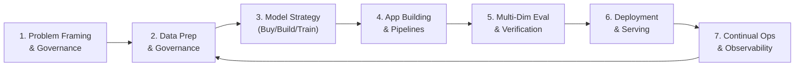
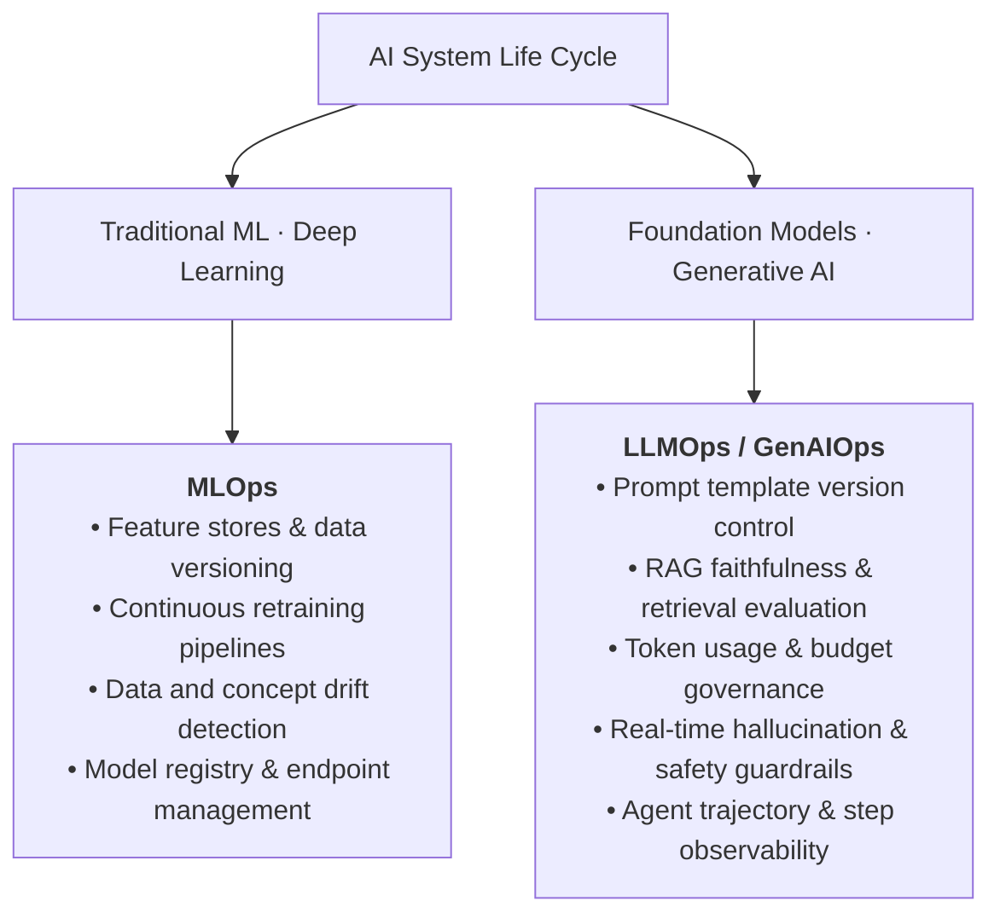

> Document standard: August 2026

## Overview

Just as software engineering follows the **SDLC (Software Development Life Cycle)** from requirements analysis to maintenance, AI systems also follow a systematic lifecycle.

However, AI systems have fundamental differences compared to traditional software:
- **Probabilistic Behavior** — Even identical inputs can yield varying outputs, meaning deterministic unit tests alone cannot guarantee quality.
- **Data Dependency and Drift** — Even without code changes, aging training data or shifts in real-world data distributions (Data Drift, Concept Drift) degrade system performance over time.
- **Multi-Dimensional Governance** — Systems must continuously govern risks unique to AI, including hallucinations, bias, PII leakage, and prompt injection attacks.

Referencing global standard frameworks such as NIST AI RMF 1.0 (Govern–Map–Measure–Manage) and ISO/IEC 5338 (AI system life cycle processes), the **AI System Life Cycle** encompasses the following end-to-end stages:

---

## 7-Stage AI System Lifecycle

### 1. Problem Framing & Governance
- **Business Value Assessment** — Define return on investment (ROI), key performance indicators (KPIs: latency, task completion rate, cost caps).
- **Regulatory & Compliance Mapping** — Establish data privacy, network isolation, and intellectual property (IP) protection requirements upfront.
- **AI Suitability Check** — Prevent the anti-pattern of applying expensive Large Language Models (LLMs) to problems better solved by rule-based logic or simple heuristics.

### 2. Data Preparation & Governance
- **Data Pipeline Engineering** — Ingest structured/unstructured data, sanitize, chunk, and maintain semantic metadata catalogs.
- **Privacy & Security Enforcement** — Enforce PII masking and role/attribute-based access controls (RBAC/ABAC) starting from ingestion.
- **Quality Management** — Generate vector embeddings and maintain up-to-date document catalogs for RAG. See [Vector Store](../../ai/vector-store/).

### 3. Model Strategy Selection
- **Adoption Path Decision** — Choose between turnkey SaaS (Buy), managed RAG assembly (Assemble), custom API engineering (Build), or dedicated pretraining/fine-tuning (Train) based on organizational capabilities and TCO.
- **Model Size Optimization** — Rather than defaulting to frontier models everywhere, design composite routing architectures using lightweight models (Small/Flash) and reasoning models. See [1P vs 3P Models](../../ai/1p-vs-3p/).

### 4. Application Engineering & Pipelines
- **Prompt & RAG Pipelines** — Implement few-shot prompting, ReAct frameworks, semantic routing, and hybrid retrieval. See [Advanced RAG Patterns](../../ai/rag-patterns/).
- **Tool Integration & Agent Design** — Connect function calling, backend REST APIs, and database connectors to build autonomous execution agents. See [AI Agents](../../ai/agents/).
- **Training Pipelines** — Build distributed training and fine-tuning pipelines when training custom model weights.

### 5. Multi-Dimensional Evaluation & Verification
- **Offline Benchmarks (Golden Sets)** — Measure ground-truth accuracy, recall, and precision against curated test sets.
- **LLM-as-a-Judge & RAG Metrics** — Continuously evaluate Faithfulness, Answer Relevance, and Context Precision.
- **Red Teaming & Security Validation** — Test resilience against prompt injections, system jailbreaks, and data extraction attacks. See [AI Security](../../security/ai-security/).

### 6. Deployment & Serving
- **Inference Architecture** — Configure serverless API endpoints, containerized high-throughput inference engines (vLLM, TensorRT-LLM), or edge on-device runtimes.
- **Traffic Governance** — Implement canary deployments, blue/green rollouts, rate limiting, and token quota controls.

### 7. Continual Operations & Observability
- **Continuous Monitoring** — Track token consumption, P99 latency, and user feedback (thumbs up/down) in real time.
- **Feedback Loops** — Ingest production edge cases into regression eval suites to continually refine prompt templates and knowledge bases.

---

## 4-Tier Enterprise Adoption Matrix

Selecting an AI delivery model depends not only on the technical task, but fundamentally on **target personas (who builds and uses it)** and the **control and operational responsibility boundary**.

| Delivery Model | Target Persona | Control & Responsibility Boundary | UI/UX Interaction Surface | Representative Cloud Solutions | Typical Enterprise Use Cases |
| --- | --- | --- | --- | --- | --- |
| **Tier 1 (Buy)** | **Non-technical business users** (Sales, HR, legal, general staff) | • **Full vendor responsibility (Turnkey SaaS)** • Vendor manages weights, infra, and base guardrails • Customer manages prompts and enterprise data inputs | • In-app embedded Copilots • Standalone web chat UI | • Microsoft 365 Copilot • Google Workspace Gemini • Salesforce Agentforce • ChatGPT Enterprise | • Company-wide drafting & email • Meeting summarization & scheduling • CRM contact & sales briefing |
| **Tier 2 (Assemble)** | **Citizen developers / Analysts** (Domain & business logic experts) | • **Shared responsibility (Managed Assemble)** • Vendor manages model hosting & RAG engine • Customer manages knowledge DB, workflows & integrations | • Drag-and-drop visual studios • Slack/Teams bot embed | • Microsoft Copilot Studio • Amazon Bedrock IDE (SageMaker Unified Studio) • Vertex AI Agent Builder • Dify, Flowise | • HR policy Q&A bots • Customer support Tier-1 FAQ bots • Departmental data collection bots |
| **Tier 3 (Build)** | **Software engineers** (App & backend dev teams) | • **Customer-driven development (Custom Orchestration)** • Leverage vendor foundation model APIs • Customer controls custom code, LoRA tuning & guardrails | • Custom web/mobile app UX • Background headless agents • Backend REST/gRPC APIs | • Amazon Bedrock API + AgentCore • Microsoft Foundry SDK • Gemini Enterprise API • LangChain / Semantic Kernel | • ERP custom inventory agents • In-app customer search & recommendations • CI/CD failure auto-triage agents |
| **Tier 4 (Train & Ops)** | **ML engineers / Data scientists** (Infrastructure & modeling experts) | • **Full customer control (Weights & Infrastructure)** • Own GPU cluster infrastructure and weights • Dedicate team to custom MLOps pipelines and serving | • Jupyter/VS Code IDEs • MLOps orchestration pipelines • Dedicated inference endpoints | • AWS SageMaker AI • Azure Machine Learning • Google Vertex AI Pipelines • OCI Data Science | • Financial fraud detection (FDS) • Large-scale supply chain forecasting • Domain-specialized model fine-tuning |

:::note[Essence of Tiers: Responsibility and Control Trade-off, Not a Maturity Ladder]
These 4 Tiers are not a mandatory sequential maturity ladder. Instead, they represent **the trade-off axis between operational burden (TCO) and necessary control (IP protection, precision tuning)**. Most global enterprises deploy Tier 1/2 for broad enterprise productivity while simultaneously focusing Tier 3/4 on core differentiated business capabilities.
:::

---

## Technical Task Selection Guide

| Requirement | Recommended Approach | Key Technologies & References |
| --- | --- | --- |
| Natural language conversation, summarization, translation | Foundation model APIs | [AI Platforms & Model Comparison](../../ai/ai-ml/) |
| Internal document search & question answering | RAG (Foundation model + Vector store) | [Advanced RAG Patterns](../../ai/rag-patterns/), [Vector Store](../../ai/vector-store/) |
| Multi-step autonomous task automation | AI Agents (tool calling + planning) | [AI Agents](../../ai/agents/), [Agent Adoption Guide](../../ai/agent-adoption/) |
| Enforcing custom style, format, or tone | Fine-tuning or LoRA adapters | Foundation model fine-tuning |
| Image/object recognition, OCR | Pre-trained vision models or CV APIs | Document AI, Amazon Rekognition, etc. |
| Time-series forecasting, tabular anomaly detection | Traditional ML algorithms | SageMaker AI, Vertex AI traditional ML platforms |
| Ultra-lightweight edge or on-device serving | Small open models + Quantization | ONNX Runtime, TensorRT-LLM, vLLM |

---

## Workload Operational Frameworks: MLOps vs LLMOps

In the continual operations phase, engineering practices diverge into two specialized execution pillars based on workload and data characteristics: **MLOps** and **LLMOps / GenAIOps**.

### Key Differences Comparison

| Area | Traditional ML (MLOps) | Generative AI (LLMOps / GenAIOps) |
| --- | --- | --- |
| **Core Assets** | Datasets, features, compiled model weight binaries | Prompt templates, vector indexes, embeddings, guardrails |
| **Iteration Cycles** | Weeks to months for full model retraining | Minutes for prompt tuning, hours for RAG index updates |
| **Quality Evaluation** | F1-Score, RMSE, AUC-ROC statistical metrics | Golden Sets, LLM-as-a-Judge, hallucination rate, guardrails |
| **Cost Profile** | Primarily upfront training GPU costs (CAPEX-like) | Continuous per-token runtime execution costs (OPEX-like) |
| **Primary Tools** | Kubeflow, MLflow, SageMaker Pipelines | LangSmith, Arize Phoenix, Promptflow, AgentOps |

For detailed LLMOps architectures and tracing techniques, see [LLMOps](../../ai/llmops/).

---

## Integration with DevOps

AI systems do not operate in isolation; they integrate directly with enterprise DevOps and platform engineering practices:

- **CI/CD Integration** — Integrate prompt regression testing and RAG evaluation stages into application delivery pipelines ([CI/CD](../../devops/cicd/)) to catch degradation before release.
- **Infrastructure as Code (IaC)** — Provision vector databases, GPU node pools, and serving endpoints with [IaC](../../devops/iac/) for reproducible environments.
- **Unified Observability** — Correlate traditional infrastructure metrics (CPU, GPU, memory) with AI application metrics (token spend, hallucination rate, user satisfaction) in a single pane of glass ([Observability](../../devops/observability/)).

---

## References

- [AI Getting Started](../../ai/getting-started/) — Fundamental AI concepts and enterprise decision paths
- [AI Platforms & Model Comparison](../../ai/ai-ml/) — Cloud vendor AI platform and foundation model comparison
- [LLMOps](../../ai/llmops/) — Generative AI and agent production operational framework
- [AI Security](../../security/ai-security/) — Prompt injection, jailbreaks, and AI guardrails
- [DevOps Getting Started](../../devops/getting-started/) — Cloud software development and delivery pipelines
