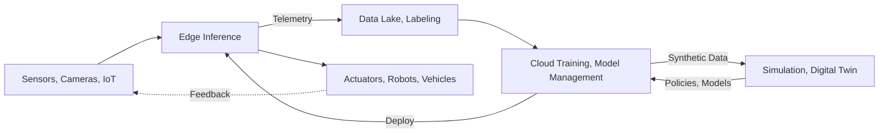

> Last reviewed: September 2026 | This area changes quickly and is subject to quarterly review.

## What Physical AI Is

Physical AI refers to the shift from AI confined to digital data such as text and images toward AI **connected to the physical world of sensors, robots, vehicles, and equipment** — perceiving, deciding, and acting physically. Unlike digital AI such as chatbots or document processing, Physical AI is fundamentally different in that failures in **latency, safety, or real-time behavior** can directly endanger people or equipment.

Physical AI is not a single product but a pipeline of interlocking layers. Data enters from the physical world, passes through storage and refinement and then training and simulation, and sends actions back out into the physical world.

:::note
This document focuses on **concepts and vendor-neutral comparison**. For general patterns of edge and hybrid infrastructure, see [Hybrid and Edge Computing](../../compute/hybrid-and-edge/); for autonomous execution concepts, see [AI Agents](../../ai/agents/); for model catalogs and inference costs, see [AI Platform and Model Comparison](../../ai/ai-ml/). Product and model names change especially quickly in this area, so verify against each vendor's official documentation before adoption.
:::

## Layer 1 — Edge Inference and IoT

Data from the physical world is high-volume and real-time, making it impractical to send everything to the cloud. The baseline structure is to infer first on site (at the edge) and upload only what is needed to the cloud.

| Item | AWS | Azure | Google Cloud | OCI |
| --- | --- | --- | --- | --- |
| Edge runtime | [IoT Greengrass](https://docs.aws.amazon.com/greengrass/v2/developerguide/) | [Azure IoT Operations](https://learn.microsoft.com/azure/iot-operations/) / [IoT Edge](https://learn.microsoft.com/azure/iot-edge/) | [Google Distributed Cloud (Edge)](https://cloud.google.com/distributed-cloud) | [Roving Edge Infrastructure](https://www.oracle.com/cloud/roving-edge-infrastructure/) |
| Edge ML inference | Greengrass ML components (SageMaker AI model deployment) | IoT Edge modules + Azure AI services | Edge TPU / Coral (verify current support status) | Build your own on RED compute |
| Industrial data ingestion | [IoT SiteWise](https://aws.amazon.com/iot-sitewise/) (OPC UA) | IoT Operations (OPC UA) | — (partner or self-built) | — (self-built) |

:::caution
**Azure Percept was retired in March 2023.** Even if older material presents Percept as edge AI hardware, comparable capability is now assembled from Azure IoT Edge / IoT Operations plus Azure Certified Device partner hardware (Microsoft did not designate a single official successor product). Do not build architecture assumptions on obsolete product names.
:::

### Edge Inference Hardware

If the edge runtime is the software layer, the choice of **accelerator hardware** beneath it determines feasibility and TCO. There are four criteria — the **compute performance** to run the target model, the **memory capacity** the model must fit into, the robot's **power and thermal budget**, and the **lifespan of the software ecosystem**.

| Family | Characteristics | Considerations |
| --- | --- | --- |
| Robotics-oriented edge modules (for example the [NVIDIA Jetson](https://developer.nvidia.com/embedded/jetson-modules) family) | Spans low-power compact modules to high-performance ones, and is effectively the default choice for robotics and VLA inference | Performance and memory differ greatly across generations and modules, with wide price spreads. Confirm first that the target model fits in that module's memory |
| General-purpose CPUs with integrated NPUs and small accelerators | Sufficient for lightweight vision such as classification and detection, with low power and unit cost | Often short on memory and bandwidth for large multimodal and VLA inference |
| FPGAs and industrial SoCs | Favorable for equipment where deterministic latency and long-term supply guarantees matter | High development difficulty and significant model porting cost |
| Cloud provider edge appliances | Extend cloud operational tooling and management to the field | Intended as field servers and gateways; they do not replace real-time control onboard the robot |

:::caution
**Do not compare on TOPS figures alone.** Vendor-quoted compute performance uses different baselines depending on precision (INT8, FP4, and so on) and whether sparsity is applied, so placing numbers from different conditions side by side is not a valid comparison. Actual inference speed is often governed by memory capacity and bandwidth and by how well the model fits, so **measuring the target model on the target module** is the reliable approach.
:::

:::caution
For edge accelerators, the **lifespan of the software ecosystem** matters as much as hardware lifespan. A product whose driver and runtime updates have stopped cannot support new kernels or new model formats, creating early replacement pressure. For families without clear signals of continued investment — such as Google Edge TPU / Coral in the Layer 1 table above — **verify current support status and driver update history directly** before placing them in a new design. Prices are not fixed either and have been adjusted around generational transitions, so validate large-scale deployment plans with a fresh quote.
:::

### Sensor Data Pipeline — Ingestion, Storage, Labeling

Data arriving from the edge cannot be used for training as-is. Physical AI data is **multimodal — 1D time series (joint angles, current, temperature), 2D video, 3D point clouds, and equipment metadata mixed together** — so it must pass through ingestion, storage, and refinement/labeling before entering the training pipeline.

| Stage | AWS | Azure | Google Cloud | OCI |
| --- | --- | --- | --- | --- |
| Stream and video ingestion | [Kinesis Data Streams](https://aws.amazon.com/kinesis/data-streams/) / [Kinesis Video Streams](https://aws.amazon.com/kinesis/video-streams/) | [Event Hubs](https://learn.microsoft.com/azure/event-hubs/) + IoT Operations | [Pub/Sub](https://cloud.google.com/pubsub) | [OCI Streaming](https://www.oracle.com/cloud/streaming/) |
| Data lake | [S3](https://aws.amazon.com/s3/) | [Data Lake Storage](https://learn.microsoft.com/azure/storage/blobs/data-lake-storage-introduction) | [Cloud Storage](https://cloud.google.com/storage) | [Object Storage](https://www.oracle.com/cloud/storage/object-storage/) |
| Parallel file system for training | [FSx for Lustre](https://aws.amazon.com/fsx/lustre/) | [Azure Managed Lustre](https://azure.microsoft.com/products/managed-lustre) | [Managed Lustre](https://cloud.google.com/products/managed-lustre) / [Parallelstore](https://cloud.google.com/parallelstore) | [File Storage with Lustre](https://www.oracle.com/cloud/storage/file-storage-with-lustre/) |
| Labeling | [SageMaker Ground Truth](https://docs.aws.amazon.com/sagemaker/latest/dg/sms.html) (closed to new customers) | [Azure ML data labeling](https://learn.microsoft.com/azure/machine-learning/how-to-label-data) | — (managed service ended; partner or open source) | [OCI Data Labeling](https://www.oracle.com/artificial-intelligence/data-labeling/) |

:::caution
**Managed labeling services are shrinking rather than growing.** Google Cloud's Vertex AI data labeling has not been available since July 1, 2024, and AWS SageMaker Ground Truth stopped accepting new customers on July 30, 2026 (existing customers may continue to use it, with no new features planned). Ground Truth Plus reached end of support on June 30, 2026. Do not tie labeling to a single cloud's managed service; make a structure **replaceable by open source or partner tooling** your default.
:::

:::note
In GPU training, the bottleneck is often not computation but **data loading and checkpoint writes**. Reading directly from object storage leaves GPUs idle, so it is common to place a parallel file system in front of object storage for the training phase. For a general storage-tier comparison see [Block and File Storage](../../storage/block-and-file/), and for checkpoint strategy see [Distributed Training](../gpu-infra/distributed-training/).
:::

## Layer 2 — Digital Twins and Simulation

Training robots and vehicles only in the real world is costly, risky, and slow. This is why the sim-to-real approach took hold: generate and train on large volumes of scenarios in a **digital twin** and **simulation** that virtually replicate the physical environment, then transfer to reality.

| Item | AWS | Azure | Google Cloud | OCI | Cross-vendor |
| --- | --- | --- | --- | --- | --- |
| Digital twin | [IoT TwinMaker](https://aws.amazon.com/iot-twinmaker/) | [Azure Digital Twins](https://learn.microsoft.com/azure/digital-twins/) | — (self-built with Spanner Graph, BigQuery, etc.) | — | [NVIDIA Omniverse](https://www.nvidia.com/en-us/omniverse/) |
| Robot and physics simulation | — (RoboMaker end of support; self-built) | — (partner or self-built) | — (partner or self-built) | — | [NVIDIA Isaac Sim / Isaac Lab](https://developer.nvidia.com/isaac/sim) |

:::caution
**AWS RoboMaker reached end of support on September 10, 2025.** Robot simulation on AWS is now assembled directly from GPU instances plus open source (Isaac Sim, Gazebo, and so on) with no dedicated managed service. Be careful not to place EOL services into new designs.
:::

:::note
In the digital twin and robot simulation layer, **the NVIDIA Omniverse and Isaac ecosystem is widely used.** All three major clouds support running this stack on GPU instances, and rather than depending on one cloud's proprietary managed product, checking **whether the stack can be moved and run on any cloud (portability)** first is the way to reduce lock-in.
:::

### Why Training Data Is Scarce

Simulation is a premise rather than an option because of **data scarcity**. Language models started from effectively unlimited pre-training data in the form of internet text, but data of "a robot actually picking up and moving an object" is orders of magnitude smaller. Physical AI training starts from a design that fills the gap with cheaper, more plentiful data.

| Data tier | Characteristics | Limitation |
| --- | --- | --- |
| Internet video, images, text | Effectively unlimited and cheap. Provides general knowledge about the world and objects | Not directly connected to a robot's body or joint commands |
| Human task video (egocentric) | Relatively plentiful. Provides hints about motion sequence and intent | Framed around a human body, so it does not transfer directly to a robot embodiment |
| Robot teleop episodes | Most accurate, containing actual joint commands | A human must directly operate the robot to produce it, making collection the most expensive |

**Teleoperation** is the practice of a person moving a robot directly with a controller or VR rig to produce demonstration data, and **imitation learning** trains a model to reproduce that data. It is the most reliable method, but human time is the cost, which makes it hard to scale.

:::note
For cloud cost estimation, this structure means **a cost axis exists separately from GPUs**. Data collection (equipment and labor), storage and transfer, and labeling costs arise independently of training compute, so estimating TCO from GPU hours alone will be far off.
:::

### Open Datasets and Benchmark Ecosystem

Because data scarcity is hard for any single organization to overcome alone, an open ecosystem has formed in which multiple institutions pool data and share evaluation tasks. When choosing a stack, **"which open assets can be used as-is on this stack"** becomes a practical criterion for judging lock-in.

| Category | Representative assets | What it is used for |
| --- | --- | --- |
| Cross-robot datasets | [Open X-Embodiment](https://arxiv.org/abs/2310.08864) | A collection consolidating robot data from many institutions. The baseline for cross-embodiment pre-training |
| Large manipulation datasets | [DROID](https://github.com/droid-dataset/droid) | Teleop data collected across diverse environments |
| Simulation benchmarks | [LIBERO](https://github.com/Lifelong-Robot-Learning/LIBERO), [CALVIN](https://github.com/mees/calvin), [RoboCasa](https://github.com/robocasa/robocasa), [Meta-World](https://github.com/Farama-Foundation/Metaworld) | Compare policies by task success rate on standard task suites |
| Human task video | [Ego4D](https://ego4d-data.org/) | Egocentric task video. Corresponds to the middle tier of the three data tiers above |
| Open toolchains | [LeRobot](https://github.com/huggingface/lerobot) | An open source stack bundling data format, training, and evaluation |

:::caution
Open datasets have **licensing terms that differ per asset.** Some permit research use only or require attribution or disclosure of derivatives, so before using them as training assets in a commercial product, check each dataset's license together with the terms of its subcomponents (the parts contributed by individual institutions).
:::

:::note
Using a model pre-trained on open datasets can reduce the volume of initial data collection, but the real benefit depends on **whether your robot's embodiment and target task are represented in that data**. The same applies to benchmark scores: if measurement conditions differ, they are not comparable (see [What Determines Whether a Model Passes](#what-determines-whether-a-model-passes)).
:::

### Sim-to-Real Gap

The value of simulation is clear, but **a simulator's physics, sensor, and material models differ subtly from reality.** Differences in friction coefficients, lighting, sensor noise, and mechanical play accumulate, producing the phenomenon where a policy that succeeded in simulation fails on the real robot. This is the **sim-to-real gap**.

Three mitigations are common.

- **Domain randomization** — Randomly vary physical parameters such as friction, mass, lighting, and texture during training so that reality falls inside that distribution.
- **Small-scale fine-tuning on real data** — Finish a simulation-pretrained policy with a small amount of data from the actual robot.
- **Physical validation gate** — Use success rates on real equipment as the deployment criterion, separately from simulation success rates.

:::caution
**Do not use simulation success rates directly as deployment evidence.** Simulation metrics are useful for detecting regressions but do not guarantee real-world performance. When choosing a simulator, look not only at rendering quality but also at **physical fidelity in the target domain** (contact, friction, deformation, and so on).
:::

## Layer 3 — Robotics Foundation Models

### Basic Terms — Policy and Embodiment

The function that decides "what to do in this situation" is called a **policy**. Taking an **observation** — camera images, range sensors, joint angles — as input and producing an **action** — joint commands, motion commands — as output is the smallest unit of robot intelligence. Every model discussed below is a question of how to construct that policy.

Robot bodies differ. A manipulator arm, a quadruped, a humanoid, and an autonomous mobile robot (AMR) all differ in degrees of freedom and control method, and these different bodies are called **embodiments**. Transferring a policy learned on one body to another — **cross-embodiment transfer** — is a well-known unsolved problem in the field.

:::note
From a procurement perspective, embodiment is **a variable that determines model reusability**. Even for the same task, changing robot models may make accumulated data and trained policies unusable as-is, so hardware selection should account for "what assets get tied to this body."
:::

Just as LLMs generalized language, **robot foundation models** that aim to generalize robot perception, planning, and motion are emerging. The representative approach is VLA (Vision-Language-Action), which takes natural language instructions and connects vision, language, and action.

| Item | Status |
| --- | --- |
| Representative stack | [NVIDIA Isaac GR00T](https://developer.nvidia.com/isaac/gr00t) — an open foundation model (VLA) for robots, with Omniverse/Cosmos-based simulation and synthetic data, and Jetson Thor on-device inference |
| Major clouds | Their own general-purpose robot foundation models remain limited — they generally run the NVIDIA stack on GPU infrastructure or offer it through partnerships |
| National policy | Japan adopted robotics foundation model development as a national project under GENIAC (see [Japan AI Landscape](../../japan/ai-landscape/)) |

### Connecting the Physical World and Agents

If a robot foundation model handles perception, planning, and motion, the agent is the autonomous execution layer above it that **takes a goal, plans steps on its own, and calls tools, sensors, and actuators to execute them**. In Physical AI, unlike digital agents, **actions take effect immediately in the physical world**, so the connection method and permission boundaries are directly tied to safety.

- **Edge agent vs. cloud orchestration** — It is common to divide responsibility so that real-time judgment and control loops run autonomously on site (at the edge), while long-horizon planning, multi-robot coordination, and model updates are handled in the cloud. Even if the network is severed, the edge agent must be able to continue operating safely or stop safely.
- **Tool and actuator connectivity (MCP and similar)** — For an agent to read sensor values and issue higher-level tasks, a standardized connection layer is needed. However, a protocol such as MCP is a **high-level task instruction and tool-call layer**; real-time actuator control (motors, joints, and so on) is handled by a **separate deterministic low-level control layer** (fieldbus, robot middleware, and so on) with guaranteed latency and safety. The two must not be conflated. For general concepts of autonomous execution and tool calling, see [AI Agents](../../ai/agents/); for agent-tool integration protocols, see [AI Agent Integration (MCP)](../../mcp/).

#### Why the Layers Are Separated — Control Frequency Mismatch

This separation is not a design preference but a consequence of **physically different operating frequencies**. The low-level control loop holding motors and joints must run deterministically at sub-millisecond periods, while inference by a large multimodal model is far slower with much greater latency variance. The common structure therefore splits into two layers.

- **Slow layer (understanding and planning)** — Understands the scene and sets the next goal. It can be heavy and run at a slow period. It may even sit in the cloud.
- **Fast layer (execution and control)** — Converts a given goal into actual joint trajectories and executes them at a fixed period. It must be on site, and its latency must not fluctuate.

:::caution
Designs that place a large model directly inside the control loop are a common failure cause. Putting the model on-device makes it hard to meet real-time periods, while moving it to the cloud turns network latency and disconnection into control-quality problems. **Define which decisions must complete within how many milliseconds first**, then decide placement.
:::

#### Agent-to-Hardware Connection Standards

After MCP established itself as the standard connecting agents to data and software tools, **standards connecting agents to physical equipment** have begun to appear as well. In August 2026 Anthropic published a research preview of the **[Model Hardware Standard (MHS)](https://www.anthropic.com/news/model-hardware-standard-research-preview)**. Instead of building a custom adapter per device, it exposes devices through a common driver so that a single agent can operate multiple devices in parallel. Safety limits are **enforced at the driver level**, below the agent, so a model cannot talk its way past a hard limit.

:::caution
As of September 2026, MHS is a **research preview**, and its scope centers on scientific research instruments and advanced manufacturing equipment. It does not replace existing standards for industrial robot control (fieldbus, safety PLC, robot middleware), and it is separate from functional safety certification regimes. Rather than treating it as an architectural premise, read it as a signal that **the agent-to-hardware connection layer is moving toward standardization**.
:::

:::caution
When allowing an agent to call physical actuators (motors, valves, vehicle controls, and so on) directly, **explicitly restrict the permission scope (action space)** and require human approval and prior validation by the safety layer for hazardous actions. A wrong tool call by a digital agent ends with a retry, but a malfunction by a physical agent can cause irreversible harm.
:::

:::caution
Robot foundation models and **world models** are an early, rapidly developing area as of September 2026. Model names, versions, and performance figures change substantially with each vendor announcement, so this document covers only the range where mature comparison is possible and defers details to official source links.
:::

## Safety Layer — Autonomous Driving and Robotics

AI that moves in the physical world is directly tied to human life and equipment, making **functional safety** central. Domain-specific safety standards and certification regimes apply separately — [ISO 26262](https://www.iso.org/standard/68383.html) for autonomous driving, [ISO 13849](https://www.iso.org/standard/73481.html) and IEC 61508 for industrial machinery and robots — and the principle is to maintain an **independent safety layer** (safety stop, hardware interlocks, safety PLC) that operates regardless of the AI model's judgment.

Vendors and suppliers offer commercial stacks implementing this. For example, NVIDIA offers the safety system **Halos**.

- **Autonomous vehicles (AV)**: the [DRIVE](https://www.nvidia.com/en-us/solutions/autonomous-vehicles/) platform (AGX, Hyperion) with the Halos safety system (spanning cloud to vehicle, targeting ISO 26262), with simulation via Omniverse and Cosmos.
- **Robotics**: In June 2026 NVIDIA announced **[Halos for Robotics](https://developer.nvidia.com/blog/inside-nvidia-halos-for-robotics-a-full-stack-functional-safety-system-for-physical-ai/)** (IGX Thor, Holoscan Sensor Bridge, Halos OS, AI Systems Inspection Lab), extending its autonomous driving safety foundation to industrial robots, humanoids, and AMRs.

:::note
The safety layer is **a separate safety system, not a foundation model**. A foundation model (for example [Isaac GR00T](https://developer.nvidia.com/isaac/gr00t)) handles robot perception, planning, and motion, while the layer responsible for functional safety above it plays a different role. The safety layer acts as a final gate that **blocks or constrains any motion outside the permitted action space**, even one planned by an agent or model. Halos above is a commercial implementation example of this safety layer, starting in autonomous driving and extending to robotics in 2026.
:::

## Multicloud and Edge Architecture Considerations

### What Goes at the Edge, What Goes in the Cloud

Physical AI design starts by deciding where each task belongs — edge or cloud. The criteria are latency sensitivity, data volume (bandwidth), safety requirements, and behavior when the network is severed.

| Task | Primary location | Reason |
| --- | --- | --- |
| Real-time perception and control loop | Edge | Latency-sensitive and must not stop even when the network is severed |
| Safety stop and emergency shutdown | Edge | Cannot tolerate a cloud round trip |
| First-pass sensor data filtering and aggregation | Edge | Uploading all raw data costs too much bandwidth and money |
| Data storage and labeling | Cloud | Aggregate data from many machines and manage it as a training asset |
| Model training and retraining | Cloud | Requires large-scale GPUs and datasets (see [GPU Infrastructure](../gpu-infra/workload-and-architecture/)) |
| Synthetic data generation and simulation | Cloud | Digital twins and simulators require large-scale compute |
| Multi-robot fleet coordination, long-horizon planning | Cloud | Global coordination beyond an individual edge's field of view |
| Model version management and deployment (OTA) | Cloud → Edge | Managed centrally and distributed to the field |

### The Closed-Loop Operating Cycle

Physical AI is not deployed once and finished; it operates as a cycle in which field data returns to the model. Each stage of the flow diagram above corresponds to the following operating cycle.

1. **Edge inference** (`Edge Inference` in the diagram) — Perceive, decide, and control in real time on site, selecting only meaningful events and anomalous data.
2. **Telemetry collection and refinement** (`Telemetry` → `Data Lake, Labeling`) — Upload the selected data and operation logs to the cloud, store them, and refine and label them for training use.
3. **Cloud retraining and simulation** (`Cloud Training, Model Management` ↔ `Simulation, Digital Twin`) — Improve the model with collected data and validate new scenarios in the digital twin and simulation.
4. **OTA deployment** (`Deploy` → `Edge Inference`) — Deploy validated models and policies back to the edge. For general patterns such as signing and rollback against deployment failure or regression, see [Hybrid and Edge Computing](../../compute/hybrid-and-edge/).

:::note
If the network is severed, stages 2–4 of this cycle pause, but stage 1 (edge inference and control) must **continue autonomously offline**. Assume disconnection is a normal state rather than an exception, and design the edge to operate safely on its own.
:::

### What Determines Whether a Model Passes

To run the closed loop, you need a criterion for "is this model fit to ship." In Physical AI, however, **a lower training loss does not mean a higher real success rate.** A model trained to faithfully reproduce demonstration data cannot recover once it falls into a state absent from those demonstrations.

The criterion must therefore be **the success rate of rollouts carried through to completion**, not a loss value. In practice, three tiers are recorded separately.

| Evaluation tier | What it measures | Limitation |
| --- | --- | --- |
| Offline metrics | Loss and prediction accuracy on validation data | Weakly correlated with success rate. Use for regression detection only |
| Simulation rollouts | Success rate completing the task in the simulator | Diverges from reality by the size of the sim-to-real gap |
| Physical rollouts | Success rate, intervention count, and recovery time on real equipment | Most trustworthy but most expensive |

:::caution
Robotics evaluation benchmarks are **less standardized than those for language models.** Vendor-reported success rates vary greatly with task definition, initial conditions, and whether retries are allowed, so check first **whether the measurement conditions are published** rather than focusing on the number itself. If the conditions differ, two models' success rates are not comparable. For general model evaluation, see [LLMOps](../llmops/).
:::

### Matching Training Infrastructure to Scale

A common misconception in Physical AI is that "training robot models always requires a large GPU cluster." In practice, most work is **fine-tuning a pre-trained robot foundation model to your own robots and tasks**, and this phase is nothing like LLM pre-training in scale. Fine-tuning a VLA model of a few billion parameters often completes on a single GPU within hours.

| Stage | Nature of the work | Infrastructure pattern | Cost strategy |
| --- | --- | --- | --- |
| Initial validation | Small demonstration dataset, LoRA/PEFT adapter training | A single GPU instance | Spot/preemptible instances as the default. Interruption costs little to restart |
| Task specialization | Medium demonstration dataset, full fine-tuning | Single node, multiple GPUs plus a managed training job | A managed training service with automatic checkpoint and resume |
| Platformization | Many robots and tasks, repeated retraining | Multiple nodes plus a high-speed interconnect | Reserved or committed discounts. Requires automatic node recovery (see [Distributed Training](../gpu-infra/distributed-training/)) |

:::note
The practical implication of this ladder is **do not make large commitments at the first stage**. The initial and task-specialization phases are often well served by spot/preemptible instances and pay-as-you-go, and reservations or commitments can wait until the retraining cadence becomes routine. Conversely, simulation occupies GPUs longer as you increase the number of parallel environments, so simulation frequently dominates cost over training. For vendor mapping of GPU instance families and interconnects, see [GPU Workloads and Architecture](../gpu-infra/workload-and-architecture/).
:::

### Fleet Deployment — Abort and Rollback Are Different Layers

Loading a model onto one robot and deploying to a fleet of thousands to tens of thousands are different problems. At fleet scale, the design hinges on **how fast a bad model spreads** and **whether it can be reversed once spread**.

- **Staged rollout** — Deploy to a small group first and expand, halting expansion if the failure rate exceeds a threshold.
- **Abort** — The mechanism that halts expansion. In most deployment systems, however, abort **cancels only targets that have not yet started**; deployments already in progress run to completion.
- **Rollback** — The mechanism that returns devices that already received the new version to their previous state. It is a separate layer from abort and works only if the device side has a recovery path such as **previous-version retention or an A/B partition**.

:::caution
"We set abort criteria, so we are safe" is the most common misconception. Abort only halts spread; it **cannot reverse devices already deployed to.** The rollback path must be designed separately on both the cloud-side deployment policy and the device-side recovery mechanism.
:::

:::note
Fleet deployment services often have **quotas that cannot be adjusted** (targets per job, number of dynamic groups, deployment package size, and so on). Discovering such limits late forces a change to the deployment structure itself, so during the pilot phase **check each vendor's current service quota documentation against your target fleet size** first. Also, in configurations where new devices are automatically added to a deployment group, there may be behavior where, depending on when they join, they skip the staged rollout and receive the deployment immediately.
:::

### Other Considerations

- **Data gravity and latency** — Sensor data is high-volume and latency-sensitive, so dividing work between on-site edge inference and cloud training is the baseline design. Decide first what is processed at the edge and what is uploaded.
- **Simulator portability** — If digital twins and simulation are tied to one cloud's proprietary service, porting becomes difficult. Prioritizing stacks such as NVIDIA Omniverse and Isaac that run anywhere given a GPU reduces lock-in.
- **On-device vs. cloud training split** — It is common to split training and synthetic data generation to cloud GPUs and real-time inference to on-device hardware (for example the Jetson family).
- **Safety and regulation** — Autonomous driving and industrial robots are subject to separate functional safety certification and regulation. Reflect certification requirements early in the architecture.
- **Check product lifecycle** — This area has many retired (EOL) products (for example Azure Percept, AWS RoboMaker, managed labeling services). Always confirm each service's current support status before designing.

## Open Problems

Physical AI is an active research area, and adoption decisions depend as much on **"what does not work yet"** as on what does. The remaining challenges generally fall into the following five strands. Use it as a grid to ask which cell a vendor demo or proposal actually advances.

| Strand | Core question | Current limitation |
| --- | --- | --- |
| Action representation | In what form should actions be represented so they are learned and transferred well | Each representation trades off precision, generalization, and speed differently, with no settled answer |
| Execution | How to bridge the period gap between slow understanding/planning and fast real-time control | Large models struggle to run on-device in real time, while moving them to the cloud creates latency and disconnection problems |
| Generalization | How much of what was learned on one robot and environment transfers to another body, new objects, and new scenes | The sim-to-real gap and cross-embodiment transfer remain unsolved |
| Safety | How to guarantee that a machine exerting physical force behaves without danger | Failure means physical harm. An independent problem separate from model performance |
| Data and evaluation | How to collect enough data and compare models fairly | Collection is expensive, and success-rate measurement and benchmarks are still being standardized |

:::note
These five are intertwined. For example, evaluation must be honest before safety can be claimed, and without generalization, data collection costs repeat for every task. When planning adoption, it is safer to first confirm **which cell of this grid the target task depends on**.
:::

## Common Mistakes

- **Sending all data to the cloud** — A design that ignores latency, bandwidth, and cost fails at real-time control. Dividing inference to the edge comes first.
- **Using EOL products in new designs** — Do not adopt services that have ended or curtailed support — RoboMaker, Percept, managed labeling services — based only on older material.
- **Locking into a single vendor's simulator** — Tying the training pipeline to one cloud's proprietary simulation makes porting and comparison difficult.
- **Bolting on safety later** — Autonomous driving and robots must design safety in from the start ("built-in," not "bolt-on").
- **Granting physical agents unlimited permissions** — Letting an autonomous agent call actuators without constraints turns a malfunction directly into physical harm. Action-space restriction and safety-layer validation are essential.
- **Estimating TCO from GPU cost alone** — Data collection, storage, and labeling, plus simulation occupancy cost, arise separately from training compute.
- **Using simulation success rates as deployment evidence** — Deploying without a physical rollout validation gate lets the sim-to-real gap surface in the field.
- **Setting abort criteria without designing a rollback path** — Spread stops, but devices already deployed to do not come back.
- **Placing a large model directly in the real-time control loop** — Failing to meet the control period leads to safety problems. Separate the slow planning layer from the fast control layer.

## Checklist

- [ ] Have you distinguished inference to process at the edge from data to upload to the cloud?
- [ ] Does the edge operate autonomously and safely (offline) when the network is severed?
- [ ] Have you defined how many milliseconds each decision must complete within, and separated the slow planning layer from the fast control layer?
- [ ] If agents call physical actuators, have you restricted the action space and added safety-layer validation?
- [ ] Have you designed the storage, refinement, and labeling layer for sensor data, and confirmed that labeling tooling is replaceable?
- [ ] Have you estimated data collection, storage, labeling, and simulation costs separately from GPU cost?
- [ ] Have you defined the model pass criterion as rollout success rate rather than a loss value, with a physical validation gate?
- [ ] Have you chosen an infrastructure stage matched to your training scale (without over-committing during initial validation)?
- [ ] Have you designed both a staged rollout and a **rollback path** for fleet deployment (rather than assuming abort is sufficient)?
- [ ] Does your target fleet size fit within each vendor's non-adjustable service quotas?
- [ ] Did you select the edge accelerator by measuring the target model rather than by TOPS figures, and confirm the support lifespan of its drivers and runtime?
- [ ] Have you checked the licenses of the open datasets and benchmarks you plan to use, and whether they cover your own embodiment?
- [ ] Is the digital twin and simulation stack portable to another cloud (lock-in check)?
- [ ] Are the IoT and robotics services you plan to use currently supported (EOL check)?
- [ ] For autonomous driving or industrial robots, have you reflected functional safety certification requirements in the design?
- [ ] Is the division of roles between on-device inference and cloud training clear?

## Related Documents

- [Hybrid and Edge Computing](../../compute/hybrid-and-edge/) — General edge infrastructure patterns
- [AI Agents](../../ai/agents/) — Autonomous planning and execution concepts
- [AI Agent Integration (MCP)](../../mcp/) — Agent-to-tool and system integration protocols
- [GPU Infrastructure](../gpu-infra/workload-and-architecture/) — GPU clusters for cloud training and simulation
- [Distributed Training](../gpu-infra/distributed-training/) — Multi-node training and checkpoint strategy
- [Block and File Storage](../../storage/block-and-file/) — Parallel file system comparison
- [LLMOps](../llmops/) — General model evaluation and operations
- [AI Platform and Model Comparison](../../ai/ai-ml/) — Model catalogs and inference costs
- [Japan AI Landscape](../../japan/ai-landscape/) — Robotics foundation models as a national project (GENIAC)

## Further Reading

### AWS

- [AWS IoT Greengrass Developer Guide](https://docs.aws.amazon.com/greengrass/v2/developerguide/)
- [AWS IoT TwinMaker](https://aws.amazon.com/iot-twinmaker/)
- [AWS IoT SiteWise](https://aws.amazon.com/iot-sitewise/)
- [Amazon FSx for Lustre](https://aws.amazon.com/fsx/lustre/)
- [Amazon SageMaker Ground Truth documentation](https://docs.aws.amazon.com/sagemaker/latest/dg/sms.html)

### Azure

- [Azure IoT Operations documentation](https://learn.microsoft.com/azure/iot-operations/)
- [Azure Digital Twins documentation](https://learn.microsoft.com/azure/digital-twins/)
- [Azure Managed Lustre](https://azure.microsoft.com/products/managed-lustre)
- [Azure Machine Learning data labeling](https://learn.microsoft.com/azure/machine-learning/how-to-label-data)

### Google Cloud

- [Google Distributed Cloud](https://cloud.google.com/distributed-cloud)
- [Coral / Edge TPU](https://cloud.google.com/edge-tpu)
- [Google Cloud Managed Lustre](https://cloud.google.com/products/managed-lustre)
- [Google Cloud Parallelstore](https://cloud.google.com/parallelstore)

### OCI

- [Oracle Roving Edge Infrastructure](https://www.oracle.com/cloud/roving-edge-infrastructure/)
- [OCI File Storage with Lustre](https://www.oracle.com/cloud/storage/file-storage-with-lustre/)
- [OCI Data Labeling](https://www.oracle.com/artificial-intelligence/data-labeling/)

### Cross-vendor

- [NVIDIA Isaac GR00T (developer page)](https://developer.nvidia.com/isaac/gr00t)
- [NVIDIA Omniverse](https://www.nvidia.com/en-us/omniverse/)
- [NVIDIA autonomous vehicle (DRIVE, Halos) solutions](https://www.nvidia.com/en-us/solutions/autonomous-vehicles/)
- [NVIDIA Jetson module lineup](https://developer.nvidia.com/embedded/jetson-modules)
- [Anthropic Model Hardware Standard (research preview)](https://www.anthropic.com/news/model-hardware-standard-research-preview)

### Open Datasets and Toolchains

- [Open X-Embodiment (paper)](https://arxiv.org/abs/2310.08864)
- [LeRobot (open source robotics toolchain)](https://github.com/huggingface/lerobot)
- [Ego4D](https://ego4d-data.org/)
