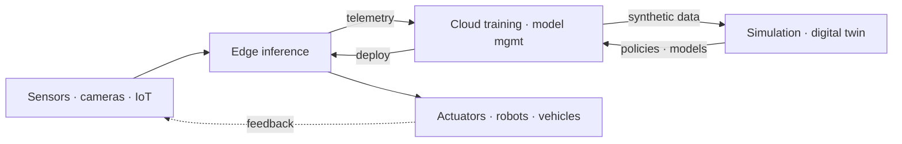

> Last reviewed: September 2026 | This document covers a fast-moving area and is subject to quarterly review.

## What Is Physical AI

Physical AI refers to the shift from AI confined to digital data (like text and images) toward AI that **connects to the physical world of sensors, robots, vehicles, and equipment** — perceiving, deciding, and physically acting. Unlike digital AI such as chatbots or document processing, Physical AI is fundamentally different in that failures of **latency, safety, and real-time behavior** can pose direct risks to people or equipment.

Physical AI is not a single product but a pipeline of interlocking layers. Data flows in from the physical world, passes through training and simulation, and flows back out as physical action.

:::note
This document focuses on **concepts and vendor-neutral comparison**. For general edge/hybrid infrastructure patterns, see [Hybrid and Edge Computing](../../compute/hybrid-and-edge/); for autonomous execution concepts, see [AI Agents](../../ai/agents/); for the model catalog and inference costs, see [AI Platforms and Model Comparison](../../ai/ai-ml/). Product and model names in this area change especially fast, so reconfirm against each vendor's official documentation before adopting.
:::

## Layer 1 — Edge Inference and IoT

Data from the physical world is voluminous and real-time, making it impractical to send everything to the cloud. The default is to infer at the edge first and send only the necessary data to the cloud.

| Item | AWS | Azure | Google Cloud | OCI |
| --- | --- | --- | --- | --- |
| Edge runtime | [IoT Greengrass](https://docs.aws.amazon.com/greengrass/v2/developerguide/) | [Azure IoT Operations](https://learn.microsoft.com/azure/iot-operations/) / [IoT Edge](https://learn.microsoft.com/azure/iot-edge/) | [Google Distributed Cloud (Edge)](https://cloud.google.com/distributed-cloud) | [Roving Edge Infrastructure](https://www.oracle.com/cloud/roving-edge-infrastructure/) |
| Edge ML inference | Greengrass ML components (deploy SageMaker AI models) | IoT Edge modules + Azure AI services | Edge TPU / Coral | Self-managed compute on RED |
| Industrial data ingestion | [IoT SiteWise](https://aws.amazon.com/iot-sitewise/) (OPC UA) | IoT Operations (OPC UA) | — (partner / self-managed) | — (self-managed) |

:::caution
**Azure Percept was retired in March 2023.** Even if older material presents Percept as edge AI hardware, similar capabilities are now assembled with Azure IoT Edge / IoT Operations and Azure Certified Device partner hardware (Microsoft did not designate a single official successor). Do not base your architecture on a discontinued product name.
:::

## Layer 2 — Digital Twins and Simulation

Training robots and vehicles solely in the real world is costly, risky, and slow. This is why sim-to-real approaches have taken hold: generate and train on large volumes of scenarios in a **digital twin** and **simulation** that virtually replicate the physical environment, then transfer to reality.

| Item | AWS | Azure | Google Cloud | OCI | Cross-vendor |
| --- | --- | --- | --- | --- | --- |
| Digital twin | [IoT TwinMaker](https://aws.amazon.com/iot-twinmaker/) | [Azure Digital Twins](https://learn.microsoft.com/azure/digital-twins/) | — (self-managed with Spanner Graph, BigQuery, etc.) | — | [NVIDIA Omniverse](https://www.nvidia.com/en-us/omniverse/) |
| Robotics / physics simulation | — (RoboMaker discontinued; self-managed) | — (partner / self-managed) | — (partner / self-managed) | — | [NVIDIA Isaac Sim / Isaac Lab](https://developer.nvidia.com/isaac/sim) |

:::caution
**AWS RoboMaker reached end of support on September 10, 2025.** Robot simulation on AWS is now built without a dedicated managed service, using GPU instances plus open source (Isaac Sim, Gazebo, etc.). Take care not to include an end-of-life (EOL) service in new designs.
:::

:::note
The digital twin and robot simulation layer is **widely served by the NVIDIA Omniverse/Isaac ecosystem.** All three major clouds support running this stack on top of GPU instances, so rather than depending on any one cloud's dedicated managed product, first check **whether the stack is portable across clouds** — that is the way to reduce lock-in.
:::

## Layer 3 — Robotics Foundation Models

Just as LLMs generalized language, **robot foundation models** are emerging to generalize a robot's perception, planning, and motion. A representative approach is VLA (Vision-Language-Action), which takes natural-language instructions and connects vision, language, and action.

| Item | Status |
| --- | --- |
| Leading stack | [NVIDIA Isaac GR00T](https://developer.nvidia.com/isaac/gr00t) — an open foundation model for robots (VLA), with Omniverse/Cosmos-based simulation and synthetic data, and Jetson Thor for on-device inference |
| The three major clouds | Native general-purpose robot foundation models are still limited — they generally run the NVIDIA stack on GPU infrastructure or offer it via partnerships |
| National policy | Japan adopted robotics foundation model development as a national project under GENIAC (see [Japan's AI Landscape](../../japan/ai-landscape/)) |

### Connecting Agents to the Physical World

If robot foundation models handle perception, planning, and motion, agents are the autonomous-execution layer on top that **takes a goal, plans the steps itself, and calls tools, sensors, and actuators to carry it out**. Unlike digital agents, in Physical AI an agent's actions are **immediately reflected in the physical world**, so the connection method and permission boundaries are directly tied to safety.

- **Edge agent ↔ cloud orchestration** — Real-time decision and control loops typically run autonomously at the edge, while long-horizon planning, multi-robot coordination, and model updates are handled in the cloud. Even if the network drops, the edge agent must be able to keep operating safely or come to a safe stop.
- **Tool/actuator connection (MCP, etc.)** — For an agent to read sensor values and issue higher-level tasks, it needs a standardized connection layer. However, a protocol like MCP is a **high-level task-instruction / tool-calling layer**; real-time actuator control (motors, joints, etc.) is handled by a **separate deterministic low-level control layer** (fieldbus, robot middleware, etc.) where latency and safety are guaranteed. The two must not be conflated. For general autonomous-execution and tool-calling concepts, see [AI Agents](../../ai/agents/); for the agent-to-tool integration protocol, see [AI Agent Integration (MCP)](../../mcp/).

:::caution
When you let an agent directly call physical actuators (motors, valves, vehicle control, etc.), **explicitly restrict its permission scope (action space)** and require human approval or safety-layer pre-verification for risky actions. A digital agent's wrong tool call ends in a retry, but a physical agent's malfunction can lead to irreversible harm.
:::

:::caution
Robot foundation models and **world models** are an early, fast-moving area as of September 2026. Model names, versions, and performance figures change significantly with each vendor announcement, so this document covers only what can be compared with reasonable maturity and defers detailed figures to official source links.
:::

## Safety Layer — Autonomous Driving and Robotics

AI that moves in the physical world is directly tied to human life and equipment, making **functional safety** central. Autonomous driving is governed by [ISO 26262](https://www.iso.org/standard/68383.html), and industrial machinery and robots by [ISO 13849](https://www.iso.org/standard/73481.html), IEC 61508, and other domain-specific safety standards and certification schemes. The principle is to provide an **independent safety layer** (safe stop, hardware interlocks, safety PLCs, etc.) that operates regardless of the AI model's decisions.

Each vendor/supplier offers a commercial stack that implements this. For example, NVIDIA provides the **Halos** safety system.

- **Autonomous vehicles (AVs)**: the [DRIVE](https://www.nvidia.com/en-us/solutions/autonomous-vehicles/) platform (AGX, Hyperion) with the Halos safety system (end-to-end from cloud to car, aligned with ISO 26262), using Omniverse/Cosmos for simulation.
- **Robotics**: in June 2026, NVIDIA announced **[Halos for Robotics](https://developer.nvidia.com/blog/inside-nvidia-halos-for-robotics-a-full-stack-functional-safety-system-for-physical-ai/)** (IGX Thor, Holoscan Sensor Bridge, Halos OS, AI Systems Inspection Lab), extending its AV safety foundation to industrial robots, humanoids, and AMRs.

:::note
A safety layer is a **separate safety system, not a foundation model**. A robot's perception, planning, and motion are handled by a foundation model (e.g., [Isaac GR00T](https://developer.nvidia.com/isaac/gr00t)), while the layer on top that handles functional safety plays a different role. The safety layer acts as a final gate that **blocks or limits any action — even one planned by an agent or model — that falls outside the allowed action space**. Halos above is a commercial implementation example of this safety layer; it began in autonomous driving and expanded its scope to robotics in 2026.
:::

## Multicloud and Edge Architecture Considerations

### What to Put at the Edge vs. in the Cloud

The starting point of Physical AI design is deciding where each task belongs — the edge or the cloud. The criteria are latency sensitivity, data volume (bandwidth), safety requirements, and behavior when the network is severed.

| Task | Primary location | Why |
| --- | --- | --- |
| Real-time perception/control loop | Edge | Latency-sensitive; must not stop even if the network drops |
| Safe stop / emergency shutdown | Edge | Cannot tolerate a cloud round-trip delay |
| First-pass sensor filtering/aggregation | Edge | Sending all raw data up is excessive bandwidth/cost |
| Model training/retraining | Cloud | Needs large-scale GPUs and datasets (see [GPU Infrastructure](../gpu-infra/workload-and-architecture/)) |
| Synthetic data generation / simulation | Cloud | Digital twins and simulators need large-scale compute |
| Multi-robot/fleet coordination, long-horizon planning | Cloud | Global coordination beyond an individual edge's view |
| Model version management / deployment (OTA) | Cloud → Edge | Managed centrally and deployed to the field |

### Closed-Loop Operating Cycle

Physical AI is not deploy-once-and-done; it operates as a loop in which field data returns to the model. Each stage of the flow diagram above maps to the following operating cycle.

1. **Edge inference** (`Edge inference`) — Perceive, decide, and control in real time in the field, selecting only meaningful events/anomalous data.
2. **Telemetry collection** (`telemetry`) — Send the selected data and driving/operation logs to the cloud.
3. **Cloud retraining/simulation** (`Cloud training · model mgmt` ↔ `Simulation · digital twin`) — Improve the model with the collected data and validate new scenarios in the digital twin/simulation.
4. **OTA deployment** (`deploy` → `Edge inference`) — Deploy the validated models/policies back to the edge. For general patterns like signing and rollback against failed/regressed deployments, see [Hybrid and Edge Computing](../../compute/hybrid-and-edge/).

:::note
When the network is severed, stages 2–4 of this cycle pause, but stage 1 (edge inference/control) **must continue autonomously offline**. Assume disconnection is one of the normal states, not an exception, and design the edge to operate independently and safely.
:::

- **Data gravity and latency** — Sensor data is voluminous and latency-sensitive, so a design that splits edge inference and cloud training is the default. Decide first what to process at the edge and what to send up.
- **Simulator portability** — If your digital twin and simulation are tied to one cloud's dedicated service, migration is hard. Prioritizing a stack that runs anywhere with GPUs (like NVIDIA Omniverse/Isaac) reduces lock-in.
- **On-device vs. cloud training split** — It is common to place training and synthetic-data generation on cloud GPUs and real-time inference on-device (e.g., Jetson-class hardware).
- **Safety and regulation** — Autonomous driving and industrial robots are subject to separate functional-safety certifications and regulations. Factor certification requirements into the architecture early.
- **Check product lifecycle** — This area has many retired (EOL) products (e.g., Azure Percept, AWS RoboMaker). Always confirm each service's current support status before designing.

## Common Mistakes

- **Sending all data to the cloud** — A design that ignores latency, bandwidth, and cost fails at real-time control. Edge inference splitting comes first.
- **Using EOL products in new designs** — Do not adopt discontinued services like RoboMaker or Percept based only on old material.
- **Locking into a single vendor's simulator** — Tying your training pipeline to one cloud's dedicated simulation makes migration and comparison difficult.
- **Bolting on safety later** — For AVs and robots, safety must be designed from the start ("built-in," not "bolt-on").
- **Granting unlimited permissions to a physical agent** — Letting an autonomous agent call actuators without constraints turns a malfunction into physical harm. Action-space limits and safety-layer verification are essential.

## Checklist

- [ ] Have you separated inference to run at the edge from data to send to the cloud?
- [ ] Does the edge operate autonomously and safely offline when the network is severed?
- [ ] If an agent calls physical actuators, have you restricted its action space and added safety-layer verification?
- [ ] Is your digital twin / simulation stack portable to other clouds (lock-in check)?
- [ ] Are the IoT / robotics services you plan to use under current support (EOL check)?
- [ ] For AVs or industrial robots, have you factored functional-safety certification requirements into the design?
- [ ] Is the split between on-device inference and cloud training clearly defined?

## Related Documents

- [Hybrid and Edge Computing](../../compute/hybrid-and-edge/) — general edge infrastructure patterns
- [AI Agents](../../ai/agents/) — autonomous planning and execution concepts
- [AI Agent Integration (MCP)](../../mcp/) — agent-to-tool/system integration protocol
- [GPU Infrastructure](../gpu-infra/workload-and-architecture/) — GPU clusters for cloud training/simulation
- [AI Platforms and Model Comparison](../../ai/ai-ml/) — model catalog and inference costs
- [Japan's AI Landscape](../../japan/ai-landscape/) — robotics foundation model national project (GENIAC)

## References

### AWS

- [AWS IoT Greengrass Developer Guide](https://docs.aws.amazon.com/greengrass/v2/developerguide/)
- [AWS IoT TwinMaker](https://aws.amazon.com/iot-twinmaker/)
- [AWS IoT SiteWise](https://aws.amazon.com/iot-sitewise/)

### Azure

- [Azure IoT Operations documentation](https://learn.microsoft.com/azure/iot-operations/)
- [Azure Digital Twins documentation](https://learn.microsoft.com/azure/digital-twins/)

### Google Cloud

- [Google Distributed Cloud](https://cloud.google.com/distributed-cloud)
- [Coral / Edge TPU](https://cloud.google.com/edge-tpu)

### OCI

- [Oracle Roving Edge Infrastructure](https://www.oracle.com/cloud/roving-edge-infrastructure/)

### Cross-vendor (NVIDIA)

- [NVIDIA Isaac GR00T (developer page)](https://developer.nvidia.com/isaac/gr00t)
- [NVIDIA Omniverse](https://www.nvidia.com/en-us/omniverse/)
- [NVIDIA Autonomous Vehicles (DRIVE / Halos) solutions](https://www.nvidia.com/en-us/solutions/autonomous-vehicles/)
