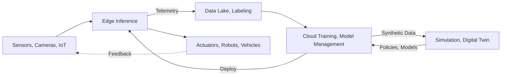

> Last reviewed: September 2026 | This area changes quickly and is subject to quarterly review.

## What Physical AI Is

Physical AI refers to the shift from AI confined to digital data such as text and images toward AI **connected to the physical world of sensors, robots, vehicles, and equipment** — perceiving, deciding, and acting physically. Unlike digital AI such as chatbots or document processing, Physical AI is fundamentally different in that failures in **latency, safety, or real-time behavior** can directly endanger people or equipment.

Physical AI is not a single product but a pipeline of interlocking layers. Data enters from the physical world, passes through storage and refinement and then training and simulation, and sends actions back out into the physical world.

:::note
This document set focuses on **concepts and vendor-neutral comparison**. For general patterns of edge and hybrid infrastructure, see [Hybrid and Edge Computing](../../../compute/hybrid-and-edge/); for autonomous execution concepts, see [AI Agents](../../../ai/agents/); for model catalogs and inference costs, see [AI Platform and Model Comparison](../../../ai/ai-ml/). Product and model names change especially quickly in this area, so verify against each vendor's official documentation before adoption.
:::

## How This Document Set Is Organized

Because the Physical AI pipeline is long, it is split into a data-and-training layer and a deploy-and-operate layer.

- **[Data and Training](../data-and-training/)** — Layer 1 (edge inference, IoT, hardware, sensor data pipeline) and Layer 2 (digital twins, simulation, open datasets, sim-to-real), plus choosing training infrastructure matched to scale.
- **[Deploy and Operate](../deploy-and-operate/)** — Layer 3 (robotics foundation models, agent connectivity), the safety layer, multicloud and edge architecture, and closed-loop operations and fleet deployment.

## Open Problems

Physical AI is an active research area, and adoption decisions hinge as much on "what does not work yet" as on "what works now." The remaining challenges fall into roughly five strands. When reviewing a vendor demo or proposal, you can use them as a grid to ask which cell was actually advanced.

| Strand | Core question | Current limitation |
| --- | --- | --- |
| Action representation | In what form should actions be represented so they are learned and transferred well | Each representation trades off precision, generalization, and speed differently, with no settled answer |
| Execution | How to bridge the frequency gap between slow understanding/planning and fast real-time control | Large models struggle to run real-time on-device, and moving to the cloud creates latency and disconnection problems |
| Generalization | How much of what is learned on one robot/environment transfers to another body, new object, or new scene | The sim-to-real gap and cross-embodiment transfer remain unsolved |
| Safety | How to guarantee a machine exerting physical force behaves without danger | Failure means physical harm. An independent challenge separate from model performance |
| Data and evaluation | How to collect enough data and compare models fairly | Collection cost is high, and success-rate measurement and benchmarks are still being standardized |

:::note
These five are intertwined. For example, evaluation must be honest before you can speak about safety, and without generalization the data collection cost repeats per task. When planning adoption, it is safer to first identify **which cell of this grid your target task depends on**.
:::

## Related Documents

- [Data and Training](../data-and-training/) — Edge, data pipeline, simulation, training infrastructure
- [Deploy and Operate](../deploy-and-operate/) — Robotics foundation models, safety, architecture, fleet deployment
- [Hybrid and Edge Computing](../../../compute/hybrid-and-edge/) — General edge infrastructure patterns
- [AI Agents](../../../ai/agents/) — Autonomous planning and execution concepts
- [GPU Infrastructure](../../gpu-infra/workload-and-architecture/) — GPU clusters for cloud training and simulation
- [AI Platform and Model Comparison](../../../ai/ai-ml/) — Model catalogs and inference costs

## Further Reading

### Cross-vendor

- [NVIDIA Isaac GR00T (developer page)](https://developer.nvidia.com/isaac/gr00t)
- [NVIDIA Omniverse](https://www.nvidia.com/en-us/omniverse/)
- [NVIDIA Jetson module lineup](https://developer.nvidia.com/embedded/jetson-modules)
