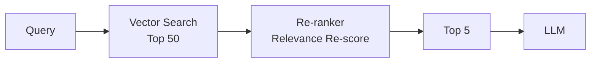

> Last reviewed: August 2026 | This is a fast-moving area subject to quarterly review.

:::note
For RAG basics (vector stores, embeddings, basic retrieval), read the RAG section in [Getting Started](../../ai/getting-started/) and [Vector Stores and Embeddings](../../ai/vector-store/) first. This document builds on those basics with **advanced patterns that raise production quality** (chunking, re-ranking, hybrid search, query expansion, evaluation).
:::

## Limitations of Basic RAG

Simply "document → embedding → retrieve → pass to LLM" is insufficient for production quality. Common problems cited by Azure and AWS official guides:

- **Poor chunking** breaks context, degrading retrieval quality.
- **Without re-ranking**, the LLM references irrelevant context from retrieved results.
- **Ambiguous user queries** (pronouns, abbreviations) defeat vector search alone.

Sources:
- [Azure — Develop a RAG Solution: Chunking Phase](https://learn.microsoft.com/azure/architecture/ai-ml/guide/rag/rag-chunking-phase)
- [AWS — Writing best practices to optimize RAG applications](https://docs.aws.amazon.com/prescriptive-guidance/latest/writing-best-practices-rag/introduction.html)

## Chunking Strategies

How much and how documents are split determines retrieval quality.

### Chunking Methods

| Method | Description | Best For |
| --- | --- | --- |
| **Fixed-size** | Split at fixed token count (e.g., 512) | General text, blogs |
| **Sentence-based** | Split by sentence boundaries | Natural language documents |
| **Recursive** | Hierarchical: paragraph → sentence → word | Structured documents |
| **Semantic** | Group semantically similar sentences | Long explanatory text |
| **Document-structure** | Split by headings/sections | Manuals, wikis, technical docs |

Azure recommends trying `Fixed-size` → `Recursive` → `Document-structure` in order of increasing sophistication (see the [Chunking Phase guide](https://learn.microsoft.com/azure/architecture/ai-ml/guide/rag/rag-chunking-phase)).

### Chunk Size Guide

- **Too small** — Insufficient context; retrieved fragments lose meaning.
- **Too large** — Multiple topics in one chunk degrades precision; increases token consumption.

General starting point (Azure guide):
- Chunk size: **500–1500 tokens**
- Overlap: 10–20% between chunks to prevent context loss

:::note
Chunk size is never "set and forget." Measure retrieval quality with representative queries and adjust iteratively.
:::

### Vendor Chunking Options

| Vendor | Supported Methods | Reference |
| --- | --- | --- |
| AWS Bedrock Knowledge Bases | Default, fixed-size, hierarchical, semantic | [KB Chunking Options](https://docs.aws.amazon.com/bedrock/latest/userguide/kb-chunking-parsing.html) |
| Azure AI Search (Foundry IQ) | Auto-chunking with integrated vectorization, customizable | [Azure AI Search Chunking](https://learn.microsoft.com/azure/search/vector-search-how-to-chunk-documents) |
| Vertex AI RAG Engine | Chunk size/overlap configuration, RagManagedDb auto-management | [RAG Engine](https://docs.cloud.google.com/gemini-enterprise-agent-platform/build/rag-engine/rag-overview) |

### Managed RAG Pipelines

Instead of building chunking, embedding, retrieval, and re-ranking yourself, **managed services** handle the entire pipeline.

| Vendor | Service | Strengths |
| --- | --- | --- |
| AWS | [Bedrock Managed Knowledge Base](https://aws.amazon.com/bedrock/knowledge-bases/) | **GA June 2026**. 6 native data connectors (S3, SharePoint, Confluence, Web Crawler, Google Drive, OneDrive), Smart Parsing (automatic multi-format parsing), Agentic Retriever (agent decomposes and searches complex multi-step queries), managed vector store. AgentCore Gateway MCP integration |
| Azure | [Azure AI Search (Foundry IQ)](https://learn.microsoft.com/azure/search/) | Integrated vectorization, built-in semantic ranker, custom skill pipeline. Also serves as managed knowledge layer in the Microsoft Foundry portal |
| Google Cloud | [RAG Engine (Gemini Enterprise Agent Platform)](https://docs.cloud.google.com/gemini-enterprise-agent-platform/build/rag-engine/rag-overview) | Source → embedding → retrieval unified. **Cross Corpus Retrieval** (simultaneous retrieval across multiple RAG corpora, Preview). RagManagedDb for automatic infra management |

:::note
Managed RAG is ideal for rapid prototyping. For fine-grained control over chunking logic or search algorithms, custom builds may be preferable.
:::

## Re-ranking

Vector search is fast but doesn't rank by true relevance. **Re-ranking** re-scores the top-N results with a separate model.

### Vendor Re-ranking Services

| Vendor | Service | Reference |
| --- | --- | --- |
| AWS | Bedrock Knowledge Bases Reranker (Amazon Rerank, Cohere Rerank) | [Reranker Guide](https://docs.aws.amazon.com/bedrock/latest/userguide/kb-reranker.html) |
| Azure | Azure AI Search Semantic Ranker | [Semantic Ranker](https://learn.microsoft.com/azure/search/semantic-search-overview) |
| Google Cloud | Vertex AI Ranking API | [Ranking API](https://cloud.google.com/generative-ai-app-builder/docs/ranking) |
| OCI | Cohere Rerank (OCI Enterprise AI) | [OCI Enterprise AI Models](https://docs.oracle.com/en-us/iaas/Content/generative-ai/pretrained-models.htm) |

## Hybrid Search

Vector search is weak at exact string matching (product codes like `SKU-12345`, proper nouns). **Hybrid search** combines vector search with traditional keyword search (BM25).

| Vendor | Hybrid Approach | Reference |
| --- | --- | --- |
| AWS | OpenSearch Vector + BM25 (RRF algorithm) | [Hybrid Search](https://docs.aws.amazon.com/opensearch-service/latest/developerguide/knn-retrieval.html) |
| Azure | Azure AI Search hybrid query | [Hybrid Search](https://learn.microsoft.com/azure/search/hybrid-search-overview) |
| Google Cloud | Vertex AI Search (auto hybrid) | [Vertex AI Search](https://cloud.google.com/enterprise-search) |
| OCI | OCI AI Vector Search with SQL combination | [OCI AI Vector Search](https://docs.oracle.com/en-us/iaas/autonomous-database-serverless/doc/oracle-ai-vector-search-autonomous-database.html) |

## Enterprise Access Control (ACL-aware Retrieval)

A commonly overlooked point when running RAG in a customer environment is **document access permissions**. Source documents (SharePoint, file shares, databases) carry per-user and per-group access control lists (ACLs); ignoring them and putting everything into a single index can expose confidential content to users who lack permission.

The pattern that vendor official guides commonly present has three steps.

- **Sync permissions at ingestion** — store the source ACLs (allowed/denied users and groups) or metadata (department, classification level, etc.) in the index alongside the document body and embeddings.
- **Filter by identity at query time** — the application passes the authenticated user identity (including groups and roles) with the search request, and the retrieval layer returns only the documents that user is permitted to access.
- **The application owns authentication** — this filter only **assists** access control; it is not authentication or authorization itself. User authentication and identity verification must be handled by the upstream application, and the retrieval layer's ACL filter must not be treated as the sole security boundary.

| Vendor | Document-level access control | Reference |
| --- | --- | --- |
| AWS | Bedrock Managed Knowledge Base — ACL-aware retrieval (pre-retrieval filter + real-time verification), metadata filtering | [ACL-aware retrieval](https://docs.aws.amazon.com/bedrock/latest/userguide/kb-managed-acl.html) |
| Azure | Azure AI Search — Entra-based ACL/RBAC indexing (preview) and a string-based security-trimming filter (GA) | [Document-level access control](https://learn.microsoft.com/azure/search/search-document-level-access-overview) |
| Google Cloud | Gemini Enterprise — matches data-source `acl_info` against the authenticated principal for query-time access checks | [Configure access controls](https://docs.cloud.google.com/gemini/enterprise/docs/identity) |
| OCI | Generative AI Agents RAG — access enforced at the database layer (mTLS and DB authentication by default), policy applied before retrieved evidence reaches the model | [OCI Generative AI Agents RAG](https://docs.oracle.com/en-us/iaas/Content/generative-ai-agents/oracle-db-guidelines.htm) |

:::caution
A retrieval-layer ACL filter does not replace authentication. AWS explicitly warns that "ACL awareness is not authorization," and the other vendors' access controls are likewise designed on the assumption that the upstream application authenticates the user and passes a verified identity. Do not rely on the search filter alone to guarantee authorization.
:::

For the delivery perspective of landing this pattern as production code in network-isolated/air-gapped or customer-specific permission environments, see [Field Deployment](../../about-cloud/field-deployment/).

## Query Expansion and Transformation

When user queries are short or ambiguous, use an LLM to rewrite or expand the query.

- **Query Rewriting** — Resolve pronouns/abbreviations explicitly (e.g., "that" → "policy X discussed in the last meeting").
- **Multi-Query** — Generate multiple query versions and search each.
- **HyDE (Hypothetical Document Embeddings)** — LLM generates a hypothetical answer, then embeds that answer for retrieval.

Official guides:
- [Azure — Enrichment Phase of RAG](https://learn.microsoft.com/azure/architecture/ai-ml/guide/rag/rag-enrichment-phase)
- [AWS — RAG Optimization Guide](https://docs.aws.amazon.com/prescriptive-guidance/latest/writing-best-practices-rag/introduction.html)

## Evaluation

RAG systems require measuring **retrieval quality** and **response quality** separately.

### Retrieval Quality Metrics

| Metric | Meaning |
| --- | --- |
| **Recall@K** | Fraction of relevant docs in top-K results |
| **MRR** (Mean Reciprocal Rank) | Average reciprocal rank of correct document |
| **NDCG** | Ranking quality with position-weighted scoring |

### Response Quality Metrics

| Metric | Meaning |
| --- | --- |
| **Faithfulness** | Is the generated answer grounded in retrieved documents? |
| **Answer Relevance** | Does the answer actually address the question? |
| **Context Precision/Recall** | How accurate and sufficient is the retrieved context? |

### Evaluation Tools

| Tool | Description |
| --- | --- |
| [RAGAS](https://github.com/explodinggradients/ragas) | Open-source RAG evaluation framework |
| [Azure AI Evaluation SDK](https://learn.microsoft.com/azure/ai-studio/how-to/develop/evaluate-sdk) | Built-in Faithfulness, Relevance metrics |
| [Bedrock Evaluations](https://docs.aws.amazon.com/bedrock/latest/userguide/model-evaluation.html) | Integrated model/RAG evaluation |
| [Vertex AI Evaluation Service](https://cloud.google.com/vertex-ai/generative-ai/docs/models/evaluation-overview) | Gen AI evaluation framework |

## Common Mistakes

- **Setting chunk size once and never adjusting** — Without measuring retrieval quality on representative queries, chunks may be too fragmented or mixed-topic.
- **Passing vector search results directly to LLM without re-ranking** — Irrelevant docs in top results cause hallucinations.
- **Not considering hybrid search** — Product codes and proper nouns requiring exact string matching won't be found by vector search alone.

## Checklist

- [ ] Chunk size and overlap tuned by measuring retrieval quality with representative queries
- [ ] Re-ranking (Semantic Ranker, Cohere Rerank, etc.) applied to improve result accuracy
- [ ] RAG evaluation metrics (Faithfulness, Answer Relevance) measured regularly

## References

### AWS
- [RAG Options and Architectures](https://docs.aws.amazon.com/prescriptive-guidance/latest/retrieval-augmented-generation-options/introduction.html)
- [Writing Best Practices to Optimize RAG Applications](https://docs.aws.amazon.com/prescriptive-guidance/latest/writing-best-practices-rag/introduction.html)
- [Bedrock Knowledge Bases Chunking](https://docs.aws.amazon.com/bedrock/latest/userguide/kb-chunking-parsing.html)
- [Bedrock Knowledge Bases Reranker](https://docs.aws.amazon.com/bedrock/latest/userguide/kb-reranker.html)

### Azure
- [Design and Develop a RAG Solution](https://learn.microsoft.com/azure/architecture/ai-ml/guide/rag/rag-solution-design-and-evaluation-guide)
- [RAG Chunking Phase](https://learn.microsoft.com/azure/architecture/ai-ml/guide/rag/rag-chunking-phase)
- [Azure AI Search Hybrid Search](https://learn.microsoft.com/azure/search/hybrid-search-overview)
- [Azure AI Search Semantic Ranker](https://learn.microsoft.com/azure/search/semantic-search-overview)

### Google Cloud
- [RAG Engine (Gemini Enterprise Agent Platform)](https://docs.cloud.google.com/gemini-enterprise-agent-platform/build/rag-engine/rag-overview)
- [Vertex AI Ranking API](https://cloud.google.com/generative-ai-app-builder/docs/ranking)
- [Vertex AI Evaluation Service](https://cloud.google.com/vertex-ai/generative-ai/docs/models/evaluation-overview)

### OCI
- [OCI AI Vector Search](https://docs.oracle.com/en-us/iaas/autonomous-database-serverless/doc/oracle-ai-vector-search-autonomous-database.html)
- [OCI Enterprise AI Models](https://docs.oracle.com/en-us/iaas/Content/generative-ai/pretrained-models.htm)
