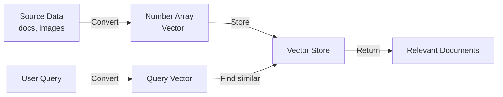

> Last reviewed: August 2026

## Overview

:::note
**New to vectors/embeddings?** Read the RAG section in [Getting Started](../../ai/getting-started/) first. After this document (vector store basics), advanced implementation such as chunking, re-ranking, and hybrid search continues in [Advanced RAG Patterns](../../ai/rag-patterns/).
:::

### Use Cases

- **Internal document chatbot** — Answer employee questions by searching company docs
- **Product FAQ automation** — Handle customer inquiries based on product manuals
- **Semantic search** — Searching "affordable lodging" also finds "budget hotel," "value pension"
- **Recommendation systems** — Automatically recommend similar products/content/users

## What Is a Vector Store

### An easy way to understand it

Think of a librarian. Ask "Do you have any books on machine learning?" and even if a book's title doesn't contain "machine learning," the librarian will point you to books on related topics — "artificial intelligence," "deep learning," "AI fundamentals."

**A vector store is a database that plays this librarian's role.** It remembers the "meaning" of documents and quickly finds documents with similar meaning.

### Keyword Search vs Vector Search

| Method | Search Basis | Example |
| --- | --- | --- |
| **Keyword search** (traditional DB) | Exact word match | "affordable lodging" → only docs containing "affordable" |
| **Vector search** (vector store) | Semantic similarity | "affordable lodging" → also finds "budget hotel," "value inn" |

## How It Works

1. Convert source data (text, images) to **number arrays (vectors)**. This process is called **embedding**.
2. Store vectors in a vector store.
3. Convert the query the same way and find the **most similar vectors** to return the original data.

:::note
Why number arrays? For a computer to calculate "similar meaning," it must quantify meaning. Representing a word as 1536 numbers means semantically similar words have similar number combinations.
:::

## Options

### 1. Dedicated Vector Stores

Purpose-built for vector search. Use for large-scale/high-performance needs.

| Vendor | Product | Characteristics |
| --- | --- | --- |
| AWS | [OpenSearch Serverless Vector Engine](https://docs.aws.amazon.com/opensearch-service/latest/developerguide/serverless-vector-search.html) | Large-scale vector search |
| AWS | [S3 Vectors (Preview)](https://docs.aws.amazon.com/AmazonS3/latest/userguide/s3-vectors.html) | S3 durability + low cost |
| Azure | [Azure AI Search](https://learn.microsoft.com/azure/search/vector-search-overview) | Vector + keyword + semantic ranking integrated |
| Google Cloud | [Vertex AI Vector Search](https://cloud.google.com/vertex-ai/docs/vector-search/overview) | Google ScaNN algorithm, high performance |
| OCI | [OCI AI Vector Search](https://docs.oracle.com/en-us/iaas/autonomous-database-serverless/doc/oracle-ai-vector-search-autonomous-database.html) | Built into Autonomous Database, SQL-based |

### 2. Vector Extensions for Existing DBs

Add vector capability to your current database. Start without extra infrastructure.

| Vendor | Product | Characteristics |
| --- | --- | --- |
| AWS | [Aurora PostgreSQL (pgvector)](https://aws.amazon.com/about-aws/whats-new/2023/07/amazon-aurora-postgresql-pgvector-vector-storage-similarity-search/) | Relational + vector in one DB |
| AWS | [ElastiCache for Valkey](https://aws.amazon.com/elasticache/what-is-valkey/) | In-memory vector, ultra-low latency |
| Azure | [Cosmos DB Vector Search](https://learn.microsoft.com/azure/cosmos-db/vector-search) | Global distribution + vector |
| Google Cloud | [AlloyDB (Vector Search)](https://cloud.google.com/alloydb/docs/ai) | PostgreSQL-compatible + high performance |
| Google Cloud | [Cloud SQL (pgvector)](https://cloud.google.com/sql/docs/postgres/extensions#pgvector) | Simple start |

### 3. Managed RAG Pipelines

"Upload documents and auto-vectorize" — managed services handling the full pipeline.

| Vendor | Product | Characteristics |
| --- | --- | --- |
| AWS | [Bedrock Knowledge Bases](https://docs.aws.amazon.com/bedrock/latest/userguide/knowledge-base.html) | Document → embedding → store → RAG automatic |
| Azure | [Azure AI Search + OpenAI "On Your Data"](https://learn.microsoft.com/azure/ai-services/openai/concepts/use-your-data) | Fastest RAG setup |
| Google Cloud | [Vertex AI RAG Engine](https://cloud.google.com/vertex-ai/generative-ai/docs/rag-overview) | Document → embedding → retrieval unified |
| OCI | [OCI Enterprise AI Agents](https://www.oracle.com/artificial-intelligence/generative-ai/agents/) | OCI Search integrated RAG |

## When to Choose What

| Situation | Recommended |
| --- | --- |
| Just starting, want minimal setup | Managed RAG Pipeline (Bedrock Knowledge Bases, etc.) |
| Already using PostgreSQL | DB vector extension (pgvector) |
| Millions of vectors, performance critical | Dedicated vector store (OpenSearch, Vertex AI Vector Search) |
| Already using Oracle DB | OCI AI Vector Search |
| Ultra-low latency needed (real-time recommendations) | Valkey-based in-memory |

:::note
**Start simple.** Most workloads are well served by managed RAG pipelines or pgvector. Dedicated vector stores are needed only at millions-of-vectors scale.
:::

## Deep Dive: Algorithms and Performance

### ANN Algorithms

Finding the "closest" vector among millions via exact comparison is slow. **ANN** (Approximate Nearest Neighbor) algorithms trade slight accuracy for major speed gains.

| Algorithm | Characteristics | Used By |
| --- | --- | --- |
| **HNSW** | Graph-based. Good accuracy/speed balance | pgvector, OpenSearch, Azure AI Search |
| **IVF** | Cluster-based. Memory efficient | pgvector, FAISS |
| **IVFPQ** | IVF + vector compression for memory savings | Neptune Analytics, FAISS |
| **ScaNN** | Google-developed. TPU-optimized | Vertex AI Vector Search |

### Embedding Dimensions and Storage

Embedding model output dimensions determine storage and search speed.

Simple calculation: 1,000,000 × 1536 dimensions × 4 bytes = **~6GB**

| Vendor | Model | Dimensions | Characteristics |
| --- | --- | --- | --- |
| AWS | Titan Embeddings V2 | 256–1024 | Variable dimension, Bedrock native |
| Azure | text-embedding-3-large | 256–3072 | OpenAI, variable dimension |
| Google | Gemini Embedding 2 | 768 | Vertex AI native |
| Cohere | Embed 4 | 1024 | Multimodal, multilingual, OCI/Bedrock |
| Open-source | BGE-M3, E5, etc. | 768–1024 | Self-hostable |

**Selection criteria:** Multilingual performance needed → Cohere, BGE-M3. Cost priority → lower dimensions. Accuracy priority → higher dimensions. Changing models requires full vector re-indexing.

### Hybrid Search

Vector search excels at semantics but is weak on **exact strings** such as product codes (`SKU-12345`). **Hybrid search** combines vector search with traditional keyword search (BM25) to improve precision.

:::note
For details on vendor-specific support, implementation patterns, and the RRF algorithm for hybrid search, see [Advanced RAG Patterns](../../ai/rag-patterns/).
:::

## Common Mistakes

- **Deploying a dedicated vector store from day one** — At tens-of-thousands scale, pgvector or managed RAG pipelines suffice. Over-engineering wastes cost.
- **Changing embedding model without regenerating existing vectors** — Different models produce different vector spaces; full re-indexing is mandatory.
- **Not designing metadata filtering** — Without permission-based or category filters, searches return irrelevant results across the entire vector space.

## Checklist

- [ ] Selected vector store type (managed RAG / DB extension / dedicated) matching data scale and performance needs
- [ ] Prepared full vector regeneration pipeline for embedding model changes
- [ ] Stored metadata (permissions, categories, dates) alongside vectors for filtered search

## References

### AWS
- [S3 Vectors](https://docs.aws.amazon.com/AmazonS3/latest/userguide/s3-vectors.html)
- [Bedrock Knowledge Bases](https://docs.aws.amazon.com/bedrock/latest/userguide/knowledge-base.html)
- [OpenSearch Vector Search](https://docs.aws.amazon.com/opensearch-service/latest/developerguide/knn.html)

### Azure
- [Azure AI Search Vector Search](https://learn.microsoft.com/azure/search/vector-search-overview)
- [Microsoft Foundry On Your Data](https://learn.microsoft.com/azure/ai-services/openai/concepts/use-your-data)

### Google Cloud
- [Vertex AI Vector Search](https://cloud.google.com/vertex-ai/docs/vector-search/overview)
- [AlloyDB AI](https://cloud.google.com/alloydb/docs/ai)

### OCI
- [OCI AI Vector Search](https://docs.oracle.com/en-us/iaas/autonomous-database-serverless/doc/oracle-ai-vector-search-autonomous-database.html)
