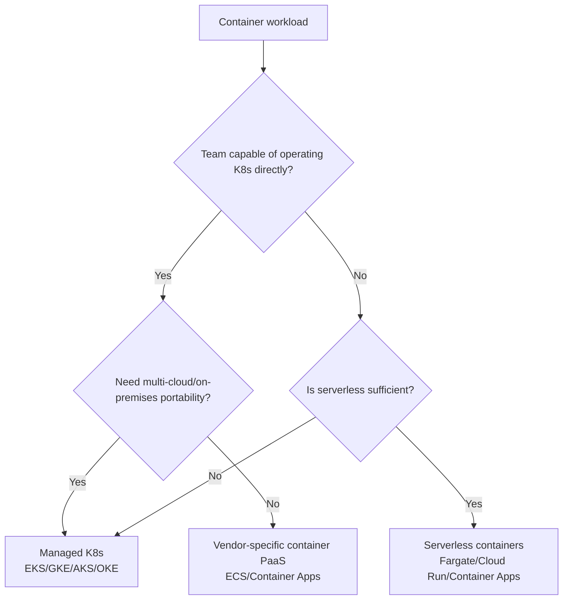

> Last reviewed: August 2026

## Overview

VMs are flexible, but deploying a single app requires managing a heavy image that includes the entire OS. Ten apps means ten VMs, and ten rounds of OS patching. The "it works on my machine but not on the server" problem is also common across environments.

**Containers** package an app together with only its dependencies, lightly, so it runs identically anywhere. They're lighter than VMs, start faster, and solve the environment-mismatch problem.

:::note
For those familiar with EKS: Azure has AKS, Google Cloud has GKE, and OCI has OKE.
:::

As containers scale into the tens or hundreds, you need orchestration to manage them. You can install and operate Kubernetes yourself, but using a cloud vendor's **managed service** lets the vendor handle control plane management, upgrades, and security patching. Users can focus solely on deploying apps.

## Product comparison

### Managed Kubernetes

| Vendor | Product | Notes |
| --- | --- | --- |
| AWS | EKS (Elastic Kubernetes Service) | Control plane is paid. Supports K8s 1.36 (2026.06) |
| Azure | AKS (Azure Kubernetes Service) | Control plane is free |
| Google Cloud | GKE (Google Kubernetes Engine) | Autopilot mode: no node management, billed per pod. Rapid channel: K8s 1.36 |
| OCI | OKE (Oracle Kubernetes Engine) | Control plane is free. Serverless operation possible via Virtual Nodes |

### Serverless / simplified container execution

Services that run containers without you managing the server (node) directly. Examples include AWS Fargate, Azure Container Apps, Google Cloud Cloud Run, and OCI Container Instances. See [Serverless](../../compute/serverless/#serverless-containers) for a detailed comparison of each product.

| Vendor | Representative product |
| --- | --- |
| AWS | Fargate · ECS · App Runner |
| Azure | Container Apps · Container Instances (ACI) |
| Google Cloud | Cloud Run |
| OCI | OCI Container Instances |

### Container registry

| Vendor | Product | Notes |
| --- | --- | --- |
| AWS | ECR (Elastic Container Registry) | |
| Azure | ACR (Azure Container Registry) | |
| Google Cloud | Artifact Registry | Also supports non-container packages |
| OCI | OCI Container Registry (OCIR) | |

## Key differences

- **AWS** — Offers two choices: ECS (its own orchestrator) and EKS (Kubernetes). ECS service auto scaling supports high-resolution (20-second) metrics, making the scale-out trigger roughly 4x faster than before (363s → 86s).
- **Azure** — Container Apps lets you operate containers without knowing K8s.
- **Google Cloud** — Cloud Run offers the simplest way to run containers in a serverless environment.
- **OCI** — The OKE control plane is free, and serverless Kubernetes operation is possible via Virtual Nodes.

## Decision tree

## What to choose when

| Situation | Recommendation |
| --- | --- |
| You want to run containers simply, without Kubernetes | AWS ECS or Azure Container Apps |
| You want to run an existing container app serverlessly without code changes | Google Cloud Cloud Run |
| You need Kubernetes but want to save on control plane cost | Azure AKS or OCI OKE (free control plane) |
| You want to be billed per pod without managing nodes | GKE Autopilot or AWS Fargate |
| You want serverless Kubernetes | OCI OKE Virtual Nodes |
| You want to deploy directly from source code | AWS App Runner |

## Kubernetes control plane vs. data plane

Managed Kubernetes consists of two layers.

| Layer | Responsible for | Managed by |
| --- | --- | --- |
| **Control plane** | API server, etcd, scheduler, controller manager | Managed by the vendor |
| **Data plane** | Worker nodes (VMs), kubelet, container runtime | Managed by the user (or delegated to serverless nodes) |

### Control plane cost

| Vendor | Control plane cost | Notes |
| --- | --- | --- |
| AWS EKS | Paid (billed hourly per cluster) | [EKS pricing](https://aws.amazon.com/eks/pricing/) |
| Azure AKS | Free | Paid if Uptime SLA is enabled |
| Google Cloud GKE Standard | Paid (per-cluster management fee) | Cluster management fee applies to all modes. A monthly credit can offset roughly one zonal/Autopilot cluster. [GKE pricing](https://cloud.google.com/kubernetes-engine/pricing) |
| Google Cloud GKE Autopilot | Paid (cluster management fee + billed pod-requested resources) | No nodes. Free-tier credit can offset part of the management fee. [GKE pricing](https://cloud.google.com/kubernetes-engine/pricing) |
| OCI OKE | Free | Paid for Enhanced clusters |

## Node management strategy

Operational burden varies depending on how you manage the data plane's nodes.

| Strategy | Description | Pros | Cons |
| --- | --- | --- | --- |
| **Self-managed nodes** | User manages node AMI, patching, and scaling directly | Full control | High operational burden |
| **Managed node groups** | Vendor manages node provisioning/upgrades (AWS Managed Node Groups, AKS Node Pools, GKE Node Pools) | Automatic upgrades, rolling updates | Node count still needs to be managed |
| **Serverless nodes (Fargate/Virtual Nodes/Autopilot)** | No node concept at all. Runs per pod | Minimal operational burden | Per-pod overhead cost, some constraints (hostNetwork, DaemonSet, etc.) |

### Node pool composition

Rather than a single workload type, multiple node pools are configured for varying requirements (GPU, Spot, storage type).

- **General-purpose node pool** — most applications
- **GPU node pool** — ML inference/training pods
- **Spot/Preemptible node pool** — batch jobs, CI
- **ARM node pool** — cost optimization (Graviton, Cobalt, Ampere, Axion)

## Container runtime transition

Since Dockershim was removed in Kubernetes 1.24, **containerd** has become the de facto standard runtime. Following the containerd 1.6 EOL in August 2025, the shift to **containerd 2.x** has accelerated in earnest.

### Key changes in containerd 2.x

| Change | Impact | Response |
| --- | --- | --- |
| Docker Image Manifest Schema 1 disabled by default (2.0), fully removed (2.1) | Very old images (built before 2017) fail to pull. containerd 2.0 can re-enable it via an environment variable, but it's removed in 2.1. Managed K8s node images may have limited ability to re-enable this depending on vendor/version | Check schema version with `docker manifest inspect`. Rebuild as Schema 2 or OCI images. Check vendor node OS/runtime release notes |
| CRI plugin configuration structure changed | May not be compatible with the existing `containerd config.toml` | Validate configuration migration before upgrading nodes |
| New sandbox API | Improved pod isolation | Handled by the vendor when using managed K8s |

### Runtime status by vendor

| Vendor | Default runtime | Notes |
| --- | --- | --- |
| AWS EKS | containerd | Automatic AMI updates transition to containerd 2.x |
| Azure AKS | containerd (Azure Linux 3.0) | Azure Linux 3.0 is default from AKS 1.32+. Azure Linux 2.0 reaches EOL 2025.11 |
| Google Cloud GKE | containerd | Automatically managed via COS (Container-Optimized OS) |
| OCI OKE | containerd (Oracle Linux 8/9) | Transitions via node pool OS image upgrades |

:::caution
**If you're using Docker Schema 1 images**, pulls will fail on containerd 2.x. Search your registry for images with `mediaType: "application/vnd.docker.distribution.manifest.v1+json"` and rebuild them.
:::

## Kubernetes production-readiness checklist

- [ ] Are nodes distributed across multiple AZs?
- [ ] Have you set resource requests and limits on pods?
- [ ] Have you configured liveness/readiness probes?
- [ ] Have you configured a Horizontal Pod Autoscaler?
- [ ] Have you restricted pod-to-pod communication with a Network Policy?
- [ ] Have you integrated with cloud IAM via Workload Identity (not using Service Account Keys)?
- [ ] Have you restricted image pulls to only a private registry?
- [ ] Have you configured log/metric/trace collection?
- [ ] Have you established an etcd/PV backup strategy (Velero, etc.)?
- [ ] Have you decided on a cluster upgrade strategy?
- [ ] Have you verified containerd 2.x compatibility (Docker Schema 1 images not supported)?

:::note
For Day-2 operations details, see [Kubernetes Operations](../../devops/kubernetes-operations/).
:::

## Common mistakes

- **Using K8s for what doesn't need it** — Introducing Kubernetes for a simple web app or small-scale service only adds operational complexity. First check whether ECS, Cloud Run, or Container Apps would suffice.
- **Not setting resource limits** — Without requests/limits on pods, a single pod can consume all of a node's resources, causing other pods to be OOMKilled or fail to schedule.
- **Using the `latest` tag** — Using `latest` as an image tag makes it impossible to track which version was deployed, and rollback becomes impossible.

## Checklist

- [ ] Have you set resource requests/limits on all pods?
- [ ] Have you pinned container image tags to a SHA or semantic version?
- [ ] Have you configured liveness/readiness probes (health checks)?
- [ ] Have you separated namespaces by environment/team?

## Related documents

- [CI/CD](../../devops/cicd/)
- [IaC](../../devops/iac/)
- [Serverless](../../compute/serverless/)

## References

### AWS

- [Amazon EKS documentation](https://docs.aws.amazon.com/ko_kr/eks/)
- [Amazon ECS documentation](https://docs.aws.amazon.com/ko_kr/ecs/)
- [AWS Fargate documentation](https://docs.aws.amazon.com/ko_kr/AmazonECS/latest/userguide/AWS_Fargate.html)

### Azure

- [AKS documentation](https://learn.microsoft.com/ko-kr/azure/aks/)
- [Container Apps documentation](https://learn.microsoft.com/ko-kr/azure/container-apps/)
- [Container Instances documentation](https://learn.microsoft.com/ko-kr/azure/container-instances/)

### Google Cloud

- [Google Kubernetes Engine documentation](https://cloud.google.com/kubernetes-engine/docs)
- [Google Cloud Run documentation](https://cloud.google.com/run/docs)
- [Google Artifact Registry documentation](https://cloud.google.com/artifact-registry/docs)

### OCI

- [OKE (Oracle Kubernetes Engine) documentation](https://docs.oracle.com/en-us/iaas/Content/ContEng/home.htm)
- [OCI Container Instances documentation](https://docs.oracle.com/en-us/iaas/Content/container-instances/home.htm)
- [OCI Container Registry documentation](https://docs.oracle.com/en-us/iaas/Content/Registry/home.htm)
