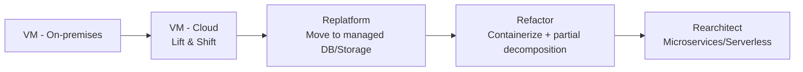
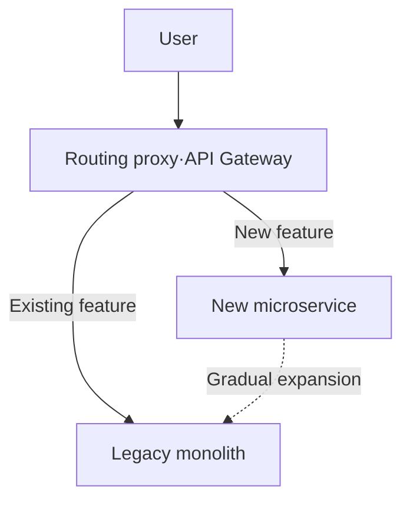
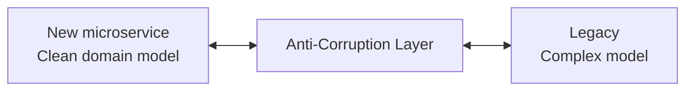

> Last reviewed: August 2026

## What is modernization

**Modernization** is the work of restructuring an existing application to fit the cloud environment in order to improve scalability, deployment speed, and operational efficiency. The core is not adding new features, but aligning an existing workload with cloud best practices.

:::note
Each vendor provides a modernization framework: [AWS Migration Hub](https://docs.aws.amazon.com/migrationhub/), [Azure CAF Modernize](https://learn.microsoft.com/azure/cloud-adoption-framework/modernize/), [Google Cloud Application Modernization](https://cloud.google.com/solutions/application-modernization).
:::

### Difference from migration

| Aspect | Migration | Modernization |
| --- | --- | --- |
| **Purpose** | Move to the cloud | Leverage cloud-native advantages |
| **Scope** | Infrastructure replacement | Improving architecture/operational model |
| **Timing** | During migration | After migration, or concurrent |
| **Representative activities** | Lift & Shift | Replatform, Refactor, Rearchitect |

:::note
For migration strategy (the 7 Rs), see [Application Migration](../../compute/migration/).
:::

## Why modernize

Lift & Shift alone doesn't capture enough of the cloud's benefits. If you operate purely on a VM basis:

- **Scalability** — Auto scaling is possible, but VM boot takes several minutes.
- **Deployment speed** — Deployment cycles are slow and rollback is complex.
- **Operational burden** — You have to manage OS patching, security, and monitoring yourself.
- **Cost** — Less efficient compared to managed/serverless options.

Google Cloud's official guide describes modernization as follows:

*"A gradual journey that moves you beyond the limitations of legacy applications into a scalable, resilient, and flexible system"* — [Google Cloud Architecture](https://cloud.google.com/architecture/modernization-path-dotnet-applications-google-cloud)

## Common failure patterns

Failure patterns commonly cited across multiple vendor guides:

- **Rewriting the entire system at once** — High risk, schedules collapse. Transition gradually using the Strangler Fig pattern.
- **Excessive decomposition of low-business-value components** — Splitting legacy code that changes rarely into microservices only increases operational cost.
- **Ignoring the state problem in the monolith** — Even after moving to containers, auto scaling won't work if sessions remain pinned to instances.
- **Lack of observability** — Root-causing failures in a distributed system becomes difficult. Build distributed tracing/log aggregation first.
- **No accompanying organizational change** — Conway's Law: system structure follows organizational structure. If you change only the technology while keeping the team structure the same, modernization won't stick.

## Modernization strategies

The three main strategies proposed by the Microsoft Cloud Adoption Framework:

| Strategy | Description | Difficulty | Target |
| --- | --- | --- | --- |
| **Replatform** | Keep the engine but move to a managed service. Slight optimization | Medium | DB to RDS, VM to App Service/Container Apps |
| **Refactor** | Partially rewrite the application structure. Begin decomposing into services | Medium-high | Splitting out a specific function from a monolith |
| **Rearchitect** | Redesign the architecture from scratch. Microservices, serverless | High | Fundamental improvement of scalability/resilience needed |

Source: [Azure CAF Modernization Strategies](https://learn.microsoft.com/azure/cloud-adoption-framework/modernize/modernization-cloud-replatform-refactor-rearchitect)

### Staged transition path

Generally proceeds in this order.

:::caution
Not every workload needs to reach stage E. Choose the appropriate stopping point based on **business value** and **change frequency**. For legacy code that changes rarely, stopping at stage B is realistic.
:::

## Key patterns

### Strangler Fig pattern

A pattern introduced by Martin Fowler in which a large monolithic application is **replaced incrementally with a new system rather than all at once**.

**Steps:**
1. Place a routing layer (API Gateway) in front of the legacy system
2. Develop new features as microservices and have the proxy route to them
3. Extract existing features into microservices one by one
4. Remove the legacy system once everything has been migrated

**Pros:** Minimizes risk, no business interruption
**Cons:** Requires maintaining dual systems during the transition period

Sources:
- [AWS Prescriptive Guidance — Strangler Fig Pattern](https://docs.aws.amazon.com/prescriptive-guidance/latest/cloud-design-patterns/strangler-fig.html)
- [AWS — Decomposing monoliths: Strangler Fig](https://docs.aws.amazon.com/prescriptive-guidance/latest/modernization-decomposing-monoliths/strangler-fig.html)

### Anti-Corruption Layer

An intermediate layer that separates new microservices from legacy systems. It prevents the legacy system's outdated model from affecting the new service.

### Saga pattern

A pattern for handling transactions that span multiple services in a microservices environment. Instead of the distributed transactions of a traditional DB, it maintains consistency through **compensating transactions**.

Source: [AWS Prescriptive Guidance — Saga Pattern](https://docs.aws.amazon.com/prescriptive-guidance/latest/cloud-design-patterns/saga.html)

### Event-driven architecture

Instead of direct calls between services, communication happens asynchronously via **events**. This gains scalability and loose coupling.

| Element | Vendor products |
| --- | --- |
| Messaging | Amazon SQS/SNS/EventBridge, Azure Service Bus/Event Grid, Google Cloud Pub/Sub/Eventarc, OCI Events/Streaming |
| Event streaming | Amazon MSK/Kinesis, Azure Event Hubs, Google Cloud Pub/Sub, OCI Streaming |

## 12-Factor App principles

The [12-Factor App](https://12factor.net/ko/) is a set of design principles for cloud-native applications. Review each principle during modernization.

| # | Principle | Core idea |
| --- | --- | --- |
| 1 | Codebase | One repository, many deploys |
| 2 | Dependencies | Explicitly declared and isolated |
| 3 | Config | Stored in environment variables |
| 4 | Backing services | Treated as attached resources |
| 5 | Build, release, run | Strictly separate stages |
| 6 | Processes | Run as stateless processes |
| 7 | Port binding | Export services via port binding |
| 8 | Concurrency | Scale out via the process model |
| 9 | Disposability | Fast startup and graceful shutdown |
| 10 | Dev/prod parity | Keep environments as similar as possible |
| 11 | Logs | Treat logs as event streams |
| 12 | Admin processes | Run admin/management tasks as one-off processes |

Principle **6 (stateless)** in particular is key to cloud scaling. Sessions, caches, and files must be moved to external storage for horizontal scaling to work.

## Modernization tools by vendor

### AWS

| Product | Purpose |
| --- | --- |
| [App2Container](https://aws.amazon.com/app2container/) | Automatically containerize Java/.NET apps |
| [Migration Hub Refactor Spaces](https://aws.amazon.com/migration-hub/features/#Migration_Hub_Refactor_Spaces) | Supports the Strangler Fig pattern with managed infrastructure |
| [AWS Mainframe Modernization](https://aws.amazon.com/mainframe-modernization/) | Mainframe application migration/modernization |
| [AWS Transform](https://aws.amazon.com/transform/) | AI-based legacy code conversion (.NET/mainframe) |

### Azure

| Product | Purpose |
| --- | --- |
| [Azure App Service](https://azure.microsoft.com/products/app-service/) | Managed web app hosting (Replatform) |
| [Azure Container Apps](https://azure.microsoft.com/products/container-apps/) | Serverless containers |
| [Azure Migrate: Containerization](https://learn.microsoft.com/azure/migrate/tutorial-app-containerization-aspnet-kubernetes) | Containerize ASP.NET/Java apps |
| [Azure Service Fabric](https://azure.microsoft.com/products/service-fabric/) | Microservices platform |

### Google Cloud

| Product | Purpose |
| --- | --- |
| [Cloud Application Modernization Program (CAMP)](https://cloud.google.com/solutions/camp) | End-to-end framework from assessment to modernization |
| [Migrate to Containers](https://cloud.google.com/migrate/containers/docs) | VM → GKE containers |
| [Cloud Run](https://cloud.google.com/run/docs) | Serverless containers (Refactor target) |
| [Apigee](https://cloud.google.com/apigee) | API management + Strangler Fig routing |

### OCI

| Product | Purpose |
| --- | --- |
| [OKE (Oracle Kubernetes Engine)](https://docs.oracle.com/en-us/iaas/Content/ContEng/home.htm) | Container platform |
| [OCI API Gateway](https://docs.oracle.com/en-us/iaas/Content/APIGateway/home.htm) | Strangler Fig routing |
| [OCI Functions](https://docs.oracle.com/en-us/iaas/Content/Functions/home.htm) | Rewrite as serverless |

## Common mistakes

- **Forcing a rarely-changing legacy system into microservices** — This only increases operational complexity with no business value. For systems that change rarely, stop at Rehost/Replatform.
- **Moving to a distributed system without observability** — Without distributed tracing, log aggregation, and metric collection, root-causing failures becomes impossible.
- **Changing only the technology without organizational change** — By Conway's Law, systems follow organizational structure. If team boundaries aren't aligned with service boundaries, modernization won't stick.

## Checklist

- [ ] Have you evaluated the business value and change frequency of the workload targeted for modernization?
- [ ] Is a routing layer (API Gateway, etc.) ready to apply the Strangler Fig pattern?
- [ ] Is an observability foundation (distributed tracing, log aggregation, metric collection) established?

## References

### AWS

- [AWS Prescriptive Guidance — Cloud Design Patterns](https://docs.aws.amazon.com/prescriptive-guidance/latest/cloud-design-patterns/welcome.html)
- [AWS Prescriptive Guidance — Modernization strategy](https://docs.aws.amazon.com/whitepapers/latest/microservices-on-aws/microservices-on-aws.html)
- [AWS — Decomposing monoliths into microservices](https://docs.aws.amazon.com/whitepapers/latest/microservices-on-aws/microservices-on-aws.html)
- [AWS App2Container](https://aws.amazon.com/app2container/)

### Azure

- [Cloud Adoption Framework: Modernize](https://learn.microsoft.com/azure/cloud-adoption-framework/modernize/)
- [Modernization guidance: Replatform, Refactor, Rearchitect](https://learn.microsoft.com/azure/cloud-adoption-framework/modernize/modernization-cloud-replatform-refactor-rearchitect)
- [Azure Architecture Center — Application Modernization](https://learn.microsoft.com/azure/architecture/guide/)

### Google Cloud

- [Cloud Application Modernization Program (CAMP)](https://cloud.google.com/solutions/camp)
- [Application Modernization Solutions](https://cloud.google.com/solutions/application-modernization/)
- [Modernization path for .NET applications](https://cloud.google.com/architecture/modernization-path-dotnet-applications-google-cloud)

### OCI

- [Oracle Modernization](https://www.oracle.com/cloud/migrate-applications-to-oracle-cloud/)
- [OCI Cloud Adoption Framework](https://docs.oracle.com/en-us/iaas/Content/cloud-adoption-framework/home.htm)

### Design principles

- [The Twelve-Factor App](https://12factor.net/ko/)
- [Martin Fowler — Strangler Fig Application](https://martinfowler.com/bliki/StranglerFigApplication.html)
