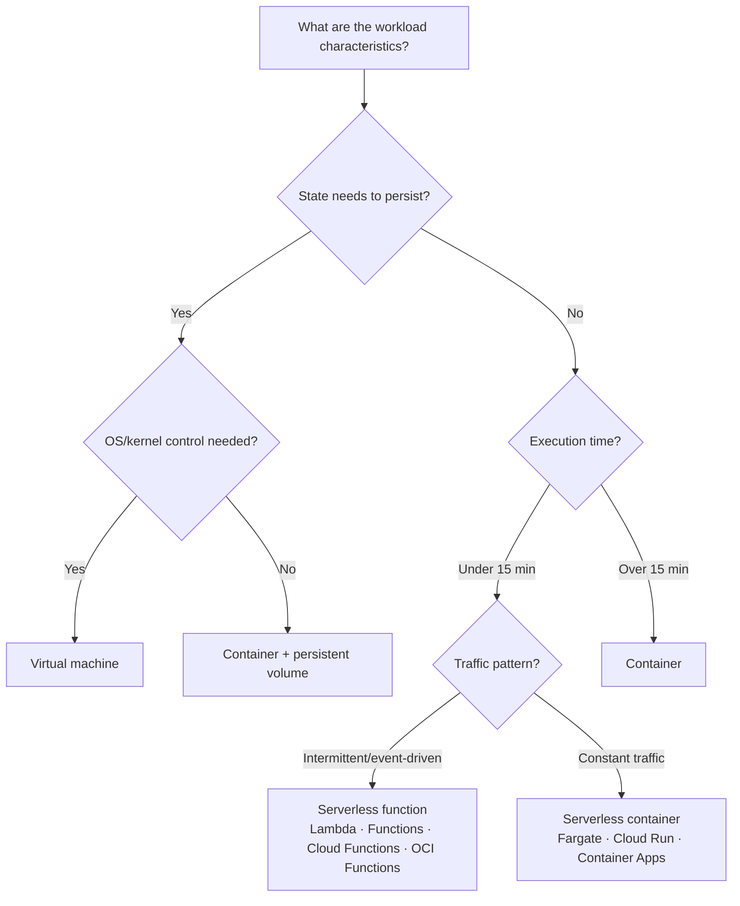

> Last reviewed: August 2026

## Overview

VMs and containers automated server creation and deployment, but you still have to decide "how many servers do I need" and "when should I scale." Auto scaling helps, but the cost of maintaining a minimum number of instances remains.

**Serverless** removes even this last management burden. You no longer need to be aware that servers exist — code runs only when there's a request. A function's lifecycle is **request received → instance created (cold start) → code executes → idle wait → released after some time (evict)**. The vendor automatically manages this whole process.

| Layer | What you manage | Billing model | Idle cost |
| --- | --- | --- | --- |
| **Instance (VM)** | OS, patching, scaling — everything | Time-based (billed while running) | Yes |
| **Container** | App + orchestration | Node-hours or per-pod | Partial |
| **Serverless** | Code only | Request count + execution time (GB-seconds) | None (unless Provisioned Concurrency is used) |

## Why serverless?

- **Cost** — Cost is zero with no traffic. You're billed only for what you use (based on GB-seconds or request count).
- **Operations** — The vendor handles OS patching, security updates, and scaling entirely.
- **Speed** — Deploy code with no infrastructure setup and it runs immediately.

:::caution
Serverless isn't always cheaper. For constantly high-load workloads, cost can end up higher than VMs/containers. Also, setting Provisioned Concurrency incurs cost even while idle. Simulate cost based on your traffic pattern.
:::

## Where serverless is still hard

- **Cold start** — If there's no invocation for a while, the instance is released, causing hundreds of ms to several seconds of delay on the next call. (In this document, "cold start" refers to function initialization delay. For VM boot delay, see [Auto Scaling](../../compute/auto-scaling/).)
- **Execution time limits** — Long-running tasks are constrained.
- **Constant load** — For 24/7 uniform traffic, a VM may be more cost-effective.
- **Retries and idempotency** — Delivery guarantees for async/event triggers vary by vendor and service. Design functions to be idempotent on paths with retries. Check per-service options for failure destinations, such as DLQs, on-failure destinations, and subscription dead-letters.
- **VPC connection latency impact** — VPC integration implementation differs by vendor. AWS Lambda uses a model where the Hyperplane ENI is provisioned at function creation/update time, so the "an ENI is created per invocation" description is outdated. Measure environment-specific latency separately for initial configuration, the first call after a long idle period, and subnet/security group constraints.

These constraints are gradually easing (Provisioned Concurrency, extended execution time limits, etc.), and the scope of serverless applicability keeps expanding.

## Product comparison

### FaaS (Function as a Service)

| Vendor | Product | Notes |
| --- | --- | --- |
| AWS | Lambda | Up to 15 minutes. Integrates with 200+ AWS service events. **Lambda durable functions** (GA): checkpointing, automatic recovery, no cost while waiting |
| Azure | Azure Functions | Premium: unlimited execution. Durable Functions/Durable Tasks (stateful workflows). Added **serverless agents**, MCP connector, Go language support (Build 2026) |
| Google Cloud | Cloud Functions | 2nd gen: up to 60 minutes. Eventarc integration |
| OCI | OCI Functions | Based on Fn Project. Runs as Docker containers. 5 minutes synchronous, **up to 60 minutes asynchronous (Detached)** |

### Serverless containers

| Vendor | Product | Notes |
| --- | --- | --- |
| AWS | Fargate | Run containers on ECS/EKS without managing servers |
| AWS | App Runner | Deploy directly from source/image |
| Azure | Container Apps | Built-in event-based scaling |
| Google Cloud | Cloud Run | HTTP-based. Move existing container apps to serverless without modification |
| OCI | OCI Container Instances | Run containers without server management |

### Workflow orchestration

| Vendor | Product | Notes |
| --- | --- | --- |
| AWS | Step Functions | Visual workflow editor |
| Azure | Durable Functions / Logic Apps | Code-based / low-code |
| Google Cloud | Workflows | YAML-based service orchestration |
| OCI | OCI Events + OCI Functions | Event-driven function chaining |

## Key differences

- **AWS Lambda** — Rich event-source integration with AWS services. Natively supports diverse triggers such as API Gateway, S3, and DynamoDB Streams.
- **Google Cloud Cloud Run** — Existing container images can be deployed as-is without modification, simplifying the migration path.
- **Azure Functions** — Durable Functions can handle even long-running, stateful workflows in a serverless manner.
- **OCI Functions** — Based on Fn Project (open source), it can run Docker containers directly as functions, resulting in lower vendor lock-in.

## Serverless vs. containers vs. VMs

## What to choose when

| In this situation | Choose this |
| --- | --- |
| Integration with AWS service events is essential | AWS Lambda |
| You want to move an existing container app to serverless without modification | Google Cloud Cloud Run |
| You need to handle long-running, stateful workflows serverlessly | Azure Durable Functions |
| You want to minimize vendor lock-in and run Docker-based functions | OCI Functions (Fn Project-based) |
| You need visual workflow orchestration | AWS Step Functions |
| You need event-driven auto-scaling containers | Azure Container Apps |

:::note
**Cold starts are increasingly being mitigated.** Each vendor offers mitigations such as Provisioned Concurrency and pre-warmed instances. But they don't disappear entirely, so for latency-sensitive workloads, configure pre-provisioning or apply a keep-warm strategy.
:::

## Cold start mitigation strategies

Cold start is serverless's biggest downside. Here's a summary of mitigation methods by vendor.

| Strategy | Description | AWS Lambda | Azure Functions | Google Cloud Cloud Functions/Run | OCI Functions |
| --- | --- | --- | --- | --- | --- |
| **Pre-provisioning** | Keep pre-warmed instances ready (incurs cost even while idle) | Provisioned Concurrency | Premium Plan (Pre-warmed) | Min Instances | — |
| **Keep-warm calls** | Periodically call the function to keep it warm | EventBridge schedule | Timer Trigger | Cloud Scheduler | OCI Events |
| **Runtime choice** | Use a runtime with fast initialization | Go, Rust have fast cold starts. Java/.NET are slow | Same | Same | Same |
| **Lightweighting** | Reduce package size, minimize dependencies | Use Lambda Layers | Same | Same | Same |
| **SnapStart** | Fast start based on a snapshot | Lambda SnapStart (Java) | — | — | — |

## Concurrency limits and throughput

Serverless auto-scales but is not unlimited. You need to know how many requests per second it can handle.

| Vendor | Default concurrency limit | Expandable |
| --- | --- | --- |
| AWS Lambda | 1,000 concurrent executions per account (per region) | Can be increased via support request |
| Azure Functions | Consumption Plan: limited. Premium: higher | Elastic Premium Plan |
| Google Cloud Cloud Functions (2nd gen) | Per-instance concurrent request limit and function/project scaling limit are separate (check [official quotas](https://cloud.google.com/functions/quotas)) | Adjustable |
| OCI Functions | Per-tenancy limit | Can be increased via support request |

### Concurrency limiting strategies

- **Reserved Concurrency** (AWS Lambda) — Reserve or cap the concurrent execution count for a specific function
- **Throttling** — Use supported retry policies (exponential backoff)
- **Queue-based buffering** — Absorb traffic spikes with SQS/Service Bus/Pub/Sub
- **Downstream protection** — 1,000 concurrency = 1,000 DB connections. Always place a connection pooler such as RDS Proxy, Cloud SQL Auth Proxy, or PgBouncer between Lambda and the DB

## Container image support

All vendors support container-image-based serverless functions. This makes it easy to move existing container workloads to serverless.

| Vendor | Max image size | Notes |
| --- | --- | --- |
| AWS Lambda | 10GB | Pulled from ECR |
| Azure Functions | — (Custom Container) | Any image |
| Google Cloud Cloud Run | — | Pulled from Artifact Registry |
| OCI Functions | — | OCI Registry or external |

## Operational considerations

Serverless reduces infrastructure management, but operations doesn't disappear.

- **IAM least privilege** — Grant functions only the minimum permissions they need. Don't share a single role across multiple functions.
- **VPC connectivity** — Only connect a VPC when needed, such as for DB access, and measure vendor-specific networking latency/constraints (subnets, NAT, security groups).
- **Distributed tracing** — Serverless call chains tend to get complex. Set up tracing with X-Ray, Cloud Trace, etc.
- **Idempotency design** — On paths with retries/duplicate delivery, design so processing the same event multiple times yields the same result.
- **Cost monitoring** — Unexpected invocation surges can lead to cost spikes. Set up budget alerts.

## Common mistakes

- **Direct DB connections (connection exhaustion)** — Connecting directly to a DB from Lambda/Functions creates as many connections as concurrent executions, exhausting the DB connection pool. Always place a connection pooler such as RDS Proxy, Cloud SQL Auth Proxy, or PgBouncer.
- **Ignoring cold start** — Operating a latency-sensitive workload without cold start mitigation settings (Provisioned Concurrency, Min Instances) degrades user experience.
- **All logic in one function** — Putting multiple responsibilities into a single function makes debugging hard, increases timeout risk, and prevents reuse. Apply the single-responsibility principle.

## Checklist

- [ ] Have you placed a connection pooler (RDS Proxy, PgBouncer, etc.) in front of the DB?
- [ ] Have you applied cold start mitigation settings (Provisioned Concurrency, Min Instances)?
- [ ] Have you set function timeouts appropriate to the workload?
- [ ] Have you applied async patterns (queues, events) to reduce synchronous call chains?

## References

### AWS

- [AWS Lambda documentation](https://docs.aws.amazon.com/ko_kr/lambda/)
- [AWS Step Functions documentation](https://docs.aws.amazon.com/ko_kr/step-functions/)
- [Serverless Applications Lens](https://docs.aws.amazon.com/ko_kr/wellarchitected/latest/serverless-applications-lens/welcome.html)

### Azure

- [Azure Functions documentation](https://learn.microsoft.com/ko-kr/azure/azure-functions/)
- [Azure Durable Functions documentation](https://learn.microsoft.com/azure/azure-functions/durable/durable-functions-overview)

### Google Cloud

- [Google Cloud Functions documentation](https://cloud.google.com/functions/docs)
- [Google Cloud Run documentation](https://cloud.google.com/run/docs)
- [Google Cloud Workflows documentation](https://cloud.google.com/workflows/docs)

### OCI

- [OCI Functions documentation](https://docs.oracle.com/en-us/iaas/Content/Functions/home.htm)
