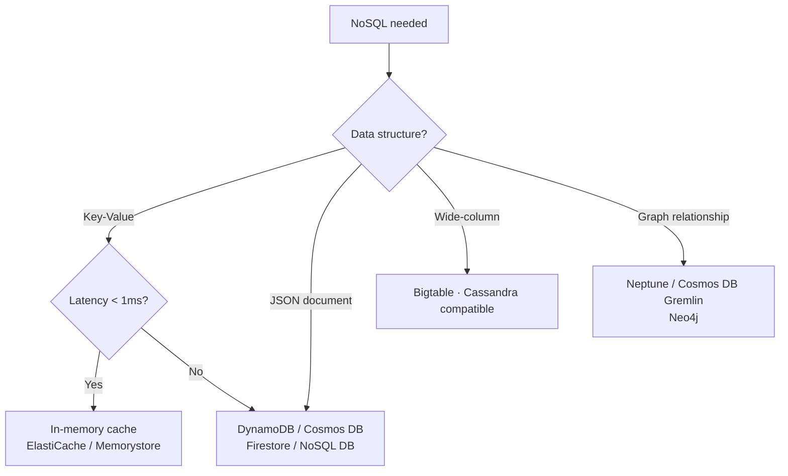

> Last reviewed: August 2026

## Overview

Relational databases (SQL) structure data into tables, rows, and columns, and are queried with SQL. They enforce a strict schema and guarantee transactions (ACID), but horizontal scaling under heavy traffic is difficult and schema changes are cumbersome.

**NoSQL** (Not Only SQL) is an approach that gives up some of the RDB's core elements — a fixed schema, joins, full ACID transactions — in exchange for horizontal scalability and a flexible data model. It doesn't mean "not using SQL," but rather "solving problems that are hard to solve with SQL alone, in a different way."

### SQL vs. NoSQL

| Item | SQL (relational) | NoSQL |
| --- | --- | --- |
| **Schema** | Strict (table structure predefined) | Flexible (schemaless or schema-on-read) |
| **Scaling** | Primarily vertical (a bigger server) | Horizontal (add servers) |
| **Transactions** | ACID guaranteed | Only partially supported (BASE model) |
| **Joins** | Complex joins possible | No joins or limited joins |
| **Suitable for** | Structured data, complex relationships, consistency matters | Large-scale traffic, flexible structure, fast responses |

### NoSQL types

| Type | Data structure | Choose this when | Use cases |
| --- | --- | --- | --- |
| **Key-value** | Value retrieved by a single key | Simple lookups need to be extremely fast | Sessions, cache, config, shopping carts |
| **Document** | JSON/BSON documents | Schema changes often or has nested structure | User profiles, catalogs, CMS |
| **Wide-column** | Columns can differ per row | Writing large-scale time-series/event data | IoT, logs, analytics, recommendations |
| **Graph** | Nodes + edges (relationships) | Relationships/connections between data are central | Social networks, fraud detection, knowledge graphs |

## Use cases

| DB | Type | Representative use case | Why this instead of an RDB |
| --- | --- | --- | --- |
| DynamoDB | Key-value/document | Sessions, shopping carts, game state, IoT | Unlimited scale, single-digit ms guarantee, flexible schema |
| MongoDB (Atlas/DocumentDB/Cosmos DB) | Document | Catalogs, CMS, user profiles | Schemaless, nested documents, fast development |
| Cassandra / Bigtable | Wide-column | Time series, logs, recommendations | Large-scale writes, regional distribution |
| Neptune / Cosmos DB Gremlin | Graph | Social, fraud detection, knowledge graphs | Relationship traversal is faster than joins |

### MongoDB managed options

| Vendor | Service | Notes |
| --- | --- | --- |
| AWS | DocumentDB | MongoDB-compatible API, not fully MongoDB |
| Azure | Cosmos DB for MongoDB | MongoDB API compatibility mode |
| MongoDB Atlas | Atlas (AWS/Azure/Google Cloud) | Multi-cloud managed. Fully compatible. A vendor-neutral option |

## Product comparison

### Key-value / document DB

| Vendor | Product | Notes |
| --- | --- | --- |
| AWS | DynamoDB | Fully serverless. Millisecond latency. Automatic capacity scaling |
| Azure | Cosmos DB | Multi-model (document, key-value, graph, wide-column). Global distribution |
| Google Cloud | Firestore | Document DB. Optimized for mobile/web apps. Real-time sync |
| Google Cloud | Bigtable | Wide-column. Large-scale analytics/time series |
| OCI | OCI NoSQL Database | Key-value + document + wide-column. Serverless capacity management |

### Search / log analytics engines

Search engines (the Elasticsearch/OpenSearch family) are an adjacent area to NoSQL, specialized for full-text search and log analytics. See [Search Engines](../../database/search/) for a comparison of vendor services.

### Graph DB

| Vendor | Product | Notes |
| --- | --- | --- |
| AWS | Neptune | |
| Azure | Cosmos DB (Gremlin API) | |

:::note
For a detailed comparison of in-memory caches (Redis/Valkey), see [Cache and In-Memory](../../database/cache/).
:::

## Key differences

**AWS DynamoDB** — Fully serverless with no capacity management needed. Provides single-digit millisecond latency, and adding DAX (in-memory cache) enables microsecond-level responses.

**Azure Cosmos DB** — Supports document, key-value, graph, and wide-column all in one service. Global distribution (multi-region writes) is built in by default.

**Google Cloud Firestore** — Real-time sync accessible directly from mobile/web clients is a strength. Bigtable specializes in large-scale analytics workloads.

**OCI NoSQL Database** — Supports key-value, document, and wide-column in a single service, with serverless capacity management and predictable, low-latency performance.

:::note
For consistency trade-offs and selection criteria for globally distributed DBs (DynamoDB Global Tables, Cosmos DB, Spanner, etc.), see [Managed RDB — Globally Distributed DB](../../database/managed-rdb/#globally-distributed-db).
:::

## Selection guide

| Situation | Recommendation |
| --- | --- |
| Fully serverless key-value/document DB + millisecond latency | AWS DynamoDB |
| Handle documents, key-value, and graph all in one DB | Azure Cosmos DB |
| Global multi-region writes | Azure Cosmos DB |
| Real-time sync for mobile/web apps | Google Cloud Firestore |
| Large-scale time-series/IoT data writes | Google Cloud Bigtable |
| Full-text search + log analytics | AWS OpenSearch / OCI Search |
| Graph DB | AWS Neptune / Azure Cosmos DB (Gremlin) |

## Key design patterns

Unlike an RDB, NoSQL requires you to **define query patterns first, then design keys**.

### RDB vs. NoSQL design approach

- **RDB**: Normalize data → resolve queries later with joins
- **NoSQL**: Define access patterns (what queries you'll run) first → design keys/tables to match

### DynamoDB-style key design

- **Partition Key (PK)** — the unit of data distribution. Even distribution is key
- **Sort Key (SK)** — sorting/range queries within a PK
- **Single-table design** — storing multiple entities in one table via PK/SK combinations
- **Hot partition anti-pattern** — traffic concentrated on a specific PK → throttling

### MongoDB-style key design

- **The `_id` field and indexing strategy** — design compound indexes that match your query patterns
- **Embedding vs. referencing** — nested documents (1:1, 1:few) vs. referencing a separate collection (1:many)
- **Shard key selection** — consider cardinality, write distribution, and query isolation

:::note
For key design anti-patterns and general DB operations (connection pools, caching strategy, HA), see [Database Operations](../../database/operations/).
:::

## Common mistakes

- **Designing as if normalizing like an RDB** — NoSQL either has no joins or they're inefficient. You need to define query patterns first and design with denormalization.
- **Key design that causes hot partitions** — Building a Partition Key from just a timestamp concentrates traffic on a specific partition and causes throttling.
- **Applying NoSQL to every workload** — Workloads requiring complex relationships and transactions (payments, inventory) are better suited to an RDB. NoSQL is not a cure-all.

## Checklist

- [ ] Did you define access patterns (queries) first and design keys/tables accordingly?
- [ ] Have you confirmed the Partition Key has high enough cardinality for even distribution?
- [ ] Have you chosen the capacity mode (provisioned vs. on-demand) to fit the traffic pattern?

## References

### AWS

- [Amazon DynamoDB documentation](https://docs.aws.amazon.com/ko_kr/dynamodb/)
- [Amazon Neptune documentation](https://docs.aws.amazon.com/ko_kr/neptune/)

### Azure

- [Azure Cosmos DB documentation](https://learn.microsoft.com/ko-kr/azure/cosmos-db/)

### Google Cloud

- [Firestore documentation](https://cloud.google.com/firestore/docs)
- [Bigtable documentation](https://cloud.google.com/bigtable/docs)

### OCI

- [OCI NoSQL Database documentation](https://docs.oracle.com/en-us/iaas/nosql-database/index.html)
