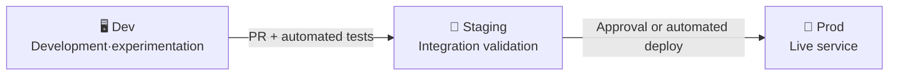

> Last reviewed: June 2026

## Overview

On-premises, building code and deploying it to servers is either manual or requires installing and operating tools like Jenkins yourself. **CI/CD** (Continuous Integration / Continuous Delivery) is a pipeline that automatically builds, tests, and deploys code whenever it changes.

Cloud vendors provide managed CI/CD services, letting you assemble a pipeline without the burden of operating build servers. They also integrate well with 3rd-party tools such as GitHub Actions and GitLab CI.

### CI vs CD

- **CI (Continuous Integration)** — Automatic build + test on every code commit. Catches problems early.
- **CD (Continuous Delivery)** — Automatically deploys built artifacts to staging/production.

### What's the benefit of deploying frequently?

| Item | Deploying once a month | Deploying several times a day |
| --- | --- | --- |
| **Change size** | Large and risky | Small and safe |
| **Root cause analysis** | Which of hundreds of changes? | Check the most recent commit |
| **Rollback** | Complex (many dependencies) | Simple (revert a small change) |
| **User feedback** | Weeks later | Same day |
| **Market response** | Slow | Ship features faster than competitors |

The higher the deployment frequency, the lower the risk of each deployment, and the faster user feedback can be incorporated. This directly translates into business agility. According to DORA research, teams with higher deployment frequency also have shorter recovery times and lower change failure rates.

### Why environment separation matters

CI/CD pipelines route code through multiple environments before it reaches production.



- **Dev** — Developers experiment freely. It's fine if it breaks.
- **Staging** — Configured identically to production. Final validation before deployment.
- **Prod** — The environment real users access.

On-premises, adding another environment meant buying more servers, but in the cloud, IaC lets you replicate the same environment in minutes. You can also delete it after testing to save costs.

When environments are separated:
- Code under development doesn't accidentally affect production.
- Bugs found in staging never reach users.
- You can apply different permissions to each environment to strengthen security.

## Product Comparison

### Build (CI)

| Vendor | Product | Notes |
| --- | --- | --- |
| AWS | CodeBuild | Fully managed. Billed by the minute. Supports Docker image builds |
| Azure | Azure Pipelines | GitHub/Azure Repos integration. Free tier (1,800 minutes/month) |
| Google Cloud | Cloud Build | Container-based. 120 minutes/day free |
| OCI | OCI DevOps Build Pipelines | Managed builds. Native integration with OCI services |

### Deploy (CD)

| Vendor | Product | Notes |
| --- | --- | --- |
| AWS | CodeDeploy | Deploys to EC2, ECS, Lambda. Supports Blue/Green, Rolling |
| AWS | CodePipeline | Orchestrates the build→test→deploy pipeline |
| Azure | Azure Pipelines (Release) | Multi-stage pipelines. Approval gates |
| Google Cloud | Cloud Deploy | Deploys to GKE, Cloud Run. Promotion-based |
| OCI | OCI DevOps Deployment Pipelines | Deploys to OKE, Compute, Functions. Supports approval stages |

### Source Repositories

| Vendor | Product | Notes |
| --- | --- | --- |
| AWS | CodeCommit | New repository creation discontinued in 2024. GitHub/GitLab recommended |
| Azure | Azure Repos | Git-based. Included in Azure DevOps |
| Google Cloud | Cloud Source Repositories | Supports mirroring. GitHub/GitLab integration |
| OCI | OCI DevOps Code Repositories | Git-based. Included in OCI DevOps |

### Artifact Repositories

| Vendor | Product | Notes |
| --- | --- | --- |
| AWS | CodeArtifact | Maven, npm, PyPI, NuGet packages |
| Azure | Azure Artifacts | Included in Azure DevOps |
| Google Cloud | Artifact Registry | Unified container images + language-specific packages |
| OCI | OCI Artifact Registry | Container images + general artifacts |

## Key Differences

**AWS** — You can build a full pipeline with CodeBuild/CodeDeploy/CodePipeline, but in practice the GitHub Actions + CodeDeploy combination is widely used. CodeCommit no longer accepts new repository creation.

**Azure** — Azure DevOps unifies source control, CI/CD, boards (issue tracking), and testing into a single platform. It also integrates closely with GitHub Actions.

**Google Cloud** — Cloud Build can handle both build and deployment, making it simple. Cloud Deploy is a CD tool specialized for GKE/Cloud Run.

**OCI** — OCI DevOps provides an integrated build/deployment pipeline, with native support for OKE, Compute, and Functions deployments plus approval stages.

## Practical Guide

### Repository Separation

| Strategy | Description | Suited for |
| --- | --- | --- |
| **Monorepo** | App code + infrastructure code in one repository | Small teams, fast iteration |
| **App/deploy separation** | App code repository separate from deployment manifest repository | GitOps, multiple environments, need for permission separation |

Separating the deployment repository lets app developers focus solely on code, while the platform team manages deployment configuration (Helm charts, Kustomize, etc.). Separating the deployment repository is common in GitOps.

### Rollback vs Fast Redeploy

When an incident occurs, you have two options.

- **Rollback** — Revert to the previous version. Safe, but can get complicated if there was a data migration.
- **Roll-forward (fast fix deployment)** — Quickly deploy a new version with the fix. Can be better than rollback if CI/CD is fast.

If the pipeline is fast enough (commit→production within 10 minutes), roll-forward is more practical. However, a rollback path should always be ready.

### Tests to Run in the Pipeline

| Stage | Test | Purpose |
| --- | --- | --- |
| **At build time** | Unit tests | Verify individual functions/modules work correctly |
| **At build time** | Static analysis (Lint, [SAST](../../devops/devsecops/)) | Catch code quality and security vulnerabilities early |
| **Staging** | Integration tests | Verify inter-service integration |
| **Staging** | E2E tests | Validate the full user scenario flow |
| **Production** | Canary/blue-green | Validate against real traffic on a subset before full cutover |

### Approval Process

| Approval type | When needed | Why |
| --- | --- | --- |
| **Code review (PR)** | Every change | Peers verify code quality/security. The most important gate |
| **Automated tests pass** | Every change | Ensures objective quality without human judgment |
| **Manual approval** | Production deployment (optional) | Only for regulatory requirements or high-risk changes |

:::note
**Why manual manager approval is unnecessary** — If code review + automated tests guarantee quality, manual approval only creates a bottleneck. The manager ends up clicking "approve" without reading the code, which isn't real verification. It's safer to let automated quality gates (test coverage, security scans, performance criteria) make the objective judgment instead.
:::

## Common Mistakes

- **Deploying without tests** — A pipeline that deploys as soon as the build passes, without automated tests, causes production incidents. Set at least unit tests and static analysis as gates.
- **Hardcoding secrets** — Writing API keys or passwords directly into pipeline configuration files exposes them to anyone with repository access.
- **Pushing directly to main** — Bypassing code review and automated tests by pushing directly to the main branch nullifies the quality gates.

## Checklist

- [ ] Are the build-test-deploy stages clearly separated?
- [ ] Are secrets managed through a pipeline secret management feature (GitHub Secrets, Azure Key Vault, etc.)?
- [ ] Is a rollback strategy (redeploy previous version or roll-forward) established?
- [ ] Are pipeline execution times monitored and bottlenecks managed?

## What to Keep Doing

Building a pipeline once isn't the end. The pipeline itself needs ongoing maintenance.

- **Dependency updates** — Regularly update build tools, plugins, and base images.
- **Execution time optimization** — A slow pipeline hurts developer productivity. Check caching and parallelization.
- **Flaky test management** — Intermittently failing tests erode trust. Isolate or fix them.

## AI Agents and CI/CD — GitHub Agentic Workflows

In 2026, a pattern emerged for integrating **AI coding agents** into CI/CD pipelines. [GitHub Agentic Workflows](https://github.github.com/gh-aw/) (Technical Preview, Feb 2026) adds "Continuous AI" capability to traditional deterministic CI/CD.

### Concept

| Traditional CI/CD | + Agentic Workflows |
| --- | --- |
| Event → build → test → deploy | Event → **agent analysis/fix** → build → test → deploy |
| Humans write code, pipeline runs | Agents classify issues, analyze CI failures, maintain docs, improve tests |

### How It Works

AI agents (Copilot, Claude Code, OpenAI Codex) run in GitHub Actions workflows, triggered by **events** or on a **schedule**. The agent analyzes and fixes code in a dedicated ephemeral environment (a GitHub Actions runner) and opens a PR.

```yaml
# Example: an agent triages issues and improves tests every morning
on:
  schedule:
    - cron: '0 9 * * *'
  issues:
    types: [opened]
```

### Use Cases

- **Automatic issue triage** — When a new issue opens, the agent labels and prioritizes it
- **Automatic CI failure analysis** — On a build failure, the agent analyzes the cause and opens a fix PR
- **Automatic documentation maintenance** — Related docs are updated automatically when code changes
- **Copilot Code Review** — The agent automatically reviews PRs (consumes Actions minutes starting 6/1)

:::caution
**Security caution:** When an AI agent processes untrusted input (issue bodies, PR descriptions) in CI/CD, **indirect prompt injection** can leak secrets. Grant agents the minimum privileges necessary, and sanitize untrusted input. See [AI Security — CI/CD Agent Security](../../security/ai-security/) for details.
:::

## Related Documents

- [Infrastructure as Code (IaC)](../../devops/iac/)
- [SLI/SLO and Error Budgets](../../devops/slo/)

## References

### AWS

- [AWS CodeBuild Documentation](https://docs.aws.amazon.com/ko_kr/codebuild/)
- [AWS CodeDeploy Documentation](https://docs.aws.amazon.com/ko_kr/codedeploy/)
- [AWS CodePipeline Documentation](https://docs.aws.amazon.com/ko_kr/codepipeline/)

### Azure

- [Azure Pipelines Documentation](https://learn.microsoft.com/ko-kr/azure/devops/pipelines/)
- [Azure DevOps Documentation](https://learn.microsoft.com/ko-kr/azure/devops/)

### Google Cloud

- [Cloud Build Documentation](https://cloud.google.com/build/docs)
- [Cloud Deploy Documentation](https://cloud.google.com/deploy/docs)
- [Artifact Registry Documentation](https://cloud.google.com/artifact-registry/docs)

### OCI

- [OCI DevOps Documentation](https://docs.oracle.com/en-us/iaas/Content/devops/using/home.htm)
